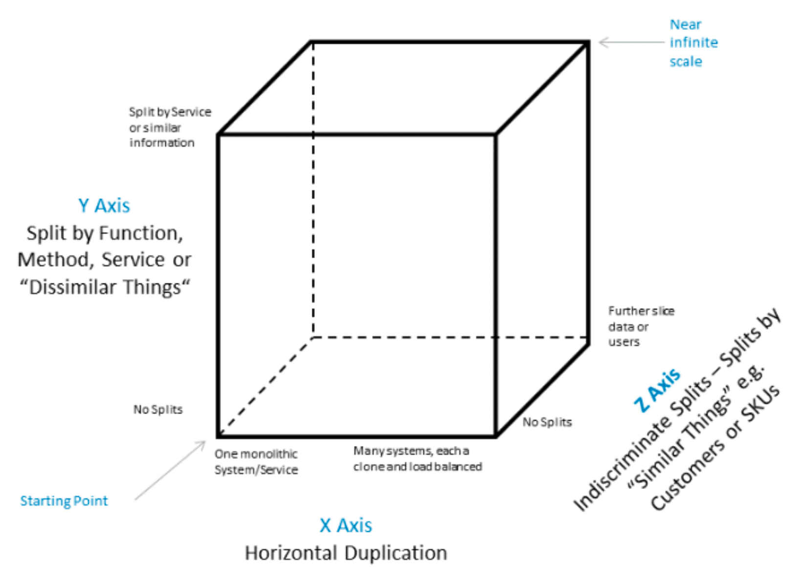
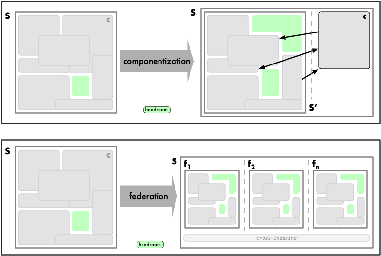

---

title: "Scalability"
---

**Scalability is a strategic practice**. We need

*  A framework to evaluate technical scalability-related decisions in context
* Best practices guidelines to lead our scalability design and implementation

# The framework

Frameworks help contextualize our thinking around a problem by breaking it into manageable conceptual parts, providing vantage points from which we can *evaluate* choices in both the present and the future. Our design becomes more predictable, our discussions more focused, our decisions likely more accurate and correct. We can make tradeoffs more visible, and, hopefully, easier to understand and reason about.

[**Swimlanes**](https://akfpartners.com/growth-blog/fault-isolation-swim-lane) and the [**Scale Cube**](https://akfpartners.com/growth-blog/scale-cube) are widely adopted models to manage both fault isolation and scalability in a structured fashion.

## Swimlanes

*A “swim lane” or fault isolation zone is a failure domain. A failure domain is a group of services within a boundary such that any failure within that boundary is contained within the boundary and the failure does not propagate or affect services outside of the said boundary.*

## The Scale Cube

*The Scale Cube is a model for segmenting services, defining them and scaling products. It also creates a common language for teams to discuss scale related options in designing solutions.*

Under this model, the axes represent the following scalability strategies:

- **`X`**-axis: **cloning**
  - cloning of services and data without bias (i.e., "*like*" workers, duplicating entire datasets)
- **`Y`**-axis: **componentization**
  - separation of work responsibility based on type of data and/or work performed
- **`Z`**-axis: **federation**
  - separation based on customer or requestor bias

These are well-known strategies we are intuitively familiar with. The power of formally adopting the framework lies in that we can now contextualize these strategies and potentially *consider* several moves ahead in a systematic fashion. The following figure (source: https://upload.wikimedia.org/wikipedia/commons/5/5f/Scale_Cube.png) depicts these axes:

The Scale Cube model starts at coordinates `[0,0,0]`, where a single instance runs on one system: scalability is entirely dependent on the compute resources associated with the system, and it is scaled by adding more and faster computing resources (CPU, memory, disk). The limiting factor becomes the largest available computing resource, closely followed by cost.

The Scale Cube can be applied to any component in all iterations.

## Example: Postgres current state

GitLab.com is currently running at `[1,1,0]`:

* `X`-axis: The database is composed of N fully replicated instances (a primary RW with several RO secondaries), each of which contains a duplicate of the entire dataset. This configuration can be scaled vertically for the RW workload by adding more hardware, and horizontally for the RO workload (increased query capacity) by adding more replicas. Two limiting factors will play a role:
  * RW capacity is directly proportional to hardware capacity (vertical scaling)
  * RO capacity will eventually run into the limits imposed by replication lag (CAP will play a role)
* `Y`-axis: We are already migrating some data (diffs) off the database through componentization, albeit without creating a service

A [recent analysis](https://gitlab.com/gitlab-com/gl-infra/infrastructure/-/issues/10340) indicates our database capacity is well beyond the 12-month range (and estimate that will be updated weekly). As we ponder scalability options, the question is whether the next iteration implements `[1,2,0]` or `[1,1,1]`. Current proposals essentially advocate for the latter strategy, but there is a case to be made for choosing an entirely different direction.

# Scalability Best Practices

This section collects scalability best practices, gathered over time through experience (ours and others’). They are **guidelines, not rules**, that we apply to work through these problems in a structured fashion, leveling the cognitive playing field.

## `[AMF]` Always Monolith First

The first rule of scalability is… don’t.

This is a variation on a well-known theme: functionality first, avoid premature optimization. Always start in the monolith, and only extract from it when there is a good reason to do so. A “good reason” is always a data-driven decision (via KPIs). Doing so will avoid unchecked proliferation of “services” inside the application, which is in itself a significant problem (unmanageable dependencies, orphaned or neglected services, etc). As a guardrail, we can set a strict limit on the number of “services” allowed within the application, and it should be organizationally difficult to raise that limit. It is important to note the implication is that the service may not be optimized and perform as well as the rest of the product. It should still be reliable or have a published error budget and performance target so that users can make an informed choice.  

Remember, however, that scalability is a strategic practice, so keep the Scale Cube in mind: consider the relationships created by new entities carefully and within the scalability framework: what would happen if an entity needed to be componentized or federated in the future?

## `[SSI]` Serialize Scalability Iterations

Never attempt to scale across two axes at the same time.

## `[CBF]` Componentization Before Federation. *Most of the Time*

**Componentization** breaks down a system into logical, interconnected components. **Federation** refers to [TODO: definition].

Componentization provides scale by creating headroom throughout the freed up resources extracted from the system. It also allows us to scale them relatively independently of other components, as locally optimize and scale individual components as necessary: in general, we need only worry about appropriately scaling downstream dependencies, so as to not overwhelm them. In extreme cases, we may choose an entirely different class of datastore (for instance, we may determine that storing comments in a document database is more effective than doing so in a relational database; we are already doing this by migrating diffs off of Postgres into object storage).

Componentization is not free:

- Data comes from a separate subsystem and thus a separate runtime scope, so data mappers and data composers are required to compose the data we need. The application must now take over some of those responsibilities, which had been previously delegated to the datastore.
- Internal latencies will increase, so caching enters the equation; cross-indexing may be required
- Failure modes become more diffuse: a complete component failure may be straightforward to detect, but when results are returned, we must be able to ascertain said results are the full set of results expected, or be able to understand when partial results are being returned.

Componentization can (and should) adhere to efficient iteration. **Componentization** entails breaking up GitLab into logical components such as repositories (already somewhat there: Gitaly, which has in fact also been federated through hashed paths), issues, comments, pipelines, etc. We must place a sensible cap on the number of components allowed (AMF). **Federation** entails vertical axes (tenants, for instance).

One problematic issue with federating before componentizing is that, long-term, we end up attempting to scale federated members vertically. While in some cases this may work well, we may reach a point where we need to componentize all federated members, a maneuver that adds complexity to the process.

### *Most of the Time*

There are times, however, when federating first makes sense, especially when we can provide a low impact MVC that creates customer value or can lay the foundation of future iterations. However, these should be limited to cases where the scope is at its shallowest (see MVF).

## `[MVF]` Minimum, Variable-depth Federation.

We iterate efficiently, so we try to operate on the minimum scope possible: only implement the shallowest federation in any given iteration, as measured in terms of the number of affected layers in the stack and the distance between said layers. As a very practical matter, federation never cuts across the entire stack in a single iteration: use it whenever, wherever, and however it makes sense to do so, but minimize the scope. Variable-depth allows us to be selective in its application (which is aligned with *boring solutions* and *MVC*),

### Examples

Federation may be as simple as having separate DNS endpoints into GitLab.com for certain types of customers, where *types* may be defined across any number of variables: a business entity (i.e., company Acme), geolocation (eu.gitlab.com, gitlab.com.de, or gitlab.cn). What lies behind is entirely up to us.

## `[NFR]` Never Federate Relationships

Never federate relationships. Relationships are not true entities, even if they sometimes take the form of entities. For examples, namespaces are *relationship entities*: their sole function if to function as a relationship bridge. Compare to true entities, like projects, users, or issues.

## `[NFE]` Never Federate Entities

Much like we should never use an entity’s attribute as a primary key, we should never federate entities to create intrinsic swimlanes, which is to say, never use an entity’s attribute identifier as a swimlane identifier. Federate using an entity’s attribute allowing for multiple entities to share a swimlane. In the extreme case, N = 1, but not by making the entity’s identifier the swimlane’s identifier.

## `[FCC]` Federation is a Customer Choice

We should never force customers to embrace federation, especially existing customers. In particular, federation on edge layers, which tend to be those closest to the customer, can be extremely disruptive (e.g., front doors). People tend to hardcode names in configurations and scripts. This is very true for us, where millions of people have cloned repositories with Git configurations pointing to GitLab.com.

## `[CTF]` Compliance Through Federation

Since federation is based on customer or requestor bias, it enables the activation of features along those boundaries for customers that want a certain feature (geolocated data). Regulatory compliance is thus enabled through federation.

## `[CTL]` Componentizing on Time Locality

Sometimes, it makes sense to split a given component in terms of time. Pipelines and related data, for instance, is one example of a potential time-split. Perhaps we keep all configuration and schedules in a fast, relational database, but we move 6-month old data to a separate, perhaps slower database.

# Workflow

## Performance Indicators

Performance indicators are scalability-related instrumentation that enables us to understand component and application scalability limits. They’re currently being worked on by the Scalability Team:

- [**https://docs.google.com/document/d/1lZ7RKtv7yCkV7MVx-7UfZZMvEB9lzLrrFDUw0oVFxXA/edit#heading=h.ibm29qjhrqeb**](https://docs.google.com/document/d/1lZ7RKtv7yCkV7MVx-7UfZZMvEB9lzLrrFDUw0oVFxXA/edit#heading=h.ibm29qjhrqeb)
- https://gitlab.com/gitlab-com/gl-infra/scalability/-/issues/382

Performance indicators allow prioritization of scalability work.

## Articulate Objectives

It is important to articulate scalability objectives before embarking on scalability work. It needs not be a detailed specification: simplicity rules, and the objectives can be refined over time. (Note: PIs are key) Most of the time, we will not be able to accurately predict the exact effects of a given scalability iteration. Estimates are therefore ok (but show the math).

## Scope the Solution

What potential solutions(s) would meet the objectives? Use the Scale Cube and Best Practices to scope it (them), and evaluate what future steps might look like (step-functions). Engage through the Architecture Workflow.

