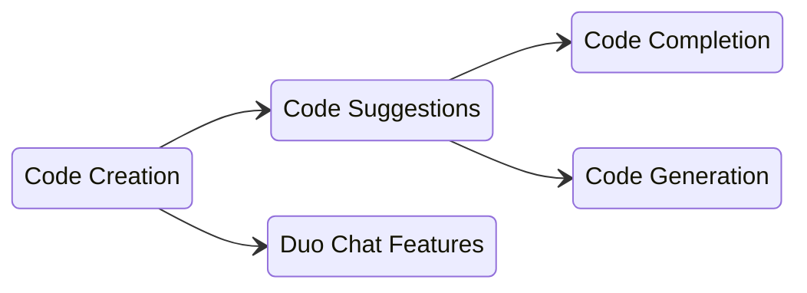

## Team Vision

We envision a world where our innovations in AI-driven code creation not only enhance productivity but also inspire creativity, enabling developers to tackle more complex challenges and push the boundaries of what's possible in software development.

## Team Mission

Develop cutting-edge AI-powered tools that enhance the efficiency and creativity of software engineers. We are committed to providing intelligent code suggestions that not only streamline coding tasks but also elevate the quality of software products. We aim to empower developers worldwide, making complex coding more accessible, and accelerating the creation of exceptional software.

## Team Handles

| Category                 | Handle              |
|--------------------------|---------------------|
| GitLab Team Handle       | @code-creation-team |
| Slack Channel            | #g_code_creation    |
| Slack Handle (Engineers) | @code-creation-engs |

## Commonly Monitored Issue Lists

- [Planning Issues](https://gitlab.com/gitlab-org/create-stage/-/issues/?sort=due_date&state=opened&label_name%5B%5D=group%3A%3Acode%20creation&label_name%5B%5D=Planning%20Issue&first_page_size=20)
- [OKRs](https://gitlab.com/gitlab-com/gitlab-OKRs/-/issues/?sort=title_asc&state=opened&label_name%5B%5D=devops%3A%3Acreate&label_name%5B%5D=group%3A%3Acode%20creation&first_page_size=20)
- [Workflow Board](https://gitlab.com/groups/gitlab-org/-/boards/5998095)
- [Reliability](https://gitlab.com/gitlab-org/gitlab/-/boards/4227439?not[label_name][]=type%3A%3Afeature&label_name[]=section%3A%3Adev&label_name[]=devops%3A%3Acreate&label_name[]=group%3A%3Acode%20creation)
- [Security](https://gitlab.com/gitlab-org/gitlab/-/issues/?sort=due_date&state=opened&label_name%5B%5D=security&label_name%5B%5D=devops%3A%3Acreate&label_name%5B%5D=group%3A%3Acode%20creation&not%5Blabel_name%5D%5B%5D=type%3A%3Afeature&first_page_size=20)
- [InfraDev Issues](https://gitlab.com/gitlab-org/gitlab/-/issues/?sort=due_date&state=opened&label_name%5B%5D=devops%3A%3Acreate&label_name%5B%5D=infradev&label_name%5B%5D=group%3A%3Acode%20creation&not%5Blabel_name%5D%5B%5D=type%3A%3Afeature&not%5Blabel_name%5D%5B%5D=severity%3A%3A4&first_page_size=200)

## Team Members

The following people are permanent members of the Code Creation Team:



You can reach the whole team on GitLab issues/MRs by using the `@code-creation-team` handle.

## Stable Counterparts

The following members of other functional teams are our stable counterparts:

| Category          | Counterpart                                                                                                     |
|-------------------|-----------------------------------------------------------------------------------------------------------------|
| Product Manager   | TBD                                                                                                             |
| Technical Writing |                                                                            |
| UX                |  (Create Stage)                                                              |
| SET               |  (Create Stage)                                                              |
| Support           | [TBD](https://handbook.gitlab.com/handbook/support/support-stable-counterparts/)                                |
| AppSec            | [TBD](https://handbook.gitlab.com/handbook/security/product-security/application-security/stable-counterparts/) |

## Core Responsibilities

A lot of the terms we use in this area sound similiar and can be confusing at first. Here are the basic basic terms:

- **Code Creation**: The group name and a collection of features relating to providing AI generated code
- **Code Suggestions**: A feature within Code Creation that provides AI-generated code within an IDE
   - **Code Completion**: A short AI-generated suggestion intended to complete an existing line or block of code
   - **Code Generation**: A longer AI-generated suggestion intended to create entire functions, classes, code blocks, etc.
- **Duo Chat**: Another feature that interacts with GitLab Duo Chat to write new code, refactor existing code, or scan code for vulnerabilities

If it helps, here are these terms in a diagram:

## Engineering Onboarding

To help get started as a developer with the Create:Code Creation team, we have created an
[onboarding issue template](https://gitlab.com/gitlab-com/create-stage/code-creation/team-tasks/-/issues/new?issuable_template=developer_onboarding).

## Meetings

**Sync: Code Creation** - a meeting held once a week on Tuesday at 15:00 UTC to align on group priorities. If there are no points on the meeting agenda one hour before the meeting starts, that meeting is considered as canceled.

All of our meetings and videos are uploaded to the [Code Creation YouTube Playlist](https://www.youtube.com/playlist?list=PL05JrBw4t0KoZOUC-DfaJOzFb6w6hG198). Some meetings are marked as private, so internal team members will need to swtich to use the [Unfiltered YouTube account](https://handbook.gitlab.com/handbook/marketing/marketing-operations/youtube/#unable-to-view-a-video-on-youtube).

## Other Related Pages

- Product Categories: [Code Creation](/handbook/product/categories/#code-creation-group)
- Direction: [Code Suggestion Direction](https://about.gitlab.com/direction/create/code_creation/code_suggestions/)

## Code Suggestion Dashboards

1. [Usage and Acceptance Rate](https://10az.online.tableau.com/#/site/gitlab/views/PDCodeSuggestions/ExecutiveSummary)
1. [Internal Usage](https://10az.online.tableau.com/#/site/gitlab/workbooks/2376230/views)
1. [General Metric Reporting](https://10az.online.tableau.com/#/site/gitlab/views/DRAFTCentralizedGMAUDashboard/MetricReporting?:iid=1) - can find code suggestions rate limiting, X-Ray usage, etc
1. [Log Visualization Dashboard](https://log.gprd.gitlab.net/app/dashboards#/view/6c947f80-7c07-11ed-9f43-e3784d7fe3ca?_g=(refreshInterval:(pause:!t,value:0),time:(from:now-6h,to:now))) - another view of latency, response codes, number of requests, etc
1. [Rails API Latency for Tokens](https://dashboards.gitlab.net/d/api-rails-controller/api-rails-controller?orgId=1&var-PROMETHEUS_DS=Global&var-environment=gprd&var-stage=main&var-controller=Grape&var-action=POST%20%2Fapi%2Fcode_suggestions%2Fcompletions&from=now-15m&to=now)
1. [Rails API Latency for Completions](https://dashboards.gitlab.net/d/ai-assisted-main/ai-assisted-overview?orgId=1)
1. [Grafana Dashboard](https://dashboards.gitlab.net/d/stage-groups-code_creation/stage-groups3a-code-creation3a-group-dashboard?orgId=1)
1. [Grafana Error Budget](https://dashboards.gitlab.net/d/stage-groups-detail-code_creation/stage-groups-code-creation-group-error-budget-detail?orgId=1)
