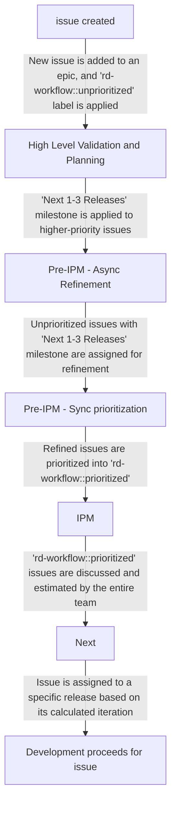

## Overview

The group is part of [Create Stage][hb-create] in the [Dev Sub-department][hb-dev]. We focus on multiple [categories][hb-categories]: `Remote Development` and the `Web IDE`.

### 👌 Group OKRs
<span id="-team-okrs" data-message="alias anchor for old links"></span>

If you're interested in the group's Objectives and Key Results (OKRs), you can find them on [GitLab](https://gitlab.com/gitlab-com/gitlab-OKRs/-/issues/?sort=title_asc&state=opened&label_name%5B%5D=group%3A%3Aide&first_page_size=20).

### 🤴 Group Principles
<span id="-team-principles" data-message="alias anchor for old links"></span>

[Create:IDE Principles][principles]: What Are the Create:IDE Group Principles?

### 🚀 Team Members

The following people are permanent members of the IDE Engineering Group:

**Engineering Manager & Engineers**



**Product, Design & Quality**



### ☕ Category DRIs
<span id="-team-category-dris" data-message="alias anchor for old links"></span>

| Category                 | DRI                                     |
|--------------------------|-----------------------------------------|
| Remote Development       |      |
| Web IDE                  |  |

### ☎️ How to reach us

Depending on the context here are the most appropriate ways to reach out to the IDE Group:

- Slack Channel: [`#g_create_ide`][slack]
- Slack Groups: `@create-ide-team` (entire team) and `@create-ide-engs` (just engineers)

### Group Metrics Dashboards

[Create::IDE Group Metrics Tableau Workbook](https://10az.online.tableau.com/#/site/gitlab/workbooks/2067787/views)

### 📆 Group Meetings
<span id="-team-meetings" data-message="alias anchor for old links"></span>

**❗️Important**: For every meeting, the [IDE group's meeting document][gdoc] should be used, and filled with the meeting notes, as well as references to any other sync meeting agendas/notes/recordings which have recently occurred. This will make it easier for people to find any meeting notes.

These are regular meetings in which most team members will participate. Also, please note that sync meeting schedules are flexible and can be moved to accomodate required participants.  Below is our schedule:

#### Quarterly Strategy and OKR Planning Meeting

- **When:** Once every quarter.
- **What:** In this meeting, we will discuss and align our group's strategic goals and objectives. We'll go over our progress on OKRs and define the next steps to achieve them.

#### Think Big Sessions / Optional Sync Call

- **When:** Once a month, on the week when there is no Quarterly Strategy Meeting.
- **What:** We can use this time for "Think Big" sessions or other optional synchronous calls.

#### Open Office Hours Meeting

- **When:** Every other week, alternating between APAC and AMER friendly times.
- **What:** This meeting is an open agenda, and if there are no topics, we will cancel the meeting. It's a chance to drop by and have an informal chat with colleagues. The meeting will alternate between APAC and AMER friendly times to cover different regions.

#### Retro Meeting

- **When:** Every fourth Thursday of the month.
- **What:** In this monthly meeting, we'll go over the feedback from our asynchronous group retro and identify action items and next steps. Our goal is to improve efficiency by learning from our past mistakes and successes.

#### Pre-Iteration Planning Meeting

- **When:** Every Wednesday, alternating between APAC and EMEA time zones.
- **What:** The goal of the Pre-IPM meeting is for the team leaders to collaborate on preparing all issues which are to be prioritized for the upcoming iteration(s), so they are ready for the wider team to discuss and estimate in the next IPM. For more information, see ["Pre-Iteration Planning Meeting"](#-pre-iteration-planning-meeting).

#### Iteration Planning Meeting (IPM)

- **When:** Biweekly on Wednesday, alternating between APAC and EMEA time zones.
- **What:** In this meeting, we will review the team's backlog and the current iteration status. We'll estimate and prioritize work for the next one or two iterations. The meeting will alternate between APAC and EMEA time zones to accommodate different regions. For more information, see ["Iteration Planning Meeting"](#-iteration-planning-meeting).

## 📦 Group Processes
<span id="-team-processes" data-message="alias anchor for old links"></span>

### 🖖 Weekly EM Updates

Each week the group EM provides a Weekly Status update issue which aims to capture the most important items for the team to be aware of. These can be found [here](https://gitlab.com/gitlab-com/create-stage/ide/-/issues/?sort=title_asc&state=all&label_name%5B%5D=Weekly%20Team%20Announcements&first_page_size=20).

### 😷 Issue Workflow Hygiene

In the Create:IDE group we leverage an automatic issue hygiene system via the [triage bot](https://gitlab.com/gitlab-org/quality/triage-ops/-/tree/master/policies/groups/gitlab-org/ide). This helps to ensure issues and label hygiene are respected, currently, our rules are:

### 🌉 Architecture Plans vs. Iteration Plans

We use the terms _Architecture Plan_ and _Iteration Plan_ when we think of outcomes to broad high-level issues. An investigative spike should result in an Architecture Plan and an Iteration Plan.

- **Architecture Plan**: A high-level vision of a technical approach that is shown to solve user problems. This plan includes a formulation of specific [quality attributes](https://en.wikipedia.org/wiki/List_of_system_quality_attributes) that are important for this use cases (such as performance, usability, or security). It also includes an outline of technical approaches that will satisfy these quality attributes in addition to the functional requirement. A [spike effort](https://en.wikipedia.org/wiki/Spike_(software_development)) should be created to verify and explore the technical approach for an architecture plan. The spike could result in new architectural concerns, resulting in an iteration of the plan.
- **Iteration Plan**: A plan for how we'll iteratively implement an Architecture Plan or another objective. This can be composed of low-level technical steps, or medium-level slices of use cases. The iteration plan should result in a set of issues (and possible epics) with clearly defined scope and weights.

**Sometimes it takes a time to develop a well fleshed-out iteration plan. In these cases, a "Formulate Iteration Plan" weighted issue can be used.**

### 📝 Issue Guidelines

These guidelines apply to all issues we use for planning and scheduling work within our group. Our Engineers can define specific implementation issues when needed, but the overall goal for our issues are as follows:

- Treat the wider community as the primary audience ([see relevant summary for rationale][community-contributions-wider-community]).
- Provide a meaningful **title** that describes a deliverable result.
    - ✅ `Add a cancel button to the edit workspace form page`
    - ✅ `Automatically save Devfile changes after 2 seconds of inactivity`
    - ❌ `Make WebIDE better`
- Provide a meaningful description that clearly explains the goal of the issue, and provide some technical details if necessary.
- Should there be critical implementation steps or other useful ways to create small tasks as part of the issue, please use a checklist as part of the issue descriptions.
- The issue should have a weight assigned.

It's okay to create specific engineering-driven implementation issues for more complex features. These would be called **Child Issues** and they should always link back to their parent. If one issue would spawn many child issues, consider creating an Epic.

## 🤖 Planning Process
<span id="-category-specific-planning-processes" data-message="alias anchor for old links"></span>

The IDE group has decided to use an alternate planning process for the following reasons:

1. Remote Development is a large, greenfield category, with many engineering, infrastructure, and technical concerns and unknowns which will continue to evolve and change as the category matures.
1. The Remote Development category is also currently receiving much attention as part of of GitLab's competitive strategy, and thus has greater internal and external expectations for accurate estimates of feature delivery and timelines.
1. In order to meet this need for more accurate and realistic planning and delivery estimates, the Remote Development category team has decided to modify parts of the [Plan](/handbook/product-development-flow/#build-phase-1-plan) and [Build & Test](/handbook/product-development-flow/#build-phase-2-develop--test) phases of the GitLab Product Development Flow to a more lightweight velocity-based estimation and planning process inspired by the widely-used and popular [XP](https://www.amazon.com/Extreme-Programming-Explained-Embrace-Change/dp/0321278658) and [Scrum](https://www.scrum.org/resources/blog/agile-metrics-velocity) methodologies. The goal is to provide accurate delivery estimates based on ["Yesterday's Weather"](https://gitlab.com/gitlab-com/www-gitlab-com/uploads/283f165896e2851bdc324f790d9c90e4/Screen_Shot_2023-03-27_at_6.16.51_PM.png) historical velocity analysis.
1. To better support the use of these methodologies, the IDE group has committed to dogfooding the [Iterations feature](https://docs.gitlab.com/ee/user/group/iterations/index.html), and following the [documented process for running agile iterations](https://docs.gitlab.com/ee/tutorials/agile_sprint.html) where possible.
1. However, due to existing limitations of the Iterations and Boards features in fully supporting these methodologies, we will also experiment with new and alternate tools and processes, with the goal of informing and potentially contributing back to improve GitLab's support for them. More details will be shared as this effort evolves.

Even though the Web IDE category does not have all these constraints (e.g. it is based on VS Code and is not greenfield code, and has fewer unknowns), the Web IDE category will follow a similar process in order reduce the cognitive overhead of the entire group.

### Planning Process Overview
<span id="-remote-development-planning-process" data-message="alias anchor for old links"></span>
<span id="remote-development-planning-process-overview" data-message="alias anchor for old links"></span>

The IDE group has modified parts of the [Plan](/handbook/product-development-flow/#build-phase-1-plan) and [Build & Test](/handbook/product-development-flow/#build-phase-2-develop--test) phases of the GitLab Product Development Flow to a more lightweight velocity-based estimation and planning process inspired by the widely-used and popular [XP](https://www.amazon.com/Extreme-Programming-Explained-Embrace-Change/dp/0321278658) and [Scrum](https://www.scrum.org/resources/blog/agile-metrics-velocity) methodologies.

The crux of these changes is focused around the following process phases:

1. "High Level Validation and Planning". This is analogous to the [Validation Track in the GitLab Product Flow](/handbook/product-development-flow/#validation-track), because it needs to achieve the same [Validation Goals & Outcomes](/handbook/product-development-flow/#validation-goals--outcomes) before we can start refining and prioritizing issues.
1. The "Pre-Iteration Planning Meeting", or "Pre-IPM". This is analogous to ["backlog refinement"](/handbook/product-development-flow/#outcomes-and-activities-4) in the standard GitLab product development flow. The goal of the Pre-IPM is to ensure that all issues which are to be prioritized in the upcoming iteration(s) are ready for the wider team to briefly discuss and estimate in the next IPM. See more details in the [Pre-Iteration Planning Meeting](#-pre-iteration-planning-meeting) section.
1. The "Iteration Planning Meeting", or "IPM". This is analogous to the ["Weekly Cycle" in XP](https://www.amazon.com/Extreme-Programming-Explained-Embrace-Change/dp/0321278658) or ["Sprint Planning" in Scrum](https://www.scrum.org/resources/what-is-sprint-planning). See more details in the [Iteration Planning Meeting](#-iteration-planning-meeting) section.

These components allow us to provide realistic velocity-based estimates based on ["Yesterday's Weather"](https://gitlab.com/gitlab-com/www-gitlab-com/uploads/283f165896e2851bdc324f790d9c90e4/Screen_Shot_2023-03-27_at_6.16.51_PM.png) historical velocity analysis.

**IMPORTANT: note that these process changes do not represent a full adoption of XP or Scrum methodologies. Instead, they are a minimal and lightweight process "inspired" by XP and Scrum. The primary goal is to allow the team to provide realistic planning and delivery estimates to leadership based on accurate velocity measurements. The Pre-IPM and IPM processes are the minimal components which allow us to meet that goal.**

### Custom workflow labels

To facilitate the IDE group's specific planning process, we make use of custom workflow scoped labels under `~rd-workflow::`.
These custom workflow labels are necessary to work around [current limitations of GitLab iterations and boards in implementing this process](https://gitlab.com/cwoolley-gitlab/gl-velocity-board-extension#why-doesnt-standard-gitlab-support-this).

The Web IDE category also uses the `~rd-workflow::` labels, despite the Remote Development specific prefix.
These workflow labels were originally created just for the Remote Development tea, but now our entire IDE group is
using this process. In a future iteration, we will likely look at renaming them and updating our relevant automation tools.

### GitLab Velocity Board Chrome Extension

To facilitate this process, especially around calculating emergent iterations based on velocity, we will use the
[GitLab Velocity Board Chrome Extension](https://gitlab.com/cwoolley-gitlab/gl-velocity-board-extension).

See [this video](https://www.youtube.com/watch?v=XcHpLhs7Fl0) for an overview of the extension, and also for an explanation of
this general process, and why we need to use an extension to support it rather than the current standard GitLab Iteration and Board features.

This extension is in support of a [GitLab OKR](https://gitlab.com/gitlab-com/gitlab-OKRs/-/work_items/2085) for Create.
We plan to continue iterating in this area, with the goal of eventually having GitLab directly support this workflow.

### Wider Board Columns

The default width of lists on boards can make the board harder to use, since you see fewer items and have to scroll more.

There is [an open issue to address this](https://gitlab.com/gitlab-org/gitlab/-/issues/15927). In the meantime, though, you can use the following javascript bookmarklet suggested in [this comment on the issue](https://gitlab.com/gitlab-org/gitlab/-/issues/15927#note_214871708), which will make the lists take up the full board width. Just make a bookmark named "Wider board lists" with this as the link:

```text
javascript:(function(){var el=document.getElementsByClassName('boards-list');for(i=0;i<el.length;++i){el[i].style.padding=0;el[i].style.display='table';}el=document.getElementsByClassName('board');for(i=0;i<el.length;++i){el[i].style.padding=0;el[i].style.border='0';el[i].style.display='table-cell';}el=document.getElementsByClassName('board-inner');for(i=0;i<el.length;++i){el[i].style.padding=0;el[i].style.border='0';}})();
```

### Remote Development Iteration Planning Report

In addition to the Velocity Board chrome extension, there is a [Remote Development Iteration Planning Report](https://gitlab-org.gitlab.io/remote-development/remote-development-team-automation/remote-development-iteration-planning-report-latest.html) which is automatically published every 6 hours.

This report shows the same auto-calculated iteration/velocity data, and uses the same logic as the Velocity Board Chrome Extension, but you don’t have to install the extension to see it.

The pipeline to generate it can also be run [directly from CI](https://gitlab.com/gitlab-org/remote-development/remote-development-team-automation/-/pipelines).

### Process Phases

NOTE: All issues in this process _must_ be assigned the `~Category:Remote Development` or `~Category:Web IDE` label, _even if they are also assigned another category label_. Otherwise the board and velocity calculation tools will not work properly.



#### 1. High Level Validation and Planning

**Process:**

**TL;DR: Assign the [`Next 1-3 releases` milestone](https://gitlab.com/groups/gitlab-org/-/milestones/48#tab-issues) milestone to all issues that should be refined and prioritized in the next Pre-IPM meeting(s).**

1. All higher-priority issues should be [contained in the category epic or one of its sub-epics](https://gitlab.com/groups/gitlab-org/-/epics/7419)
1. They should all have the `~rd-workflow::unprioritized` label assigned.
1. All higher-priority issues should be assigned to the **[`Next 1-3 releases` milestone](https://gitlab.com/groups/gitlab-org/-/milestones/48#tab-issues)**.
1. Issues which are not a priority to finish within the `%"Next 1-3 releases"` may have the `%"Next 4-7 releases"` or `%"Next 7-13 releases"` release applied, or alternately, they can be assigned to `%Backlog` or `%Awaiting Further Demand`.
1. Issues in `~rd-workflow::unprioritized` MUST NOT be left without a release applied. This should be enforced by automation. Use [this issue search to identify Remote Development issues which are missing a milestone](https://gitlab.com/groups/gitlab-org/-/issues/?sort=created_asc&state=opened&label_name%5B%5D=Category%3ARemote%20Development&milestone_title=None&first_page_size=100)

**Explanation:**

This process identifies and validates higher-priority issues to be worked on in the upcoming releases. It is analogous to the [Validation Track in the GitLab Product Flow](/handbook/product-development-flow/#validation-track), and should consist of many of the same steps and processes.

In addition to validating features, this process can also result in Engineering identifying high-priority issue which are necessary to [address Technical Debt or "Friction"](https://www.mechanical-orchard.com/post/friction-over-debt?utm_campaign=Boost_friction_debt).

There may be concerns about over-committing too many issues to the `%"Next 1-3 releases"` release. However:

1. If we are being healthy and diligent about following the Pre-IPM process **_every week_** as defined, we should be reviewing **_ALL_** issues which have the `%"Next 1-3 releases"` during every Pre-IPM, and moving them to `~"rd-workflow::prioritized"` .
1. If we don't get to them one week, we should decide how to deal with it - either agree to do them async in the next week, schedule an extra Pre-IPM, or commit to ensuring we finish reviewing them in next week's Pre-IPM.
1. Then, during the weekly IPM, per the process defined above, these issues will be weighted and prioritized, and have their release changed from `%"Next 1-3 releases"` to a specific release, depending on what iteration they fall into (and we can always give ourselves a "buffer" by assuming, for our purposes, that only things slated to be completed by a certain time will be likely to be in the release, e.g., everything slated to be completed in the 2nd iteration of the month, which is a ~1+ week buffer before the actual release is cut).

See the [following discussion thread](https://gitlab.com/gitlab-org/create-stage/-/issues/13151#note_1417052962) for more context.

#### 2. Pre-Iteration Planning Meeting

**TL;DR:**

- **Async phase - Refinement:**
  - **Engineering Manager: Assign someone to refine each unrefined `rd-workflow::unprioritized` issue which has the `%"Next 1-3 releases"` milestone using the [Remote Development issue template](https://gitlab.com/gitlab-org/gitlab/-/blob/master/.gitlab/issue_templates/Remote%20Development%20Group%20-%20issue.md)**
  - **Refinement Assignees: Adequately refine the issue using the [Remote Development issue template](https://gitlab.com/gitlab-org/gitlab/-/blob/master/.gitlab/issue_templates/Remote%20Development%20Group%20-%20issue.md), then apply the `refined` label**
- **Sync phase - Prioritization: Product and Engineering leaders meet to appropriately prioritize each `refined` issue into the `rd-workflow::prioritized` lane on the Iteration Planning board.**

##### Async Phase of Pre-IPM Process - Refinement

1. Identify all issues which:
   1. Have the `~"rd-workflow::unprioritized"` **AND**
   1. Have the `%"Next 1-3 releases"` milestone applied (optionally include additional milestones for next `3-4`/`4-7` releases, if these are being used) **AND**
   1. Do **NOT** yet have the `~refined` label
1. This can be done by a [direct search for `Label is ~rd-workflow::unprioritized` and `Milestone is %Next 1-3 releases` and `Label is not one of ~refined`](https://gitlab.com/groups/gitlab-org/-/issues/?sort=created_asc&state=opened&label_name%5B%5D=rd-workflow%3A%3Aunprioritized&milestone_title=Next%201-3%20releases&not%5Blabel_name%5D%5B%5D=refined&first_page_size=100)
1. Assign each of these issues to an appropriate team member to be refined, and leave a comment on the issue mentioning the team member and linking to
   [Async Phase of Pre-IPM Process - Refinement](#async-phase-of-pre-ipm-process---refinement)
   This selection process can be whatever works for the team, but in general issues should be refined by someone who has the knowledge and availability
   to refine them properly and promptly. If there are questions, ask for help or reassign it to someone else.
1. The assignee should use the [Remote Development issue template](https://gitlab.com/gitlab-org/gitlab/-/blob/master/.gitlab/issue_templates/Remote%20Development%20Group%20-%20issue.md) to refine the issue. The refinement should ensure
   that the description of each prioritized issue is complete, and contains enough information for the team to review, understand
   and estimate it during the next IPM, in less than 5-10 minutes, without extensive debate/discussion.
1. There should be no `TODO:` comments left in the description from the template once refinement is complete. If a section from the template is not applicable, delete it.
1. If the refinement uncovers additional scope/complexity, the issue should be broken down into smaller issues, which
   are then refined individually. Optionally, an epic may be created to organize the work across multiple issues.

##### Sync Phase of Pre-IPM Process - Prioritization

1. During each Pre-IPM meeting, we will _temporarily_ [filter the Iteration Planning board on the `~refined` label](https://gitlab.com/groups/gitlab-org/-/boards/5283620?label_name[]=Category%3ARemote%20Development&label_name[]=refined),
   so that only refined issues appear in the `~"rd-workflow::unprioritized"` list. _Make sure you don't save this filter to the defualt board settings_
1. The goal of each Pre-IPM sync meeting will be to prioritize all of these issues into the `~"rd-workflow::prioritized"` list, based on their
   relative importance, whether they are blocking other issues, etc. They are prioritized by dragging them into the appropriate order in the `~"rd-workflow::prioritized"` list, with the highest-priority issues being at the top, and the lowest-priority issues being at the bottom.
1. After an issue has been moved to the `~"rd-workflow::prioritized"` list, it should be assigned to the **current `Iteration` of the `Iteration Cadence`**.
   We will eventually create an automation for this, but for now it must be done manually. The easiest way to do this is to search for `RD` in the `Iteration` field,
   and pick the top-most iteration. Then, the `Iteration Cadence` feature functionality will handle automatically rolling over any incomplete issues to the next
   iteration once the current iteration ends. Do _NOT_ assign it to a future iteration, only the current iteration. We do this because of limitations in the
   GitLab Iteration feature which are incompatible with this process, and instead we rely on the
   [GitLab Velocity Board Chrome Extension](#gitlab-velocity-board-chrome-extension) to automatically split the actual current iteration
   in the database into multiple future "virtual" iterations based on dynamic velocity calculations.

**Explanation:**

The "Pre-Iteration Planning" (Pre-IPM) meeting prepares for the Iteration Planning Meeting. It is analogous to ["backlog refinement"](/handbook/product-development-flow/#outcomes-and-activities-4) in the standard GitLab product development flow.

During the Pre-IPM, the team will collaborate on creating/refining, organizing, and clarifying all issues which are to be prioritized for the upcoming iteration(s). This will normally involve Product and Engineering leaders on the team, but may also involve Design or other team members depending on the nature of the issues involved. The goal is to ensure that all issues which have been identified as a priority for the upcoming releases are properly refined, curated, prioritized, and ready for the wider team to briefly discuss and estimate in the next IPM.

If a single piece of work spans multiple projects/repos, there should be be a separate issue created for each MR in each repo. We cannot use the [tasks feature](https://docs.gitlab.com/ee/user/tasks.html#set-task-weight), because boards cannot display individual
tasks.

**QUESTION: Why isn't there a `~rd-workflow::refined` phase instead of using the `~refined` label?**

For a few reasons:

1. We want to keep the main process and board simple and easy to understand. The three columns for `unprioritized`, `prioritized`, and `done` phases
   are intuitive and self-explanatory. Also, the movement between `unprioritized` and `prioritized` is a sync process, which ensures the team leadership
   are all on the same page about current priorities.
1. The refinement and prioritization process may vary among different teams that use this process in the future. Keeping the three core phases simple
   means that the basic process and board approach can still be used with simpler or more complex refinement/prioritization processes.
1. Finally (and most importantly from a pragmatic perspective), the implementation of the logic for velocity and iteration calculations on the board is
   much simpler if we enforce a standardized three-phase/three-column process and UI.

#### 3. Iteration Planning Meeting

**Process:**

**TL;DR: _As a team_, briefly discuss then estimate each prioritized issue.**

1. In each the IPM meeting, all newly prioritized issues in the `~"rd-workflow::prioritized"` lane of the [Remote Development Iteration Planning board](https://gitlab.com/groups/gitlab-org/-/boards/5283620) or [Web IDE Iteration Planning board](https://gitlab.com/groups/gitlab-org/-/boards/7440987) are reviewed by the team. The board should be unfiltered other than the standard `~"Category:Remote Development"` or `~"Category:Web IDE"` label.
1. For each newly-prioritized issue, the facilitator reads the description, and the team **_briefly_** discusses the issue. If there are no blocking concerns/risks raised, the team collectively estimates the issue with rock-paper-scissors fibonacci scale, and the collectively agreed weight is assigned.
    1. If the discussion for a single issue goes on longer than 5-10 minutes or turns into an extended debate/discussion, this is an indicator that the issue has not been adequately refined, and should go back to the ~"rd-workflow::unprioritized" list, and potentially have another issue immediately created and prioritized to do further investigation/refinement, if the refinement scope may be significant.
1. Issues which are prioritized in the upcoming 1-2 iterations should be assigned to individual(s) at this point, to ensure it gets worked on and not lost.

**Explanation:**

The "Iteration Planning Meeting", or "IPM" meeting is a weekly process where a team reviews the backlog and the current iteration status, estimates and prioritizes work for the next iteration, and uses issues as the single source of truth for discussions and progress. It is analogous to the ["Weekly Cycle" in XP](https://www.amazon.com/Extreme-Programming-Explained-Embrace-Change/dp/0321278658) or ["Sprint Planning" in Scrum](https://www.scrum.org/resources/what-is-sprint-planning).

The goal of the IPM is to ensure all issues for the upcoming iteration have been discussed, and [estimated with weights as a team](#-what-weights-to-use). Then, each issue will be worked on, and if there are commits to be made as part of the work, there should be a 1-to-1 relationship between the issue and MR.

The iteration cycle is one week long, and each category team maintains a separate dedicated board for tracking their progress - [the Remote Development Iteration Planning board](https://gitlab.com/groups/gitlab-org/-/boards/5283620) and [the Web IDE Iteration Planning board](https://gitlab.com/groups/gitlab-org/-/boards/7440987).

#### 4. Assigning prioritized issues to specific releases based on calculated iterations

TODO: This can be automated in the future by adding functionality to the chrome extension. For now, it will be a manual process.

**TL;DR: Assign issues to specific releases based on their calculated iteration**

At this point, once all prioritized issues have been estimated, with the use of the [GitLab Velocity Board Extension](https://gitlab.com/cwoolley-gitlab/gl-velocity-board-extension) we will be able to know how they break down into future iterations.

Then, based on the dates of calculated iterations, we can reassign the issues from the `Next 1-3 releases` milestone into specific milestones.

### Example Lifecycle for a Feature Issue

1. Product and Design work together to identify a new feature requirement.
1. An issue is created using the [Remote Development issue template](https://gitlab.com/gitlab-org/gitlab/-/blob/master/.gitlab/issue_templates/Remote%20Development%20Group%20-%20issue.md). The correct labels are automatically applied by the template,
   so the issue shows up in the `~"rd-workflow::unprioritized` list of the Iteration Planning board.
   Note that the issue description may be incomplete/unrefined and high-level at this point.
1. Product decides the issue is a high priority, so they apply the `%"Next 1-3 Releases"` milestone to signal this.
1. As part of the async Pre-IPM process, someone is assigned to refine the issue, by finishing filling out the issue template, then applying the `~refined` label
1. As part of the sync Pre-IPM meeting, product and engineering leadership move the refined issue to the `~rd-workflow::prioritized` list,
   in the appropriate position based on its priority relative to other issues.
1. In the sync IPM meeting, the wider team discusses and estimates the issue, and it is assigned to whoever will do the work.
1. Once the priority and weight are determined, the current velocity will tell us what iteration the issue should be completed in, and a specific
   release milestone can be assigned to the issue based on that.
1. The assignee opens an MR for the issue, ensures that the issue and MR are cross-referenced on the first lines of their descriptions, and
   begins work on the MR.
1. When the work is completely done - i.e., the MR is reviewed and merged, the feature is verified and tested in production, etc.,
   then the issue is closed, and moved to the `~rd-workflow::done` list.

### Relationship of Issues to MRs
<span id="1-to-1-relationship-of-issues-to-mrs" data-message="alias anchor for old links"></span>

We want to enforce that:

1. Every MR is owned by a weighted issue

This is in order to facilitate accurate and granular velocity calculations and issue prioritization under this process.
The merge request is the atomic unit of deliverable work in most cases, so it must be represented in the prioritization
and calculations by being owned by one and only one issue.

In order to enforce this via triage-ops automations
(https://about.gitlab.com/handbook/engineering/development/dev/create/ide/#automations-for-remote-development-workflow),
the first line of the issue should have the format: `MR: <...>`:

1. For new issues, the first description line should be: `MR: Pending`
1. Once an MR is created for the issue and work is started, the first description line of the issue should be: `MR: <MR link with trailing +>`,
   and the first description line of the MR should be `Issue: <Issue link with trailing +>`.
1. If the work for an issue was iteratively split into multiple MR's, the first description line of the issue should be:
   ```
   MR:
     - <MR link with trailing +>
     - <MR link with trailing +>
   ```
   Each description line of the MR's in this list should be `Issue: <Issue link with trailing +>`. **Please note:** If breaking out an issue's implementation
   into multiple MR's unexpectedly increases the scope of the work, please consider creating a new weighted and prioritized issue to
   capture the extra scope. This is important in order to accurately reflect scope increases, and their impact on reporting and velocity.
1. If there is _NO MR_ associated with this issue, the first line should be: `MR: No MR`.
   However, this should be rare, because most issues should have some sort of committed deliverable, even if it is only
   a documentation addition or update. If it is an issue which represents a larger piece of work split across smaller issues,
   then it should be promoted to an epic.

**QUESTION: Why does every MR need a backing issue?**

- If boards and epics allowed MRs to be added and estimated as well as issues, this would not be necessary - for feature/maintenance
involving an MR, we could have the MR directly represent the full lifecycle of the discussion and implementation, and not
have an issue at all.
- We also cannot rely on the Crosslinking Issues feature (https://docs.gitlab.com/ee/user/project/issues/crosslinking_issues.html),
because this shows ALL linked MRs that have mentioned the issue anywhere, and cannot enforce this 1-1 relationship.

### 📝 Ad-Hoc Work

It is normal that team members may identify issues that need to be resolved promptly prior to the next planning cycle. This may be because they are blocking other prioritized issues, or just because a team member wishes to tackle an outstanding bug or small piece of technical debt.

In these situations, it is acceptable for a team member to take the initiative to create an issue, assign proper labels, estimate it, assign it to the current iteration, and work on it, _as long as it does not adversely impact the delivery of other prioritized issues_. However, if it becomes large or risks impacting other issues which were collectively prioritized as part of an IPM, then the issue should be brought up for discussion with the wider team in the next pre-IPM and/or IPM.

### 🏋 What Weights to Use

To assign weights to issues effectively, it's important to remember that issue weight should not be tied to time. Instead, it should be a purely abstract measure of the issue's significance. To accomplish this, the our team uses the Fibonacci sequence starting from weight 0:

- **Weight 0:** Reserved for the smallest and easiest issues, such as typos or minor formatting changes, or very minor code changes with no tests required.
- **Weight 1:** For simple issues with little or no uncertainty, risk or complexity. These issues may have labels like "good for new contributors" or "Hackathon - Candidate". For example:
    - Changing copy text which may be simple but take some time.
    - Making CSS or UI adjustments.
    - Minor code changes to one or two files, which require tests to be written or updated.
- **Weight 2:** For more involved issues which are still straightforward without much risk or complexity, but may involve touching multiple areas of the code, and updating multiple tests.
- **Weight 3:** For larger issues which may have some unforeseen complexity or risk, or require more extensive changes, but is still not large enough to warrant [breaking down into smaller separate issues](#-breaking-down-large-issues).
- **Weight 5:** Normally, this weight should be avoided, and indicate that the issue ideally [should be broken down into smaller separate issues](#-breaking-down-large-issues). However, in some cases a issue with a weight of 5 might still be prioritized. For example, if there is a large amount of manual updates to be made which will require a large amount of effort, but doesn't necessarily involve significant risk or uncertainty.
- **Weight 8/13+:** Weights above 5 are used to clearly indicate work that is not yet ready to be assigned for implementation, and _must_ be broken down because it is too large in scope to start implementing, and/or still has too many unknowns/risks. This weight is temporarily assigned to "placeholder" issues to capture the scope of the effort in our velocity-based capacity planning calculations. For more information, see ["Breaking Down Large Issues"](#-breaking-down-large-issues).

### 📝 Breaking Down Large Issues

Some issues are large in scope to start implementing, and/or still has too many unknowns/risks. In this case, we should break it down into smaller issues which can be implemented in a single iteration. These smaller issues should ideally have a weight of 3 or less, but never more than 5. Here's our process:

1. Create an investigation issue to identify the work that needs to be done. This issue represents the work needed to research, investigate, discover and document the effort, and break the work down into new issues which are small and clear enough to be prioritized and started. The investigation issue should have a weight assigned which reflects the effort required perform this investigation and breakdown. Here's an example: https://gitlab.com/gitlab-org/gitlab/-/issues/408186.
1. While the investigation issue work is ongoing, we create a temporary "placeholder" issue on our Iteration Board. This placeholder issue serves to capture the scope of the effort in our velocity-based capacity planning calculations while the investigation to break is down is still ongoing.
    1. It should have a weight of either 8/13+ (indicating that it is too large to be prioritized and started, and must be broken down.
    1. The title format for the placeholder issue is `[Category] - Iteration Planning Placeholder for [description of work]`. Here's an example: https://gitlab.com/gitlab-org/gitlab/-/issues/408093.
    1. The description should have a link to the investigation issue, and a reminder to remove the weight and close it once the smaller replacement issues are created.
    1. The `~blocked` label can be applied so it is clear that this issue should is not ready for development. Unfortunately, we must still apply the `~Deliverable` label to this issue, because that is the only way we can associate it with the Iteration Cadence for velocity calculations.
1. Once the investigation and breakdown into smaller issues is complete, then the weight can be removed and the issue closed.

### 🍨 Handling Issues Outside the Process
<span id="-handling-remote-development-issues-outside-the-process" data-message="alias anchor for old links"></span>

Certain `group::ide` issues may be categorized under the `rd-workflow::ignored` label. These categories include:

1. **QA-Owned Issues:**
   - Issues owned by QA that may not require the standard remote development process.
1. **PM-Owned Issues with `type::ignore`:**
   - Issues owned by Product Managers marked with `type::ignore`, such as reporting, blogs, OKRs, etc.
1. **Long-Lived Security Issues:**
   - Security-owned issues with extended timelines that don't align with the typical remote development workflow.

This approach ensures that these types of issues do not have an undesired impact on our velocity, and that our remote development process remains streamlined while accommodating different issue categories that may not fit the standard workflow.

## 👏 Communication

The IDE Team communicates based on the following guidelines:

1. Always prefer async communication over sync meetings.
1. Don't shy away from arranging a [sync call](#-ad-hoc-sync-calls) when async is proving inefficient, however always record it to share with team members.
1. By default communicate in the open.
1. All work-related communication in Slack happens in the [#g_create_ide][slack] channel.

### ⏲ Time Off

Team members should add any [planned time off][paid-time-off] in the ["Time Off by Deel"](https://gitlab.slack.com/archives/D019WTM2F99) slack app, so that the Engineering Manager can use the proper number of days off during capacity planning.

### 🤙 Ad-hoc sync calls

We operate using async communication by default. There are times when a sync discussion can be beneficial and we encourage team members to schedule sync calls with the required team members as needed.

## 🔗 Other Useful Links

### 🏁 Developer Cheatsheet

[Developer Cheatsheet][cheatsheet]: This is a collection of various tips, tricks, and reminders which may be useful to engineers on (and outside of) the team.

### 🤗 Fostering Wider Community Contributors

We want to make sure that all the fields of the Create:IDE team are approachable for outside contributors.
In this case, if issues should be good for any contribution it should be treated with extra care. Therefore have a look at this excellent guide written by our own Paul Slaughter!

[Cultivating Contributions from the Wider Community][community-contributions]: This is a summary of why and how we cultivate contributions from the wider community.

### 📹 GitLab Unfiltered Playlist

The IDE Group collates all video recordings related to the group and its team members in [a playlist][youtube] in the [GitLab Unfiltered](https://www.youtube.com/channel/UCMtZ0sc1HHNtGGWZFDRTh5A) YouTube channel.


  



  



  



  


### Create:IDE Error Budget

- https://dashboards.gitlab.net/d/stage-groups-detail-ide/stage-groups-ide-group-error-budget-detail?orgId=1
- https://dashboards.gitlab.net/d/stage-groups-ide/stage-groups-ide-group-dashboard?orgId=1

## Automations

Automations should be set up via [triage-ops](https://gitlab.com/gitlab-org/quality/triage-ops/) if possible.

Other more complex automations may be set up in the
[Remote Development Team Automation project](https://gitlab.com/gitlab-org/remote-development/remote-development-team-automation).

### Automations for Remote Development Workflow

Ideally we should automate as much of the [Remote Development Planning Process](#-remote-development-planning-process) workflow as possible.

We have the following automation goals for this Workflow. Unless otherwise noted, these rules are all defined in the [triage-ops `policies/groups/gitlab-org/ide/remote-development-workflow.yml` config files](https://gitlab.com/gitlab-org/quality/triage-ops/-/blob/master/policies/groups/gitlab-org/ide/remote-development).

| ID | Goal | Automation | Link(s) to implementation |
| --- | --- | --- | --- |
| <a id="automation-01">01</a> | Ensure every issue in the category is assigned to an epic | Issues in `~"Category:Remote Development"` but no epic assigned should get a warning comment | TODO: implement |
| <a id="automation-02">02</a> | Ensure category issues show up on the Iteration Planning board | Issues in `~"Category:Remote Development"` but no `~rd-workflow` label should be added to `~rd-workflow::unprioritized`. | [triage-ops link](https://gitlab.com/gitlab-org/quality/triage-ops/-/blame/master/policies/groups/gitlab-org/ide/remote_development/workflow-02.yml) |
| <a id="automation-03">03</a> | Avoid premature assignment of specific milestones before an issue has gone through IPM, to avoid getting this warning: https://gitlab.com/gitlab-org/gitlab/-/issues/411933#note_1419147845 | 1. Issues with a specific milestone but not in `~rd-workflow::prioritized` should have the milestone automatically set back to `%"Next 1-3 releases"`. <br> 2. Issues with a specific milestone but no weight should have the milestone automatically set back to `%"Next 1-3 releases"`. <br> 3. Issues with a specific milestone but no iteration should have the milestone automatically set back to `%"Next 1-3 releases"`. | [triage-ops link](https://gitlab.com/gitlab-org/quality/triage-ops/-/blame/master/policies/groups/gitlab-org/ide/remote_development/workflow-03.yml) |
| <a id="automation-04">04</a> | Ensure prioritized issues are in the correct state | Issues in `~rd-workflow::prioritized` but not assigned to the current Iteration of the Iteration Cadence should automatically get assigned to the Current Iteration | TODO: implement |
| <a id="automation-05">05</a> | Ensure closed issues are in the correct state | Every Issue in `~"Category:Remote Development"` which is closed must have the `~rd-workflow::done` label applied. | [triage-ops link](https://gitlab.com/gitlab-org/quality/triage-ops/-/blame/master/policies/groups/gitlab-org/ide/remote_development/workflow-05.yml) |
| <a id="automation-06">06</a> | Sync Remote Development workflow and GitLab workflow labels | 1. Issues in `~rd-workflow::unprioritized` but with no GitLab workflow label should have `~"refined"` assigned. <br> 2. Unstarted issues in `~rd-workflow::prioritized` but with `~"refined"` assigned should get `~"workflow::ready` for development" assigned. | [triage-ops link](https://gitlab.com/gitlab-org/quality/triage-ops/-/blame/master/policies/groups/gitlab-org/ide/remote_development/workflow-06.yml) |
| <a id="automation-07">07</a> | Ensure all prioritized issues have a milestone assigned | All issues with `~rd-workflow::prioritized` but no milestone should have `%"Next 1-3 releases"` milestone assigned. | TODO: implement |
| <a id="automation-08">08</a> | Ensure all issues with `~rd-workflow-unprioritized` have a milestone assigned | All issues with `~rd-workflow::unprioritized`, but no milestone, should have: <br> - `~needs-milestone` label applied <br> - along with a comment with a link to the [1. High level validation and planning section][#1-high-level-validation-and-planning], and instructions that one of the following milestones must be assigned to all issues in `~rd-workflow::unprioritized`: <br> - `%"Next 1-3 releases"` <br> - `%"Next 4-6 releases"` <br> - `%"Next 7-12 releases"` <br> - `%Backlog` <br> - `%Awaiting further demand` | TODO: implement |
| <a id="automation-09">09</a> | Apply correct ~rd-workflow label to reopened issues | Re-opened issues which are open but in `~rd-workflow::done` should have `~"rd-workflow::prioritized"` assigned. | TODO: implement |
| <a id="automation-10">10</a> | Ensure issues and MRs are 1-1 | - Every MR in `~"Category:Remote Development"` must have the first line of the description matching: `Issue: <issue link>\n\n`. See https://docs.gitlab.com/ee/topics/gitlab_flow.html#linking-and-closing-issues-from-merge-requests  <br> - Every Issue in `~"Category:Remote Development"` must have the first line of the description matching: `"MR: <MR link>"` or `"MR: Pending"`. See https://docs.gitlab.com/ee/topics/gitlab_flow.html#linking-and-closing-issues-from-merge-requests | TODO: implement |
| <a id="automation-11">11</a> | Automate Label Assignment for Ignored Issues | Issues with the `type::ignore` label should have the `rd-workflow::ignored` label assigned. | TODO: implement |
| <a id="automation-12">12</a> | Ensure all prioritized issues with an assignee have a weight assigned | All issues with `~rd-workflow::prioritized` and an assignee but no weight should get a reminder note to either add a weight estimate or remove the assignee. | TODO: implement |
| <a id="automation-13">13</a> | Assign a `rd-maturity::*` label of `viable`, `complete`, etc based on epic hierarchy | All issues should have appropriate labels added/removed based on epic hierarchy | TODO: implement |
| <a id="automation-14">14</a> | Add an error comment if an issue is assigned to an iteration in the [RD cadence](https://gitlab.com/groups/gitlab-org/-/cadences/) but not assigned to `~Category:Remote Development` | TODO: implement |

<!-- LINKS START -->

[hb-create]: /handbook/engineering/development/dev/create/
[hb-dev]: /handbook/engineering/development/dev/
[hb-categories]: https://about.gitlab.com/direction/create/#categories-in-create
[paid-time-off]: /handbook/paid-time-off/#paid-time-off
[product-development-flow]: /handbook/product-development-flow/
[workflow-labels]: https://docs.gitlab.com/ee/development/contributing/issue_workflow.html#labels
[gdoc]: https://docs.google.com/document/d/1b-dgL0ElBf_I3pbBUFISTYBG9VN02F1b3TERkAJwJ20/edit#
[slack]: https://gitlab.slack.com/archives/CJS40SLJE
[youtube]: https://www.youtube.com/playlist?list=PL05JrBw4t0KrRQhnSYRNh1s1mEUypx67-
[cheatsheet]: /handbook/engineering/development/dev/create/ide/developer-cheatsheet/
[principles]: /handbook/engineering/development/dev/create/ide/principles/
[community-contributions]: /handbook/engineering/development/dev/create/ide/community-contributions/
[community-contributions-wider-community]: /handbook/engineering/development/dev/create/ide/community-contributions/#wider-community-as-primary-audience

<!-- LINKS END -->
