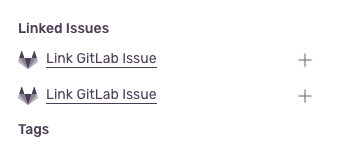

## Overview

The Utilization Team often works at the interface between GitLab Core and Fulfillment applications. This includes components in the [Utilization category](/handbook/product/categories/#utilization-group) like consumables management (storage, compute, seats, etc.), usage reporting, and usage notifications. Our customers use GitLab SaaS, GitLab self-managed, and internal tooling.

## Vision

For more details about the product vision for Fulfillment, see our [Fulfillment](https://about.gitlab.com/direction/fulfillment/) page.

The Utilization group manages the [Utilization category](/handbook/product/categories/#utilization-group).

## Team members



## Stable counterparts



## How we work

### Sync Time is Valuable

We try to [work async](/handbook/company/culture/all-remote/asynchronous/) as much as possible. However, there are occasions where synchronous communication might be better suited for the task. Our Weekly Team Sync meeting is one of those occasions where we can celebrate wins, collaborate quickly over a number of issues, and generally have some face-time in an all-remote environment.

Crucially, we use this high bandwidth communication to review issues that need some extra discussion and input from the team to ensure that issues can be estimated and work developed with minimal back and forth to establish the nature of the request.

#### Times and Timezones

The Utilization group is spread across at least [4 different timezones](https://leipert-projects.gitlab.io/better-team-page/timezones/?search=reports_to%3AChaseSouthard).

The Utilization Team meets via Zoom on Tuesdays each week at 9:00 AM US Eastern Time (6:00 AM PT / 2:00 PM UTC) to accommodate teammates in their timezones.

#### Recording Meetings

Using the `[REC]` meeting prefix, the meeting is automatically uploaded into the [GitLab Videos Recorded folder in Google Drive](https://drive.google.com/drive/u/0/folders/0APOeuCQrsm4KUk9PVA) on an hourly basis via a scheduled pipeline. All teammates are set as alternate hosts and should be able to record the meeting if the Engineering Manager is not present. The recording link will be placed into the agenda after the recording is available.

We don't normally publish our team sync meetings to the GitLab Unfiltered YouTube channel because we often talk about confidential issues related to product pricing and other internal initiatives. We would rather have a single repository of meeting recordings in Zoom or Google Drive rather than risk of unsafe information disclosure.

#### Meeting Preparation

All team members are encouraged to add topics to the [weekly agenda](https://docs.google.com/document/d/10Fdt-tx1_G1NFoAPv6wU5BeEQeXsPq1UZXkIPfuF3Vk/edit?usp=sharing) async. In the unlikely event that the agenda is empty, we'll cancel the meeting.

### Async Updates

#### Engineers

Engineers are responsible for providing async issue updates on active, assigned issues when progress is made. Following the [template and guidance](/handbook/engineering/development/fulfillment/#weekly-async-issue-updates) for async updates for the entire Fulfillment Sub-department, updates should be made at least weekly. These updates help keep collaborators, stakeholders, and community contributors informed on the progress of an issue.

In addition to weekly issue updates, we ask that engineeering DRIs also provide a weekly status update for the bodies of work where they're focussed. 

- **When**: We aim to provide these updates every Tuesday 
- **Who**: Anyone who is listed as a DRI against our current milestone priority projects
- **What**: The updates should include accomplishments, any blockers and a sense of how the work is progressing against the timeline. As an added bonus, a link to a demo that has been posted in the #s_fulfillment_demo Slack channel would also be beneficial.
- **Where**: Please provide them in the comments of the primary/parent epic of your work and tag Alex and Chase when you do so.

An example template to use in these updates looks like:

```markdown
# BE Weekly Update YYYY-MM-DD

* **Timeline Confidence**: :thumbsup:
* **% Complete**: X% (Y weight closed / Z total weight)
* **Blockers**: None
* **Accomplishments**:
  * 3 MRs created 
  * 1 issue closed

cc/ @alex_martin @csouthard 
```

Initially we are using the following formula for `% Complete`, rounded down to the nearest multiple of 5:

```markdown
(issue weight closed / total issue weight) * 100
```

#### Engineering Manager

##### Milestones

The Engineering Manager will report before the end of each week on milestone progress in the current milestone planning issue on the following topics:

```markdown

**Total Weight Closed** XX

**Total Weight Open** XX (XX in dev)

**Deliverable Weight Closed** XX

**Deliverable Weight Open** X (XX in dev;  X blocked)

**Blocked Issues** X issue(s) (X weight) link, description
```

##### OKRs

The Engineering Manager will report on the progress of [OKRs](/handbook/company/okrs/) every two weeks as a comment in relevant work items found in the [Objectives and Key Results project](https://gitlab.com/gitlab-com/gitlab-OKRs).

Current OKRs: [Work Items Labeled with Utilization](https://gitlab.com/gitlab-com/gitlab-OKRs/-/issues/?sort=created_date&state=opened&label_name%5B%5D=group%3A%3Autilization&first_page_size=100)


### Taking Time Off (PTO)

It is important to [take time off](/handbook/paid-time-off/#paid-time-off) so that you can rest, reset, avoid burnout, take care of loved ones, etc. You are encouraged to take time for yourself or your family following our operating principle of [Family and Friends First, work second](/handbook/values/#family-and-friends-first-work-second). Guidance is to communicate your PTO intention with your manager with [twice the number of days](/handbook/paid-time-off/#a-gitlab-team-members-guide-to-time-off) that you are taking off.

When going out of office, please be sure to [clearly communicate](/handbook/paid-time-off/#communicating-your-time-off) your availability with other people. The following steps are required when submitting a PTO notification.

1. In [Time Off by Deel](/handbook/paid-time-off/#time-off-by-deel), select a role as your backup during your PTO. Please assign the team slack channel #g_utilization as your backup to help distribute the workload. Consider if your current work in progress requires a substitute DRI and assign a single person for those specific issues.

2. Add the Fulfillment Shared Calendar to your Time Off by Deel settings so your PTO events are visible to everyone in the team. The calendar ID is: `gitlab.com_7199q584haas4tgeuk9qnd48nc@group.calendar.google.com` Read more about [PTO](/handbook/paid-time-off/#a-gitlab-team-members-guide-to-time-off) in the handbook.

3. Update your GitLab.com status with your out of office dates by clicking on your profile picture and selecting "Edit Status." For Example: `OOO Back on yyyy-mm-dd` Adding `OOO` to your status message will keep you from appearing in the [reviewer roulette](https://docs.gitlab.com/ee/development/code_review.html#reviewer-roulette).

## Milestone Planning

### Key dates

| Date | Event |
| ------ | ------ | ------ |
| The Monday of the week the milestone ends |**PM** creates a Planning Issue and pings the EM(s) in the Planning Issue for review & preliminary weighting.<br><br> **EM and PM** calculate capacity, add to Planning Issue.|
| Monday to Friday of the week the milestone ends |**EM** & **ICs** add weights to issues in the backend and frontend build boards.|
| The Friday the milestone ends | **PM** adds ~Deliverable labels to issues.|
| The Friday the milestone ends |Last day of milestone<br><br> **PM** adjusts current and upcoming issues to reflect slippage from the current milestone. ~Deliverable labels are adjusted as necessary.|
| Team Sync Closest to the Next Milestone | **PM** reviews the upcoming milestone plan with the team. |
| The third Thursday of the month | Release |

### How We Prioritize Issues

We have [cross-functional prioritization](/handbook/product/cross-functional-prioritization/) process that is aligned with our prioritization framework.

#### Responsibilities

- The Product Manager will prioritize `type::feature` issues
- The Engineering Manager will prioritize `type::maintenance` issues
- The Software Engineer in Test will prioritize `type::bug` issues
- The Product Designer will prioritize `sus::impacting` issues ([System Usability Scale (SUS)](/handbook/engineering/infrastructure/engineering-productivity/issue-triage/#sus-impacting))

#### Mechanics

- The team uses the [#g_utilization_planning](https://gitlab.slack.com/archives/C04108X3FDG) Slack channel to discuss cross-functional prioritization.
- The team reviews [this dashboard](#merged-merge-request-types) which shows the distribution of MRs that are bugs, maintenance, and features to ensure the team's efforts are properly aligned to our target prioritization ratio (60% features / 30% maintenance / 10% bugs).
- The team uses [this prioritization board](https://gitlab.com/gitlab-org/gitlab/-/boards/4416231?label_name%5B%5D=group%3A%3Autilization) to order our top features, bugs, maintenance, and [System Usability Scale (SUS)](/handbook/engineering/infrastructure/engineering-productivity/issue-triage/#sus-impacting) impacting issues.
- For a quick view and controls on bugs by priority, [this board](https://gitlab.com/groups/gitlab-org/-/boards/2874336?label_name[]=group%3A%3Autilization&label_name[]=type%3A%3Abug) can be used. More detailed information on bugs, including backlog and open rate, both of which are factors in determining their desired bug percentage for the upcoming milestone, is shown in this [dashboard](https://10az.online.tableau.com/t/gitlab/views/OpenBugAgeOBA/BugPrioritizationDashboard) (select Utilization from filters).
- The team collaborates on a prioritization issue that documents and discusses our current prioritization scheme.

### Planning Issues

- [Current Planning Issue](https://gitlab.com/gitlab-org/fulfillment-meta/-/issues/?sort=created_date&state=opened&label_name%5B%5D=group%3A%3Autilization&label_name%5B%5D=Planning%20Issue&first_page_size=100)
- [Archive 13.8 - present](https://gitlab.com/gitlab-org/fulfillment-meta/-/issues/?sort=created_date&state=closed&label_name%5B%5D=group%3A%3Autilization&label_name%5B%5D=Planning%20Issue&first_page_size=100)


### How Engineering Refines Issues

Before work can begin on most issues, a preliminary investigation is often required to provide an estimate and breakdown of the work as described. If the scope of work for a given issue spans several disciplines (docs, design, frontend, backend, etc.) and involves significant complexity across those disciplines, consider creating separate issues for each discipline.

Engineers are expected to allocate approximately 4 hours each milestone to evaluate, refine, and weigh issues assigned to them. Refining an issue ensures the problem statement is clear enough and designs are available (if applicable) to provide a rough effort sizing estimate; the intention is not to provide solution validation during refinement.

If any issue requires any additional `~frontend`, `~backend`, `~Quality`, `~UX`, or `~documentation` reviews, they are assigned to the respective individual(s) to collaborate on the issue where they can validate assumptions and/or provide missing detail necessary to provide an estimate.

#### Checklist for Refining Issues

1. Does the issue have a problem statement in the description?
1. Does the issue have the expected behavior described well enough for anyone to understand?
1. Does the issue explicitly define who the stakeholders are (e.g. BE, FE, PM, UX and/or Tech Writer)? In case the stakeholders aren't very clear (especially when it's not FE nor BE), mention both the PM and EM when you ask for clarification?
1. Does the issue have a proposal in the description?
    - _If so_:
    1. Does the proposal address the problem statement?
    1. Are there any unintended side effects of the implementation?
    - _If not_:
    1. Create a proposal during the estimation steps or summarize the prevailing proposal.
1. Does the issue have proper labeling matching the job to be done? (e.g. bug, feature, performance)

Anyone on the team can contribute to answering the questions in this checklist, but the final decisions are up to the PM and EM.

##### Updated Refinement/Estimation Template

```markdown
### Refinement / Weighting

<!--
Ready for development means replying yes to the following questions:

- Does the issue have a problem statement in the description?
- Does the issue have the expected behavior described well enough for anyone to understand?
- Does the issue explicitly define who the stakeholders are (e.g. BE, FE, PM, UX and/or Tech Writer)?
- Does the issue have a proposal in the description?
- Does the issue have proper labeling matching the job to be done? (e.g. bug, feature, performance)
- Is this issue sufficiently small enough? If not, break it into smaller issues
- Is it assigned to the correct domain (e.g. frontend, backend)? If not, break it into two issues for the respective domains
- Is the issue clear and easy to understand? If not, try asking further clarification questions and update the description once they are received
- Has the issue been reviewed for overlap with other issues and addressed as necessary?
- Are the weights of the issues updated based on team input and knowledge?

If more than 2 MRs are needed, consider adding a table like the following to the description (e.g. under `Implementation plan`).

| Description | MR |
|-|-|
|||

It will help track the status.
-->

- [ ] Ready for development
- [ ] Weight is assigned
- [ ] Number of MRs listed
- [ ] Needs testing considerations
- [ ] Needs documentation updates
- [ ] Reviewed other milestone issues for possible overlap with current one and mark them as "linked", "blocks", or "is blocked by"

**Reasoning:**

<!--
Add some initial thoughts on how you might break down this issue. A bulleted list is fine.

This will likely require the code changes similar to the following:

- replace the hex driver with a sonic screwdriver
- rewrite backups to magnetic tape
- send up semaphore flags to warn others

Links to previous examples. Discussions on prior art. Notice examples of the simplicity/complexity in the proposed designs.
-->
```

#### Steps for Refining and Weighting Issues

1. By the 10th of the month, engineers will be assigned to milestone candidate issues by either EM or PM. These issues should have `needs weight` and `workflow::planning breakdown` labels. [This board](https://gitlab.com/groups/gitlab-org/-/boards/4717996?weight=None&label_name[]=group%3A%3Autilization&label_name[]=needs%20weight) tracks those assignments.
1. For the next 5 days, often between the 10th and 14th, engineers should work to provide estimates, refine, and breakdown issues.
1. Use the [checklist above](#checklist-for-refining-issues) to refine issues.
1. Split an issue out into components. For example, if backend work needs to be completed before frontend work can begin. [See below](#splitting-issues) for more information.
1. Update associated issues to be linked, marking as blocked where appropriate.
1. Add a weight based on our definition ([see below](#estimation))
1. Update the `~workflow::*` label to the appropriate status, e.g.
    - `~"workflow::design"` if further design refinement is needed, and let the designer know.
    - `~"workflow::ready for development"` when refinement is completed and a weight has been applied, signaling that it's ready for implementation and the issue can now be prioritized.
    - `~"workflow::planning breakdown"` if extensive investigation and/or research is needed, the status does not move, and the PM and EMs should be informed. An issue remains in this workflow status while collaborating with others to clarify minor aspects of the issue.
1. Unassign themselves from the issue when they are done refining and weighing the issue.

#### Splitting issues

If an issue has several components (e.g. `~frontend`, `~backend`, or `~documentation`) it may be useful to split it up into separate implementation issues. The original issue should hold all the discussion around the feature, with separate implementation issues being used across disciplines to track the work done. Doing this provides several benefits:

- There's only one DRI per issue.
- Workflow labels and health statuses are more relevant.
- We can weight issues with more accuracy.
- We can mark one implementation as a blocker for another.
- It's easier to see what work can be picked up by each functional group.
- We can schedule work across multiple milestones.

#### Re-evaluating issues

Sometimes a long passage of time might elapse between the initial refinement and an engineer picking up the issue to work on it. With the frequency with which the codebase can be updated, this can lead to the implementation plan or the weight being inaccurate and in some cases the issue might not even be required anymore.

If that passage of time is significant, e.g. 1 year, we should re-evaluate the issue to ensure it is still relevant and accurate by performing the refinement process, using the [Refinement/Estimation Template](#updated-refinementestimation-template) above.

### Maintenance Issues

Much like [Martin Fowler's technical debt quadrant](https://martinfowler.com/bliki/TechnicalDebtQuadrant.html), we'll repurpose the [Eisenhower Method](https://en.wikipedia.org/wiki/Time_management#The_Eisenhower_Method) to help guide our thinking as we categorize and prioritize our maintenance issues. We use a two-axis framework, `urgency` and `importance`, to prioritize maintenance issues (refactoring, intentional or unintentional technical debt, etc). It's a framework for decision making.

#### `urgency`: "_Will we need it soon?_"

Range: not-urgent or urgent

We can also quantify _urgency_ in a number of ways. One method is based on customer impact. For instance, we can use the number of errors(5xx's code errors; user facing exceptions), error-budget(higher impact leads to higher urgency), or the number of customers impacted by the issue. Other non-customer based urgency could include the timeline for driven changes such as package or gem upgrades.

Defining questions:

1. "What will happen if we don't fix this issue in the next one milestone?"
1. "Does the business need still exist? Is this still actively being used by our customers?"

#### `importance`: "_How bad is it?_"

Range: not-important or important

Importance can be more subjective. From the your perspective, the relative importance will be filtered through the lens of your role or your discipline.

There are some categories that we can agree are objectively important. These include: defects, system performance (REST and GraphQL APIs; database transaction efficiency), and lack of testing.

Defining questions:

1. "Is the impact local, global, or systemic?"
1. "Is the return on investment of the possible solution greater than the cost of maintenance?"
1. "Will this block our ability to deliver new features or to deliver faster?"

#### Maintenance Issues Triage

Engineers are responsible for the triage of maintenance issues using the scheme above and applying the labels below. From time to time the engineering manager may also triage maintenance issues with validation and support from engineers. All maintenance issues should have one of the following scoped labels.

- **urgent-important** will translate to `priority::1`
- **not-urgent-important** will translate to `priority::2`
- **urgent-not-important** will translate to `priority::3`
- **not-urgent-not-important** will translate to `priority::4`

#### Adding Maintenance Issues to the Current Milestone

For each milestone, we should allocate (at a minimum) maintenance issues equal to the number of engineers per discipline. These should be chosen based on the prioritization scheme outlined above.

#### Labels and How We Use Them

We have many labels that can be applied to an issue or a merge request. Besides the issue workflow labels, here are the minimum basic labels to apply to issues *and* merge requests:

- Type (`type::feature`, `type::bug`, or `type::maintenance`)
- Stage that owns the area (`section::fulfillment`)
- Group that owns the area (`group::utilization`)
- Discipline (`frontend`, `backend`, `database`, `UX`, `documentation`)
- `security` if the issue is related to application security, and `breaking change` if this work is considered a breaking change

The extended list of labels that should be applied where applicable to issues and MRs:
- UI Context: `usage_quota:storage`, `usage_quota:pipeline`, `usage_quota:transfer`, `usage_quota:other`

The `workflow::planning breakdown` label is driven by Product, but is a collaborative effort between Product, UX and Engineering. We are using this label to help drive the refinement, estimation, and breakdown of issues as described above. During that refinement process, the following examples of how the team might contribute towards that effort:

- Product defining or clarifying the problem statement. Product and UX will collaborate on problem validation as needed.
- UX providing designs as needed.
- UX reviewing issues that have a workflow/user experience change by monitoring issues with the `~UX` label.
- Engineering clarifying the issue description as stated, and refines and weights the issue once Product and UX have provided enough details to do so.

Spikes are labeled with `spike`, `feature::enhancement` and `type::feature`. Spikes that update dependencies or upgrade versions of underlying libraries are labeled with `spike`, `maintenance::dependency` and `type::maintenance`

### Estimation

We follow the [estimation rubric](/handbook/engineering/development/fulfillment/#estimation) provided on the Fulfillment handbook page that equates issue weight mostly with complexity and breadth of change required.

As a general rule, issues with an estimated weight above `5` should be broken down into smaller, more iterative issues. The Engineer assigned to the issue for estimation will suggest how to split the issue. If the Engineer has a clear understanding about how the split should happen, they should proactively split the issue while also leaving estimations on the child issues along with a comment on the parent issue. If the split results is more than 4 issues, consider creating an epic.

Estimations should help us:

- better understand the goal of the issue
- understand what a solution could be, but not necessarily all of the implementation details
- assess whether blockers exist or not

Estimations are not perfect, nor should we spend many hours trying to provide the most perfect estimation. As a result, we do not expect:

- implementation details to be heavily scrutinized
- all blockers to be caught
- that we prove the proposed solution to be the right one

Sometimes during development, we reshape the issue, change its solution, or even postpone it. We are proud to work to contribute to issues even if the outcome shifts from our original notion.

**Estimation Review**

We do not have a synchronous meeting to discuss issue estimates like in a planning poker session where estimations are blindly chosen and shared only to reach a consensus from the entire group; this activity does make estimations more engaging and accurate than other methods. Like other GitLab activities, we attempt to do this asynchronously, but limited to a few team members.

In an effort to raise our confidence of our estimates through shared discussion, ask another team member to briefly review the issue and your rationale for estimation, but conceal the weight of your estimate in a `details` block (see below). Should both team members agree, or be moved to either side, we will use that estimate. If there is some disagreement, about the estimate value provided as a result of new information, experience, or opinion, we have options to choose either value, an average value that fits within the estimation framework, or seeking a third party opinion like that of the engineering manager.

```html
<details>
  <summary>Estimate</summary>
  estimate: 2
</details>
```

Throughout the estimation process, consider the following GitLab sub-values:

- [Bias for action](/handbook/values/#bias-for-action): the person with more context should help drive the estimation
- [Everything is in draft](/handbook/values/#everything-is-in-draft): other team members can [propose changes](/handbook/values/#make-a-proposal) to the estimate with an [explanation](/handbook/values/#say-why-not-just-what)
- [Low level of shame](/handbook/values/#low-level-of-shame): estimations will never be perfect, but we can quickly iterate on an estimate that will be good enough to get us started
- [Articulate when you've changed your mind](/handbook/values/#articulate-when-you-change-your-mind): as we arrive towards some consensus estimate, clearly articulate that your earlier stance is no longer your current stance

#### Spikes

We use [spikes](/handbook/product/product-processes/#spikes) _during the milestone_ to produce a [design document](https://www.industrialempathy.com/posts/design-docs-at-google/) or similar artifact that is useful for planning and execution of feature or other complex work. This can simply be, but not limited to, an issue containing a summary of the discussions on the topic, answers to questions from the spike description, links to any Proof of Concept MRs produced, a road map or other detailed outline. They are assigned like other work and take up capacity from the milestone.

Spikes are typically considered a `Deliverable` issue and we use [this template](https://gitlab.com/gitlab-org/customers-gitlab-com/-/blob/main/.gitlab/issue_templates/spike_template.md) (internal only) to create new spike issues.

Estimating the effort required for a Spike is not as clearly set or easily defined as feature work because the complexity can't be accurately estimated. Take into consideration the following criteria when adding a weight to spike issue.

- Scope
- Duration (time box)
- Outcome / Deliverable / Artifact production

Follow the same Fibonacci scale used for feature work from 1 (low, quick, easy) to 5 (large, lengthy, difficult). Historically, we have not estimated [spikes](https://gitlab.com/dashboard/issues?scope=all&state=closed&label_name[]=group%3A%3Autilization&label_name[]=spike) higher than 5.

**Guidelines**

- Spikes are typically marked as deliverable to ensure clear ownership from engineers.
- Spikes are typically time-boxed to a short duration, sometimes one week, never more than one milestone.
- We should try to schedule Spikes at the beginning of a milestone so that the investigation will conclude before the planning of the following milestone.
- Limit: no more than 2 Spikes per milestone.
- Typically multiple team members collaborate on a spike. We want to ensure we get multiple different viewpoints as well as keep the research focused and efficient.
- Spikes should be assigned to at least one frontend and one backend engineer to ensure we consider the issue from both viewpoints. Otherwise, we can split the spike issue along those disciplines.

## "What do I work on next?"
### What are the priorities for this milestone?

- When we receive `P1/S1` bug type issues, they will outrank other planned issues.
- The highest priorities for a given milestone would be issues labeled with `Deliverable` and `group::utilization`.
- Once all `Deliverable` issues have been picked up as denoted by assignment and are in the `workflow:in dev` stage or beyond, then you should pull from the current milestone column on the respective boards. The current milestone column will be stack ranked (or at least reviewed) daily by the Product Manager, so that each team member can pull from the top of the column expecting that it is already ordered in priority.
- Complete assigned estimation work.
- Refine the issue backlog.
- `Stuff that should just work`[^stsjw-1], unscheduled work, or other areas of interest.

DRIs assign themselves to the selected issue. This is also a good time to re-evaluate the weight and proposal, in case the DRI picking up the issue was not the same individual who originally weighted and refined the issue. Aspirationally, we strive to iterate and want to breakdown issues to ship as much value in the milestone for our users as possible, which means if you see a more efficient way forward when you start working on a new issue, you are free to raise a comment and update the proposal to deliver more iterative value.

[^stsjw-1]: Small effort improvements to the project can be added to the current milestone as unplanned work. Resolving small bugs or fixing flakey tests immediately are examples of how to use the `stuff that should just work` label.

## Triage

The following lists are links to Sentry and other tools where we proactively identify and triage Utilization problems. Proactive triage will not only provide for a more secure and robust application, but also provide for a better user experience especially as we iterate on features, reveal features from behind a feature flag, or introduce a refactoring. It leans into our [Bias for action](/handbook/values/#bias-for-action) sub-value and raises our awareness of application performance.

### Potential list of places to check

| Subject | Link | Notes |
| - | - | - |
| CustomersDot syncing | [Sentry](https://sentry.gitlab.net/gitlab/customersgitlabcom/?query=is%3Aunresolved+UpdateGitlabPlanInfoWorker) | `UpdateGitlabPlanInfoWorker` class is used to sync data between CustomersDot and GitLab |
| GitLab Subscriptions | [Sentry](https://sentry.gitlab.net/gitlab/gitlabcom/?query=is%3Aunresolved+subscription) | Results could be refined by controller, e.g. `SubscriptionsController` |
| Billing errors | [Sentry](https://sentry.gitlab.net/gitlab/gitlabcom/?query=is%3Aunresolved+billing) | Results could be further refined by controller, e.g. `Groups::BillingsController`, `Projects::BillingsController` |
| Rails logs | [Kibana](https://log.gprd.gitlab.net/goto/c97cd8d278b9cae18c8588c85a82a2d6) | Utilization feature category Rails logs for the last 7 days |
| Sidekiq logs | [Kibana](https://log.gprd.gitlab.net/goto/7fe39288bc23a368ddbec6ed369c3ab2) | Utilization feature category Sidekiq logs for the last 7 days |
| Billable Member API | [Grafana dashboard](https://dashboards.gitlab.net/d/api-rails-controller/api-rails-controller?orgId=1) | - |
| CustomersDot Bug Issues | [Issues](https://gitlab.com/gitlab-org/customers-gitlab-com/-/issues?label_name[]=type::bug&label_name%5B%5D=group%3A%3Autilization&scope=all&sort=created_date&state=opened) | - |
| GitLab Bug Issues | [Issues](https://gitlab.com/gitlab-org/gitlab/-/issues?label_name[]=type::bug&label_name%5B%5D=group%3A%3Autilization&scope=all&sort=created_date&state=opened) | - |

### Creating an issue direct from Sentry

There's a way in sentry to create an issue for any error you find.

e.g. https://sentry.gitlab.net/gitlab/customersgitlabcom/issues/2505559/?query=is%3Aunresolved%20UpdateGitlabPlanInfoWorker

See links in the right sidebar:



Although both links look the same, the first link is for creating an issue _in the security repo_, the **second should be for the project** (CustomersDot/GitLab) accordingly.

## Support Requests

Fulfillment has a new [collaborative process with the Support team](https://gitlab.com/gitlab-com/fulfilment-sub-department/section-fulfilment-request-for-help#how-to-submit-a-request-for-help-to-the-fulfilment-section-development-team) to track and manage requests for help. We have a specialized, scoped label, `~"Help group::Utilization"`.  [Issues](https://gitlab.com/gitlab-com/fulfilment-sub-department/section-fulfilment-request-for-help/-/issues) are generated in the same project.

Other boards where previous requests are tracked:
- Board: [Bugs by severity](https://gitlab.com/groups/gitlab-org/-/boards/4373035?label_name%5B%5D=group%3A%3Autilization&label_name%5B%5D=type%3A%3Abug)
- Board: [Features by severity](https://gitlab.com/groups/gitlab-org/-/boards/4373035?label_name%5B%5D=group%3A%3Autilization&label_name%5B%5D=type%3A%3Abug)

## Iteration

[Iteration](/handbook/values/#iteration) powers [Efficiency](/handbook/values/#efficiency) and is the key that unlocks [Results](/handbook/values/#results), but it's also really difficult to internalize and practice. Following the [development department's key metrics](/handbook/engineering/development/performance-indicators/#development-department-mr-rate) we strive to deliver small and focused MRs.

### Exemplary Iteration Attempts

- [Epic GitLab.com Billable Members List](https://gitlab.com/groups/gitlab-org/-/epics/4547)
  - <https://gitlab.com/gitlab-org/gitlab/-/issues/321560>
  - <https://gitlab.com/gitlab-org/gitlab/-/issues/324658>
  - <https://gitlab.com/gitlab-org/gitlab/-/issues/325412>
  - <https://gitlab.com/gitlab-org/gitlab/-/issues/321560#note_543385756>
- [Epic Expired SaaS subscriptions should revert to free plan](https://gitlab.com/groups/gitlab-org/-/epics/4627)
- [Expired subscriptions](https://gitlab.com/gitlab-org/customers-gitlab-com/-/issues/3112#note_596972724)

### Iteration Retrospectives

Following a similar process to Milestone Retrospectives, we employ [Iteration Retrospectives](https://gitlab.com/gitlab-com/www-gitlab-com/-/merge_requests/82623) on a quarterly basis.

#### [May 2021](https://gitlab.com/gitlab-org/fulfillment-meta/-/issues/234)

**Key Takeaways**

- Look for blockers as natural boundaries for issue/epic breakdown
- Intentionally cut scope to ensure deliverability. Try to cut scope as early as possible.
- Lean into using [the Refinement Template](/handbook/engineering/development/fulfillment/#estimation-template) for estimations.
- Remember to find reviewers/maintainers with domain knowledge and compatible timezones for maximum efficiency - See also [MR review guidelines](/development/code_review.html#domain-experts)
- Share your proof of concept solutions with others to get feedback early on solutions
- Consider acceptable partial solutions - cover the majority case; defer the edge cases for the next iteration if possible

## Architecture Reviews

Each month, we conduct an architecture review.

The review process targets reviews from both a current and future design perspective.
That is, the group decides if the component under review should be done in a particular way.
This is not necessarily "should a thing be done," but it could be used that way. It can also be used to propose
a large architectural change that might have wide sweeping changes or as a prelude to
the construction of a blueprint in our [evolution workflow](/handbook/engineering/architecture/workflow/)
process.

The timeline has both async and sync steps. For smaller reviews, it may be possible to complete all of the steps
asynchronously. We've already established that synchronous time is valuable. This process follows a similar pattern that
we have used for our retrospectives and working groups.

### Timeline

1. The team creates a review issue
   1. We can use the [Utilization team project](https://gitlab.com/fulfillment-group/utilization-group/team-project), the following [issue template](https://gitlab.com/fulfillment-group/utilization-group/team-project/-/blob/main/.gitlab/issue_templates/architecture_review.md), and [Epic](https://gitlab.com/groups/fulfillment-group/utilization-group/-/epics/2)
   1. Find a Reviewer (Issue author and DRI)
      1. Optionally, find a person to chair the review. They would facilitate
      the process (review meeting scheduling; note taking; managing the clock and discussion).
      For smaller reviews, the reviewer also acts as the chair.
   1. Summarize the [concern, feature, proposal, etc]. Limit this to 1 paragraph, but address the problem in its entirety.
   The topic should be agreed upon between the team and the reviewer.
1. The team asynchronously contributes to the issue to provide additional detail that documents the [concern, feature, proposal, etc] identified in the issue description.
   1. Summarize the problem space. Definitions, terms, what is the key motivation for addressing this topic.
   1. List those directly affected by the current problem or future revision. Bring in a stable counterpart (e.g. Support, Sales, cross-stage DRI) to further understand the impact.
   1. Set exit criteria - what we will achieve on completion. Produce a brief that describes when this issue can be closed (e.g. improved documentation, sharing session, epic for refactoring, new issues, a proposal, an architecture blueprint)
      1. Include:
         1. Any architecture being proposed
         1. Non-functional requirements (e.g. accessibility, security, performance, etc)
         1. Relevant business goals
      1. Consider alternatives, costs, and opportunities
      1. Be sure to address any concerns from affected groups or cross-stage collaborators
1. The Reviewer creates a list of questions making them available to the team prior to the review meeting. The questions could be derived from information gathered in the previous step
1. The Reviewer (or Chair) convenes a review meeting. The discussion should be recorded and made as widely available as possible while keeping sensitive information SAFE
   1. Invite the team and any outside collaborator
   1. Invite the EM and SEM/Director
   1. PM, Designer, or other internal collaborators can be added optionally depending on the topic
   1. Suggested agenda
      1. Overview
      1. Discussion of questions from step 3 above
      1. Is the proposal relevant in a wider context (team goals, sub-department goals, department goals)
      1. Action items, if any
   1. The Reviewer is responsible for outlining the action items and ultimately deciding the outcome of the review
   1. Additional review steps can be completed asynchronously to complete the exit criteria
   1. It is possible to alter the questions or direction given discussion. This could include a subsequent review or invalidating the current review.
1. The artifacts of the review (recording, issues, etc) are published and made available to others in the `/doc` directory of the [CustomersDot project](https://gitlab.com/gitlab-org/customers-gitlab-com)
1. Consider updating this timeline with any new learnings or propose adjustments to the [issue template](https://gitlab.com/fulfillment-group/utilization-group/team-project/-/blob/main/.gitlab/issue_templates/architecture_review.md) if applicable.
1. The review issue is closed

### Investment Time

The time required to prepare, discuss, and complete a review is variable.
We should not spend all of our time on the review. We should approach the review
pragmatically with a focus on understanding the problem, the value proposition,
and definition of success. By meeting on a 30 day cycle, we can spread
out the investment required over time.

We should time box the preparation of the review, and we should reconsider
or reduce the review scope if the topic is too broad, has too many
hidden dependencies, or becomes unwieldy in some other way.

Team collaboration is important to the success of the review. The Reviewer should
ask for input, feedback, and receive help from other team members by opening
a discussion thread in the review issue. The role is not meant to be solitary, but
a typical DRI.

## Performance Indicators


  



  



  



  



You can find more centralized engineering metrics at [this page](https://handbook.gitlab.com/handbook/engineering/metrics/dashboards/).

