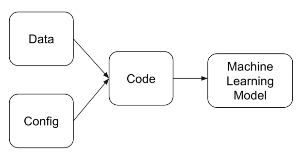
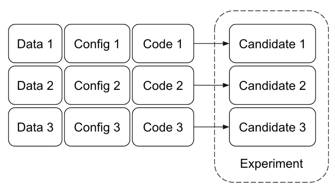
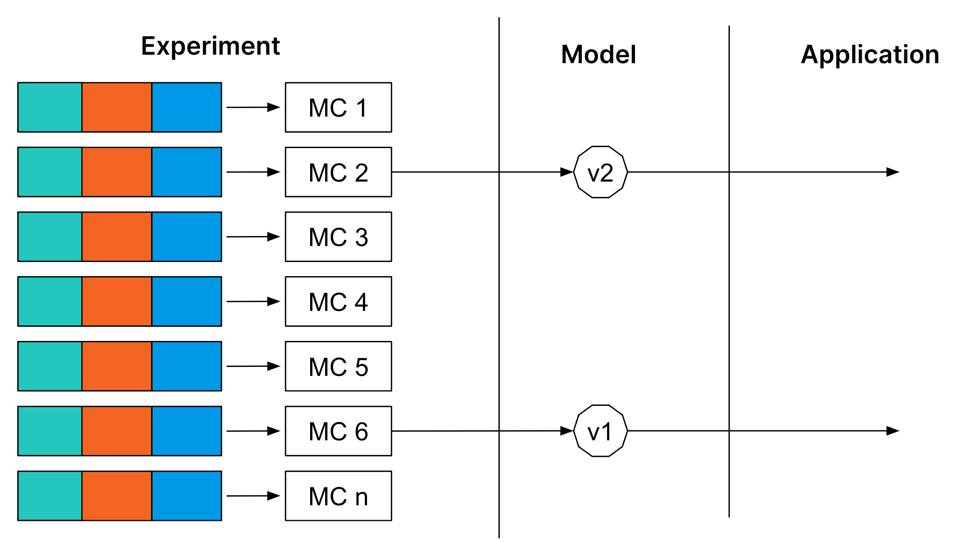

This is a project led by the Incubation Engineer - MLOps

DRI: [@eduardobonet](https://gitlab.com/eduardobonet)

- [Epic](https://gitlab.com/groups/gitlab-org/-/epics/9423)
- [All Merge Requests](https://gitlab.com/gitlab-org/gitlab/-/merge_requests?scope=all&state=opened&label_name[]=Model%20Registry)
- [All Issues](https://gitlab.com/gitlab-org/gitlab/-/issues/?label_name%5B%5D=Model%20Registry)

## Mission

Make it dead simple for Data Scientists to track their model lifecycle with GitLab, tracking different candidates, 
promoting them into model versions so that they can be served and deployed.

## Guiding Principles

* GitLab enables Data Scientists to use Model Registry without requiring any support from Platform Engineers
* Model Registry is not just a vertical feature, it integrates across the platform to enhance experience in different steps of model development

## Approach: Model registry as Package registry

- Model registry is implemented using the GitLab package registry. This ensure easy integration across the platform.
- We intend to continue using MLflow as client API, but api support will depend on whether it conflicts with GitLab's package registry

## Current Status

### What is Machine Learning Experiment Tracking?

A Machine Learning Model is the result of three components: the code to extract the patterns, the data where the patterns are
extract from and the configuration used for both. Any change on either of these components can lead to changes in the model 
performance.

Each **Model Candidate** represents a combination of the three components, and the associated artifact and results. A group
of comparable candidates is called an experiment.

Experiment Tracking gives Data Scientists a central place to organize, discover and compare candidates, experiments 
and artifacts, making it easier to keep track of the evolution across time. 

Some of the common features seen in Experiment Tracking offerings are:
- Log the parameters used to created a Candidate
- Log the model metrics of each candidate
- Log additional metadata for each candidate
- Log the artifact generated for each candidate
- Being able to search and filter candidates by metric, parameters or metadata

More info: 
- [ML Experiment Tracking: What It Is, Why It Matters, and How to Implement It](https://neptune.ai/blog/ml-experiment-tracking)
- [Experiment Tracking](https://madewithml.com/courses/mlops/experiment-tracking/)

### What is the difference between Experiment Tracking and Model Registry?

Experiment Tracking is focused on comparing different candidates that can be promoted to a model version. Model Registry
on the other hand focuses on the lifecycle of a candidate that was promoted to a model version.

Candidates can be created either locally, manually or automated through CI (in an MR for example), 
and the code might not even be present in the repository yet. Meanwhile, a model version can be deployed along the application for consumption. 
This way, Experiment Tracking is associated to the Create stage of MLOps, when the Data Scientist is still prototyping, 
while the Model Registry belongs to the Packaging stage.

### What is the difference between Experiment Tracking and Experimentation/AB Testing?

Although with similar names, they do not interact. ML Experiments compare model candidates, based on model metrics computed at 
creation time, while AB testing and experimentation aims com measure the impact of a two or more different variants based on usage
metrics.

 

