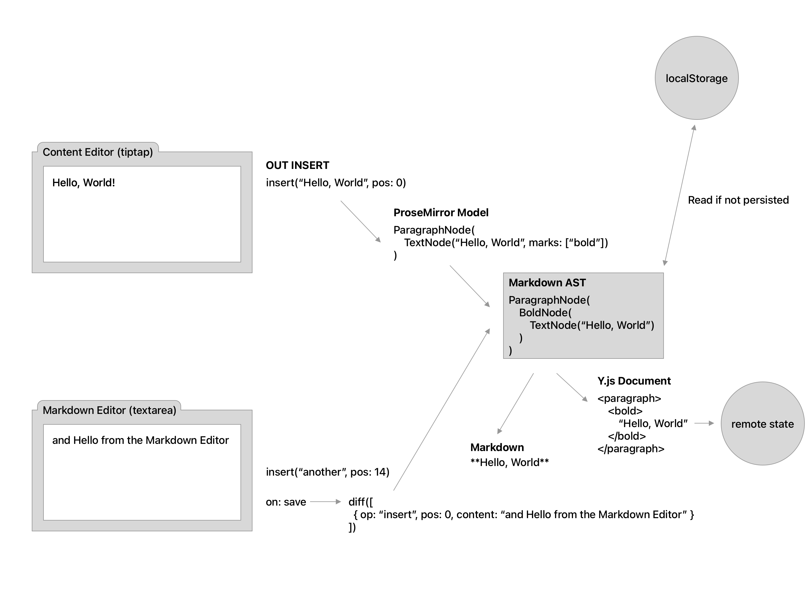

---

title: Real-time Editing of Issue Descriptions (REID) Single-Engineer Group
---

## The Real-time Editing of Issue Descriptions (REID) Single-Engineer Group

Real-time Editing of Issue Descriptions (REID) was a [Single-Engineer Group (SEG)](/handbook/company/structure/#single-engineer-groups)
investment within GitLab’s [Incubation Engineering Department](https://gitlab.com/gitlab-com/www-gitlab-com/-/blob/master/handbook/engineering/development/incubation).
This SEG effort has ended due to a team member departure, effective March 16, 2023.

### Vision

The goal of REID was to ship an MVP to enable real-time collaborative editing of issue descriptions. This would also serve as the foundation for building additional real-time collaborative text-editing use cases at GitLab.
A user should never have to leave the GitLab application for tasks like pair programming, collaborating on isssues, merge requests, tech designs and RFCs.
REID has been developed following the principle of [progressive enhancement](https://developer.mozilla.org/en-US/docs/Glossary/Progressive_Enhancement).

## Outcome

While a working solution to real-time editing of issue descriptions has not yet been implemented,
the SEG laid the foundations for completing this work at a future date by delivering the following key results:

- A Ruby port of `Y.js` (implementation of the YATA CRDT for conflict-free state replication between many participants).
- Several companion libraries for marshalling, persisting and synchronizing this state between clients.
- A [sample application](https://github.com/y-crdt/yrb-actioncable/tree/main/examples/collaborative-text-editor)
  demonstrating how these libraries could be integrated into a Rails application.

These libraries are currently in proof-of-concept state and have yet to be integrated and validated to work
well with a production application such as GitLab.

REID is a complex subject and many challenges were faced along the way:

- There is inherent complexity in building sound foundations based on CRDTs.
- There is domain-specific complexity as regards the integration with GitLab: the existing editor solutions
  are complex and feature-rich; making them real-time requires additional effort.
- There was little in the way of existing work in the Ruby landscape so a lot needed to be written from scratch.
- Some organizational challenges were faced when trying to integrate experimental code with GitLab's
  code base. For example, the [`Awareness` feature](https://gitlab.com/gitlab-org/gitlab/-/merge_requests/92925)
  was built and an integration attempt was made, but ultimately
  did not ship because of open questions around how to slot it into GitLab's overall IA.

A hand-over with the [Application Performance group](/handbook/engineering/infrastructure/core-platform/data_stores/application_performance/)
has been conducted in [this issue](https://gitlab.com/gitlab-org/application-performance-team/team-tasks/-/issues/136).

## Outputs

The following artifacts were produced by this SEG. Some of these are ongoing efforts and will require more time to be completed
and considered ready for production.

### Foundational libraries

GitLab's software stack enables real-time collaboration via [Websockets](https://developer.mozilla.org/en-US/docs/Web/API/WebSocket), in particular [GraphQL subscriptions](https://graphql.org/blog/subscriptions-in-graphql-and-relay/). Real-time comes with certain complexities when users want to collaboratively edit text, in particular rich text. In order to allow multiple parties to edit the same *text* concurrently, we must ensure a conflict-free replication mode between all participating clients. There are several ways to achieve this, but we utilize [CRDTs](https://en.wikipedia.org/wiki/Conflict-free_replicated_data_type). CRDTs allow us to concurrently edit state from `1, 2, … n` clients and eventually end up with a consistent representation of the document on all clients.

Every participant in the editing process is a client (in comparison to [Operational Transformation](https://en.wikipedia.org/wiki/Operational_transformation)). The CRDT we picked ([YATA](https://www.researchgate.net/publication/310212186_Near_Real-Time_Peer-to-Peer_Shared_Editing_on_Extensible_Data_Types)) has a popular frontend implementation [Y.js](https://github.com/yjs/yjs) and we have created bindings for its [Rust](https://www.rust-lang.org/) port [`y-crdt`](https://github.com/y-crdt/y-crdt). This allows our Ruby on Rails backend to just act as one more client.

#### The `y-rb` gem

**Current State:** Published to [RubyGems](https://rubygems.org/gems/y-rb).

This Ruby gem is developed under the `y-crdt` umbrella ([project link](https://github.com/y-crdt/yrb)) and brings basic and complex shared types (Array, Map, Text, XML) to Ruby. The encoded updates and state vectors are 100% compatible with [Y.js](https://github.com/yjs/yjs) and therefore state can be synced between the JavaScript frontend and the Ruby backend in a seamless way. It is implemented as Ruby language bindings on top of [`yrs`](https://github.com/y-crdt/y-crdt),
the Rust implementation of YATA, but adds more idiomatic interfaces that Ruby developers would be accustomed to.

The reference implementation of YATA is written in JavaScript, including the server-side components implementing the transport (websockets in our case.)
In the communication model used in the reference implementation, the server is just another peer in the
synchronization network, but plays a special role: it is the SSoT for what the latest state is, where and how it is perstisted, and what should happen
should clients disconnect and need to catch up on lost updates. This necessitates the server, which is a Rails app (i.e. written in Ruby), to be able to
understand and transform state updates, so a Ruby implementation of YATA was needed.

**Trade-offs, limitations, open issues:**

- Requires Rust to be integrated into the GitLab tool-chain; this has [happened for the GDK](https://gitlab.com/gitlab-org/gitlab-development-kit/-/issues/1588) and [CI build containers](https://gitlab.com/gitlab-org/gitlab-build-images/-/merge_requests/610).
- Most GitLab contributors are not familiar with Rust; at a minimum, the team contributing to this library would need to build up
  Rust proficiency in order to debug issues with the underlying `yrs` bindings. Familiarity with [magnus](https://github.com/matsadler/magnus)
  (used for Rust-Ruby bindings) and [rb-sys](https://github.com/oxidize-rb/rb-sys) (writing C-Ruby extensions in Rust) are necessary.
- An alternative implementation where peers communicate directly
  was [considered, but ultimately discarded](https://gitlab.com/gitlab-org/gitlab/-/issues/386280), the reason being that all communication between peers
  would also have to be implemented in Ruby, which was considered to be the more complex of the two options.
- Thread-safety: GitLab uses a multi-threaded application server. We need to perform additional verification to ensure that critical
  sections where shared state is involved are properly protected.
- Scalability: additional verification is needed that the operations the library performs scale with the traffic and usage patterns we
  see on gitlab.com.

#### The `y-rb_redis` gem

**Current State:** Started

This Ruby gem is developed under the `y-crdt` umbrella ([project link](https://github.com/y-crdt/yrb-redis)). It is a thin abstraction layer to allow persisting changesets to Redis. The updates produced by `y-crdt` documents are stored as lists using Ruby's Array binary encoding.
This allows us to persist and restore documents efficiently.

In the server-centric model, the server acts as a state mediator between clients and allows them to catch up on lost updates in the event
of network partitions or similar problems. This necessitates the server to own a copy of the latest YATA document with all state
updates applied. If a client reconnects, the server can push the latest state vector into the subscriber without the client having to
wait for another client propagating a new update.

**Trade-offs, limitations, open issues:**

- The implementation assumes full-state persistence in which the entire document state is serialized. This is in contrast to using
  a replay log where only individual updates are stored. There is a space-time trade-off: full state persistence will eventually
  use less space than maintaining the update log since it does not grow as a function of update frequency, and YATA's garbage
  collection strategies can not condense redundant operations.
  Reads are faster because no roll-up is required. Writes are more expensive because each update must be incorporated back into the full state
  vector, as opposed to appending a list item to a replay log. As regards scalability, full-state writes may require locking to avoid
  data corruption, whereas a replay log can be optimistically appended to.
- State is ephemeral and distinct from entity state in the database. YATA state must eventually be flushed from Redis
  to the GitLab database to commit the final entity update (such as an issue description string).

#### The `y-rb_actioncable` gem

**Current State:** Started

This Ruby gem is developed under the `y-crdt` umbrella ([project link](https://github.com/y-crdt/yrb-actioncable)).
It implements the [Y sync protocol](https://github.com/yjs/y-protocols/blob/master/PROTOCOL.md) on top of ActionCable by providing
a `SyncChannel` that clients can subscribe to in order to receive and request state updates.
On top of using `y-rb_redis` to store YATA state, it utilizes [Redis Streams](https://redis.io/docs/data-types/streams/)
to keep track of which updates were last seen by any given client.

GitLab has settled on [ActionCable](https://guides.rubyonrails.org/action_cable_overview.html) to implement websockets on top of the
[Redis PubSub](https://redis.io/docs/manual/pubsub/) adapter.
This implementation has no delivery guarantees (we look for `at-least-once`), and no atomic broadcast mechanism.
This means that if a client disconnects then reconnects, it may lose out on updates other clients may have sent to the
server. Upon reconnection, a client is now able to sync its state with the server and catch up on lost messages.

**Trade-offs, limitations, open issues:**

- Essential functionality exists, but a retry mechanism is still in a [draft PR](https://github.com/y-crdt/yrb-actioncable/pull/17).
- As regards the integration with GitLab, we will need to weigh between two approaches for propagating RT updates:
  via the `SyncChannel` implemented in this library (YATA updates) or via the existing `GraphqlChannel` where updates propagate
  by posting a GQL mutation and/or by triggering a GQL query in response to changes being made to the underlying model.
  It may depend on the individual use case which approach makes more sense: if the database is the source of truth and
  conflicts or data races are unlikely, `GraphqlChannel` suffices. An example could be updating the issue label set.
  For more complex use cases such as RT text editing, data flows at much higher frequency and needs to be represented
  efficiently on the wire (using a binary encoding) and YATA provides us assurance that updates are free of conflicts.
  It is conceivable to implement GraphQL mutations and queries on top of `SyncChannel`, but GraphQL does
  not support binary wire formats (we deliver JSON payloads) and sending every YATA update as a mutation will likely
  create unncessary overhead. Both approach could therefore co-exist.

### Awareness

**Current State:** Started

Starting a collaborative editing session should be exactly the same as opening and editing an issue today. In case a second user starts to work on an issue, the backend will create a *collaborative editing session* users automatically and makes sure that all changes (deltas) are synced between all participating parties.

Awareness helps us to see who we are collaborating with and how. It helps us answering the following questions:
- Who is online and collaborating with me?
- Who is actively participating?

**Trade-offs, limitations, open issues:**

- Create a session and awareness model that allows collaborators to "see" each other and their current state (present/away).
  There was an [MR](https://gitlab.com/gitlab-org/gitlab/-/merge_requests/92925) that added this functionality, but it was not
  merged into GitLab because the sidebar is being reworked and closed for new modifications.

### Editor bindings

**Current State:** Started

To determine and replicate a change to the description field, we need to encode everything that a user does as a change event (delta). Y.js uses a binary encoded representation to optimize payloads, but essentially it is a list of operations. One example of how this looks like is the [Quill Delta Format](https://quilljs.com/docs/delta/).

The GitLab UI does not rely on a uniform text editor but instead offeres a mix of `textarea`, `tiptap/prosemirror`, `Web IDE`, …, multiple editor modes (Raw, WYSISWYG), and post-edit transforms (Markdown parser → references). We need to build a transform layer to broadcast changes made to a text field in a conflict-free format, and reversly, apply incoming changes seamlessly in the editor.

**Trade-offs, limitations, open issues:**

- Move parser to frontend (WASM)
- Write a binding (transform) that allows to incrementally receive and apply updates in any text editing mode.
  This could be accomplished by first translating markdown into an intermediate AST that could act as a universal
  interchange format between different editors:

  

## Updates

<figure class="video_container">
    <iframe width="600" height="340" src="https://www.youtube.com/embed?max-results=1&controls=0&showinfo=0&rel=0&listType=playlist&list=PL05JrBw4t0KpPmRsaVaDOoWyIp1iKacZo" frameborder="0" allowfullscreen></iframe>
</figure>

| | Date | Topic | Description | Video |
|---|:----------:|-----------------------------------|-----|-----|
| 14 | 2022-12-21 | An ActionCable based Y.js WebSocket and BroadcastChannel provider | Editor bindings | [https://www.youtube.com/watch?v=g--9JLOMXeQ](https://www.youtube.com/watch?v=g--9JLOMXeQ) |
| 13 | 2022-12-12 | Rust available in gdk and base images | Adding Rust | [https://www.youtube.com/watch?v=xmj7SzYIo1o](https://www.youtube.com/watch?v=xmj7SzYIo1o) |
| 12 | 2022-11-17 | Adding Rust to GitLab Pt.2 | Adding Rust to gdk, CI, etc. | [https://www.youtube.com/watch?v=K_vidq8VdAs](https://www.youtube.com/watch?v=K_vidq8VdAs) |
| 11 | 2022-11-02 | Adding Rust to GitLab | Shipping a gem with a native extension is tricky and extends the scope of the project. | [https://www.youtube.com/watch?v=IQS81adVWWg](https://www.youtube.com/watch?v=IQS81adVWWg) |
| 10 | 2022-10-19 | Message protocol, Editor bindings, Awareness Pt. 2 | Two busy weeks, and lots of complexity. | [https://www.youtube.com/watch?v=wJnvhW4eBKQ](https://www.youtube.com/watch?v=wJnvhW4eBKQ) |
| 9 | 2022-10-06 | Real-time demo (y-rb usage) | Celebrate the first table `y-rb` multip-platform release with a sandbox demo. | [https://www.youtube.com/watch?v=1gfYfUMh3dU](https://www.youtube.com/watch?v=1gfYfUMh3dU) |
| 8 | 2022-09-16 | Change of plans | Awareness feature not to ship to current issue sidebar and y-rb multi-platform releases. | [https://www.youtube.com/watch?v=x47YnULTiro](https://www.youtube.com/watch?v=x47YnULTiro) |
| 7 | 2022-08-18 | Ruby+Rust | Awareness feature about to ship, and a little intro to how Ruby+Rust bindings work. | [https://www.youtube.com/watch?v=ng20jSo2TIs](https://www.youtube.com/watch?v=ng20jSo2TIs) |
| 6 | 2022-08-05 | Progress & Roadmap | Progress on the work to ship the Awareness widget, and an outlook for what is coming next. | [https://www.youtube.com/watch?v=ZSdpj_YxsCE](https://www.youtube.com/watch?v=ZSdpj_YxsCE) |
| 5 | 2022-07-22 | JTBD and Progress Update | JTBD (Jobs to be done) and Iteration on the Awareness UI | [https://www.youtube.com/watch?v=S0s-s45zVv8&list=PL05JrBw4t0KpPmRsaVaDOoWyIp1iKacZo&index=2](https://www.youtube.com/watch?v=S0s-s45zVv8&list=PL05JrBw4t0KpPmRsaVaDOoWyIp1iKacZo&index=2) |
| 4 | 2022-07-06 | Awareness UI/UX and a CRDT database | Where and how to add the presence indicators on the issue page. A database for CRDTs is usually not necessary, but can become interesting for cases where we need a simple way to fetch the initial document state. | [https://www.youtube.com/watch?v=B094U_DvL-s&list=PL05JrBw4t0KpPmRsaVaDOoWyIp1iKacZo&index=3](https://www.youtube.com/watch?v=B094U_DvL-s&list=PL05JrBw4t0KpPmRsaVaDOoWyIp1iKacZo&index=3) |
| 3 | 2022-06-22 | The Awareness feature | Technical challenges on rolling out real-time features at scale. Memory and resource concerns and how to mitigate them. | [https://www.youtube.com/watch?v=ZPH9tvcPDfc&list=PL05JrBw4t0KpPmRsaVaDOoWyIp1iKacZo&index=4](https://www.youtube.com/watch?v=ZPH9tvcPDfc&list=PL05JrBw4t0KpPmRsaVaDOoWyIp1iKacZo&index=4) |
| 2 | 2022-06-09 | Tech design & terminology | A proposal for real-time collboration at GitLab. The presented tech design aims to be a comprehensive guide and peer-reviewed document | [https://www.youtube.com/watch?v=crzCYkMk5XQ&list=PL05JrBw4t0KpPmRsaVaDOoWyIp1iKacZo&index=5](https://www.youtube.com/watch?v=crzCYkMk5XQ&list=PL05JrBw4t0KpPmRsaVaDOoWyIp1iKacZo&index=5) |
| 1 | 2022-05-25 | First update | The y-rb Ruby gem and how we are going to use it to bring real-time collaboration to GitLab. | [https://www.youtube.com/watch?v=5mTS64Y-rX0&list=PL05JrBw4t0KpPmRsaVaDOoWyIp1iKacZo](https://www.youtube.com/watch?v=5mTS64Y-rX0&list=PL05JrBw4t0KpPmRsaVaDOoWyIp1iKacZo) |

## Product Development Group affinity

- [Code Review](/handbook/product/categories/#code-review-group)
- [Source Code](/handbook/product/categories/#source-code-group)
- [Editor](/handbook/product/categories/#editor-group)
- [Product Planning](/handbook/product/categories/#product-planning-group)
- [Project Management](/handbook/product/categories/#project-management-group)

## Links

- [Epic](https://gitlab.com/groups/gitlab-org/incubation-engineering/real-time-editing/-/epics?state=opened&page=1&sort=start_date_desc)
- [Issues](https://gitlab.com/gitlab-org/incubation-engineering/real-time-editing/real-time-editing-issue-descriptions/-/issues)
- [Hand-over issue](https://gitlab.com/gitlab-org/application-performance-team/team-tasks/-/issues/136)

### Reading List

* [Hybrid Anxiety and Hybrid Optimism: The Near Future of Work](https://future.a16z.com/hybrid-anxiety-optimism-future-of-work/)
