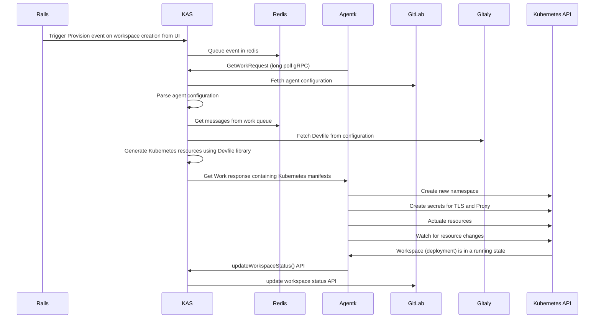
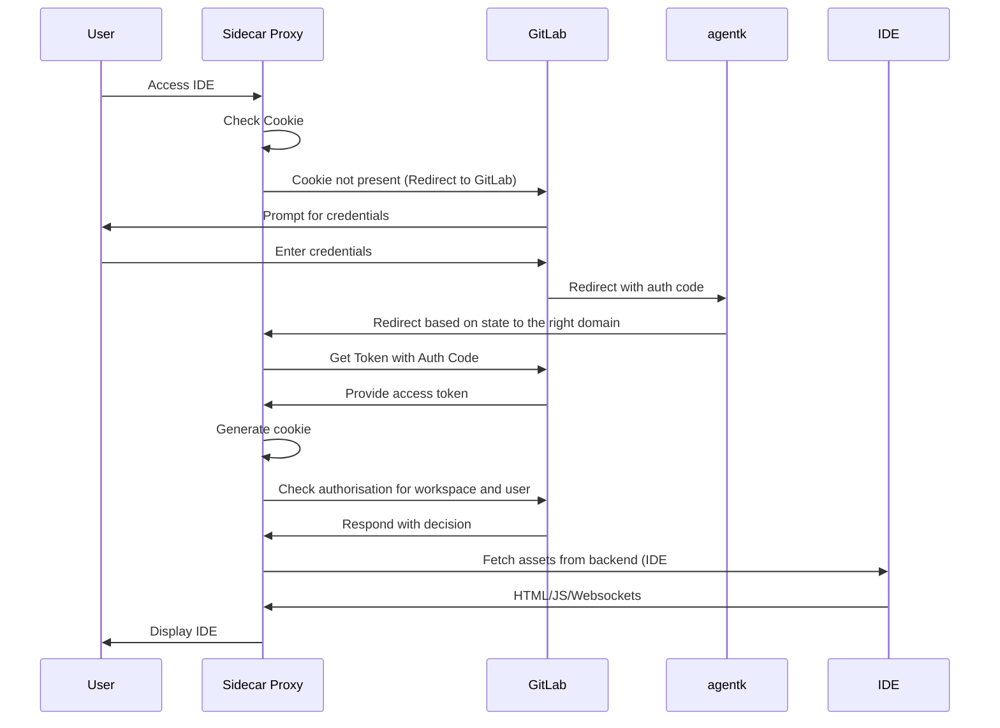

---

title: Server Runtime Single-Engineer Group
---


## Introduction

This page provides a comprehensive overview of *Server Runtime* and catalogs relevant links and pages. It is created and maintained by @shekharpatnaik. The Server Runtime SEG [Single-Engineer Group](/handbook/company/structure/#single-engineer-groups) is a part of [Incubation Engineering Department](/handbook/engineering/development/incubation/).

## About Server Runtime

Server Runtime is aimed at engineering a performant, scalable remote development experience & productizing it as a customer offering. When this comes to fruition, we envision being able to bring to bear a remote development experience that is browser and platform agnostic and lets GitLab users build, run and test their code right within the GitLab platform. We see this as a viable product idea to generate revenue for the company & to transform the IDE experience for engineers. Competitors in this space, currently, are GitPod and Codespaces.

Generally, cloud based development environments have the following traits:

1. Easier to standardize and templatize
2. Easier to patch, sandbox, upgrade
3. Offer flexibility and support for multiple IDEs such as Vim, Emacs, VS Code and IntelliJ
4. Can be rate-carded and function well with a consumption based model
5. Variable performance based on proximity to remote environment, component and interaction design, dependency management

This SEG aims at engineering the server runtime in a manner that addresses each of the enlisted traits to build a performant, scalable, configurable experience for users. This SEG was established in response to the following [issue](https://gitlab.com/gitlab-org/gitlab/-/issues/329602).

## Evolution of Server Runtime

The Server Runtime architecture has evolved iteratively. The initial approach at inception made use of a custom server runtime (control plane); the control plane handled server runtime environment deployments and lifecycle events in a variety of target platforms, including Kubernetes and cloud virtual machines (VMs)

The functionality offered by the initial version of the control plane is summarized for reference & posterity here:

- Handling server runtime deployments and lifecycle events in k8s environments
- Handling integration with GitLab to store workspaces metadata and authn/z
- A multitude of IDE experiences including VS Code, Jupyter Hub, Vim, and others.
- Ability to run it in managed k8s clusters on GitLab.com as a free or paid offering
- Support for k8s and VM environments
- Ability to run in headless mode enabling users to connect local IDEs and/or the GitLab Web IDE to the runtime environment

You can review the architecture that enabled this functionality [here](https://gitlab.com/gitlab-org/incubation-engineering/server-runtime/custom-server-runtime-playground/-/blob/main/Readme.md#architecture)

The Server Runtime architecture has gone through several iterations since, and as it stands currently, the notable change in approach is to develop the Server Runtime based on the [GitLab Agent for Kubernetes](https://docs.gitlab.com/ee/user/clusters/agent/).

GitLab Agent for Kubernetes (GA4K) provides an extensible module based architecture for building services that can communicate with both GitLab (rails) as well as a k8s cluster. The agent can be installed on any k8s cluster; and it communicates with rails over a bi-directional gRPC tunnel. Using the GitLab agent enables the deployment of developer workspaces to all customers clusters that have the GitLab agent installed.

The architecture makes extensive use of [Devfiles](https://devfile.io) which is an open source standard to express the definition of developer environments.

## Milestones and progress

The most recent weekly update for the Server Runtime SEG can be found at:

<figure class="video_container">
    <iframe width="600" height="340" src="https://www.youtube.com/embed?max-results=1&controls=1&showinfo=0&rel=0&listType=playlist&list=PL05JrBw4t0Kr6sicAh753uzvoPqrGZuLB" frameborder="0" allowfullscreen></iframe>
</figure>

### Previous recordings

| Date       | Tl;DR;                                                                            | Video                                                                          |
|------------|-----------------------------------------------------------------------------------|--------------------------------------------------------------------------------|
| 2022-12-23 | GitLab Agent - Making changes to workspace state from the UI and k8s              | [https://youtu.be/nCIusZfxufo](https://youtu.be/nCIusZfxufo){:target="_blank"} |
| 2022-12-16 | GitLab Agent - A demo of using Python and Jupyter with SR4GA4K                    | [https://youtu.be/lQK_3xTb55U](https://youtu.be/lQK_3xTb55U){:target="_blank"} |
| 2022-12-12 | GitLab Agent - Rails UI, Authentication, Repository cloning                       | [https://youtu.be/jxHFOeg9gAw](https://youtu.be/jxHFOeg9gAw){:target="_blank"} |
| 2022-11-29 | GitLab Agent - Started porting server runtime. Support for HTTPS                  | [https://youtu.be/-E8wJZsYnbM](https://youtu.be/-E8wJZsYnbM){:target="_blank"} |
| 2022-11-16 | Custom Control Plane - Adding Rails UI and connecting to the GDK                  | [https://youtu.be/wyZbbrCBk6A](https://youtu.be/wyZbbrCBk6A){:target="_blank"} |
| 2022-11-02 | Custom Control Plane - Adding Devfile support, support for SSH authn and authz    | [https://youtu.be/f_jfwh4v_q0](https://youtu.be/f_jfwh4v_q0){:target="_blank"} |
| 2022-10-26 | Custom Control Plane - Documentation updates, support for GCP DNS, IDE selection  | [https://youtu.be/JIGNEqpdI7k](https://youtu.be/JIGNEqpdI7k){:target="_blank"} |
| 2022-10-19 | Custom Control Plane - Adding Authentication, opening ports, attaching volumes    | [https://youtu.be/GFM0xK7Hz_I](https://youtu.be/GFM0xK7Hz_I){:target="_blank"} |
| 2022-10-12 | What is server runtime. Starting work on the custom control plane.                | [https://youtu.be/yrhJo_wUuIM](https://youtu.be/yrhJo_wUuIM){:target="_blank"} |


## Server Runtime Architecture

### Overview


Server runtime comprises of GitLab and customer managed components. GitLab manages the server side component called **KAS** and an agent, called **Agentk** runs on the customers' cluster/s.
The Server Runtime is deployed as a module, on both, the server and the client side. AgentK makes outbound connections to KAS from the customer's k8s cluster to fetch updates. It actuates k8s resources pertinent to the runtime, such as deployment, services et cetera based on these updates. Customer hosting GitLab instances will be responsible for managing KAS while for managed GitLab.com accounts this will be managed by GitLab. GitLab can talk to KAS using a gRPC API which is accessed using the kas-gem.

### Workspace Provisioning Flow (k8s)

A core part of the server runtime is provisioning a new workspace and managing workspace lifecycle events. The flow can be summarized as follows:

1. A user requests a new workspace from the GitLab Rails UI.
2. Rails makes a gRPC API callout to KAS to register the new provisioning event request
3. KAS writes the event to a queue (list) in Redis
4. Once the agent is ready, it makes a callout to KAS to fetch work (GetWorkRequest)
5. The message is picked up (and processed) by KAS
6. KAS fetches the Devfile using the Gitaly API and generates Kubernetes resources using Go templates and the *devfile library*
7. KAS sends the YAMLs to be applied to agentk using gRPC server push
8. Agentk applies the changes, creating a new Kubernetes namespace if needed
9. As the status of the deployment changes, agentk updates GitLab (via KAS) using the updateWorkspaceStatus API



### Handling user authN/Z into the workspace

This flow describes the process user authentication & authorization process. A sidecar proxy (oauth2-proxy) is injected into every workspace. A forked version of OAuth2-proxy performs the following tasks

1. Authenticates the user into GitLab
2. Makes an authorization call to confirm that the user has access to the workspace
3. Clones the repo with the user credentials


### Handling event reconciliation and drift detection

Coming soon!


### Next steps

1. Enable SSH connections for headless IDE support
2. Support running isolated workloads such as Docker and Kubernetes within a workspace
3. Ability to view workspace logs from the rails UI

## Product Development Group Affinity

- [Editor](/handbook/product/categories/#editor-group)
- [Remote Development](https://about.gitlab.com/direction/create/ide/remote_development/)


## Getting started with Server Runtime

Server runtime is a GitLab agent module. You can clone the following branch

```sh
git clone git@gitlab.com:gitlab-org/cluster-integration/gitlab-agent.git

git checkout spatnaik-remote_dev_server_runtime origin/spatnaik-remote_dev_server_runtime
```

You can then run **KAS** using the following command. You need GDK installed in order for this to work.

```sh
export OWN_PRIVATE_API_URL=grpc://127.0.0.1:8155
bazel run //cmd/kas -- --configuration-file="$HOME/projects/gitlab-development-kit/gitlab-k8s-agent-config.yml"
```

**agentk** can be run using the following. The token file can be obtained by [registering the agent](https://docs.gitlab.com/ee/user/clusters/agent/install/index.html).

```sh
export POD_NAME=test
export POD_NAMESPACE=default
bazel run //cmd/agentk -- --kas-address=grpc://127.0.0.1:8150 --token-file="$(pwd)/token.txt"
```

## Handy links and pages

- [Original Issue](https://gitlab.com/gitlab-org/gitlab/-/issues/329602)
- [Remote Development Strategy](https://gitlab.com/gitlab-org/gitlab/-/issues/377921)
- [Custom Server Runtime Playground Repository](https://gitlab.com/gitlab-org/incubation-engineering/server-runtime/custom-server-runtime-playground)
