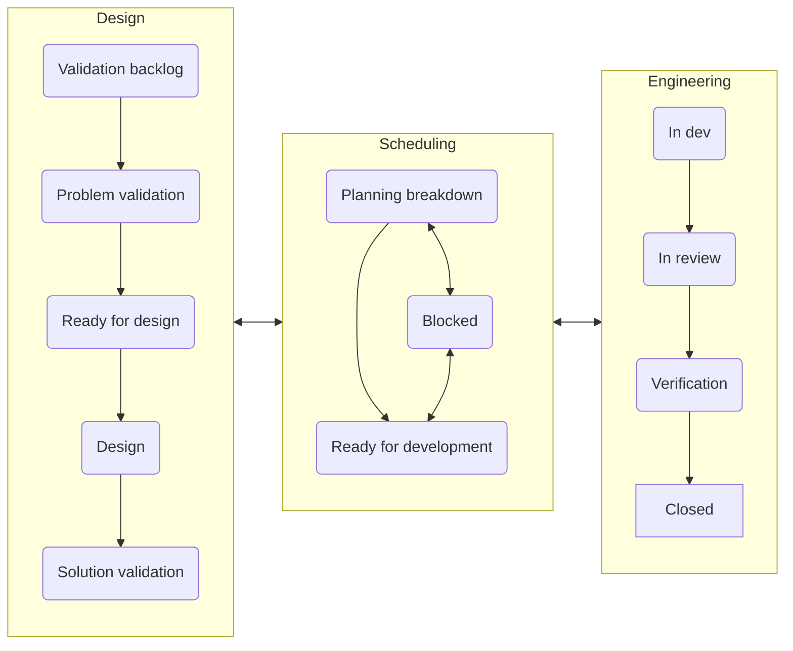
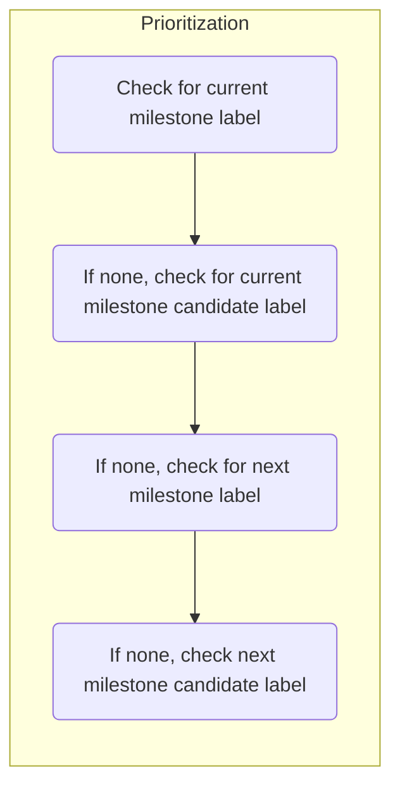

## Useful Links

### Product

- [Product Vision](https://about.gitlab.com/direction/ops/#verify)
- [Pipeline Authoring Category direction](https://about.gitlab.com/direction/verify/pipeline_authoring/)
- [number of unique users who trigger ci_pipelines (Performance indicator)](https://internal.gitlab.com/handbook/company/performance-indicators/product/ops-section/#verifypipeline-authoring---gmau---number-of-unique-users-interacting-with-gitlab-ciyml-file) - Internal link
- [CI/CD Development Documentation](https://docs.gitlab.com/ee/development/cicd/index.html)
- [CI/CD Components Documentation](https://docs.gitlab.com/ee/ci/components/)
- [CI/CD Catalog Documentation](https://docs.gitlab.com/ee/ci/components/#cicd-catalog)

### Team

- [Team Resources](/handbook/engineering/development/ops/verify/pipeline-authoring/team-resources/)
- [Workflow board: `~group::pipeline authoring`](https://gitlab.com/gitlab-org/gitlab/-/boards/5726606?label_name[]=group%3A%3Apipeline%20authoring&milestone_title=Started)
- [Slack Channel: `#g_pipeline-authoring`](https://gitlab.slack.com/archives/C019R5JD44E)

### Videos

- [GitLab Unfiltered: Pipeline Execution group (CI Related)](https://www.youtube.com/playlist?list=PL05JrBw4t0KpsVi6PG4PvDaVM8lKmB6lV)
- [CI Backend Architectural Walkthrough - May 2020](https://www.youtube.com/watch?v=ew4BwohS5OY)
- [Frontend CI product / codebase overview - June 2020](https://www.youtube.com/watch?v=7CUd7aAUiWo)
- [CI/CD Catalog Demo](https://www.youtube.com/watch?v=oNcJCU-a-bM)

### Core domain

- Pipeline configuration: YAML syntax, linter and configuration parser.
- CI/CD Catalog: publishing and releasing process to Catalog.
- Pipeline creation: process of building and persisting a pipeline including multi-project
  or child pipelines.

## Exciting things and accomplishments

This section will list the top three most recent, exciting accomplishments from the team.

- We welcomed [Rajendra Kadam](https://gitlab.com/rkadam3) as our newest backend engineer to the team!
- Recently, we completed the next [phase](https://gitlab.com/groups/gitlab-org/-/epics/11674) of Beta release for CI Catalog.
- 2023 team accomplishments can be found [here](https://gitlab.com/gitlab-org/ci-cd/pipeline-authoring/-/issues/122).

## Team Members



## Stable Counterparts

To find our stable counterparts, look at the Pipeline Authoring [product category listing](/handbook/product/categories/#pipeline-authoring-group).

## Dashboards


  



  



  



  


#### Cross-functional prioritisation

UX, Product Manager and Engineering Manager meet weekly to discuss cross-functional prioritisation in addition to any other topics that require the quad to collaborate on. Additionally, the quad also reviews the [dashboard](/handbook/engineering/development/ops/verify/pipeline-authoring/#merged-merge-request-types) which shows the % of MRs that are bugs vs maintenance vs features to ensure the team's efforts are properly aligned to the prioritisation. 

#### Design Collaboration

We hold a bi-weekly design sync meeting open to all team members where we discuss any design-related topic.

## How We Work

### Implementation template

A template in the `gitlab-org/gitlab` project called `Pipeline Authoring Issue Implementation` is used to capture consistent details around implementation efforts. This template should be used when creating `backend` or `frontend` issues which could relate to the implementation of a validated problem with a refined solution proposal, or a general `backend` or `frontend` request that isn't related to a feature improvement or addition. This template is not intended to replace or duplicate any original design issues as the single source of truth ([SSOT](https://docs.gitlab.com/ee/development/documentation/styleguide/#documentation-is-the-single-source-of-truth-ssot)). When creating an issue for a feature change or addition, usability problems or bugs, use the `feature request` or `bug` issue templates.

### Planning

Issues are refined and weighted prior to assigning them to a milestone. We use `candidate::` scoped labels to help with planning work in future milestones. This label allows us to filter on the issues we are planning, allowing Product, Engineering, and UX to refine issues async that have `workflow::design` and `workflow::ready for development` labels applied. Weighting also helps with capacity planning with respect to how issues are scheduled in future milestones.

We create a [planning issue](https://gitlab.com/gitlab-org/ci-cd/pipeline-authoring/-/blob/master/.gitlab/issue_templates/Planning_issue_PA.md) as part of our milestone planning process and the [workflow board](https://gitlab.com/gitlab-org/gitlab/-/boards/5726606?label_name[]=group%3A%3Apipeline%20authoring&milestone_title=Started) is the single source of truth ([SSOT](https://docs.gitlab.com/ee/development/documentation/styleguide/#documentation-is-the-single-source-of-truth-ssot)) for current and upcoming work. Product is the DRI in prioritizing work, with input from Engineering, UX, and Technical Writers. The planning issue is used to discuss questions and team capacity. Prior to the beginning of each milestone, issues identified in the planning issue will be assigned to that milestone and engineers can assign prioritized issues to themselves from the top of the `workflow::ready for development` column in the [workflow board](https://gitlab.com/gitlab-org/gitlab/-/boards/5726606?label_name[]=group%3A%3Apipeline%20authoring&milestone_title=Started).

#### Finding issues that need refinement
All issues that need refining will have the `~workflow::planning breakdown` label applied to them to show that the issues are ready to be weighted.
You can access all these issues using this [issue filter](https://gitlab.com/gitlab-org/gitlab/-/boards/5726606?label_name[]=group%3A%3Apipeline%20authoring&milestone_title=Started).
It's never too early to refine an issue, but we should prioritise the issues closest to starting.  We should also apply the `~workflow::refinement` label when there are still technical discussions that need to take place before weighting can occur during `~workflow::planning breakdown`.

#### How Engineering Refines Issues

*side note: we prefer [using Refining over Grooming](/handbook/communication/top-misused-terms)*

The purpose of refining an issue is to ensure the problem statement is clear enough to provide a rough effort sizing estimate; the intention is not to provide **solution validation** during refinement.

Engineering uses the [following handbook guidance for determining weights](#weighting-issues). If any issue needs any additional `~frontend ~backend ~Quality ~UX ~documentation` reviews, they are assigned to the respective individual(s).

##### Checklist for Refining Issues

1. Does the issue have a problem statement in the description?
1. Does the issue have the expected behaviour described well enough for anyone to understand?
1. Does the issue explicitly define who the stakeholders are (e.g. BE, FE, PM, UX and/or Tech Writer)?
1. Does the issue have a proposal in the description? *If so:*
    1. Does the proposal address the problem statement?
    1. Are there any unintended side effects of the implementation?
1. Does the issue have proper labeling matching the job to be done? (e.g. bug, feature, performance)
1. If the issue is a `type::bug`, is it clear how to reproduce the behavior and can a sample CI configuration file be provided?

Any one on the team can contribute to answering the questions in this checklist, but the final decisions are up to the PM and EMs.

##### Steps for Refining and Weighting Issues

Engineers will:
1. Go through the checklist above for refining issues they assign to themselves prior to each milestone.
1. Add a [weight based on the definitions](#weighting-issues).
1. Update the `~workflow::` label to the appropriate status, for example:
   * ~"workflow::design" if further design refinement is needed, and let the designer know.
   * ~"workflow::ready for development" when refinement is complete and a weight has been applied, signaling that it's ready for implementation and the issue can be scheduled accordingly.
   * ~"workflow::planning breakdown" if more investigation or research is needed, the status does not move, and the PM and EMs should be pinged.
1. Unassign themselves from the issue when they are done refining and weighting the issue.

#### Weighting Issues

The `needs weight` [board](https://gitlab.com/gitlab-org/gitlab/-/boards/5726606?label_name[]=group%3A%3Apipeline%20authoring&label_name[]=workflow%3A%3Aplanning%20breakdown) is used to show issues that need weight applied for the next milestone. That criteria will be denoted by having a `workflow::planning breakdown` label and the appropriate milestone candidate label applied to it (i.e. `candidate::15.0`). During the first 7 days of the month (i.e May 1-7), team members will review the `needs weight` [board](https://gitlab.com/gitlab-org/gitlab/-/boards/5726606?label_name[]=group%3A%3Apipeline%20authoring&label_name[]=workflow%3A%3Aplanning%20breakdown) and assign themselves to issues. Issues that aren't able to be weighted in one milestone will be evaluated for future milestones. If there is an issue with a higher urgency for weighting, a team member might be directly assigned to the issue for a prioritized review.

We add a `Weight` to issues as a way to estimate the effort needed to complete an issue. We factor in complexity and any additional coordination needed to work on an issue.  We weight issues based on complexity:

| Weight | Description  |
| --- | --- | --- |
| 1: Trivial | The problem is very well understood, no extra investigation is required, the exact solution is already known and just needs to be implemented, no surprises are expected, and no coordination with other teams or people is required.  Examples are documentation updates, simple regressions, and other bugs that have already been investigated and discussed and can be fixed with a few lines of code, or technical debt that we know exactly how to address, but just haven't found time for yet. |
| 2: Small | The problem is well understood and a solution is outlined, but a little bit of extra investigation will probably still be required to realize the solution. Few surprises are expected, if any, and no coordination with other teams or people is required.  Examples are simple features, like a new API endpoint to expose existing data or functionality, or regular bugs or performance issues where some investigation has already taken place. |
| 3: Medium | Features that are well understood and relatively straightforward. A solution will be outlined, and some edge cases will be considered, but additional investigation may be required to confirm the approach. Some surprises are expected, and coordination with other team members may be necessary.  Bugs that are relatively well understood, but additional investigation may be required.  The expectation is that once the problem is verified and major edge cases have been identified, a solution should be relatively straightforward.  Examples are regular features, potentially with backend or frontend dependencies or performance issues. |
| 4: Borderline | Similar to a weight of 3, and still technically feasible as one issue, but has more unknowns.  This weight represents issues requiring a little more effort than average, but we can still complete the work based on how the proposal is currently structured. |
| 5: Large | Features that are well understood, but has more ambiguity and complexity. A solution will be outlined, and major edge cases will be considered, but additional investigation will likely be required to validate the approach. Surprises with specific edge cases are to be expected, and feedback from multiple engineers and/or teams may be required.  Bugs are complex and may be understood, and may not have an indepth solution defined during issue refinement. Additional investigation is likely necessary, and once the problem is identified, multiple iterations of a solution may be considered.  Examples are large features with backend and frontend dependencies, or performance issues that have a solution outlined but requires more indepth solution validation.|

The maximum weighted value for an issue is a `5`, and may exceed one milestone to complete given additional dependencies and/or complexity. Consider whether an issue weighted with a `5` can be broken down into smaller iterations.

If an issue requires a feature flag rollout plan, consider increasing the weight by `1` or `2`, according to the effort involved in rolling out the feature flag and monitoring the new behavior.

##### What if an issue needs to be re-weighted?

Sometimes, issues that were originally weighted need to be updated to give a more accurate reflection of what the true work was.
When this happens, team members are encouraged to:
* Provide comments explaining why the weight is changing as the task is being implemented
* Update the weight of the issue as limitations are realized during implementation, and validate that the weight is correct upon completion of the task
* Note in the current milestone retrospective of this change as this will provide valuable context for historical reference of how much effort was involved with this work

### Syntax deprecation process

Our CI syntax keeps evolving. We cannot support all keywords indefinitely, so deprecating and removing keywords is inevitable.

GitLab does not have a versioning system for CI/CD configuration. Therefore, it is critical to over-communicate our deprecation purposes to our users and take the necessary precautions to reduce the impact on their projects. Deprecating a keyword is risky because it will break all pipelines using it, and in some cases, users are not aware of the keyword they use in their pipeline. The deprecation process described below is similar to the [deprecating and removing features](/handbook/product/gitlab-the-product/#process-for-deprecating-and-removing-a-feature) process, with additional steps to reduce the risks which involved with removing a CI/CD keyword.

1. Deprecation notice - Syntax removal introduces a breaking change, as outlined in our deprecation process, we must notify the community and customers, which means including a deprecation notice in the monthly release post.
1. Track keyword usage - Tracking keyword usage should begin as early as possible. It is a mandatory step that helps estimate the user impact, timing, and needed effort. The more users use the keyword, the more time it takes to remove it (It took more than four years to move from [remove](https://gitlab.com/gitlab-org/gitlab-foss/-/merge_requests/9766) to [deprecation](https://gitlab.com/gitlab-org/gitlab/-/issues/346823) for 'type' keyword).
1. In-app warning - Provide our users with an in-app notification that we plan to remove a keyword they use in their pipeline. Our customers will get a notification in each run of the pipeline that uses the deprecated keyword. The warning will be printed:
   - At run time on the pipeline page and logs.
   - In the pipeline editor, while authoring a pipeline.

    This step is optional if the keyword usage is relatively low (Recommend minimal reach of ~5% impacted users).
1. Keyword removal - The keyword will be removed from our code and schema and should happen in a major version. Once removed,  using the keyword will result in a lint error.

### Release Plans

To encourage more transparency and collaboration amongst the team and additionally align on the [Release Posts](/handbook/marketing/blog/release-posts/) we publish at the end of each milestone, we will be creating a separate issue to highlight a **Feature flag roll out plan** for each feature being released starting in 13.2, based on the [issue template for feature flag roll outs](https://gitlab.com/gitlab-org/gitlab/-/blob/master/.gitlab/issue_templates/Feature%20Flag%20Roll%20Out.md). The engineer who implements the feature will be responsible for creating this separate issue to highlight the details of when and how the feature flag will be toggled, and subsquently link this issue to their feature issue.  The product manager will tag this issue as a blocker to their release post, so that everyone is aligned on the release plan of the feature.

### Quad-planning

Similar to the [Three Amigos](https://www.agilealliance.org/glossary/three-amigos) process, Quad-planning is leveraging our "Quad" (Product, UX, Engineering and Quality) to help inform planning of work for the team. It also ensures a shared understanding about the scope of work in a milestone. The _Quad_ is invited to provide feedback on a Planning Issue to ensure that issues have been properly refined. Unlike the [regular product development workflow that details the Quad-planning process](/handbook/product-development-flow/#build-phase-1-plan), Engineering is not only represented by Engineering Management, but the Engineer DRIs as well. The SET counterpart representing Quality will also provide feedback earlier in the process following the [Quality department's guidelines for Quad-Planning](/handbook/engineering/infrastructure/test-platform/quad-planning/#process), by working asynchronously and reviewing the issues in the Planning issue.

The Product Manager will label relevant issues from the milestone planning issue with the `quad-planning:ready` label. Supplying these distinct viewpoints at this early stage of planning is valuable to informing the feasibility of the effort, as well as refining any unclear requirements or scope. Once acceptance criteria is agreed upon, the `quad-planning:complete` label is applied by the SET on each of the issues.

### Workflow

We use the [Pipeline Authoring Workflow issue board](https://gitlab.com/gitlab-org/gitlab/-/boards/5726606?label_name[]=group%3A%3Apipeline%20authoring&milestone_title=Started) to track what we work on in the current milestone.

We follow the [product development flow](/handbook/product-development-flow/) to ensure that the problems we're solving are well understood and the solutions are well defined and validated before the implementation.

We aim to achieve key outcomes in each phase in order to de-risk subsequent phases. However, the product development flow doesn't dictate the order we go through the phases, or the time spent in each. We might skip certain phases if we think that the necessary outcomes for that phase have already been achieved.

Development moves through [workflow states](/handbook/product-development-flow/#workflow-summary) as follows:

We use workflow labels to efficiently communicate an issue's state. Using these labels enables collaboration across teams and communicates an issue's current state. The DRIs throughout each phase of the workflow are responsible for keeping the workflow labels up-to-date.

**Note:** `workflow::awaiting security release` is applied by an engineer after the security issue has been approved by an AppSec engineer and a maintainer, and the backports have been created. This label signals that the MR is ready for merging into production, but it is awaiting the next [monthly security release](https://about.gitlab.com/handbook/engineering/releases/security-releases/). When this label is applied, the issue's milestone should also be updated to the next milestone to align with the next security release's milestone.

Issue descriptions shall always be maintained as the single source of truth. Issue description accuracy should be maintained by the DRIs throughout each phase. However all collaborators can and should contribute when they see discrepancies or needed updates.

#### "What do I work on next?"

Each member of the team can choose which issues to work on during a milestone by assigning the issue to themselves.  When the milestone is well underway and we find ourselves looking for work, we default to working **right to left** on the **issue board** by pulling issues in the right-most column. If there is an issue that a team member can help with on the board, they should do so instead of starting new work. This includes conducting code review on issues that the team member may not be assigned to, if they feel that they can add value and help move the issue along to completion.

Specifically, this means our work is prioritized in the following order:
 * Any verification on code that is in `workflow::verification` or `workflow::production` - **NOTE:** If an issue has the `workflow::feature-flagged label`, this means the feature is behind a feature flag that has not  been turned on by default.
 * Conducting code reviews on issues that are `workflow::in review`
 * Unblocking anyone in `workflow::blocked` or `workflow::in dev` if applicable
 * Then, lastly, picking from the top of the `workflow::ready for development` for development column

The goal of this process is to reduce the amount of work in progress (WIP) at any given time. Reducing WIP forces us to "Start less, finish more", and it also reduces cycle time. Engineers should keep in mind that the DRI for a merge request is **the author(s)**, to reflect the importance of teamwork without diluting the notion that having a [DRI is encouraged by our values](/handbook/people-group/directly-responsible-individuals/#dris-and-our-values).

#### "What if there are no issues left in current milestone?"

As we get closer to the end of the milestone, there sometimes might be no unassigned issues left to pick from. When that happens, engineers should pick up new work following the order below:

#### "What if I pick an issue late in a milestone, but it misses the current milestone?"

As we get closer to the end of the milestone, there might not be enough time to complete some of the picked issues.
If an issue misses the milestone, it is automatically assigned the `missed` label, but the label can be removed if
the issue was originally targeting a later milestone. Be sure to leave a comment explaining why the label was removed.
Additionally, if the team member is confident it will make the next milestone, they can update the milestone to match, even if it has not started yet.

#### Using Verify::Cancel label when an issue is canceled.

Sometimes, we have issues that were originally created to be worked on and after analysis or change in direction of the issue, we decide that the issue is no longer needed. Additionally, we may also encounter issues that were addressed previously in other MRs. In these cases, use the `Verify::Cancel` label to make it clear that the issue was closed due to no longer being desired or needed, not due to being completed.

#### Monthly issue progress update

We use the [Issue Health Status feature](https://docs.gitlab.com/ee/user/project/issues/#health-status) to indicate the probability that an issue will ship in the assigned milestone.
On the last week of the milestone, the DRI ([directly responsible individual](/handbook/people-group/directly-responsible-individuals/)) should update the health status for any open issue they are assigned to, with the following options:

- `On Track` - The issue has no current blockers, and is likely to be completed in the current milestone.
- `Needs Attention` - This signals that the DRI of the issue requires collaboration it might impact planned delivery.
- `At Risk` - The issue is **unlikely** to be completed in the current milestone and will probably miss the release due dates.

Please note that if an issue happens to roll over to the next milestone, the DRI should clear the health status once the next milestone begins to ensure the health status is accurate.
#### Issue status updates

When the DRI is actively working on an issue  (workflow status is `workflow::in dev`, `workflow::in review` or `workflow::verification` in the current milestone), they will add a comment into the issue with a status update, detailing:
- the updated issue health status
- notes on what was done based on the updated issue health status (especially if not `On Track`)
- anything else the DRI feels is beneficial to reflect the progress

There are several benefits to this approach:

- Team members can better identify what they can do to help the issue move along the board
- Creates an opening for other team members to engage and collaborate if they have ideas
- Leaving a status update is a good prompt to ask questions and start a discussion
- The wider GitLab community can more easily follow along with product development
- A history of the roadblocks the issue encountered is readily available in case of retrospection
- Product and Engineering Managers are more easily able to keep informed of the progress of work

Expectations for DRIs when providing updates for work in progress:

- Status updates are provided once per month, barring special circumstances (e.g. PTO)
- Ideally updates are made at a logical part of a DRI's workflow to minimize disruption, and not necessarily at the same time/day each week
  - Generally when there is a logical time to leave an update, such as a _change in issue health status_, that is the best time to do so
  - Can be used to present some technical findings or information relevant to other stakeholders

#### Issues in `workflow::design`

The [product development workflow labels](/handbook/product-development-flow/#workflow-summary) are the SSOT for the status of the issue as it relates to the product development workflow.

Issues going through the validation track should have the appropriate workflow label and a milestone assigned so they show up in the `workflow::design` column of the Pipeline Authoring issue board.

As an issue is labeled `workflow::design`, we change the title to `Design: [Issue title]` to make the issues in `workflow::design` easier to differentiate from Frontend and Backend implementation issues which are titled `Frontend: [Issue title]` or `Backend: [Issue title]` respectively. By default, a `Design: [Issue title]` issue will become a `Frontend: [Issue title]` and if multiple Frontend issues are required, the `Design: [Issue title]` will either be promoted to an epic or gets closed.

Once the team has created a shared understanding about the problem and the solution, and there's no obvious outstanding questions about the next steps, the Product Manager moves the issue into `workflow::planning breakdown`. We should avoid moving issues into implementation prematurely to ensure that the design discussions happen during `workflow::design` and not during the implementation as much as possible.

#### Splitting issues

*Note: Whenever possible, we will try to use the same design issue as the frontend implementation issue to ensure everything stays grouped together. Exceptions could be made for large-scale design issues where breaking things out would be easier to manage.*

If an issue has several components (e.g. ~frontend, ~backend, or ~documentation) we should split it up into separate implementation issues. When these issues are created, the issues should be titled `Frontend: [Issue title]` or `Backend: [Issue title]`, and marked as `blocked by` in case one is blocking the other. The original issue should hold all the discussion around the feature, with the implementation issues being used to track the work done. By splitting issues, there are several benefits:

1. There's only one DRI per issue.
1. Workflow labels and health statuses are more relevant.
1. We can weight issues with more accuracy.
1. We can mark one implementation as a blocker for another.
1. It's easier to see what work can be picked up by each functional group.
1. We can schedule feature work across multiple milestones.
1. When team members are selecting work from the [ready for development board](https://gitlab.com/gitlab-org/gitlab/-/boards/5726606?label_name[]=group%3A%3Apipeline%20authoring&label_name[]=workflow%3A%3Aready%20for%20development), it simplifies what issue relates to which component.

When new implementation issues are created, they should always be linked to the initial issue that contains the proposal and relevant discussions.

#### Discussion issues

Sometimes it is useful to discuss a new product opportunity or a technical approach as a team to get additional input from the engineers and the team counterparts. Such discussions aren't always actionable and may or may not result in an actionable issue. These discussions should happen in issues titled `Discussion: [Issue title]`. Their main purpose is to engage the team in the discussions around a topic. After this discussion, we might:

- Create a new issue or issues labeled appropriately with a product development workflow label.
- Promote the discussion to an epic.
- Just close the discussion if it didn't produce actionable steps.

The discussion issue should be linked to any related issues that were created as its outcome.

Having these discussions in issues can help us maintain a source of truth for the problems we're solving as a team and make the discussions more inclusive.

### Spikes

[Spikes](/handbook/product/product-processes/#spikes) are time-boxed investigations typically performed in agile software development. We create Spike issues when there is uncertainty on how to proceed on a feature from a technical perspective before a feature is developed.

#### Guidelines

- Spikes are marked as deliverable to ensure clear ownership from engineers
- Spikes are time-boxed to a short duration, ideally one week. An update should be provided if the spike is more complex and might take longer than a week to investigate.
- We should schedule Spikes at the beginning of a milestone so that investigation will conclude before the planning of the following milestone.
- Limit no more than 2 Spikes per milestone per group.
- Multiple team members collaborate on a spike. They are assigned to at least one frontend and one backend engineer to ensure we consider the issue from both viewpoints.

### Labels

#### Category Labels

The Pipeline Authoring group supports the product marketing categories described below:

| Label                 | |  | | |
| ----------------------| -------| ----|------------| ---|
| `Category:Pipeline Authoring` | [Issues](https://gitlab.com/gitlab-org/gitlab/-/issues?scope=all&utf8=%E2%9C%93&state=opened&label_name[]=Category%3APipeline%20Authoring) | [MRs](https://gitlab.com/gitlab-org/gitlab/-/merge_requests?label_name%5B%5D=Category%3APipeline%20Authoring) | [Direction](https://about.gitlab.com/direction/verify/pipeline_authoring/) | [Documentation](https://docs.gitlab.com/ee/ci/) |
| `Category:Jenkins Importer` | [Issues](https://gitlab.com/gitlab-org/gitlab/-/issues?scope=all&utf8=%E2%9C%93&state=opened&label_name[]=Category%3AJenkins%20Importer) | [MRs](https://gitlab.com/gitlab-org/gitlab/-/merge_requests?label_name%5B%5D=Category%3AJenkins%20Importer) | [Direction](https://about.gitlab.com/direction/verify/jenkins_importer/) | |
| `Category:Component Catalog` | [Issues](https://gitlab.com/groups/gitlab-org/-/issues/?sort=created_date&state=opened&label_name%5B%5D=Category%3AComponent%20Catalog) | [MRs](https://gitlab.com/gitlab-org/gitlab/-/merge_requests?scope=all&state=opened&label_name[]=Category%3AComponent%20Catalog) | [Direction](https://gitlab.com/groups/gitlab-org/-/epics/7462) | [Documentation](https://docs.gitlab.com/ee/architecture/blueprints/ci_pipeline_components/) |

#### Feature Labels

| Label                 | |  | Description |
| ----------------------| -------| ----|------------|
| `CI integrations` | [Issues](https://gitlab.com/gitlab-org/gitlab/-/issues?scope=all&utf8=%E2%9C%93&state=opened&label_name[]=CI%20integrations) | [MRs](https://gitlab.com/gitlab-org/gitlab/-/merge_requests?label_name%5B%5D=CI%20integrations) | Issues related to supporting different CI targets directly (for example, Java or Mobile). | Pipeline Authoring |
| `CI persistence` | [Issues](https://gitlab.com/gitlab-org/gitlab/-/issues?scope=all&utf8=%E2%9C%93&state=opened&label_name[]=CI%20persistence) | [MRs](https://gitlab.com/gitlab-org/gitlab/-/merge_requests?label_name%5B%5D=CI%20persistence) | Issues related to Persistence (workspaces, caching). Does not include artifacts, which is its own label |
| `CI rules` | [Issues](https://gitlab.com/gitlab-org/gitlab/-/issues?scope=all&utf8=%E2%9C%93&state=opened&label_name[]=CI%20rules) | [MRs](https://gitlab.com/gitlab-org/gitlab/-/merge_requests?label_name%5B%5D=CI%20rules) | Issues related to CI rules or linting |
| `bridge pipelines` | [Issues](https://gitlab.com/gitlab-org/gitlab/-/issues?scope=all&utf8=%E2%9C%93&state=opened&label_name[]=bridge%20pipelines) | [MRs](https://gitlab.com/gitlab-org/gitlab/-/merge_requests?label_name%5B%5D=bridge%20pipelines) | Issues related to visualizing how pipelines start and depend on each other. Includes visualizations for triggering, cross-project pipelines, and child/parent pipelines. For job execution, please use `~pipeline processing` |
| `pipeline dag` | [Issues](https://gitlab.com/gitlab-org/gitlab/-/issues?scope=all&utf8=%E2%9C%93&state=opened&label_name[]=pipeline%20dag) | [MRs](https://gitlab.com/gitlab-org/gitlab/-/merge_requests?label_name%5B%5D=pipeline%20dag) | Issues related to [Directed Acyclic Graphs](https://docs.gitlab.com/ee/ci/directed_acyclic_graph/) visualization only. For job execution, please use `~pipeline processing` |
| `pipeline graphs` | [Issues](https://gitlab.com/gitlab-org/gitlab/-/issues?scope=all&utf8=%E2%9C%93&state=opened&label_name[]=pipeline%20graphs) | [MRs](https://gitlab.com/gitlab-org/gitlab/-/merge_requests?label_name%5B%5D=pipeline%20graphs) | Issues related to pipeline graphs and visualization |
| `pipeline authoring` | [Issues](https://gitlab.com/groups/gitlab-org/-/issues?label_name%5B%5D=pipeline+authoring) | [MRs](https://gitlab.com/groups/gitlab-org/-/merge_requests?label_name%5B%5D=pipeline+authoring) | Issues related to authoring the .gitlab-ci.yml file and CI YAML configuration (https://docs.gitlab.com/ee/ci/yaml/) but excludes issues handled by another label such as "CI rules" |

#### Other Notable Labels

| Label                 | |  | Description |
| ----------------------| -------| ----|------------|
| `CI/CD core platform` | [Issues](https://gitlab.com/gitlab-org/gitlab/-/issues?scope=all&utf8=%E2%9C%93&state=opened&label_name[]=CI%2FCD%20Core%20Platform) | [MRs](https://gitlab.com/gitlab-org/gitlab/-/merge_requests?label_name%5B%5D=CI%2FCD+Core+Platform) | Any issues and merge requests related to [CI/CD core domain](#core-domain), either as changes to be made or as observable side effects. |
| `onboarding` | [Issues](https://gitlab.com/groups/gitlab-org/-/issues?scope=all&utf8=%E2%9C%93&state=opened&label_name[]=group%3A%3Apipeline%20authoring&label_name[]=onboarding) | | Issues that are helpful for someone onboarding as a new team member. |
| `Good for 1st time contributors` | [Issues](https://gitlab.com/groups/gitlab-org/-/issues?scope=all&utf8=%E2%9C%93&state=opened&label_name[]=group%3A%3Apipeline%20authoring&label_name[]=Good%20for%201st%20time%20contributors) | | Issues that are good for first time community contributors, and could similarly be labeled for `onboarding` |
| `Seeking community contributions` | [Issues](https://gitlab.com/groups/gitlab-org/-/issues?sort=created_date&state=opened&label_name[]=group::pipeline+authoring&label_name[]=Seeking+community+contributions) | | Issues we would like the wider community to contrbute and may also be labeled `Seeking community contributions` |
| `quick win` | [Issues](https://gitlab.com/groups/gitlab-org/-/issues/?sort=created_date&state=opened&label_name%5B%5D=group%3A%3Apipeline%20authoring&label_name%5B%5D=quick%20win&first_page_size=20) | | Issues we would like the wider community to contrbute and may also be labeled `quick win` |

### Collaboration with UX and Engineering

To create a high-quality product that is functional and useful – Engineering, PM and Product Designer need to work closely together, combine methodologies, and often connect throughout the product development.

Product Designers play a critical role in the product development of user-facing issues. They collaborate with the Engineering and the Product Manager to design the user experience for the features. Once the design solution is proposed, agreed and validated, the Engineering [DRI](/handbook/people-group/directly-responsible-individuals/) is assigned to implement that design and functionality during the milestone for which the issue is planned.

Product Designer, PM, and Engineering use `workflow::design` to discuss possible complexities, challenges, and uncover blockers around the proposed solution. To avoid blocking reviews later in the product development flow, the Product Designer, PM, and Engineering should work collaboratively throughout the feature design and development process to check-in often, so that the UX approval on merge requests is not required.

The Product Designer drives team discussions during the `workflow::design` phase, primarily using issues, during weekly team meetings, or leaving updates in meeting agendas as an async option. Following our [communication guidelines](/handbook/communication/#slack), Slack discussions are mostly reserved for informal communication only. We use [issues](/handbook/communication/#issues) to document design decisions — The issue description should be the single source of truth for any given problem.

The GitLab [Design Management feature](https://docs.gitlab.com/ee/user/project/issues/design_management.html) in issues is preferred for specific mock-up discussions, to make it easier to find the specs for the latest design direction or review the design-related discussions for the solutions that have been explored. Figma prototypes can also be added to the issue description to support quick-access to high-fidelity deliverables.

#### Inclusive Development

Our process of planning and development relies heavily on overcommunication rather than any approval gates or automated notification mechanisms. We adhere to the proactive mindset and responsibility of everyone involved to make sure every step in the process is as transparent as it can be.

For both planning and building this means direct, cross-functional, and other relevant stakeholders are included early into the process. This makes sure everyone is able to contribute to the best of their capabilities at the right time in the process. This can include, but is not limited to, GitLab objects, Slack, meetings, and daily standups.

Some practical examples of this are:
- When you open up or begin working on an epic, issue, or merge request consider if all stakeholders are aware of this or should be updated. If unsure, error on the side of updating rather than keeping silent.
- When making significant progress make sure this is seen by the relevant stakeholders even if you don't require immediate feedback by mentioning them rather than relying on automated email notifications. Make their involvement explicit.

Note: A good practice when only wanting to inform rather than requesting a direct action from the mentioned stakeholders is to put `FYI` directly following the @mention handle.

#### Breaking down issues for iteration

We suggest using the below steps to reach the best results in the shortest time:

* Once, through user research, we have identified a user need and have generated the big idea to meet that need, Product Designer drives the process of moving that idea into a solution prototype involving PM and Engineering Team early and often.
* We take that prototype through a user testing to validate it is solving the original problem.
* When the solution is validated with users - it is time to break the big solution down into smaller issues involving a whole team (PM, Engineers, Product Designer, QA and Technical Writer).
* Engineers, Product Designer, EM and PM are expected to work closely together to find the most technically feasible and smallest feature set to deliver value to early customers and provide feedback for future product development. Check out [iteration strategies](#iteration-strategies) for help.

We aim to design broadly for an epic or full feature at least one milestone ahead of time and then break the big solution into smaller issues to pick up in the next milestones.
Suppose working one milestone ahead to design the big solution is not possible. In that case, Engineering and Product Designer will define the first most technically feasible and smallest feature set ([MVC](/handbook/values/#minimal-viable-change-mvc)) to satisfy early customers that will be implemented in the same milestone.

#### Reviewing Merge Requests

In the past, we did not require UX reviews on MRs in Pipeline Authoring in order to increase velocity.
A lot has changed since this was introduced so we're making steps to re-align ourselves with the [code review guidelines](https://docs.gitlab.com/ee/development/code_review.html#approval-guidelines) and ensuring all MRs with user facing changes are reviewed by a product designer.

UX reviews should follow [the guidelines](/handbook/product/ux/product-designer/mr-reviews/) as closely as possible to reduce the impact on velocity whilst maintaining quality.

Many pipeline authoring features require a runner to run the pipeline in the GDK. Review apps have runners available by default. [Instructions for enabling a runner in Gitpod GDK](https://gitlab.com/gitlab-org/gitlab-development-kit/-/blob/main/doc/howto/gitpod.md#enable-runners)

#### Dealing with Community Merge Requests

For more details on how to contribute to GitLab generally, please see our [documentation](https://docs.gitlab.com/ee/development/contributing/).

#### Aligning on feature development

The Engineering DRI works with the Product Designer throughout the `workflow:in dev` phase to uncover possible problems with the solution early enough that exhibit unexpected behaviour to what was originally agreed upon. If there are changes to be added that weren't agreed upon in the initial issue - a followup issue should be made and the Engineering DRI should work with the Product Manager to schedule that issue in a following iteration. This allows us to focus on [cleanup over signoff](/handbook/values/#cleanup-over-sign-off), iterate quickly on issues with [a low level of shame](/handbook/values/#low-level-of-shame), and still make sure we accomplish what we've agreed upon. We should be careful not to hold off on completing these followup issues so that we don't build up a significant amount of Deferred UX issues.

If we find that solutions are consistently not matching the agreed upon design, we will hold a retrospective with the DRI, designer, and product manager to discuss where the gaps in communication are so that we can improve. It may be necessary to begin requiring a UX approval for merge requests on certain issues to help the Engineering DRI meet the requirements.

#### Avoiding crunch times between UX and Engineering

* Ideally, the Product Manager works ahead of time with a Product Designer to validate the problem and work on the solution. See [Validation track](/handbook/product-development-flow/#validation-track) for more details. This allows us to come up with the bigger idea ahead of time, and work further with Engineering to break it down into smaller iterations. Ideally, this should be completed before the implementation milestone starts.
* Product Designer, PM, and Engineering use the [Design phase](/handbook/product-development-flow/#validation-phase-3-design) in the Validation track to talk about complexities and discuss challenges and uncover blockers. Once we are all in agreement - we can have a put a direction on the board - see [Solution Validation phase](/handbook/product-development-flow/#validation-phase-4-solution-validation) for details.
* Engineers and Product Designers should stay in contact and frequently align throughout the [Build track](/handbook/product-development-flow/#build-track) to avoid unplanned changes.

#### Iteration on UX and Engineering collaboration process

In order to develop and maintain the optimal process for collaboration between UX and Engineering, the Product Designer runs a quarterly UX Collaboration Survey to assess the quality of UX collaboration on the team and gather feedback from the engineers, engineering managers and the product manager.

The results of the first UX collaboration survey can be found in the [UX Collaboration Survey issue](https://gitlab.com/gitlab-org/ci-cd-ux/-/issues/38). We are making iterative process changes based on the results of this survey and sync retrospective discussions, and will reassess the quality of our UX collaboration at the end of FY22-Q2.

### E2E tests

It is always required that engineers should add all relevant tests (unit, component, integration or E2E) alongside a new feature or a bug fix.
We recognize, however, that in the case of creating E2E tests this cannot be applied systematically for multiple reasons. This section
lists some ways we work to deliver tests in a painless and efficient way.

#### Plan ahead

We aim to define needed tests early with [Quad-planning](/handbook/engineering/development/ops/verify/pipeline-authoring/#quad-planning).
All the testing should be defined before the implementation starts and all parties should agree on:

- What type of test coverage is needed.
- Who is the DRI for which test.
- What is to be delivered.
- When it will be delivered.
  - If Feature flag is required consider [strategy for testing feature flags in end to end tests](https://gitlab.com/gitlab-org/quality/team-tasks/-/issues/782)

#### E2E tests are written in parallel

When writing a new feature, we might need to write new E2E specs. In Pipeline Authoring, we prefer
to add E2E tests in separate MRs, the same way we prefer frontend and backend MRs to be separate.
During [Quad-planning](/handbook/engineering/development/ops/verify/pipeline-authoring/#quad-planning), it is essential
to determine whether that separate MR is required for the feature to ship or not. Given that we use feature flags for all
new features, it is quite easy to work in separate MRs and turn on the flag when the team feels the feature has enough coverage
for production use. A typical full stack feature can therefore involve multiple backend MRs, then frontend MRs, and finally
E2E test MRs.

#### Best person for the job

Writing tests is a team effort and should never be delegated to a single group. We are all responsible for quality.
That being said, we acknowledge that Software Engineers in Tests (SETs) have the most knowledge about writing E2E tests. A benefit
of splitting the E2E specs into a separate MR is that it can be assigned to someone other than the DRI of the
feature, which lets a more appropriate person write the spec. This can be the SET, backend or
frontend, depending on the circumstances.

Given the Ruby expertise required to write E2E tests, we should have SETs and backend engineers be the primary team members to
write them. Frontend engineer may volunteer to write them with the support of a SET if they feel
confident, but it is **not expected** of them.

Whenever possible, backend engineers should help write the E2E tests of a new feature or bug fix.
They should feel comfortable pinging the SET on their team as needed (to review the MR, for example).
This helps alleviate the SET's workload, so that they are not entirely responsible for E2E tests on their own.
However when they are not comfortable writing the required E2E tests, then the plan should be for
the SET to lead the effort. The rationale being that SETs have the most context and work daily with specs,
so they will be able to write them much faster. More importantly, they can write much **better** specs.
DRI engineers should proactively help the SET understand the required tests.

#### Accounting for capacity

In the instance where the SET has too many E2E tests to write, then they should check with
backend engineers of the team if they could lead the effort on some of them. Because testing
is part of the required work, we should account for E2E when assigning issues to a milestone.

#### Bug fixes that require additional test coverage

When we fix a bug, we ideally want to write a test that would catch and prevent this bug from happening again in the future.
However, if the spec we need to write (unit, integration, or E2E test), is not straightforward and is blocking
the release of the bug fix, it is preferable to merge the fix first, and create an issue to write the spec afterwards.
This is in the spirit of [bias for action](/handbook/values/#bias-for-action).

#### Creating follow-up issues for specs

When creating follow-up issues for tests, we have to ensure that they are not going to sit on a pile in the backlog.
Tests are essential and should be prioritized as such.

When creating a follow-up issue for required tests:

- Make sure to assign the issue to the following milestone and make room for it to be worked on.
- Add all the context necessary to test the feature in the description, for example: Where it is, how it works, how to configure it, etc.
- Assign a DRI immediately and cc the product manager so that they are aware of the issue and required work.

### Technical Debt

- We track our technical debt using the following [Pipeline Authoring Technical Debt issue board](https://gitlab.com/groups/gitlab-org/-/boards/2019541), where we track issues in the planning phase.
- We schedule issues that are labeled as `workflow::ready for development`.

When creating a technical debt issue make sure to label it as such, in addition make sure to add labels based on the following guidelines:

1. Issue readiness: We add the correct `~workflow::x` label in accordance with our [product development workflow](/handbook/engineering/development/ops/verify/pipeline-authoring/#workflow)

1. Impact breakdown: We use `severity::n` labels to classify the impact of the specific tech debt item. These should map to the [severity definitions for bugs](/handbook/engineering/infrastructure/engineering-productivity/issue-triage/#severity)

#### Prioritization of Technical Debt

Engineering Managers are responsible for collecting feedback from their engineering teams to help inform the Product Manager to decide on the priority of these technical debt issues.
Engineers should label these issues accordingly with their assessment of severity, weight, and make a recommendation on a technical proposal.
- For tech debt which carries the weight of 1 or 2, engineers can schedule them for the current or future milestone.
- For tech debt that carries the weight of 3 and above should be scheduled by the Product Manager.
In each milestone, we should try allocating time for fixing tech debt issues.
Engineering teams should inform the product manager and EMs if there isn't enough time to fix those issues.

### Retrospectives

{}

[View the current Pipeline Authoring retrospective](https://gitlab.com/gl-retrospectives/verify-stage/pipeline-authoring/-/issues/?sort=created_date&state=opened&label_name%5B%5D=retrospective).

### Team Communication

{{% engineering/verify-team-communication slack-channel="g_pipeline-authoring" slack-url="https://gitlab.slack.com/archives/CPCJ8CCCX', group_label: 'group::pipeline authoring', group_issues_url: 'https://gitlab.com/groups/gitlab-org/-/issues?label_name%5B%5D=group%3A%3Apipeline+authoring&scope=all', gitlab_subgroup: 'pipeline-authoring-group" %}}

#### Team Co-Working Sessions

At GitLab, we advocate for having an async-first mindset in our daily work. Starting in May 2023, we are trialing a process that we use when there is a specific need to sync. We chose the format below because it is transparent and inclusive.

- Team member A and team member B agree on a need to have a sync meeting for an issue being working on.
- Schedule a meeting based on the availability of both team members.
- Provide a link to the relevant issue in the meeting event description.
- Share a link to the meeting in [`#g_pipeline_authoring_engineering`](https://gitlab.slack.com/archives/C03RZTZ59QE) to make other team members aware so that they may optionally attend.
- After the meeting, summarize the results in a comment in the issue.

#### Shared Team Calendar

The Pipeline Authoring team has a shared calendar that integrates with the [`#g_pipeline-authoring`](https://gitlab.slack.com/archives/C019R5JD44E) Slack channel to inform the team of important dates from Time Off by Deel.  Instructions on how
to integrate with the `Verify:Pipeline Authoring` calendar can be found [here](https://gitlab.com/gitlab-org/ci-cd/pipeline-authoring/-/issues/28).

## Developer Onboarding

Refer to the [Developer Onboarding in Verify](/handbook/engineering/development/ops/verify/#developer-onboarding-in-verify) section.
