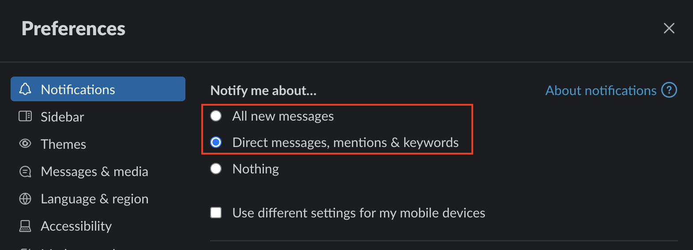
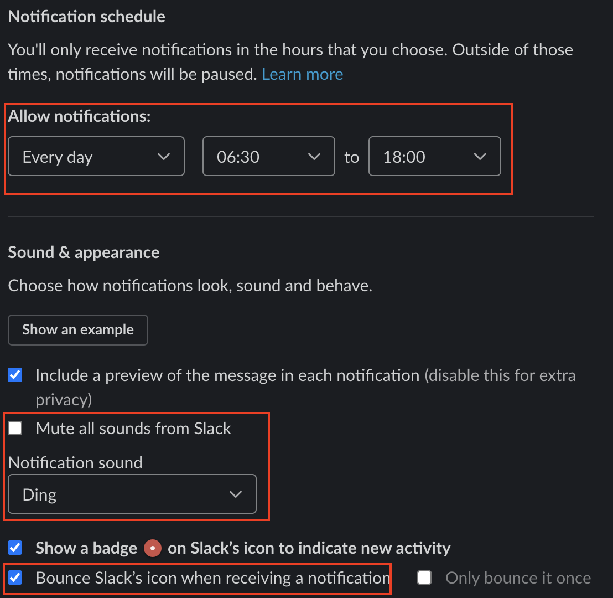
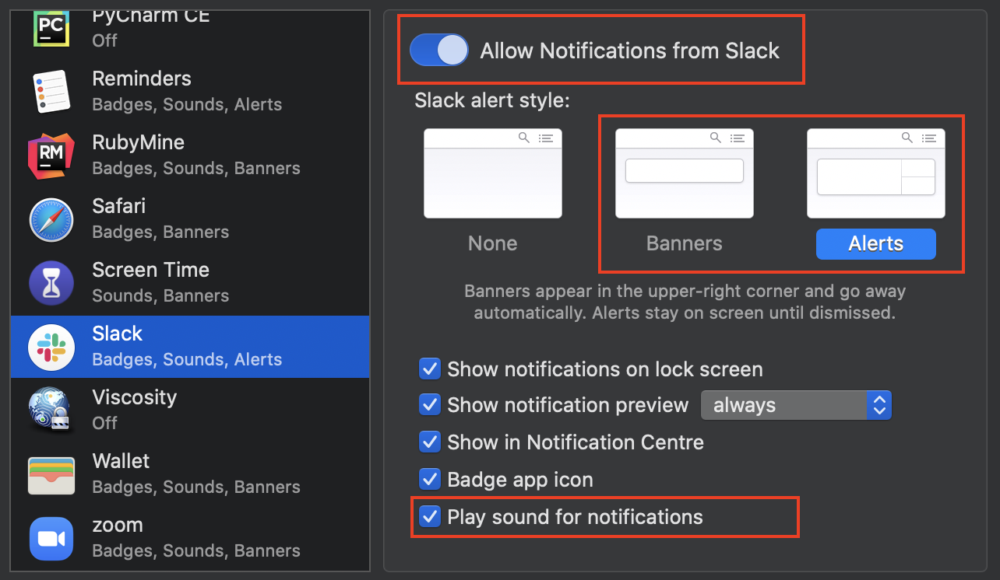
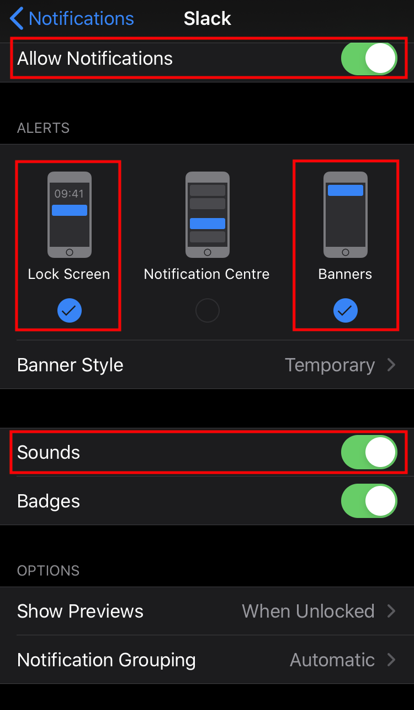

{}
We use [Pagerslack](#bot-pagerslack-usage) as the primary combined with a spreadsheet(internal only) as a backup for weekday escalations. Weekend escalations rely on the spreadsheet solely.
{}

## About This Page

This page outlines the development team on-call process and guidelines for developing the rotation schedule for handling infrastructure incident escalations.

## Expectation

The expectation for the development engineers is to be a technical consultant and collaborate with the teams who requested on-call escalation to troubleshoot together. There is no expectation that the development engineer is solely responsible for a resolution of the escalation.

## Escalation Process

### Scope of Process

1. This process is designed for the following issues:
   1. **GitLab.com** and **self-managed hosting** **`operational emergencies`** raised by the **Infrastructure** , **Security**, and **Support** teams.
   1. Engineering emergencies raised by **teams in engineering** such as the Delivery and QE teams, where an **imminent deployment or release is blocked**.
   1. Engineering emergencies raised by **teams in product** such as the Product Operations team, where the **imminent deployment of the Release Post is blocked**.
   1. Engineering emergencies raised by **teams in quality** such as the Engineering Productivity team, where  **merge requests merges are blocked** due to the `master` branch failing.
1. This process is **NOT** a path to reach development team for non-urgent issues that the Infrastructure, Security, and Support teams run into. Such issues can be moved forward by:
   1. Labelling with `security` and the `@gitlab-com/security/appsec` team mentioned to be notified as part of the [Application Security Triage rotation](/handbook/security/#triage-rotation)
   1. Labelling with `infradev` which will be raised to [Infra/Dev triage board](https://gitlab.com/groups/gitlab-org/-/boards/1193197?label_name[]=gitlab.com&label_name[]=infradev)
   1. Raising to the respective product stage/group Slack channel, or
   1. Asking the [#is-this-known](/handbook/communication/#asking-is-this-known) Slack channel
1. This process provides 24x7 coverage.

#### Example of qualified issue

1. Production issue examples:
   1. GitLab.com: [DB failover and degraded GitLab.com performance](https://gitlab.com/gitlab-com/gl-infra/production/issues/1054)
   1. GitLab.com: [Severity 1](/handbook/security/#severity-and-priority-labels-on-security-issues) vulnerability being actively exploited or high likelihood of being exploited and puts the confidentiality, availability, and/or integrity of customer data in jeopardy.
   1. Self-managed: [Customer ticket - Our GitLab instance is down - request an emergency support](https://gitlab.zendesk.com/agent/tickets/129514)
   1. Self-managed: [Customer ticket - Database overloaded due to Sidekiq stuck jobs](https://gitlab.zendesk.com/agent/tickets/130598)
1. Engineering emergency examples:
   1. [A post deployment issue with version.gitlab.com](https://gitlab.com/gitlab-com/gl-infra/production/issues/1615) that will cause self-managed deployment failure.
   1. [GitLab.com deployment](https://gitlab.com/gitlab-org/gitlab/issues/198440) or a security release is blocked due to pipeline failure.
   1. [A severity::1 regression found in the release staging.gitlab.com](https://gitlab.com/gitlab-org/gitlab/issues/199316)
   1. [Evaluating severity and making decision on a potential release or deployment show stopper](https://gitlab.com/gitlab-org/gitlab/-/issues/217450) collaboratively when other engineering teams are challenged to accomplish alone.
   1. [`master` pipelines are broken](https://gitlab.com/gitlab-org/gitlab/-/issues/378474).

#### Examples of non-qualified issues

1. Production issue examples:
   1. GitLab.Com:[Errors when import from GitHub](https://gitlab.com/gitlab-org/gitlab-ce/issues/66166)
   1. GitLab.com: [Last minute security patch to be included in an upcoming release](https://gitlab.com/gitlab-org/omnibus-gitlab/issues/4530)
   1. Self-managed(ZD): [View switch causing browser freeze](https://gitlab.com/gitlab-org/gitlab-ce/issues/52479)
   1. Self-managed(ZD): [Watch Everything Notification Level](https://gitlab.com/gitlab-org/gitlab-ee/issues/14214)
1. Engineering issue examples:
   1. [A priority::1/severity::1 enhancement of CI](https://gitlab.com/gitlab-org/gitlab/issues/36154)
   1. [A priority::1/severity::1 fix to API](https://gitlab.com/gitlab-org/gitlab-foss/issues/65381)
   1. [Non release blocking QA failures on staging.gitlab.com](https://gitlab.com/gitlab-org/gitlab/issues/198692)

### Process Outline

**NOTE:** On-call engineer do not need to announce the beginning and end of their shift in [#dev-escalation](https://gitlab.slack.com/messages/CLKLMSUR4) unless there is an active incident happening (check the chat history of the channel to know if there is an active incident). This is because many engineers have very noisy notifications enabled for that channel, and such announcements are essentially false positives which make them check the channel unnecessarily.

#### Weekdays (UTC)

Weekdays will now leverage an automated system relying upon the [Pagerslack](https://gitlab.com/jameslopez/pagerslack).

1. Incidents will be escalated by Pagerslack and randomly select a Backend Engineer (BE) that is currently online in Slack and eligible due to their working hours.
1. Pagerslack would also factor recency into the algorithm so that BEs that had recently been involved in an incident would be selected last.
1. During incidents a randomly selected BE has the option to pass the incident to another BE if they are urgently needed somewhere else.
1. Engineers who are eligible to be on-call during weekend shifts are deprioritized from the process

##### Escalation

1. SRE et al, types `/devoncall incident-issue-url` into #dev-escalation
1. Pagerslack randomly selects a Backend Engineer (BE) first responder based on: working hours, whether they are online and notifies them via slack/cell etc.
1. BE responds to the Pagerslack thread with 👀
1. If Primary does not respond a secondary will be notified.
1. Pagerslack will continue trying up to 6 different BEs with a preference for those who do not take weekend shifts
1. BE triages the issue and works towards a solution.
1. If necessary, BE reach out to domain experts as needed.

In the event that no BE engineers respond to the bot, Pagerslack will then notify the Engineering Managers. They will need to find someone available and notify this in the escalation thread. As an EM:

1. Check whether some of the engineers pinged belong to your group and see whether they are available to help
1. Try to find someone available from your group
1. If the search is positive, leave a message in the thread as an acknowledgement that the engineer from your group will be looking into the issue

#### Weekends and Holidays (UTC)

Weekend/Holiday oncall will continue to use the [oncall spreadsheet](https://drive.google.com/drive/search?q=%22Infra/Dev%20Escalation%20On-Call%20Schedule%22) (internal only) outlined above.

Holidays will be included in the oncall spreadsheet, those holidays include: [Family & Friends days](/handbook/company/family-and-friends-day/), Christmas Day, New Year's Eve, New Year's Day, and any major holidays that affect multiple timezones.

There are restrictions of eligibility in certain localities, which can be found in the `weekend` column of the [Development-Team-BE](https://docs.google.com/spreadsheets/d/1rCamrCMZPreBpYwbzFG9zpghtiH3KPiFYu46RbqWjXU/edit#gid=1779774378) spreadsheet (internal only). This spreadsheet is refreshed by the end of each month automactically via the [Employment Automation](https://gitlab.com/gitlab-com/people-group/peopleops-eng/employment-automation/-/blob/main/lib/syncing/on_call_scheduling_spreadsheet.rb).

##### Escalation

1. SRE et al, types `/devoncall incident-issue-url` into #dev-escalation
1. Pagerslack posts a link to the oncall spreadsheet
1. SRE contacts the scheduled BE via Slack or make a phone call 5 minutes after Slack ping. Refer to bullet 3 under [#process-outline](#process-outline).
1. BE triages the issue and works towards a solution.
1. If necessary, BE will reach out to domain experts as needed.

##### Reaching out to domain experts

NOTE: these people generally do not carry pagers and are only likely available during business times. Please respect the individual intake processes, this helps each team track their work.

Use the [product sections](/handbook/product/categories/) handbook page to determine whom to contact.

- [Get attention from Gitaly team](/handbook/engineering/infrastructure/core-platform/systems/gitaly/#how-to-contact-the-team): issues related to Git and Git repositories, Gitaly Cluster, including data recovery.
- [Get attention from Fulfillment team](/handbook/engineering/development/fulfillment/#escalation-process-for-incidents-or-outages): issues related to CustomersDot (customers.gitlab.com).

### First response time SLOs

**OPERATIONAL EMERGENCY ISSUES ONLY**

1.  **GitLab.com**: Development engineers provide initial response (not solution) in both [#dev-escalation](https://gitlab.slack.com/messages/CLKLMSUR4) and the tracking issue within **15 minutes**.
1.  **Self-managed**: Development engineers provide initial response (not solution) in both [#dev-escalation](https://gitlab.slack.com/messages/CLKLMSUR4) and the tracking issue on a best-effort basis. (SLO will be determined at a later time.)
1. In the case of a tie between GitLab.com and self-managed issues, GitLab.com issue takes priority.
1. In the case of a tie between production (GitLab.com, self-managed) and engineering issues, production issue takes priority. The preferred action is to either backout or rollback to the point before the offending MR.

### Required Slack Channel and Notification Settings

1. All on-call engineers, managers, distinguished engineers, fellows (who are not co-founders) and directors are required to join [#dev-escalation](https://gitlab.slack.com/messages/CLKLMSUR4).
1. On-call engineers are required to add a phone number that they can be reached on during their on-call schedule to the on-call sheet.
1. On-call engineers are required to turn on Slack notification during regular working hours. Please refer to [Notification Settings](#notification-settings) for details.
1. Similarly, managers and directors of on duty engineers are also recommended to do the same above to be informed. When necessary, managers and directors will assist to find domain experts.
1. Hint: turn on Slack **email** notification while on duty to double ensure things don't fall into cracks.

## Rotation Scheduling

**Important**: Sign-ups of weekends/holidays are required as a backup while using Pagerslack as the primary escalation tool.

### Guidelines

#### Assignments

On-call work comes in four-hour blocks, aligned to UTC:

- 0000 - 0359
- 0400 - 0759
- 0800 - 1159
- 1200 - 1559
- 1600 - 1959
- 2000 - 2359

One engineer must be on-call at all times on weekends and company holidays. This means that each year, we
must allocate 756 4-hour shifts.

The total number of shifts is divided among the eligible engineers. This is
the minimum number of shifts any one engineer is expected to do. As of February
2024 we have around 206 eligible engineers, this means each engineer is
expected to do 4 shifts per year, or 1 shift per quarter.

In general, engineers are free to choose which shifts they take across the
year. They are free to choose shifts that are convenient for them, and to
arrange shifts in blocks if they prefer. A few conditions apply:

- No engineer should be on call for more than 3 shifts in a row (12 hours),
 with 1-2 being the norm
- No engineer should take more than 12 shifts (48 hours) per week, with 10
 shifts (40 hours) being the usual maximum.

Scheduling and claiming specific shifts is done on the oncall spreadsheet.

#### On-call spreadsheet

The on-call spreadsheet(internal only) can be found by searching [Google Drive for Infra/Dev Escalation On-Call Schedule](https://drive.google.com/drive/search?q=%22Development-Team-BE%22).

#### Eligibility

All backend and fullstack engineers within Core Development or Expansion Development who have been with the company for at least 3 months, with the exception of team members in:
- ModelOps: AI Model Validation
- Secure: Composition Analysis

Exceptions: (i.e. exempted from on-call duty)

- Distinguished engineers and above.
- Intern and Associate engineers.
- Where the law or regulation of the country/region poses restrictions. According to legal department -
    - There are countries with laws governing hours that can be worked.
    - This would not be an issue in the U.S.
    - At this point we would only be looking into countries where 1) we have legal entities, as those team members are employees or 2) countries where team members are hired as employees through one of our PEO providers. For everyone else, team members are contracted as independent contractors so general employment law would not apply.
- Team members participating in another on-call rotation. Examples of this include a team specific rotation for a service owned by that team or in the [Engineering Incident Manager rotation](/handbook/on-call/#engineering-incident-manager).

The eligibility is maintained in this [team members list(internal only)](https://drive.google.com/drive/search?q=%22Development-Team-BE%22) and the spreadsheet is refreshed automatically by our [automation script](https://gitlab.com/gitlab-com/people-group/peopleops-eng/employment-automation/-/blob/main/lib/syncing/on_call_scheduling_spreadsheet.rb).

#### Nomination

Engineers should claim shifts themselves on the oncall spreadsheet.
To ensure we get 100% coverage, the schedule is fixed one month in advance.
Engineers claim shifts between two and three months in advance. When signing up, fill the cell with your **full name** as it appears in the team members list (internal only), **GitLab display name**, and **phone number with country code**. This same instruction is posted on the header of schedule spreadsheet too.

At the middle of each month, engineering managers look at the schedule for
the following month (e.g. on the 15st March, they would be considering the
schedule for April, and engineers are claiming slots in May). If any gaps or
uncovered shifts are identified, the EMs will **assign** those shifts to
engineers. The assignment should take into account:

- How many on-call hours an engineer has done (i.e., how many of their allocated hours are left)
- Upcoming leave
- Any other extenuating factors
- Respecting an assumed 40-hour working week
- Respecting an assumed 8-hour working day
- Respecting the timezones engineers are based in
- Ensuring assigned on-call shifts fit between the hours of 8am-8pm local time for all team members in general, and 7am-9pm for engineers in the US Pacific Time timezone (approved in [this issue](https://gitlab.com/gitlab-com/www-gitlab-com/-/issues/9638#note_1035704658)).
- Optimize for better alignment of shift hours
    - When assigning the first Friday shifts (00:00 UTC/Saturday 1pm NZT/ 4-6pm PST). Please favour/allocate these shifts to AMER engineers within their working hours.
    - When assigning the final Sunday shift of a typical weekend 20:00-00:00 UTC/Sunday Monday NZT, choose a New Zealand based engineer unless it is a public holiday in New Zealand.

In general, engineers who aren't signing up to cover on-call shifts will be
the ones who end up being assigned shifts that nobody else wants to cover,
so it's best to sign up for shifts early!

There is additional information regarding weekend shifts, which can be found in "Additional Notes for Weekend Shifts"(internal only) under a sub-folder called *Development Escalation Process* in the shared *Engineering* folder on Google Drive.

#### Relay Handover

- Since the engineers who are on call may change frequently, responsibility
 for being available rests with them. Missing an on-call shift is a serious
 matter.
- In the instance of an ongoing escalation no engineer should finish
 their on-call duties until they have paged and confirmed the engineer
 taking over from them is present, or they have notified someone who
 is able to arrange a replacement. They do not have to find a
 replacement themselves, but they need confirmation from someone that
 a replacement will be found.
- In the instance of an ongoing escalation being handed over to
 another incoming on-call engineer the current on-call engineers
 summarize full context of on-going issues, such as but not limited to
    - Current status
    - What was attempted
    - What to explore next if any clue
    - Anything that helps bring the next on-call engineer up to speed quickly

      These summary items should be in written format in the following locations:

        - _Existing_ threads in [#dev-escalation](https://gitlab.slack.com/messages/CLKLMSUR4)
        - Incident tracking issues

      This shall be completed at the end of shifts to hand over smoothly.
- For current Infrastructure issues and status, refer to [Infra/Dev Triage](https://gitlab.com/groups/gitlab-org/-/boards/1193197?&label_name[]=gitlab.com&label_name[]=infradev) board.
- For current Production incident issues and status, refer to [Production Incidents](https://gitlab.com/gitlab-com/gl-infra/production/-/boards/1717012?label_name[]=incident) board.
- If an incident is ongoing at the time of handover, outgoing engineers may
 prefer to remain on-call for another shift. This is acceptable as long as
 the incoming engineer agrees, and the outgoing engineer is on their first
 or second shift.
- If you were involved in an incident which has been mitigated during your shift, leave a note about your involvement in the incident issue and link to it in the [#dev-escalation](https://gitlab.slack.com/messages/CLKLMSUR4) Slack channel indicating you participated in the issue as an informational hand-off to future on-call engineers.

### Coordinator

Given the complexity of administration overhead, one engineering
director or manager will be responsible to coordinate the scheduling of
one month. The nomination follows the same approach where
self-nomination is the way to go. On each month tab in the schedule
spreadsheet, directors and managers are encouraged to sign up in the
**Coordinator** column. One director or manager per month.

#### Responsibility

The coordinator will:

1. Remind engineers to sign up, by:
    - Posting reminders to the [#development](https://app.slack.com/client/T02592416/C02PF508L) and [#backend](https://app.slack.com/client/T02592416/C8HG8D9MY) channels in Slack
    - Asking managers in [#eng-managers](https://app.slack.com/client/T02592416/CU4RJDQTY) to remind team-members in 1-1s
1. Assign folks to unfilled slots when needed. Use purple text in the spreadsheet to indicate this was an assigned slot.
1. Coordinate temporary changes or special requests that cannot be
   resolved by engineers themselves.  Fix any schedules that conflict with local labor law.
1. After assigning unfilled slots and accommodating special requests the coordinator should click **Sync to Calendar > Schedule shifts**.
   This will schedule shifts on the `On-call schedule shifts` calendar
   and if any developer added their email into the spreadsheet, they will be added as guests in the on-call calendar event. Ensure that you have subscribed to the calendar before syncing.

An [Epic of execution tracking](https://gitlab.com/groups/gitlab-com/-/epics/122) was created, where each coordinator is expected to register an issue under this Epic for the month-on-duty to capture activities and send notifications. Here is [an example](https://gitlab.com/gitlab-com/www-gitlab-com/issues/4965).

#### How-To

Refer to this [coordinator issue template](https://gitlab.com/gitlab-com/www-gitlab-com/-/blob/master/.gitlab/issue_templates/dev-oncall-monthly-execution.md) for instructions or the steps below. The same template is used for monthly oncall planning and execution issues.

1. Start by finding the least filled shift (Usually this is 00:00 - 04:00 UTC) in the oncall spreadsheet(internal only).
1. Determine the appropriate timezone for this shift (in the case of 00:00 - 04:00 it is +9,+10,+11,+12,+13).
1. Go to the team members list sheet(internal only) and filter the "UTC" column by the desired timezones for the shift . Now you have the list of possible people that can take this shift. Alternatively, you can use [this dev-on-call tool](https://gitlab.com/gitlab-com/dev-on-call) to find out people who may take this shift.
1. Go to google calendar and start to create a dummy event that is on the day and time of the unclaimed shift . NOTE you will not actually end up creating this event.
1. Add all of the people that can possibly take the shift to the event as guests.
1. Go to the "Find a Time" tab in the calendar event to see availabilities of people.
1. Find a person that is available (preferring people that have taken less than 4 shifts per quarter and few or no shifts overall, based on the shifts counts sheet (internal only)). Note people who are on leave or otherwise busy or in interviews, do not schedule them for the shift. It would be fine to ignore events that appeared to be normal team meetings, 1:1, coffee chat as people can always leave a meeting if there is an urgent escalation.
1. Assign them to the shift by filling their name in the on-call sheet in Purple font color.
1. Now since there are likely many days that have this unfilled time slot then update the event date to the next day with this same unfilled time zone. Since it's the same time then the same set of people will be appropriate to take the shift which means you don't need to update the guest list.
1. Repeat all of the above for all of the unclaimed timezones remembering that you want to solve for one shift (by time range) at a time as it means you will re-use the same guest list to determine availability.

### Additional Notes for Weekend Shifts

For those eligible engineers, everyone is encouraged to explore options that work best for their personal situations in lieu of weekend shifts. When on-call you have the following possibilities:

1. Swap weekend days and weekdays.
1. Swap hours between weekend days and weekdays.
1. Take up to double the time off for any time worked during the weekend when the above two options don't work with your personal schedule.
   1. When an engineer is in standby mode (e.g. not paged) during the weekend shift, they can take 1.25x time-off.
   1. When an engineer is in call-back mode (e.g. being paged) during the weekend shift, they can take double the time-off.
   1. For those who reside in Australia, please refer to these [guidelines of time in lieu](/handbook/total-rewards/benefits/general-and-entity-benefits/pty-benefits-australia/#on-call-engineering-only) in the handbook.
   1. Please create an OOO event in Time Off by Deel and choose **On-Call Time in Lieu**.
1. Other alternatives that promote work-life balance and have the least impact to your personal schedule.

With the above alternatives we want to make sure we comply with local labor laws and not surpass the restricted weekly working hours (ranging from 38 to 60 hours) and offer enough rest time for the engineers who sign up on weekend on-call shifts.

If you prefer to work on a preferred weekend day please proactively sign up for shifts to avoid auto-assignment. Team members who have signed up for the fewest shifts are auto-assigned open shifts first.

### Rotation Schedule

See the oncall spreadsheet(internal only). In the future, we could embed a summary of the upcoming week here.

## Resources

### Responding Guidelines

When responding to an Incident, utilize the below procedure as guidelines to follow to assist both yourself and the members requesting your assistance

1. Respond to the slack page with the `:eyes:` reaction - this signals to the bot that you are looking into the problem
1. Join the Incident Zoom - this can be found bookmarked in the `#incident-management` Slack Channel
1. Join the appropriate incident slack channel for all communications that are text based - Normally this is `#incident-<ISSUE NUMBER>`
1. Work with the EOC to determine if a known code path is problematic
  - Should the knowledge of this be in your domain, continue working with the Engineer to troubleshoot the problem
  - Should this be something you may be unfamiliar with, attempt to determine code ownership by team - Knowing this will enable us to see if we can bring online an Engineer from that team into the Incident
1. Work with the Incident Manager to ensure that the Incident issue is assigned to the appropriate Engineering Manager - if applicable

### Bot (Pagerslack) Usage

 - In order to use the bot, type `/devoncall incident-issue-url` to trigger the escalation process.
 - Message the bot privately with `top` to show the top 25 members that are next in the escalation queue
 - Message the bot privately with `position` to see your position in the queue. The higher the number, the less probabilities to get pinged.

*Please report any problems by creating an issue in the [pagerslack project](https://gitlab.com/jameslopez/pagerslack/-/issues).*

### Shadowing An Incident Triage Session

Feel free to participate in any incident triaging call if you would like to have a few rehearsals of how it usually works. Simply watch out for active incidents in [#incident-management](https://gitlab.slack.com/archives/CB7P5CJS1) and join the Situation Room Zoom call (link can be found in the channel) for synchronous troubleshooting. There is a [nice blog post](https://about.gitlab.com/blog/2020/04/13/lm-sre-shadow/) about the shadowing experience.

### Replaying Previous Incidents

Situation Room recordings from previous incidents are available in internal Google Drive folder.

### Shadowing A Whole Shift

To get an idea of [what's expected](#expectation) of an on-call engineer and how often incidents occur it can be helpful to shadow another shift. To do this simply identify a time-slot that you'd like to shadow in the on-call schedule and contact the primary to let them know you'll be shadowing. Ask them to invite you to the calendar event for this slot. During the shift keep an eye on [#dev-escalation](https://gitlab.slack.com/archives/CLKLMSUR4) for incidents and observe how the primary [follows the process](#process-outline) if any arise.

### Tips & Tricks of Troubleshooting

1. [How to Investigate a 500 error using Sentry and Kibana](https://www.youtube.com/watch?v=o02t3V3vHMs&feature=youtu.be).
1. [Walkthrough of GitLab.com's SLO Framework](https://www.youtube.com/watch?v=QULzN7QrAjY).
1. [Scalability documentation](https://gitlab.com/gitlab-org/gitlab/merge_requests/18976).
1. [Use Grafana and Kibana to look at PostgreSQL data to find the root cause](https://youtu.be/XxXhCsuXWFQ).
   - Related incident: [Postgres transactions timing out; sidekiq queues below apdex score; and overdue pull mirror jobs](https://gitlab.com/gitlab-com/gl-infra/production/issues/1433).
1. [Ues Grafana, Thanos, and Prometheus to troubleshoot API slowdown](https://www.youtube.com/watch?v=DtP4ZcuXT_8).
   - Related incident: [2019-11-27 Increased latency on API fleet](https://gitlab.com/gitlab-com/gl-infra/production/issues/1419).
1. [Let's make 500s  more fun](https://youtu.be/6ERO4XsYDn0?list=PL05JrBw4t0KodGBz0XUYdYaAYyYs-6ZK7)

### Tools for Engineers

1. Training videos of available tools
   1. [Visualization Tools Playlist](https://www.youtube.com/playlist?list=PL05JrBw4t0KrDIsPQ68htUUbvCgt9JeQj).
   1. [Monitoring Tools Playlist](https://www.youtube.com/playlist?list=PL05JrBw4t0KpQMEbnXjeQUA22SZtz7J0e).
   1. [How to create Kibana visualizations for checking performance](https://www.youtube.com/watch?v=5oF2rJPAZ-M&feature=youtu.be).
1. Dashboards examples, more are available via the dropdown at upper-left corner of any dashboard below
   1. [Saturation Component Alert](https://dashboards.gitlab.net/d/alerts-saturation_component/alerts-saturation-component-alert?orgId=1).
   1. [Service Platform Metrics](https://dashboards.gitlab.net/d/general-service/general-service-platform-metrics?orgId=1&var-type=ci-runners&from=now-6h&to=now).
   1. [SLAs](https://dashboards.gitlab.net/d/general-slas/general-slas?orgId=1).
   1. [Web Overview](https://dashboards.gitlab.net/d/web-main/web-overview?orgId=1).

### Pagerslack statistics ([Tableau](https://10az.online.tableau.com/#/site/gitlab/workbooks/2225419/views))










### Notification Settings

To make the First Responder process effective, the engineer on-call must configure their notifications to give them the best chance of noticing and responding to an incident.

These are the recommended settings. Your mileage may vary.

#### Slack Notifications

1. Within Slack, open "Preferences".
1. Under "Notify me about...", select one of the first two options; we recommend "Direct messages, mentions & keywords". Do **not** choose "Nothing".
1. If you check "Use different settings for my mobile devices", follow the same rule above.
1. Scroll down to "Notification Schedule".
1. Under "Allow notifications", enter your work schedule. For example: Weekdays, 9 am to 5 pm. Pagerslack relies on this to decide whether or not to page a person.
1. Scroll down to "Sound & appearance".
1. Choose settings that ensure you won't miss messages. We recommend:
   1. Select a "Notification sound".
   1. Check "Bounce Slack’s icon when receiving a notification".
1. Use your preference for the other settings. The "Channel-specific notifications" are particularly helpful to mute noisy channels that you don't need to be interrupted for.

#### macOS Notifications

1. Under "System Preferences", select "Notifications".
1. Scroll down to find "Slack".
1. Enable "Allow Notifications from Slack".
1. For "Slack alert style", we recommend "Alerts" so you need to dismiss them. "Banners" might also work for you. Do not select "None".
1. Enable "Play sound for notifications", particularly if you chose "Banners" above.
1. Use your preference for the other settings.

#### iOS Notifications

1. Under "Settings", open "Notifications".
1. Scroll down to find "Slack".
1. Enable "Allow Notifications from Slack".
1. Under "ALERTS", enable "Lock Screen" and "Banners".
1. Enable "Sounds".
1. Use your preference for the other settings.

