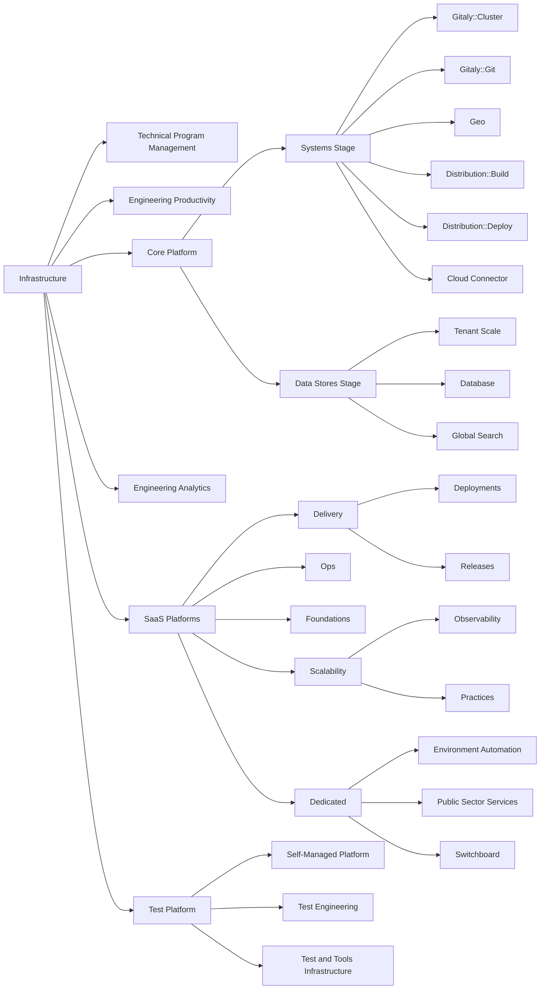

## Mission

The Infrastructure Department enables GitLab (the company) to deliver a single DevOps application, and GitLab SaaS users to focus on generating value for their own businesses by ensuring that we operate an enterprise-grade SaaS platform.

The Infrastructure Department does this by focusing on **availability**, **reliability**, **performance**, and **scalability** efforts.
These responsibilities have cost efficiency as an additional driving force, reinforced by the properly prioritized [**dogfooding**](#dogfooding) efforts.

Many other teams also contribute to the success of the SaaS platform because [GitLab.com is not a role](/handbook/company/structure/#gitlabcom-isnt-a-role).
However, it is the responsibility of the Infrastructure Department to drive the ongoing evolution of the SaaS platform, enabled by platform observability data.

## Getting Assistance

If you’re a GitLab team member and are looking to alert the Infrastructure teams about an availability issue with GitLab.com, please find quick instructions to report an incident here: [Reporting an Incident](/handbook/engineering/infrastructure/incident-management/#reporting-an-incident).

## Vision

The Infrastructure Department operates a fast, secure, and reliable SaaS platform to which (and with which) [everyone can contribute][contribute].

Integral part of this vision is to:

1. Build a highly performant team of engineers, combining operational and software development experience to influence the best in reliable infrastructure.
1. Work publicly in accordance with our [transparency] value.
1. [Use our own product](#dogfooding) to prepare, build, deliver work, and support [the company strategy][strategy].
1. Align our [strategy](#strategy) with the industry trends, company direction, and end customer needs.

## Direction

The direction is accomplished by using [Objectives and Key Results (OKRs)](/handbook/engineering/infrastructure-quality/okrs/).

Other strategic initiatives to achieve this vision are driven by the needs of enterprise customers looking to adopt GitLab.com. [The GitLab.com strategy](https://about.gitlab.com/direction/enablement/dotcom/) catalogs top customer requests for the SaaS offering and outlines strategic initiatves across both Infrastructure and Stage Groups needed to address these gaps.

{}

## Organization structure

(click the boxes for more details)

## Design

The [**Infrastructure Library**][library] contains documents that outline our thinking about the problems we are solving and represents the ***current state*** for any topic, playing a significant role in how we produce technical solutions to meet the challenges we face.

## Dogfooding

The Infrastructure department uses GitLab and GitLab features extensively as the main tool for operating many [environments](/handbook/engineering/infrastructure/environments/), including GitLab.com.

We follow the same [dogfooding process](/handbook/engineering/development/principles/#dogfooding) as part of the Engineering function, while keeping the [department mission statement](#mission) as the primary prioritization driver. The prioritization process is aligned to [the Engineering function level prioritization process](/handbook/engineering/#prioritizing-technical-decisions) which defines where the priority of dogfooding lies with regards to other technical decisions the Infrastructure department makes.

When we consider building tools to help us operate GitLab.com, we follow the [`5x rule`](/handbook/product/product-processes/dogfooding-for-product-mgt/#dogfooding-process) to determine whether to build the tool as a feature in GitLab or outside of GitLab. To track Infrastructure's contributions back into the GitLab product, we tag those issues with the appropriate [Dogfooding](https://gitlab.com/groups/gitlab-com/-/labels?utf8=%E2%9C%93&subscribed=&search=dogfooding) label.

## Handbook use at the Infrastructure department

At GitLab, we have a [handbook first policy](/handbook/handbook-usage/#why-handbook-first). It is how we communicate process changes, and how we build up a single source of truth for work that is being delivered every day.

The [handbook usage page guide](/handbook/handbook-usage/) lists a number of general tips. Highlighting the ones that can be encountered most frequently in the Infrastructure department:

1. The wider community can benefit from training materials, architectural diagrams, technical documentation, and how-to documentation. A good place for this detailed information is in the related project documentation. A handbook page can contain a high level overview, and link to more in-depth information placed in the project documentation.
1. Think about the audience consuming the material in the handbook. A detailed run through of a GitLab.com operational runbook in the handbook might provide information that is not applicable to self-managed users, potentially causing confusion. Additionally, the handbook is not a go-to place for operational information, and grouping operational information together in a single place while explaining the general context with links as a reference will increase visibility.
1. Ensure that the handbook pages are easy to consume. Checklists, onboarding, repeatable tasks should be either automated or created in a form of template that can be linked from the handbook.
1. The handbook is the process. The handbook describes our principles, and our epics and issues are our principles put into practice.

## Projects

Classification of the Infrastructure department projects is described on the [infrastructure department projects page](/handbook/engineering/infrastructure/projects).

The [infrastructure issue tracker](https://gitlab.com/gitlab-com/gl-infra/production-engineering/-/issues) is the backlog and a catch-all project for the infrastructure teams and tracks the work our teams are doing–unrelated to an ongoing change or incident.

In addition to tracking the backlog, Infrastructure Department projects are captured in our [Infrastructure Department Epic](https://gitlab.com/groups/gitlab-com/-/epics/1049) as well as in our [Quarterly Objectives & Key Results](https://gitlab.com/groups/gitlab-com/-/epics/1420)

## Supporting Product Features

We have a model that we use to help us support product features. [This model](/handbook/engineering/infrastructure/feature-support.html) provides details on how we collaborate to ship new features to Production.

## Ownership
The Infrastructure team maintains responsibility for the underlying infrastructure on which customer-facing services run.  Specific ownership details are in the [GitLab Service Ownership Policy](./service-ownership/index.html)

## Stable Counterparts

Infrastructure SREs may be aligned with [stage groups](/handbook/product/categories/#categories-a-z) as [stable counterparts](https://about.gitlab.com/blog/2018/10/16/an-ode-to-stable-counterparts/).

[Stable Counterparts](./team/stable-counterpart.html) are used as a framework for managing reliable services at GitLab.  The framework provides guidelines for collaboration between [Stage Groups](/handbook/product/categories/#categories-a-z) and [Infrastructure Teams](/handbook/engineering/infrastructure-quality/#engaging-with-the-infrastructure-teams).

## Interviewing

The Infrastructure department hires for a number of different technical specialisms and positions across its teams. This [Infrastructure Interviewing Guide](/handbook/hiring/interviewing/infrastructure-interview/) offers more detail on some of our regular openings, interview process and other useful information related to applying to jobs with us. More information on our current openings can be found on the [careers page](https://about.gitlab.com/jobs/).

## Common Links

- [How we do Incident Management for GitLab.com][incident]
- [status]

| **General Issue Trackers**                      | **General Slack Channels** | **Team Slack Channels** | **Resources**                                        |
|-------------------------------------------------|----------------------------|-------------------------|------------------------------------------------------|
| [Infrastructure issue queue][infra]             | [#production]              | [#g_delivery]           | [Production Architecture][architecture]              |
| [Production incidents, and changes][production] | [#infrastructure-lounge]   | [#g_scalability]        | [Operational Runbooks][runbooks]                     |
| [Delivery][delivery]                            | [#incident-management]     |                         | [Environments][environments]                         |
| [Scalability][scalability]                      | [#announcements]           |                         | [Monitoring][monitoring]                             |
|                                                 | [#feed_alerts-general]     |                         | [Readiness Reviews][readiness]                       |
|                                                 |                            |                         | [Infrastructure Standards][infrastructure-standards] |

## Other Pages

- [On-call Handover](/handbook/engineering/infrastructure/team/ops/on-call-handover/)
- [SRE Onboarding](/handbook/engineering/infrastructure/team/ops/sre-onboarding/)
- [GitLab.com data breach notification policy](/security/#data-breach-notification-policy)
- [Infrastructure careers and internships][interning]
- [Coding at scale](/handbook/engineering/infrastructure/team/scalability/#regarding-coding-at-scale)

[status]: https://status.gitlab.com/
[help]: /handbook/engineering/infrastructure/production/#how-to-get-help
[incident]: /handbook/engineering/infrastructure/incident-management/
[change]: /handbook/engineering/infrastructure/change-management/
[infra]: https://gitlab.com/gitlab-com/gl-infra/production-engineering/-/issues
[production]: https://gitlab.com/gitlab-com/gl-infra/production/issues/
[delivery]: https://gitlab.com/gitlab-com/gl-infra/delivery/issues/
[scalability]: https://gitlab.com/gitlab-com/gl-infra/scalability/issues

[#production]: https://gitlab.slack.com/archives/production
[#infrastructure-lounge]: https://gitlab.slack.com/archives/infrastructure-lounge
[#incident-management]: https://gitlab.slack.com/archives/incident-management
[#announcements]: https://gitlab.slack.com/archives/announcements
[#feed_alerts-general]: https://gitlab.slack.com/archives/feed_alerts-general
[#g_delivery]: https://gitlab.slack.com/archives/g_delivery
[#g_scalability]: https://gitlab.slack.com/archives/g_scalability

[architecture]: /handbook/engineering/infrastructure/production/architecture/
[environments]: /handbook/engineering/infrastructure/environments/
[monitoring]: /handbook/engineering/infrastructure
[runbooks]: https://gitlab.com/gitlab-com/runbooks
[readiness]: /handbook/engineering/infrastructure/production/readiness/
[interning]: /handbook/engineering/infrastructure/career/
[infrastructure-standards]: /handbook/infrastructure-standards/

[library]: https://gitlab.com/gitlab-com/gl-infra/readiness/-/tree/master/library

[strategy]: /company/strategy/
[transparency]: /handbook/values/#transparency
[contribute]: /company/mission/#everyone-can-contribute
