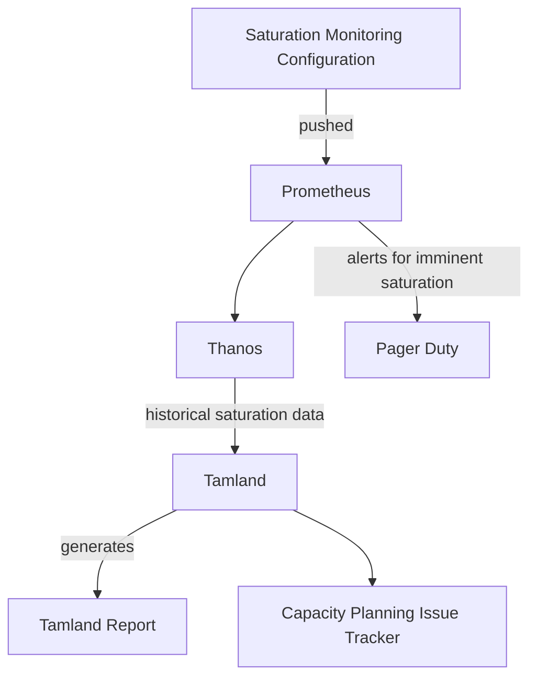

## Introduction

In order to scale GitLab infrastructure at the right time and to prevent incidents, we employ a capacity planning process for example for GitLab.com and GitLab Dedicated.

In parts, this process is predictive and gets input from a forecasting tool to predict future needs.
This aims to provide an earlier and less obstrusive warning to infrastructure teams before components reach their individual saturation levels.
The forecasting tool generates capacity warnings which are converted to issues and these issues are raised in various status meetings.

For GitLab.com capacity planning, a [report is published](https://gitlab-com.gitlab.io/gl-infra/capacity-planning-trackers/gitlab-com/) and any predicted saturation events result in an issue on the [capacity planning issue tracker](https://gitlab.com/gitlab-com/gl-infra/capacity-planning-trackers/gitlab-com/-/boards/2816983).

## Tools

We use and develop [Tamland](https://gitlab.com/gitlab-com/gl-infra/tamland), which is our capacity forecasting tool.
It relies on [Facebook's Prophet library](https://facebook.github.io/prophet/) for forecasting time series data and generates forecasts on a daily basis.

Tamland's technical documentation can be found in <https://gitlab-com.gitlab.io/gl-infra/tamland>.

GitLab's Capacity Planning strategy is based on the following technologies:

1. **[Saturation Monitoring Jsonnet Configuration](https://gitlab.com/gitlab-com/runbooks/-/tree/master/metrics-catalog/saturation)** - for saturation monitoring definition, recording rule generation, short term alerting configuration generation.
1. **Prometheus** - capturing and processing utilization and saturation metrics over the short-term.
1. **[Thanos](https://thanos.gitlab.net/)** - long-term storage of utilization and saturation metrics.
1. **[Tamland](https://gitlab.com/gitlab-com/gl-infra/tamland)** - the forecasting tool.
1. **GitLab CI** - running the daily forecasting process.
1. **[Facebook Prophet](https://facebook.github.io/prophet/)** - forecasting.
1. **[GitLab Pages Tamland Report Site](https://gitlab-com.gitlab.io/gl-infra/capacity-planning-trackers/gitlab-com/)** - static site hosting of the generated forecasts.
1. **[GitLab Capacity Planning Issue Tracker](https://gitlab.com/gitlab-com/gl-infra/capacity-planning/-/issues)** - GitLab project used for tracking capacity planning forecast warnings. Issues are created by Tamland directly.
1. **GitLab Slack Integration** - Slack notifications of new issues in the capacity planning project, to the [#infra_capacity-planning](https://gitlab.slack.com/archives/C01AHAD2H8W) channel.

### Source Data

The forecasting model uses the same saturation and utilization data model that we use to monitor GitLab.com over the short-term. This ensures that anything that we feel is worth monitoring as a potential saturation point will automatically be included in the forecasting model.

Because of this, all services used on GitLab.com are automatically included in the model.

The short-term saturation metric model used on GitLab.com models each resource as a percentage, from 0% to 100%, where 100% is completely saturated. Each resource has an alerting threshold (SLO). If this threshold is breached, alerts will fire and the engineer-on-call will be paged.

The thresholds are decided on a case-by-case basis and vary between resources. Some are near 100% while others are much lower, depending on the nature of the resource, the failure modes on saturation of the resource and the required time-to-mediation. Resources are classed as being either horizontally scalable or not. Horizontally scalable resources are generally considered lower priorities from a capacity planning point-of-view, whereas non-horizontally scalable resources (such as CPU on the primary PostgreSQL instance, for example) require much longer-term strategies for remediation and are therefore considered higher priorities in the capacity planning process.

### Forecasting with Tamland

Tamland relies on [Facebook Prophet](https://facebook.github.io/prophet/) for generating a forecasting model. Prophet performs analysis of  daily, weekly, monthly and yearly trends to forecast a future trend in the data.

Even the most skilled engineer would struggle to predict future saturation, so it's unlikely that a model could do it either. We do not expect it to be totally accurate. Instead, with hundreds of resources on GitLab.com that could potentially become saturated, Tamland's forecasts are a bellweather for changes in trends, particularly upward changes, drawing the attention of engineers who review the data to specific issues.

Tamland will attempt to predict a range of outcomes. For saturation, we focus on the median prediction (50th percentile) and only the upper 80th percentile prediction. The lower 80th percentile is not as important for saturation purposes.

The forecast process, Tamland, runs as a GitLab CI job, e.g. in the [`gitlab-com` project](https://gitlab.com/gitlab-com/gl-infra/capacity-planning-trackers/gitlab-com) for GitLab.com.
This job will run on a schedule defined [in the scheduled pipeline](https://ops.gitlab.net/gitlab-com/gl-infra/tamland/-/pipeline_schedules) (set to execute daily).
The process starts by reading the historical short-term saturation metric data from Thanos, using an hourly resolution across the last 1+ years worth of data.

## Data classification

Per the [Data Classification Standard](/handbook/security/data-classification-standard/#orange), Tamland's output data is considered ORANGE data and must remain confidential. This includes forecast plots and information about SLO violations.

Therefore, the recommended practice when including Tamland data is:

1. On public facing projects, turn on confidentiality on issues or comments
1. Recordings published to GitLab Unfiltered must be labeled *private*

## GitLab.com Capacity Planning

### Workflow

#### Stakeholders: Scalability team and Service Owners

Capacity planning is a shared activity and dependent on input from many stakeholders:

1. The [Scalability:Observability team](/handbook/engineering/infrastructure/team/scalability/observability) is the owner of the Capacity Planning process overall - the team oversees the entire process, implements technical improvements to improve our forecasting abilities and helps guide teams to act on associated capacity warnings.
2. Each service we monitor is associated with a **Service Owner**, who is identified as the [DRI](/handbook/people-group/directly-responsible-individuals/) to act on capacity warnings and provide input in terms of domain knowledge.

#### Scalability:Observability

1. Tamland analyzes metrics data on a daily basis and creates capacity warning issues if it predicts that a resource will exceed its SLO within the forecast horizon.

1. On a weekly basis, an engineer from the team reviews all open issues in the [Capacity Planning](https://gitlab.com/gitlab-com/gl-infra/capacity-planning/-/issues) tracker following the [process described on the Scalability:Observability team page](/handbook/engineering/infrastructure/team/scalability/observability.html)
   1. Assign legitimate forecasts to the respective Service Owner to review and act on it (see below).
   2. Select the most crucial saturation points to report in the [GitLab SaaS Availability](/handbook/engineering/#saas-availability-weekly-standup) meeting based on the impact they would have when fully saturated and how difficult the mitigation might be. To indicate issues like this, we apply the `~"SaaS Weekly"` label when we do the weekly triage.
   3. Review forecasts with inaccurate model fit or otherwise obscure predictions, and work on improving their quality. Those issues should be labeled with `~capacity-planning::tune model` and not get assigned to the Service Owner directly. Since these model tunings highly benefit from domain insight, the Scalability engineer involves Service Owners to get more information.
   4. Leave a feedback comment for quality assessment, see [Quality Assessment and User Feedback](#quality-assessment-and-user-feedback) below.

#### Service Owners

A Service Owner is the individual identified as the DRI for capacity planning for an individual service. This information is covered in the [service catalog](https://gitlab.com/gitlab-com/runbooks/-/blob/master/services/service-catalog.yml).

The Service Owner ideally has the closest insight into the service, its recent changes and events and is responsible for its availability and performance characteristics overall. Capacity Planning aims to help the Service Owner to be informed about trends in resource usage and predicted upcoming resource saturation events, which helps to act early and inform prioritization processes.

For capacity planning, the responsibilities of the Service Owner are:

1. Review and act on automatically generated capacity warnings for their respective service,
2. Provide regular status updates on a capacity warning and link any ongoing related work to it,
3. Feed external domain knowledge back into the forecasting model: Forecast quality is dependent on knowing about external factors like special events, changes we made and other service-specific information.

While many forecasts provide a clear and reliable outlook, not all forecasts will be accurate. For example, a sudden upward trend in the resource saturation metric may be caused by a factor that is known to be temporary - for example, a long running migration. The Service Owner is in the best position to know about these external factors and will evaluate based on all information on-hand to determine whether the forecast is accurate and if the issue requires investigation.

The Service Owner will note down their findings on the issue and get the appropriate actions going to remediate and prevent the saturation event. While the Service Owner is the DRI for the capacity warning, the [Infradev Process](/handbook/engineering/workflow/#infradev) and the [SaaS Availability weekly standup](/handbook/engineering/#saas-availability-weekly-standup) assist with the prioritization of these capacity alerts.

The Service Owner can also decide to change the Service Level Objective, the metric definition or any other forecasting parameters that are used to generate capacity warnings. Please see the related [documentation](https://gitlab.com/gitlab-com/runbooks/-/blob/master/libsonnet/saturation-monitoring/README.md) for further information. The [Scalability:Observability team](/handbook/engineering/infrastructure/team/scalability/observability.html) is available to assist, but the work should be owned by the [DRI](/handbook/people-group/directly-responsible-individuals/) and their team.

If the issue does not require investigation, it is important to follow-up and improve the quality of the forecast or the process to improve the signal-to-noise-ratio for capacity planning. This can include feeding external knowledge into the forecasting model or consider changes in automation to prevent getting this capacity warning too early. The Service Owner is expected to get in touch with Scalability:Observability to consider and work on potential improvements.

At any time, the Scalability:Observability team can be consulted and is ready to assist with questions around the forecasting or to help figure out the underlying reasons for a capacity warning.

#### Due Dates

We use the `due date` field to track when the next action is due. For example: the date we expect the issue to drop off the report, or the date we need to take another look at the forecast. We do this because we want to use the [capacity planning issue board](https://gitlab.com/gitlab-com/gl-infra/capacity-planning/-/boards) as the single source of truth. The due date is visible on this board and it is easy to see which issues need attention.

The DRI for an issue is responsible for maintaining the due date and adding status information each time the due date is adjusted.

#### Workflow Status Labels

Capacity Planning issues are created without a state. After the initial assessment, one of the following labels should be applied.

1. `capacity-planning::investigate` - this alert requires further active assessment before deciding on a course of action
1. `capacity-planning::monitor` - we need to wait for time to pass to gather further data on this issue to make a decision on how to proceed
1. `capacity-planning::tune model` - we determined the issue isn't relevant at this point in time and intend to tune the forecasting model while we continue to monitor the issue
1. `capacity-planning::in-progress` - there is a mitigation in progress for this alert
1. `capacity-planning::verification` - we have completed work on this issue and are  verifying the result

#### Saturation Labels

Each issue has saturation labels, indicating which thresholds it exceeds and how. An issue can have multiple saturation labels; for instance, any issue with `saturation` will, by definition, also have the other three.

1. `saturation` - this issue is predicted (by the median line) to reach 100% saturation in the next 90 days.
1. `violation` - this issue is predicted (by the median line) to reach the saturation threshold (which varies by component) in the next 90 days.
1. `saturation-80%-confidence` - this issue is predicted (by the upper end of the 80% confidence interval) to reach 100% saturation in the next 90 days.
1. `violation-80%-confidence` - this issue is predicted (by the upper end of the 80% confidence interval) to reach the saturation threshold (which varies by component) in the next 90 days.

#### Other labels

1. `tamland:keep-open` - Used to prevent Tamland from closing the issue automatically. This can be useful to validate the effect of changes we made for a longer period of time until we are confident about the effects.
1. Any issue concerning resource saturation or capacity planning in any tracker should have the `~"GitLab.com Resource Saturation"` label applied.

#### Prioritization Framework

The Scalability:Frameworks team uses capacity planning issues to drive prioritization. By taking saturation data as an input into the planning process, Frameworks team can identity potential projects to balance proactive and reactive work streams.

The prioritization framework uses an [Eisenhower Matrix](https://todoist.com/productivity-methods/eisenhower-matrix), a 2x2 matrix based on _urgency_ and _importance_:

|                                                                                                                                         |                                                                                                                                                 |
|-----------------------------------------------------------------------------------------------------------------------------------------|-------------------------------------------------------------------------------------------------------------------------------------------------|
| **Quadrant 1: Do** _Urgent, Important_ Reactive: Non-horizontally scalable resources forecasted to saturate 100% in 90 days.      | **Quadrant 2: Decide** _Less Urgent, Important_ Proactive: Non-horizontally scalable resources forecasted to violate hard SLO in 90 days. |
| **Quadrant 3: Delegate** _Urgent, Less Important_ Reactive: Horizontally scalable resources forecasted to saturate 100% in 90 days. | **Quadrant 4: Deny** _Less Urgent, Less Important_ Proactive: Horizontally scalable resources forecasted to violate hard SLO in 90 days.  |

 **Urgent** is based on forecast threshold (e.g. `100% saturation` vs. `hard SLO violation`) and **important** is based on scalable resources (e.g. `non_horizontal` vs. `horizontal`). The following resources are available for prioritization:

 * [Quadrant board](https://gitlab.com/gitlab-com/gl-infra/capacity-planning/-/boards/5273449)
 * [Issues sorted by priority](https://gitlab.com/gitlab-com/gl-infra/capacity-planning/-/issues/?sort=label_priority&state=opened)
 * [Scoped prioritized labels](https://gitlab.com/gitlab-com/gl-infra/capacity-planning/-/labels?subscribed=&search=capacity-planning%3A%3Apriority)

#### Quality Assessment and User Feedback

In order to determine the quality of forecasts we produce, we rely on and collect feedback from everyone using forecasts and capacity warnings.

This data helps us improve forecasting quality overall and we can also determine which components need further improving or don't qualify for forecasting at all.
The following describes what feedback we're looking for and how to give that feedback.

The intended audience is everyone interacting with capacity warnings.
This includes service owners and the Scalability group doing the triage, and we ask everyone who is using capacity warnings in some form to give feedback.

The key question to answer when presented a capacity warning is: Is this useful for me and/or my wider context?

We acknowledge that whether a capacity warning is seen as *useful* or *not useful* is highly dependent on the individual working with these warnings and their respective context.
Hence we collect feedback from everyone individually, so we ideally have multiple datapoints per capacity warning.

Feedback can be given at any point in time but ideally reflects back on when the capacity warning got created.
Did it turn out meaningful after all?

The process looks like this:

1. When a capacity warning is generated, Tamland creates an issue in the respective capacity warning tracker.
2. Team member feedback can be given **through a comment on the issue**
3. The comment includes either the `~tamland-feedback:useful` or `~tamland-feedback:not-useful` label to signal whether or not the capacity warning was useful to the team member.
   1. Required: When using the `~tamland-feedback:not-useful` label, we ask to also include a brief explanation why this wasn't useful for you specifically (in the same comment).
   1. Optional: Feel free to leave additional feedback for a useful capacity warning, too.

The team member running triage is asked to ideally leave a feedback for each open and newly created capacity warning.

For example, a forecast can be considered `useful` in these cases:

1. The forecast indicates impending saturation, which is highly relevant to prevent an incident.
2. A forecast looked "odd enough" to strike up a conversation about capacity limitations, which helped prioritize work. In this case, the forecast can be technically inaccurate, but still useful.

Cases for labeling a capacity warning as `not-useful` include:

1. The underlying timeseries is so jumpy that the projection is obviously not meaningful.
2. A recent trend has been picked up too early and the projection is obviously overly pessimistic with no action required for anyone to mitigate or research further.

#### Key Performance Indicator: Precision

Based on the feedback data collected in comments, we derive a key performance indicator *Precision* and define this as follows.

1. A capacity warning is considered useful, if it has at least one `useful` vote.
2. For a set of *rated* issues `i`, we calculate *precision* as the ratio of useful issues in `i` to total issues in `i`.
3. When referring to *precision as a KPI over time*, we use the creation timestamp for a capacity warning.

In addition to precision, we also define a KPI *rated* to indicate the ratio of rated issues to total issues for a given time period.

## GitLab Dedicated Capacity Planning

The following details the team-level agreements and responsibilities regarding capacity planning for GitLab Dedicated.
While capacity planning for GitLab.com is a shared activity, capacity planning for GitLab Dedicated implements a more differentiated responsibility model.

### Stakeholders: Scalability:Observability team and Dedicated teams

1. The Dedicated team is responsible for defining saturation metrics Tamland monitors, and to configure tenants for capacity planning.
1. The Dedicated team runs Tamland inside tenant environments and produces saturation forecasting data.
1. The [Scalability:Observability team](/handbook/engineering/infrastructure/team/scalability/observability) team owns the reporting side of capacity planning and makes sure reports and warnings are available.
1. The Dedicated team is responsible for triaging and responding to the forecasts and warnings generated, and applying any insights to Dedicated tenant environments.
1. The [Scalability:Observability team](/handbook/engineering/infrastructure/team/scalability/observability) team implements new features and fixes for Tamland to aid the capacity planning process for GitLab Dedicated.

### Defining saturation metrics and tenants

Saturation points and services can be set up for Tamland monitoring through the [Tamland manifest](https://gitlab.com/gitlab-com/gl-infra/gitlab-dedicated/instrumentor/-/blob/dc6ab53445c2754e00301951b99380013f831f4d/metrics-catalog/get-hybrid/config/tamland/manifest.json#L1).
The manifest is generated from the GET metrics catalog using a [jsonnet generator](https://gitlab.com/gitlab-com/runbooks/-/blob/master/reference-architectures/get-hybrid/src/tamland/tamland.jsonnet).

### Executing Tamland

Tamland runs inside tenant environments on a daily cadence and produces forecasting data to a S3 bucket.
For more information, please refer to [documentation](/handbook/engineering/infrastructure/team/scalability/observability/tamland/#gitlab-projects-and-capacity-planning-trackers) and this [project](https://gitlab.com/gitlab-com/gl-infra/capacity-planning-trackers/gitlab-dedicated).

### Reporting and capacity warnings

The operational project to implement capacity planning for GitLab Dedicated is [`gitlab-dedicated`](https://gitlab.com/gitlab-com/gl-infra/capacity-planning-trackers/gitlab-dedicated).
This project runs a scheduled pipeline which produces the Tamland report and manages capacity warnings for [configured tenant environments](https://gitlab.com/gitlab-com/gl-infra/capacity-planning-trackers/gitlab-dedicated/-/blob/4acdaae0ac24311bfdf3b5e24852b2dad64c0a57/tenants.yaml).

### Triage and Response

Tamland manages capacity warnings in the [`gitlab-dedicated issue tracker`](https://gitlab.com/gitlab-com/gl-infra/capacity-planning-trackers/gitlab-dedicated/-/issues).

In terms of labels used, the same mechanics apply as for GitLab.com (see above).

#### Strategy for Increasing Capacity

The strategy for handling potential capacity planning issues for GitLab Dedicated is different from GitLab.com in several ways:

1. For GitLab Dedicated, we strive for homogeneity of the tenant environments, particularly for tenants using the same reference architecture. This needs to be considered when deciding on a course of action for a potential capacity issue.
1. Changes that increase capacity should consider whether to be applied at the tenant level, to the reference architecture, as [an overlay on a reference architecture](https://gitlab.com/gitlab-com/gl-infra/gitlab-dedicated/team/-/blob/main/engineering/tenant-model.md#reference-architecture-overlays), or globally.
1. Additional per-tenant costs should be considered as part of the triage and response process and increases should be approved by the Dedicated Product Manager (see this [issue template](https://gitlab.com/gitlab-com/gl-infra/gitlab-dedicated/team/-/blob/main/.gitlab/issue_templates/approve_scaling_overlay.md)).
1. Depending on where the capacity is increased (on the local to global spectrum), the change should also be considered from a cost-vs-complexity trade-off. Different situations may require different trade-offs.

Dedicated Capacity Planning is in it's early stage, and we can expect that the process will be iterated on rapidly as our experience in this area increases.

### Feature development

We strive to provide reporting and capacity warnings tailored to our needs.
In particular for GitLab Dedicated, we anticipate the need to provide more tailored reporting and capacity warnings in terms of presentation and workflow.
This work will be managed through the [Scalability issue tracker](https://gitlab.com/gitlab-com/gl-infra/scalability/-/issues).

More general Tamland development is managed through [Tamland's issue tracker](https://gitlab.com/gitlab-com/gl-infra/tamland/-/issues).

## Examples of Capacity Issues

In this section, we discuss a few capacity planning issues and describe how we applied the process above when addressing them.
### redis-cache / redis_primary_cpu potential saturation

[gitlab-com/gl-infra/capacity-planning#364](https://gitlab.com/gitlab-com/gl-infra/capacity-planning/-/issues/364)

We split out some operations from redis-cache to a new redis-repository-cache instance to reduce our CPU utilisation on redis-cache. We had planned this for weeks in advance due to a capacity planning warning, and we were able to roll this out the day after we had a production page about CPU saturation for redis-cache.

If we hadn't had the capacity planning step in there, we may have noticed this problem much later, and had to scramble to implement mitigations in a high-pressure environment. Instead, we just accelerated our existing timeline slightly, and resolved it with a clean solution.

#### Timeline

1. 2022-09-21: our capacity planning process creates [redis-cache / redis_primary_cpu potential saturation](https://gitlab.com/gitlab-com/gl-infra/capacity-planning/-/issues/364) to warn about potential future saturation. At this time we noted that it was a risk, but not guaranteed to saturate in the next three months.
1. 2022-10-20: we create [Introduce Redis Cluster for redis-ratelimiting](https://gitlab.com/groups/gitlab-com/gl-infra/-/epics/823) (leading to [Horizontally Scale redis-cache using Redis Cluster](https://gitlab.com/groups/gitlab-com/gl-infra/-/epics/878)), representing the long-term solution to this.
1. 2022-12-05: having [analyzed the workload for Redis Cache](https://gitlab.com/groups/gitlab-com/gl-infra/-/epics/857#note_1197165845), we decide to work on [Functional Partitioning for Repository Cache to mitigate Redis saturation forecasts](https://gitlab.com/groups/gitlab-com/gl-infra/-/epics/857). This is because [Introduce Redis Cluster for redis-ratelimiting](https://gitlab.com/groups/gitlab-com/gl-infra/-/epics/823) will take longer to deliver, and we might not be able to deliver it before the forecast saturation date.
1. 2022-12-06: we create [Migrate repository cache from redis-cache to new shard on VMs](https://gitlab.com/groups/gitlab-com/gl-infra/-/epics/860) to capture the core work in moving data from one Redis instance to another.
1. 2022-12-14: the new instance is [available for testing in our pre-production environment](https://gitlab.com/groups/gitlab-com/gl-infra/-/epics/860#note_1209608054).
1. 2023-01-11: we [confirm that the current capacity forecast](https://gitlab.com/groups/gitlab-com/gl-infra/-/epics/857#note_1236188131) does not predict saturation, but we expect this is due to the end-of-year holidays.
1. 2023-01-27: we roll out the new redis-repository-cache on the `pre` and `gstg` environments in [gitlab-com/gl-infra/scalability#2050](https://gitlab.com/gitlab-com/gl-infra/scalability/-/issues/2050) and [gitlab-com/gl-infra/scalability#2052](https://gitlab.com/gitlab-com/gl-infra/scalability/-/issues/2052).
1. 2023-01-31: we have a production incident warning of imminent redis-cache CPU saturation in [gitlab-com/gl-infra/production#8335](https://gitlab.com/gitlab-com/gl-infra/production/-/issues/8335).
1. 2023-01-31: we bring in the work to roll out to `gprd` as a result, from [gitlab-com/gl-infra/production#8309](https://gitlab.com/gitlab-com/gl-infra/production/-/issues/8309). This was intended to happen the following week [due to staff availability](https://gitlab.com/gitlab-com/gl-infra/production/-/issues/8309#note_1258218604).
1. 2023-02-10: we have gone from CPU utilisation above 90% to below 70%, and the capacity planning issue ([redis-cache / redis_primary_cpu potential saturation](https://gitlab.com/gitlab-com/gl-infra/capacity-planning/-/issues/364)) issue automatically closes once the data updates for this partitioning.

### monitoring / go_memory potential saturation

[gitlab-com/gl-infra/capacity-planning#42](https://gitlab.com/gitlab-com/gl-infra/capacity-planning/-/issues/42)

- The Tamland report showed that this component would likely saturate within the next 30 days.
- The engineer reviewing the issue saw that the trend lines indicated a problem.
- The engineer contacted the Engineering Manager for the team responsible for this component.
- The responsible team worked to correct the problem.
- When the team was satisfied with their changes, we confirmed that this component was no longer showing in the report.
- We also confirmed through source metrics that this component was no longer likely to saturate.

### redis-cache / redis_memory potential saturation

[gitlab-com/gl-infra/capacity-planning#45](https://gitlab.com/gitlab-com/gl-infra/capacity-planning/-/issues/45)

- The Tamland report showed that this component might saturate in the next few months.
- The engineer reviewing the issue determined that this saturation point was an artificial limit. It is expected for this component to hover around its maximum without causing problems.
- The team worked to [exclude these components from the Tamland process](https://gitlab.com/gitlab-com/gl-infra/scalability/-/issues/1746).
- The issue was resolved.

### redis-cache / node_schedstat_waiting potential saturation

[gitlab-com/gl-infra/capacity-planning#144](https://gitlab.com/gitlab-com/gl-infra/capacity-planning/-/issues/144)

- The Tamland report showed potential saturation.
- The engineer reviewing this problem could see that outliers in the data (due to an incident) impacted the forecast.
- The engineer silenced the alerts and explained why this issue could be closed.

### git / kube_pool_max_nodes potential saturation

[gitlab-com/gl-infra/capacity-planning#31](https://gitlab.com/gitlab-com/gl-infra/capacity-planning/-/issues/31) and [gitlab-com/gl-infra/capacity-planning#108](https://gitlab.com/gitlab-com/gl-infra/capacity-planning/-/issues/108)

- The Tamland report showed potential saturation.
- The responsible team was contacted and they made changes to address the problem.
- They believed they had done enough to prevent the saturation from occurring so they closed the issue.
- When Tamland produced its next report, [the item was still included](https://gitlab.com/gitlab-com/gl-infra/capacity-planning/-/issues/108).
- The responsible team picked up the issue again and found that the metrics reporting the problem had been broken with the previous change.
- The team confirmed that the saturation problem was definitely fixed and corrected the metrics to reflect the change.
- This example shows that Tamland will continue to notify us of a capacity issue until the metrics show that it is resolved.
