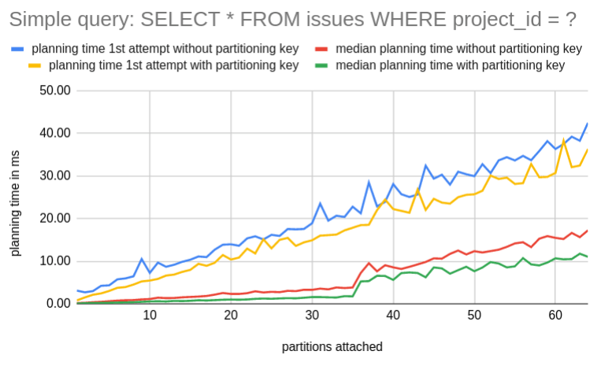
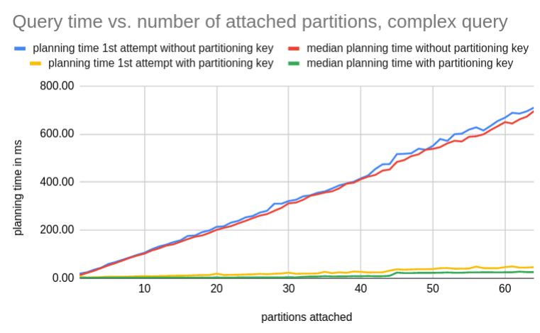
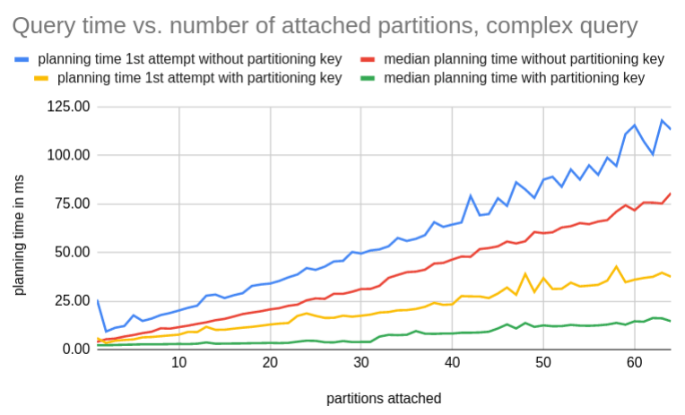

## Database Partitioning: Issue group search

We have [motivated database partitioning](partitioning.html) by looking at a specific example: Group-based issue search.

This type of search allows to find specific issues within a GitLab group ([example for `gitlab-org` group](https://gitlab.com/groups/gitlab-org/-/issues)). We can apply all kinds of filters to the search, for example by filtering on milestone, author or a free-text search.

This document summarizes findings from exploring database partitioning for issue group search on a production-size dataset with PostgreSQL 11.

### Setup

We started from a copy of the production data of GitLab.com and upgraded the database to PostgreSQL 11 (to leverage partitioning features). This dataset now lives on a GCP instance comparable to a production database replica instance (in instance type and disk sizes).

In this database, we created a partitioned `issues` table with 64 partitions and employed hash-based partitioning by the top-level namespace the issue (and its project) resides in. This was done with several steps ([SQL scripts](https://gitlab.com/abrandl/gitlab-issue-partitioning/-/tree/master/sql)):

1. Calculate top-level namespace information for each issue.
2. Create a partitioned table `parts2.issues` with the additional `top_level_namespace` column to serve as the partitioning key.
3. Migrate and copy existing data from `public.issues` into this partitioned table.

### Query Analysis

Based on this setup, we looked at two types of queries:

1. Complex issue group search with normal filters and text search combined
2. Simple query to count issues for one project

Both cases are targeted towards a single group and are able to benefit from a partitioning scheme based on namespaces.

##### Complex issue group search

Details and results for this query can be found [in the issue](https://gitlab.com/gitlab-org/gitlab/-/issues/201871#note_298222262). The properties of this example are:

1. Issue group search by milestone and text search for a logged in user within `gitlab-org` group
2. Targeted to a namespace and hence expected to greatly benefit from partitioning.

The results are:

1. We see a decrease in execution time in the order of about 8-10x, reducing warm-cache execution time from about 2s to 0.2s.
2. We see an increase in planning time from about 10ms to 40ms.

The increase in planning time is expected and it pays off as long as execution time is significantly improved.

##### Simple count query

Details and results for this query can be found [in the issue](https://gitlab.com/gitlab-org/gitlab/-/issues/201871#note_299684145). The properties of this example are:

1. Simple query to count issues in a certain project (`gitlab-org/gitlab`)
2. Defaults to an index-only scan and does not read a lot of data
3. Given the table size of the non-partitioned case (about 20 GB), this query is expected to not show significant improvements from partitioning because it's not reading a lot of data anyways.

The results are:

1. With warm caches, total time is about 29ms and 50% worse in the partitioned case compared to non-partitioned.
2. The increase in total time is dominated by a significant increase in planning time for the partitioned case (from <1ms to 14ms).

### Table and index sizes

As expected, individual [sizes of partitions and their indexes](https://gitlab.com/gitlab-org/gitlab/-/issues/201871#note_301733476) are greatly reduced. Notably, [indexes on partitions are between 10x and 100x smaller](https://gitlab.com/gitlab-org/database-team/team-tasks/snippets/1947682#table-and-index-sizes) than on the non-partitioned table. This is where the main benefit from partitioning comes from: If we're able to statically exclude most of the partitions for a query, we're only going to deal with small indexes and small tables.

### Planning times

We examined [query planning times](https://gitlab.com/gitlab-org/gitlab/-/issues/201871#note_301884463) closer. While we've been doing query analysis earlier, we noticed an increase in planning times for the partitioned case. This is expected as the planner has to prune partitions and deal with meta-data and statistics for a lot more tables (each partition has their own).

We [examined the planning time over a varying amount of attached partitions](https://gitlab.com/abrandl/gitlab-issue-partitioning/-/blob/master/planning_times.rb).

The benchmark ran 5 attempts for the same query after having re-organized partitions and attached the number of desired partitions to the table. We distinguish the first attempt from subsequent attempts due to caching behavior.

Furthermore we're looking at two cases here:

1. Query with partitioning key: `WHERE project_id = ? AND root_namespace_id = ?`
2. Query without partitioning key: `WHERE project_id = ?`

The second case obviously doesn't benefit from partitioning during execution as it scans all partitions.

Starting with the simple query, this shows a rather expected result. As we can see the planning time depends on the number of attached partitions and increases slightly the more partitions we attach. The first attempt shows elevated planning times due to a cold cache (table metadata, statistics).

In the second example, we employ the same analysis but look at the complex issue group search example. This yielded quite unexpected planning times for the case without a partitioning key. This would drastically harm queries that don't have a partitioning key as a filter.

We suspected this might be due to gathering rather large statistics. On GitLab.com, we currently have `default_statistics_target = 1000` which is 10x the default postgres setting. It directly controls the amount of detail the table histograms are going to have and therefore has a direct impact on the data that is relevant for query planning.

After dialing this down to `default_statistics_target = 100` (the default setting), we arrive at more reasonable query timings. Luckily, this setting can be controlled on a per-table basis as well.

All data for these graphs can be found in a [public sheet](https://docs.google.com/spreadsheets/d/1MUc-Ogkal5XI2KKSeyn8m3nbdXuzNZ_h1-AHK0Ql3JE/edit?usp=sharing).

### Takeaways

1. Table partitioning helps to reduce execution times as expected.
2. It increases planning times for cases where most partitions get pruned. This is expected too and pays off when the subsequent execution time can be drastically reduced.
3. We need to be careful with queries that don't have a partitioning key.

##### Queries without a partitioning key

Partitioning only works when queries contain a filter on the partitioning key. Only then the planner is able to exclude non-relevant partitions from the execution plan.

For queries without a partitioning key, it is important to know that partitioning also has an effect on their planning time. This can be a major problem as shown above and we might need to consider reducing statistic sizes for partitioned tables. We cannot expect queries without a partitioning key to simply perform at the same level as without partitioning.

This makes it harder to iteratively introduce table partitioning. Once we switch over to using the partitioned table instead of the original one, we risk suffering from queries without the partitioning key - perhaps even greatly as shown above.

This means we should make sure that - for a partitioned table - as many queries as possible benefit from the partitioning and naturally employ a partitioning key filter:

1. [`activerecord-multi-tenant`](https://gitlab.com/gitlab-org/gitlab/-/issues/207397) can be used to derive the partitioning key automatically and add this filter when possible
2. We may want to find mechanics to detect and find queries early in the development cycle (i.e. on CI) that don't contain the partitioning key.
3. There are going to be cases where we can't use a partitioning key at all.

For example, finding issues assigned to a user doesn't come with a notion of a namespace but rather from a user's perspective. We will have to identify these cases and resolve them, for example by extracting their features into a separate service or duplicating data internally (e.g. the assignments table, to support both perspectives efficiently) and in some cases it might be possible to accept the increase in planning time.

### Working page for PostgreSQL table partitioning

Also see the [working page for Introducing PostgreSQL table partitioning to GitLab's database](/handbook/engineering/infrastructure/core-platform/data_stores/database/doc/partitioning.html)
------

Author: [Andreas Brandl](https://gitlab.com/abrandl)
