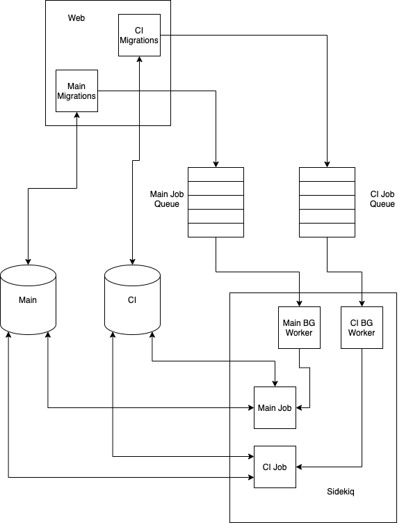

## Background migration design for multiple databases

This is a working document to specify the design of background migration support for multiple databases.

### Motivation

At GitLab, we rely heavily on background processing when migrating large volumes of data. This is not only important for typical data fixes related to application logic, but also as an underpinning for future database objectives, such as partitioning and schema redesign.

At the same time, we are [decomposing the GitLab application database into multiple databases](https://gitlab.com/groups/gitlab-org/-/epics/6168) to scale GitLab. This effort has an impact on the entire application, requiring substantial changes to implement the desired design.

Since background migrations are such an important tool, we need to properly redesign them to fully embrace a multi-database design.

### Background

Before we discuss the proposed design, we first describe how background migrations work, and the decisions imposed by the use of multiple databases.

#### Types of background migrations

We have two background migration frameworks within the application. Generally, the same multi-database design principles should apply to both.

1. Redis-based solution - These are background migrations generally available for use by any developer working on GitLab. While they do have optional job-tracking in the database, they primarily work by enqueueing sidekiq jobs to be processed on a fixed-interval delay.
1. Database-based solution - These are not generally available for use yet, but designed to be replacement for the redis-based solution. They run from a sidekiq-cron, but all job information is persisted in the database.

#### Components of background migrations

We can think of background migrations as several loosely-coupled components:

1. Enqueuing migration helpers - called from a post-deployment migration, and store the information needed to later run the background jobs
1. Job execution framework - the generic worker process responsible for executing individual migration jobs, based on previously enqueued data
1. Background migration jobs - the jobs containing the specific business logic for the particular data migration

Since these components are logically separated, we don't have to apply a one-size-fits-all solution. The migration helpers run within a migration context, so they should naturally behave as Rails' migrations behave. The background migration execution is run from sidekiq, but the generic framework and custom classes have their own distinct concerns.

#### Concerns of multiple databases

In a multi-database design, tables used to store data for business logic will reside only on a single database. The same set of business data will always come from the same known database.

Background migrations don't follow this model. Background migration jobs have a need to talk to multiple databases, potentially even at one time. Additionally, since both forms of background migrations have database-level tracking tables, we have to consider how we will divide this data across databases.

Separate from storage-level concerns, we need to consider our execution model. The use of multiple physical databases provides the opportunity to process data on each database independently.

### Proposed design

At a high level, we propose this design for multi-database background migrations:

- Enqueue migrations based on the intended context of the migration. Background migrations intended to execute in a particular context (e.g. "CI") are scheduled through Rails migrations for said context, and the tracking data is also stored on the database relevant in this context (e.g. "CI database"). If the background migrations are going to communicate with both databases then the developer can choose either `ci` or `main` based on which ever seems the most applicable.
- Use separate queues to process jobs for each database. The worker for that queue will know its own context, to connect to the appropriate tracking database.
- Allow maximum flexibility in individual migration jobs. Developers choose which databases to connect to execute their data migration.

The following diagram describes the high-level architecture of this approach:



We describe each of these points in more detail below.

#### Enqueueing migrations based on the intended context

For an example, with the decomposition effort, we intend to have a main database and a CI database. If a developer needs to run a background migration against tables on the main database, they will use a Rails migration for the main database to enqueue it. If they need to run the migration against tables on the CI database, it is enqueued by a Rails migration under CI.

This approach has several advantages:
  - The migration naturally follows the model of Rails migrations. We don't have to reach cross-database (which Rails doesn't support) while the Rails migration enqueues the jobs.
  - The execution framework can use `SharedModel` consistently both to access the tracking information and the database context for generic migration jobs which don't use a hardcoded connection to a particular database.
  - We keep tracking data local to the database where the business data for the migration resides.

To support this execution model, we can require developers to tag migrations with the context they will need. A simplified example might look like:

```ruby
class BackgroundMigration < GitlabMigration[1.0]
  restrict_gitlab_migration schema: :ci

  def up
    # schedule jobs
  end
end
```

This allows us to restrict the enqueuing migration to only run on the targeted logical database, unlike DDL changes, which will be applied to all database to keep the schema consistent.

#### Separate queues and workers

Again looking at a concrete example, if we have a main and CI database, we also have both a main and CI background worker.

Advantages to this approach:
  - It provides a clean separation of concerns that is easier to reason about and maintain.
  - It takes full advantage of multiple physical databases by processing against each independently. It also provides operation flexibility to manage these independently.
  - The workers automatically know the context in which they run, without having to pass additional data to them.

#### Allow the developer to choose how the migration connects

This is the only "decision" which is really a hard requirement. Individual background migration jobs might need to talk to one or more databases, so we have to leave the decision to the developer.

There are a couple ways this could work in practice depending on the scenario:

  - The job uses migration-specific models that inherit from the correct base class for the intended database(s).
    ```ruby
    class ExplicitMigrationJob
      class SecurityScan < Gitlab::Database[:main]
      end

      class Build < Gitlab::Database[:ci]
      end

      def perform(start_id, end_id)
        build_ids = SecurityScan.(id: start_id..end_id).pluck(:build_id)

        Build.connection.execute(<<~SQL)
          DELETE FROM ci_builds
          WHERE id IN (#{build_ids.join(',')})
            AND (...)
        SQL
      end
    end
    ```
  - The job is designed to be generic and can use `SharedModel` (either as base class or to retreive a connection) which is already configured by the execution framework for the correct context.
    ```ruby
    class GenericMigrationJob
      def perform(source_table, target_table, start_id, end_id)
        SharedModel.connection.execute(<<~SQL)
          INSERT INTO #{target_table}
          SELECT *
          FROM #{source_table}
          WHERE #{source_table}.id BETWEEN #{start_id} AND #{end_id}
        SQL
      end
    end
    ```
