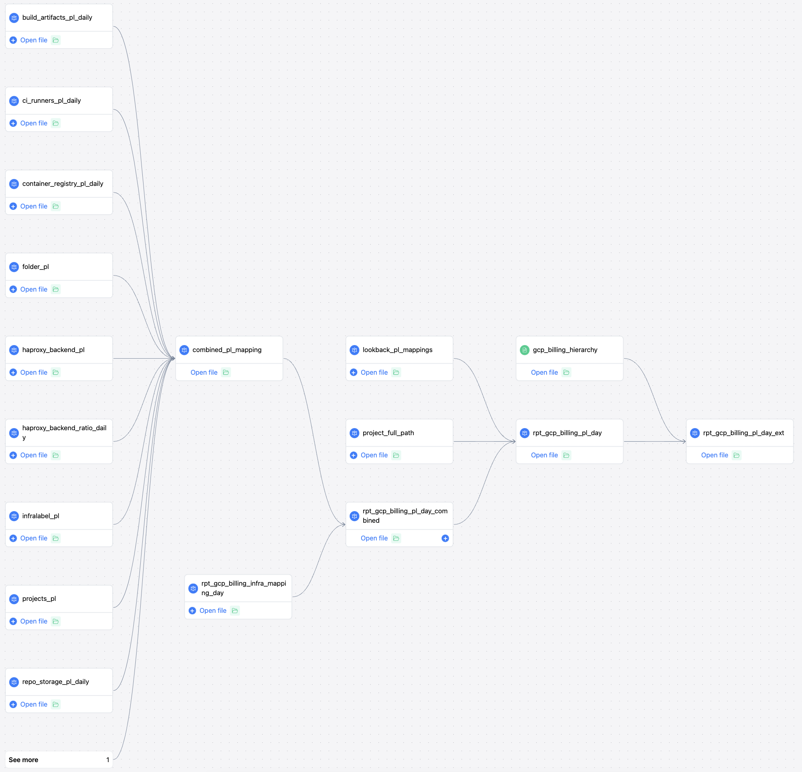

---

title: "P&L Allocation"
description: "P&L allocation documentation"
---

## Cloud FinOps at GitLab

### Overview of the data pipeline
The GCP billing Profit & Loss (P&L) allocation pipeline takes raw GCP billing data and allocates costs to P&L categories for analysis and reporting. It provides a daily overview of GCP costs by P&L category (free. internal, paid).

The pipeline consists of the following key steps:

1. Map raw GCP billing data to infrastructure labels (rpt_gcp_billing_infra_mapping_day)
2. Calculate usage and costs for various infrastructure components like CI runners, storage, etc. and map to P&L categories (models ending in _pl_daily)
3. Combine all P&L mappings into a unified mapping table (combined_pl_mapping)
4. Apply the combined P&L mappings to the raw GCP data (rpt_gcp_billing_pl_day_combined)
5. Apply the lookback mappings to the raw GCP data (rpt_gcp_billing_pl_day)
6. Output final allocated costs by P&L category and applies a hierarchy for exploration on Tableau (rpt_gcp_billing_pl_day_ext)

The workflow follows a data transformation pipeline pattern:

- Raw input → Enrichment models → Unified mappings → Allocation → P&L output

### Lineage

### Combined mappings

The combined P&L mappings consolidate all the individual mapping logic into a single model for simplicity.

| Mapping	| Source | 	Metric Used	| Scope |
|-----------|--------|--------------|------|
|build_artifacts_pl_daily	|GitLab API|	Build artifacts usage per namespace in gigabyte per day |	Storage for build artifacts
|ci_runners_pl_daily	|GitLab API|	CI consumption in ci.minutes per runner type |	CI/CD runner usage
|container_registry_pl_daily	|GitLab API|	Container registry usage per namespace in gigabyte per day |	Storage for container registries
|folder_pl|	GCP hierarchy|	Folder path |	GCP projects by parent folder
|haproxy_backend_pl|	HAproxy metrics from Thanos |	Network usage per backend in gigabyte per day |	Load balancer egress
|haproxy_backend_ratio_daily |	HAproxy metrics |	Percentage of network usage per backend	| Splits load balancer costs by backend
|infralabel_pl | Config |	Infrastructure labels |	GCP resources by infrastructure label
|namespace_pl_daily|	GitLab API |	Namespace plan data |	Namespace allocation
|projects_pl|	Config |	GCP project ID |	Specific GCP project costs
|repo_storage_pl_daily |  GitLab API|	Repo storage usage per namespace in gigabyte per day |	Storage for Git repositories

#### rpt_gcp_billing_infra_mapping_day

##### Mission, objective, inputs, granularity

- **Mission:** Map GCP billing data to infrastructure labels.
- **Objective:** Provide daily GCP billing data with additional metadata for better reporting and analysis.
- **Granularity:** Daily
- **Inputs:** Raw GCP billing data

##### Schema

    day: date - Date of the record
    gcp_project_id: varchar - GCP project identifier
    gcp_service_description: varchar - GCP service description
    gcp_sku_description: varchar - GCP SKU description
    infra_label: varchar - Infrastructure label
    env_label: varchar - Environment label
    runner_label: varchar - Runner label
    usage_unit: varchar - Unit of usage
    pricing_unit: varchar - Unit of pricing
    usage_amount: float - Amount of usage
    usage_amount_in_pricing_units: float - Usage amount in pricing units
    cost_before_credits: float - Cost before credits applied
    net_cost: float - Net cost after credits applied
    usage_standard_unit: varchar - Standard unit of usage
    usage_amount_in_standard_unit: float - Usage amount in standard units

##### Links
  - [Model](https://dbt.gitlabdata.com/#!/model/model.gitlab_snowflake.rpt_gcp_billing_infra_mapping_day)

#### rpt_gcp_billing_pl_day

##### Mission, objective, inputs, granularity

- **Mission:** Calculate daily GCP billing data by Profit & Loss categories.
- **Objective:** Provide a daily overview of GCP costs by pl_category for reporting and cost analysis. 
- **Granularity:** Daily
- **Inputs:** rpt_gcp_billing_pl_day_combined, combined_pl_mapping

##### Schema

    date_day: date - Date of the record
    gcp_project_id: varchar - GCP project identifier
    gcp_service_description: varchar - GCP service description
    gcp_sku_description: varchar - GCP SKU description
    infra_label: varchar - Infrastructure label
    env_label: varchar - Environment label
    runner_label: varchar - Runner label
    pl_category: varchar - Profit & Loss category
    usage_unit: varchar - Unit of usage
    pricing_unit: varchar - Unit of pricing
    usage_amount: float - Amount of usage
    usage_amount_in_pricing_units: float - Usage amount in pricing units
    cost_before_credits: float - Cost before credits applied
    net_cost: float - Net cost after credits applied
    usage_standard_unit: varchar - Standard unit of usage
    usage_amount_in_standard_unit: float - Usage amount in standard units
    from_mapping: varchar - Source of mapping

##### Links
  - [Model](https://dbt.gitlabdata.com/#!/model/model.gitlab_snowflake.rpt_gcp_billing_pl_day)

#### rpt_gcp_billing_pl_day_ext

##### Mission, objective, inputs, granularity

- **Mission:** Calculate daily GCP billing data by Profit & Loss categories.
- **Objective:** Provide a daily overview of GCP costs by pl_category for reporting and cost analysis. This table will be the main source for [the cockpit dashboard (Sisense)](https://app.periscopedata.com/app/gitlab:safe-dashboard/1116156/WIP:-GCP-Billing:-Cockpit---Infra-labels-version) and the [Tableau dashboard](https://10az.online.tableau.com/#/site/gitlab/views/FinOps-CloudBilling/ExplorationDashboard-1?:iid=1)
- **Granularity:** Daily
- **Inputs:** rpt_gcp_billing_pl_day_combined, combined_pl_mapping

##### Schema

    date_day: date - Date of the record
    gcp_project_id: varchar - GCP project identifier
    gcp_service_description: varchar - GCP service description
    gcp_sku_description: varchar - GCP SKU description
    infra_label: varchar - Infrastructure label
    env_label: varchar - Environment label
    runner_label: varchar - Runner label
    pl_category: varchar - Profit & Loss category
    usage_unit: varchar - Unit of usage
    pricing_unit: varchar - Unit of pricing
    usage_amount: float - Amount of usage
    usage_amount_in_pricing_units: float - Usage amount in pricing units
    cost_before_credits: float - Cost before credits applied
    net_cost: float - Net cost after credits applied
    usage_standard_unit: varchar - Standard unit of usage
    usage_amount_in_standard_unit: float - Usage amount in standard units
    from_mapping: varchar - Source of mapping

##### Links
  - [Model](https://dbt.gitlabdata.com/#!/model/model.gitlab_snowflake.rpt_gcp_billing_pl_day_ext)

#### rpt_gcp_billing_pl_day_combined

##### Mission, objective, inputs, granularity

- **Mission:** Applies the combined mappings to the billing data
- **Objective:** Provide a daily overview of GCP costs by pl_category for reporting and cost analysis. 
- **Granularity:** Daily
- **Inputs:** rpt_gcp_billing_infra_mapping_day, combined_pl_mapping

##### Schema

    date_day: date - Date of the record
    gcp_project_id: varchar - GCP project identifier
    gcp_service_description: varchar - GCP service description
    gcp_sku_description: varchar - GCP SKU description
    infra_label: varchar - Infrastructure label
    env_label: varchar - Environment label
    runner_label: varchar - Runner label
    pl_category: varchar - Profit & Loss category
    usage_unit: varchar - Unit of usage
    pricing_unit: varchar - Unit of pricing
    usage_amount: float - Amount of usage
    usage_amount_in_pricing_units: float - Usage amount in pricing units
    cost_before_credits: float - Cost before credits applied
    net_cost: float - Net cost after credits applied
    usage_standard_unit: varchar - Standard unit of usage
    usage_amount_in_standard_unit: float - Usage amount in standard units
    from_mapping: varchar - Source of mapping

##### Links
  - [Model](https://dbt.gitlabdata.com/#!/model/model.gitlab_snowflake.rpt_gcp_billing_pl_day_combined) 

#### build_artifacts_pl_daily

##### Mission, objective, inputs, granularity

- **Mission:** Map daily build artifacts usage to Profit & Loss categories.
- **Objective:** Provide daily build artifacts usage data by pl_category for cost analysis and reporting.
- **Granularity:** Daily
- **Inputs:** GitLab Storage per namespace statistics, namespace_pl_daily
- **Accuracy rating:** Very High
- **Completeness rating:** Very High

##### Schema

    snapshot_day: date - Date of the snapshot
    finance_pl: varchar - Profit & Loss category
    build_artifacts_gb: float - Build artifacts size in GB
    percent_build_artifacts_size: float - Percentage of build artifacts size

##### Links
  - [Model](https://dbt.gitlabdata.com/#!/model/model.gitlab_snowflake.build_artifacts_pl_daily)

##### Examples

    
    SELECT snapshot_day, finance_pl, SUM(build_artifacts_gb) as total_gb
    FROM prod.workspace_engineering.build_artifacts_pl_daily
    GROUP BY snapshot_day, finance_pl
    ORDER BY date_day desc;
    

Description: This query aggregates build artifacts usage data by P&L category for each snapshot day. It provides a sum of build artifacts size in gigabytes (GB), grouped by the P&L category, giving an insight into the storage requirements and cost allocation for different P&L categories.

#### ci_runners_pl_daily

##### Mission, objective, inputs, granularity

- **Mission:** Map daily CI runner usage to Profit & Loss categories.
- **Objective:** Provide daily CI runner usage data by pl_category for cost analysis and reporting.
- **Granularity:** Daily
- **Inputs:** GitLab API: ci_minutes consumption per type of customer and plan over time
- **Accuracy rating:** Very High
- **Completeness rating:** Very High

##### Schema

    reporting_day: date - Date of the report
    mapping: varchar - Mapping data
    pl: varchar - Profit & Loss category
    total_ci_minutes: number - Total CI minutes used
    pct_ci_minutes: number - Percentage of CI minutes used

##### Links
  - [Model](https://dbt.gitlabdata.com/#!/model/model.gitlab_snowflake.ci_runners_pl_daily)

##### Examples

    
    SELECT reporting_day, pl, SUM(total_ci_minutes) as total_minutes
    FROM prod.workspace_engineering.ci_runners_pl_daily
    GROUP BY reporting_day, pl
    ORDER BY reporting_day DESC;
    

Description: This query summarizes the total CI minutes used by each P&L category on a given day. It helps in understanding the distribution and usage of CI runners across different P&L categories.

#### combined_pl_mapping

##### Mission, objective, inputs, granularity

- **Mission:** Combine all Profit & Loss mappings into a single model.
- **Objective:** Create a unified model to simplify the mapping process and improve maintainability.
- **Granularity:** Daily
- **Inputs:** Various PL mappings

##### Schema

    date_day: timestamp_ntz - Date of the record
    gcp_project_id: varchar - GCP project identifier
    gcp_service_description: varchar - GCP service description
    gcp_sku_description: varchar - GCP SKU description
    infra_label: varchar - Infrastructure label
    env_label: varchar - Environment label
    runner_label: varchar - Runner label
    pl_category: varchar - Profit & Loss category
    pl_percent: float - Percentage of Profit & Loss category
    from_mapping: varchar - Source of mapping

##### Links
  - [Model](https://dbt.gitlabdata.com/#!/model/model.gitlab_snowflake.combined_pl_mapping)

##### Examples

    
    SELECT date_day, from_mapping, pl_category, AVG(pl_percent) as average_pl_percent
    FROM prod.workspace_engineering.combined_pl_mapping
    GROUP BY date_day, from_mapping, pl_category
    ORDER BY date_day DESC;
    

Description: This query provides an average percentage allocation of P&L categories for each mapping by day. It showcases how costs are distributed among different P&L categories based on infrastructure labels.

#### container_registry_pl_daily

##### Mission, objective, inputs, granularity

- **Mission:** Map daily container registry usage to Profit & Loss categories.
- **Objective:** Provide daily container registry usage data by pl_category for cost analysis and reporting.
- **Granularity:** Daily
- **Inputs:** GitLab API: Container registry usage per namespace per day
- **Accuracy rating:** Very High
- **Completeness rating:** Very High

##### Schema

    snapshot_day: date - Date of the snapshot
    finance_pl: varchar - Profit & Loss category
    container_registry_gb: float - Container registry size in GB
    percent_container_registry_size: float - Percentage of container registry size

##### Links
  - [Model](https://dbt.gitlabdata.com/#!/model/model.gitlab_snowflake.container_registry_pl_daily)

##### Examples

    
    SELECT snapshot_day, finance_pl, AVG(container_registry_gb) as average_gb
    FROM prod.workspace_engineering.container_registry_pl_daily
    GROUP BY snapshot_day, finance_pl
    ORDER BY snapshot_day DESC, finance_pl DESC;
    

Description: This query provides an average percentage allocation of P&L categories for each infrastructure label by day. It showcases how costs are distributed among different P&L categories based on infrastructure labels.

#### haproxy_backend_pl

##### Mission, objective, inputs, granularity

- **Mission:** Maps each HAproxy backend to a specific P&L split
- **Objective:** Enable better allocation and reporting of infrastructure costs by pl_category.
- **Granularity:** N/A (mapping)
- **Inputs:** gcp_billing_haproxy_pl_mapping (csv seed)
- **Accuracy rating:** Medium
- **Completeness rating:** High

##### Schema

    METRIC_BACKEND: VARCHAR
    TYPE: VARCHAR
    ALLOCATION: FLOAT

##### Links
  - [Model](https://dbt.gitlabdata.com/#!/model/model.gitlab_snowflake.haproxy_backend_pl)

##### Examples

    
    SELECT metric_backend, TYPE, AVG(ALLOCATION) as average_allocation
    FROM prod.workspace_engineering.haproxy_backend_pl
    GROUP BY metric_backend, TYPE;
    

Description: This query averages the allocation percentages for each HAproxy backend type. It provides insight into how network usage is distributed across different backend types for P&L categorization.

#### haproxy_backend_ratio_daily

##### Mission, objective, inputs, granularity

- **Mission:** Splits Networking costs into its different backends (SSH, HTTPs, ...)
- **Objective:** Enable better allocation and reporting of infrastructure costs by pl_category.
- **Granularity:** N/A (mapping)
- **Inputs:** Thanos HAproxy data, also visible [on Grafana](https://dashboards.gitlab.net/d/general-egress_ingress/general-network-ingress-egress-overview?orgId=1&from=1667956424979&to=1668115400979)
- **Accuracy rating:** Medium
- **Completeness rating:** High

##### Schema

    date_day: timestamp_ntz - Date of the record
    backend_category: varchar - Backend category identifier
    usage_in_gib: float - Usage in Gib 

##### Links
  - [Model](https://dbt.gitlabdata.com/#!/model/model.gitlab_snowflake.haproxy_backend_ratio_daily)

##### Examples

    
    SELECT date_day, backend_category, AVG(usage_in_gib) as average_usage_ratio
    FROM prod.workspace_engineering.haproxy_backend_ratio_daily
    GROUP BY date_day, backend_category;
    

Description: This query calculates the average daily usage ratio for each backend category. It's useful for analyzing the distribution of network costs among different backends on a daily basis.

#### infralabel_pl

##### Mission, objective, inputs, granularity

- **Mission:** Map infrastructure labels to Profit & Loss categories.
- **Objective:** Enable better allocation and reporting of infrastructure costs by pl_category.
- **Granularity:** N/A (mapping)
- **Inputs:** gcp_billing_infra_pl_mapping (csv seed)
- **Accuracy rating:** Medium
- **Completeness rating:** High

##### Schema

    infra_label: varchar - Infrastructure label
    type: varchar - Type of allocation
    allocation: float - Allocation value

##### Links
  - [Model](https://dbt.gitlabdata.com/#!/model/model.gitlab_snowflake.infralabel_pl)

##### Examples

    
    SELECT infra_label, type, AVG(allocation) as average_allocation
    FROM prod.workspace_engineering.infralabel_pl
    GROUP BY infra_label, type;
    

Description: This query provides an average allocation value for each infrastructure label and type. It helps in understanding how different infrastructure components are categorized into P&L categories.

#### namespace_pl_daily

##### Mission, objective, inputs, granularity

- **Mission:** Maintain a daily history of active namespaces and their associated Profit & Loss categories.
- **Objective:** Provide an historical view of namespace usage by pl_category for analysis and reporting.
- **Inputs:** GitLab Product Information
- **Granularity:** Daily
- **Inputs:** N/A

##### Schema

    date_day: date - Date of the record
    dim_namespace_id: number - Namespace identifier
    dim_plan_id: number - Plan identifier
    finance_pl: varchar - Profit & Loss category

##### Links
  - [Model](https://dbt.gitlabdata.com/#!/model/model.gitlab_snowflake.namespace_pl_daily)

##### Examples

    
    SELECT date_day, finance_pl, COUNT(dim_namespace_id) as total_namespaces
    FROM prod.workspace_engineering.namespace_pl_daily
    GROUP BY date_day, finance_pl;
    

Description: This query counts the number of namespaces per P&L category on a given day. It's useful for tracking the usage and distribution of namespaces across different P&L categories.

#### projects_pl

##### Mission, objective, inputs, granularity

- **Mission:** Map specific GCP projects to Profit & Loss categories.
- **Objective:** Provide accurate allocation and reporting of project costs by pl_category
- **Granularity:** N/A (mapping)
- **Inputs:** gcp_billing_project_pl_mapping (csv seed)
- **Accuracy rating:** High
- **Completeness rating:** High

##### Schema

    project_id: varchar - Project identifier
    type: varchar - Type of allocation
    allocation: number - Allocation value

##### Links
  - [Model](https://dbt.gitlabdata.com/#!/model/model.gitlab_snowflake.projects_pl)

##### Examples

    
    SELECT date_day, finance_pl, COUNT(dim_namespace_id) as total_namespaces
    FROM prod.workspace_engineering.namespace_pl_daily
    GROUP BY date_day, finance_pl;
    

Description: This query counts the number of namespaces per P&L category on a given day. It's useful for tracking the usage and distribution of namespaces across different P&L categories.

#### repo_storage_pl_daily

##### Mission, objective, inputs, granularity

- **Mission:** Map daily repository storage usage to Profit & Loss categories.
- **Objective:** Provide daily repository storage usage data by pl_category for cost analysis and reporting.
- **Granularity:** Daily
- **Inputs:** GitLab API: repository storage usage per day and per namespace plan type
- **Accuracy rating:** Very High
- **Completeness rating:** Very High

##### Schema

    snapshot_day: date - Date of the snapshot
    finance_pl: varchar - Profit & Loss category
    repo_size_gb: float - Repository size in GB
    percent_repo_size_gb: float - Percentage of repository size

##### Links
  - [Model](https://dbt.gitlabdata.com/#!/model/model.gitlab_snowflake.repo_storage_pl_daily)

##### Examples

    
    SELECT snapshot_day, finance_pl, SUM(repo_size_gb) as total_gb
    FROM prod.workspace_engineering.repo_storage_pl_daily
    GROUP BY snapshot_day, finance_pl;
    

Description: This query aggregates the total repository storage usage in GB by P&L category for each day. It helps in understanding the storage requirements and cost allocation for repository storage across different P&L categories.

#### folder_pl

##### Mission, objective, inputs, granularity

- **Mission:** Map projects to specific Profit & Loss categories thanks to their path in the organization folder hierarchy.
- **Objective:** Provide accurate allocation and reporting of sandbox project costs by pl_category.
- **Granularity:** N/A (mapping)
- **Inputs:** gcp_billing_sandbox_projects (csv seed)
- **Accuracy rating:** Very High
- **Completeness rating:** Very High

##### Schema

    folder: varchar - GCP project identifier
    classification: varchar - Classification category

##### Links
  - [Model](https://dbt.gitlabdata.com/#!/model/model.gitlab_snowflake.folder_pl)

#### rpt_gcp_billing_skus_day

##### Mission, objective, inputs, granularity

- **Mission:** Map specific SKUs or Service-SKU combinations to Profit & Loss categories.
- **Objective:** Enable accurate allocation and reporting of specific costs by pl_category.
- **Granularity:** N/A (mapping)
- **Inputs:** gcp_billing_single_sku_pl_mapping (csv seed)
- **Accuracy rating:** Very High
- **Completeness rating:** Very High

##### Schema

    service_description: varchar - Service description
    sku_description: varchar - SKU description
    type: varchar - Type of allocation
    allocation: number - Allocation value

##### Links
  - [Model](https://dbt.gitlabdata.com/#!/model/model.gitlab_snowflake.rpt_gcp_billing_skus_day)

### Lookback mappings

The lookback mappings are used to retroactively apply updated profit and loss (P&L) allocations to historical data. This ensures consistency in P&L reporting over time.
In Google's Cloud Billing data, our commitment costs are still incurred on the projects using the eligible compute resources. Once we apply the P&L split to a certain area of costs, the CUD lines are not mapped and must be mapped by looking back on the same perimeters.

There are two lookback mapping models:
- flex_cud_lookback: applies the P&L split retroactively to the Flex CUD SKUs in the same perimeter
- t2d_cud_lookback: applies the P&L split retroactively to the T2D CUD SKUs in the same perimeter

##### Links
  - [Flex CUD Lookback](https://dbt.gitlabdata.com/#!/model/model.gitlab_snowflake.flex_cud_lookback)
  - [Flex CUD Lookback](https://dbt.gitlabdata.com/#!/model/model.gitlab_snowflake.t2d_cud_lookback)

### Dashboards

(Internal only)[Cloud Billing dashboards](https://10az.online.tableau.com/#/site/gitlab/search/workbooks?order_by=relevancy:desc&search=finops)

### Glossary

- **P&L**: Profit & Loss
  - **P&L categories**: Profit & Loss labels: either equal to free, internal, or paid.
  - **free** users: GitLab.com users having a free plan
  - **paid** users: GitLab.com users having a paid plan
  - **internal** users: GitLab.com internal users
- **GCP** (Google Cloud Platform): A suite of cloud computing services provided by Google that runs on the same infrastructure that Google uses internally for its end-user products.
- **Pipeline**: In this context, a series of data processing steps or stages through which billing data is transformed and analyzed.
- **CI Runners**: Continuous Integration runners are virtual machines or containers that execute the code in a CI/CD process.
- **Thanos**: A set of components that can be composed into a highly available metric system with unlimited storage capacity, which can be added seamlessly on top of existing Prometheus deployments.
- **BigQuery**: A fully-managed, serverless data warehouse that enables scalable analysis over petabytes of data. It is a part of the Google Cloud Platform.
- **HAproxy**: High Availability proxy is software that provides high availability, load balancing, and proxying for applications.
- **Tableau**: A visual analytics platform transforming the way we use data to solve problems.
- **Grafana**: An open-source platform for monitoring and observability. It allows you to query, visualize, alert on, and understand your metrics.
- **SKU (Stock Keeping Unit)**: A specific type of item for sale, such as a product or service, and all attributes associated with the item type that distinguish it from other item types.
- **CUD (Committed Use Discount)**: A discount applied in exchange for a commitment to use a minimum level of resources for a specified term with Google Cloud services.
- **Flex CUD**: A type of Committed Use Discount in Google Cloud Platform that provides flexibility in usage.
- **T2D**: Refers to a specific type of Google Cloud Platform resource or service, likely in the context of a Committed Use Discount.
- **Infrastructure Labels**: Tags or labels used to categorize various GCP resources for management and billing purposes.
- **Namespace**: In GitLab, a namespace provides one place to organize your related projects. Projects in one namespace are separate from projects in other namespaces, which means you can use the same name for projects in different namespaces.
- **GitLab API**: The programming interface provided by GitLab for automating actions or querying data from GitLab instances.