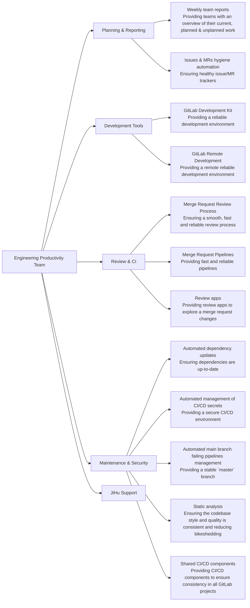

## Mission

- Constantly improve efficiency for our entire engineering team, to ultimately increase value for our customer.
- Measure what matters: quality of life, efficiency, and toil reduction improvements with quantitative and qualitative measures.
- Build partnerships across organizational boundaries to deliver broad efficiency improvements.

## Team

### Members

| Team Members                                     | Role                                                |
|------------------------------------------------- | --------------------------------------------------  |
|                | Acting Engineering Manager                          |
|            | Senior Backend Engineer, Engineering Productivity   |
|          | Senior Backend Engineer, Engineering Productivity   |
|              | Senior Backend Engineer, Engineering Productivity   |
|             | Senior Backend Engineer, Engineering Productivity   |
|            | Backend Engineer, Engineering Productivity          |
|            | Staff Backend Engineer, Engineering Productivity    |
|            | Principal Engineer, Infrastructure                  |

### Stable Counterpart

| Person | Role |
| --- | --- |
|  | [GDK Project Stable Counterpart](/handbook/engineering/infrastructure/engineering-productivity/gdk/), Application Security |

## Core Responsibilities

* **See it and find it**: Build automated measurements and dashboards to gain insights into the productivity of the Engineering organization to identify opportunities for improvement.
  * Implement new measurements to provide visibility into improvement opportunities.
  * Collaborate with other Engineering teams to provide visualizations for measurement objectives.
  * Improve existing performance indicators.
* **Do it for internal team**: Increase contributor and developer productivity by making measurement-driven improvements to the development tools / workflow / processes, then monitor the results, and iterate.
  * Identify and implement quantifiable improvement opportunities with proposals and hypothesis for metric improvements.
  * Automated [merge request quality checks](https://docs.gitlab.com/ee/development/dangerbot.html) and [code quality checks](https://docs.gitlab.com/ee/development/contributing/style_guides.html).
  * [GitLab project pipeline](https://docs.gitlab.com/ee/development/pipelines/) improvements to improve efficiency, quality or duration.
* **Dogfood use**: Dogfood GitLab product features to improve developer workflow and provide feedback to product teams.
  * Use new features from related product groups (Analytics, Monitor, Testing).
  * Improve usage of [Review apps](https://docs.gitlab.com/ee/development/testing_guide/review_apps.html) for GitLab development and testing.
* **Engineering support**:
  * [`#master-broken`](/handbook/engineering/workflow/#broken-master) pipeline monitoring.
  * KPI corrective actions such as [Review Apps stabilization](/handbook/engineering/infrastructure/performance-indicators/#review-app-deployment-success-rate).
  * [Merge Request Coach](/job-families/expert/merge-request-coach/) for ~"Community contribution" merge requests.
* **Engineering workflow**: Develop automated processes for improving label classification hygiene in support of product and Engineering workflows.
  * [Automated issues and merge requests triage](/handbook/engineering/infrastructure/engineering-productivity/triage-operations/).
  * Improvements to the labelling classification and automation used to support Engineering measurements.
  * See the [`gitlab-triage` Ruby gem](https://gitlab.com/gitlab-org/ruby/gems/gitlab-triage), and [Triage operations](https://gitlab.com/gitlab-org/quality/triage-ops) projects for examples.
* **Do it for wider community**: Increase efficiency for wider GitLab Community contributions.
* **Dogfood build**: Enhance and add new features to the GitLab product to improve engineer productivity.

## Metrics

### KPIs

[Infrastructure Performance Indicators](/handbook/engineering/infrastructure/performance-indicators/) are our single source of truth
- [Master Pipeline Stability](/handbook/engineering/infrastructure/performance-indicators/#master-pipeline-stability)
- [Merge request pipeline duration](/handbook/engineering/infrastructure/performance-indicators/#merge-request-pipeline-duration)

### PIs

- [Review App deployment success rate](/handbook/engineering/infrastructure/performance-indicators/#review-app-deployment-success-rate)
- [Time to First Failure P80](/handbook/engineering/infrastructure/performance-indicators/#time-to-first-failure-p80)
- [Time to First Failure](/handbook/engineering/infrastructure/performance-indicators/#time-to-first-failure)

### Shared

- [Quality Handbook MR Rate](/handbook/engineering/infrastructure/performance-indicators/#quality-handbook-mr-rate)
- [Quality Department Promotion Rate](/handbook/engineering/infrastructure/performance-indicators/#quality-department-promotion-rate)
- [Quality Department Discretionary Bonus Rate](/handbook/engineering/infrastructure/performance-indicators/#quality-department-discretionary-bonus-rate)

### Dashboards

The Engineering Productivity team creates metrics in the following sources to aid in operational reporting.

- [Engineering Productivity Collection](https://10az.online.tableau.com/#/site/gitlab/collections/fc447e0e-d368-4bc2-a8c6-ac782318ab96)
- [Broken Master Pipeline Root Cause Analysis](https://10az.online.tableau.com/#/site/gitlab/workbooks/2296993/views)
- [Time to First Failure](https://10az.online.tableau.com/#/site/gitlab/workbooks/2300061/views)
- [Flaky test issues](https://10az.online.tableau.com/#/site/gitlab/workbooks/2283052/views)
- [Test Intelligence Accuracy](https://10az.online.tableau.com/#/site/gitlab/views/DRAFTTestIntelligenceAccuracy/TestIntelligenceAccuracy)
- [Engineering Productivity Pipeline Durations](https://10az.online.tableau.com/#/site/gitlab/workbooks/2312755/views)
- [Engineering Productivity Jobs Durations](https://10az.online.tableau.com/#/site/gitlab/views/DRAFTEP-JobsDurations/EP-JobsDurations)
- Engineering Productivity Package And QA Durations (to be replaced in Tableau)
- GDK - Jobs Durations ([to be replaced in Tableau](https://gitlab.com/gitlab-data/tableau/-/issues/253#note_1730258820))
- [Issue Types Detail](https://10az.online.tableau.com/#/site/gitlab/workbooks/2203014/views)
- [GitLab-Org Native Insights](https://gitlab.com/groups/gitlab-org/-/insights)
- [Review Apps monitoring dashboard](https://app.google.stackdriver.com/dashboards/6798952013815386466?project=gitlab-review-apps)
- Triage Reactive monitoring dashboards
  - [Overview dashboard](https://console.cloud.google.com/monitoring/dashboards/builder/e3e9d8fc-54cd-4a98-b4a3-e81f01d37e26?project=gitlab-qa-resources&dashboardBuilderState=%257B%2522editModeEnabled%2522:false%257D&timeDomain=1w)
  - [Processors dashboard](https://console.cloud.google.com/monitoring/dashboards/builder/3338d66b-649c-4ea9-aec9-14ffba96c25f?project=gitlab-qa-resources&dashboardBuilderState=%257B%2522editModeEnabled%2522:false%257D&timeDomain=1w)

## OKRs

Objectives and Key Results (OKRs) help align our sub-department towards what really matters. These happen quarterly and are based on company OKRs. We follow the OKR process defined [here](/handbook/company/okrs/#okr-process-at-gitlab).

Here is an [overview](https://gitlab.com/gitlab-com/gitlab-OKRs/-/issues/?sort=created_date&state=opened&type%5B%5D=objective&label_name%5B%5D=Engineering%20Productivity&first_page_size=100) of our current OKRs.

## Communication

| Description | Link |
| --- | --- |
| **GitLab Team Handle** | [`@gl-quality/eng-prod`](https://gitlab.com/gl-quality/eng-prod) |
| **Slack Channel** | [`#g_engineering_productivity`](https://gitlab.slack.com/archives/CMA7DQJRX) |
| **Team Boards** | [Team Board](https://gitlab.com/groups/gitlab-org/-/boards/978615) & [Priority Board](https://gitlab.com/groups/gitlab-org/-/boards/1333450) |
| **Issue Tracker** | [`gitlab-org/quality/engineering-productivity/team`](https://gitlab.com/gitlab-org/quality/engineering-productivity/team/-/issues/) |

### Office hours

Engineering productivity has monthly office hours on the 3rd Wednesday of the month at 3:00 UTC (20:00 PST) on even months (e.g February, April, etc) open for anyone to add topics or questions to the [agenda](https://docs.google.com/document/d/1e1EXcOQl0y9ovtrnJfTKDi83QIwJ_UXMzCBsWVyY1_s/edit). Office hours can be found in the [GitLab Team Meetings calendar](/handbook/tools-and-tips/#gitlab-team-meetings-calendar)

### Meetings

Engineering Productivity has [weekly team meeting ](https://docs.google.com/document/d/1yzHuosvykzb_kaldjGP9I6wxpNpMXdNEvEFBkHyZpXs/edit#) in two parts (EMEA / AMER) to allow for all team members to collaborate in times that work for them.

- Part 1 is Tuesdays 11:00 UTC, 04:00 PST
- Part 2 is Tuesdays 22:00 UTC, 15:00 PST

### Communication guidelines

The Engineering Productivity team will make changes which can create notification spikes or new behavior for
GitLab contributors. The team will follow these guidelines in the spirit of [GitLab's Internal Communication Guidelines](/handbook/people-group/employment-branding/people-communications/).

#### Pipeline changes

##### Critical pipeline changes

Pipeline changes that have the potential to have an impact on the GitLab.com infrastructure should follow the [Change Management](/handbook/engineering/infrastructure/change-management) process.

Pipeline changes that meet the following criteria must follow the [Criticality 3](/handbook/engineering/infrastructure/change-management/#criticality-3) process:

- update to the [`cache-repo` job](https://gitlab.com/gitlab-org/gitlab/-/blob/master/.gitlab/ci/cache-repo.gitlab-ci.yml) job

These kind of changes [led to production issues in the past](https://gitlab.com/gitlab-com/gl-infra/production/-/issues/3013).

##### Non-critical pipeline changes

The team will communicate significant pipeline changes to [`#development`](https://gitlab.slack.com/messages/C02PF508L) in Slack and the Engineering Week in Review.

Pipeline changes that meet the following criteria will be communicated:

- addition, removal, renaming, parallelization of jobs
- changes to the conditions to run jobs
- changes to pipeline DAG structure

Other pipeline changes will be communicated based on the team's discretion.

#### Automated triage policies

Be sure to give a heads-up to `#development`,`#eng-managers`,`#product`, `#ux` Slack channels
and the Engineering week in review when an automation is expected to triage more
than 50 notifications or change policies that a large stakeholder group use (e.g. team-triage report).

## Experiments

This is a list of Engineering Productivity experiments where we identify an opportunity, form a hypothesis and experiment to test the hypothesis.

| Experiment | Status | Hypothesis | Feedback Issue or Findings |
| --- | --- | --- | --- |
| [Automatic issue creation for test failures](https://gitlab.com/gitlab-org/quality/engineering-productivity/team/-/issues/182) | Complete | The goal is to track each failing test in `master` with an issue, so that we can later automatically quarantine tests. | [Feedback issue](https://gitlab.com/gitlab-org/quality/engineering-productivity/team/-/issues/182). |
| [Always run predictive jobs for fork pipelines](https://gitlab.com/gitlab-org/quality/team-tasks/-/issues/1170) | Complete | The goal is to reduce the compute minutes consumed by fork pipelines. The "full" jobs only run for canonical pipelines (i.e. pipelines started by a member of the project) once the MR is approved. | |
| [Retry failed specs in a new process after the initial run](https://gitlab.com/gitlab-org/quality/team-tasks/-/issues/1148) | Complete | Given that a lot of flaky tests are unreliable due to previous test which are affecting the global state, retrying only the failing specs in a new RSpec process should result in a better overall success rate. | [Results show that this is useful](https://gitlab.com/gitlab-org/quality/team-tasks/-/issues/1148#note_914106156). |
| [Experiment with automatically skipping identified flaky tests](https://gitlab.com/gitlab-org/quality/team-tasks/-/issues/1069) | Complete - Reverted | Skipping flaky tests should reduce the number of false broken `master` and increase the `master` success rate. | We found out that it can actually break `master` in some cases, so we reverted the experiment with [`gitlab-org/gitlab!111217`](https://gitlab.com/gitlab-org/gitlab/-/merge_requests/111217). |
| [Experiment with running previously failed tests early](https://gitlab.com/gitlab-org/gitlab/-/issues/333857) | Complete | We have not noticed a significant improvement in feedback time due to other factors impacting our Time to First Failure metric. | |
| [Store/retrieve tests metadata in/from pages instead of artifacts](https://gitlab.com/gitlab-org/gitlab/-/issues/335675) | Complete | We're only interested in the latest state of these files, so using Pages makes sense here. This simplifies the logic to retrieve the reports and reduce the load on GitLab.com's infrastructure. | This has been [enabled since 2022-11-09](https://gitlab.com/gitlab-org/gitlab/-/issues/377423#note_1166315874). |
| [Reduce pipeline cost by reducing number of rspec tests before MR approval](https://gitlab.com/gitlab-org/gitlab/-/issues/336063) | Complete | Reduce the CI cost for GitLab pipelines by running the most applicable rspec tests for changes prior to approval | Improvements needed to [identify and resolve selective test gaps](https://gitlab.com/groups/gitlab-org/quality/engineering-productivity/-/epics/6) as this impacted pipeline stability. |
| [Enabling developers to run failed specs locally](https://gitlab.com/gitlab-org/gitlab/-/merge_requests/58569) | Complete | Enabling developers to run failed specs locally will lead to less pipelines per merge request and improved productivity from being able to fix regressions more quickly | [Feedback issue](https://gitlab.com/gitlab-org/gitlab/-/issues/327660). |
| [Use dynamic analysis to streamline test execution](https://gitlab.com/gitlab-org/gitlab/-/issues/222369) | Complete | Dynamic analysis can reduce the amount of specs that are needed for MR pipelines without causing significant disruption to master stability | [Miss rate of 10%](https://gitlab.com/gitlab-org/gitlab/-/issues/222369#note_480768617) would cause a large impact to master stability. Look to leverage dynamic mapping with local developer tooling. Added [documentation](https://docs.gitlab.com/ee/development/pipelines/index.html#rspec-predictive-jobs) from the experiment. |
| [Using timezone for Reviewer Roulette suggestions](https://gitlab.com/gitlab-org/gitlab/-/merge_requests/34862) | Complete - Reverted | Using timezone in Reviewer Roulette suggestions will lead to a reduction in the mean time to merge | Reviewer Burden was inconsistently applied and specific reviewers were getting too many reviews compared to others. More details in the [experiment issue](https://gitlab.com/gitlab-org/quality/team-tasks/-/issues/563#note_397680373) and [feedback issue](https://gitlab.com/gitlab-org/gitlab/-/issues/227123) |
