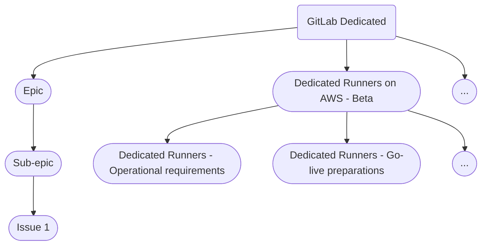

## Mission

The GitLab Dedicated team's mission is to create a fully managed, single-tenant GitLab environment, served through a GitLab Dedicated platform. It is developed to remove any manual interactions with customer tenant installations, and to ensure that the customer tenants are fully focused on unlocking the power of The One DevOps Platform.

## Vision

The GitLab Dedicated group is a customer facing team, with team members focused on a high level of infrastructure automation, and enabling customer interactions with the GitLab Dedicated platform.

Team mission is to:

- Develop a 100% automated system for provisioning a large number of single tenant GitLab sites
- Automate maintenance tasks without human interaction for the said sites
- Create and manage central observability stack, as well as observability stack per customer tenant
- Create customer portal (Switchboard), exposing administrative operations to customer tenants

## GitLab Dedicated Architecture

For GitLab Dedicated Architecture documentation please refer to the [Architecture Page](architecture/index.html)

## Performance Indicators

Team performance indicators are not fully defined. We are going to consider a **Provisioning SLO** to start with, possibly followed by [DORA 4 metrics](https://cloud.google.com/blog/products/devops-sre/using-the-four-keys-to-measure-your-devops-performance).

## Team Members

Engineering team members of GitLab Dedicated are publicly referenced with specialty for `Environment Automation`, `Switchboard` or `US Public Sector Services` team, based on their primary task.

The following people are members of the Dedicated:Environment Automation Team:



The following people are members of the Dedicated:US Public Sector Services Team:



The following people are members of the Dedicated:Switchboard Team:



## Working with us

To engage with the GitLab Dedicated teams:

- [Create an issue](https://gitlab.com/gitlab-com/gl-infra/gitlab-dedicated/team/-/issues/new) in the GitLab Dedicated team issue tracker (**Note** The issue tracker will be made public after [work in epic 33 "Considerations for making Dedicated projects public"](https://gitlab.com/groups/gitlab-com/gl-infra/gitlab-dedicated/-/epics/33) is completed)
  - For feature requests, use the [feature_requests issue template](https://gitlab.com/gitlab-com/gl-infra/gitlab-dedicated/team/-/blob/main/.gitlab/issue_templates/feature_request.md) and fill in the required information
- When creating an issue, it is not necessary to `@`mention anyone
- In case you want to get attention, use a specific team handle as defined in [group hierarchy below](#gitlab-group-hierarchy)
- Slack channels
  - For GitLab Dedicated specific questions, you can find us in [#f_gitlab_dedicated](https://gitlab.slack.com/archives/C01S0QNSYJ2)
  - The `@dedicated-envauto-team` Slack group can be used in any internal channel to tag the Environment Automation team.
  - Engineering teams have their own work channels for team work discussions:
      - [#g_dedicated-team](https://gitlab.slack.com/archives/C025LECQY0M)
      - [#g_dedicated-switchboard-team](https://gitlab.slack.com/archives/C04DG7DR1LG)
      - [#g_dedicated-us-pubsec](https://gitlab.slack.com/archives/C03R5837WCV)
  - Our [social channel](https://gitlab.slack.com/archives/C03QBGQ3K5W) is accessible to everyone who wants to casually interact with the team

### Handling Configuration Changes for Tenant Environments

Customers require the ability to customize the configuration of their Dedicated instance before they are able to use it in a production setting.
These customizations involve configuration changes to [functionality already supported in Dedicated](https://docs.gitlab.com/ee/subscriptions/gitlab_dedicated/#available-features) including infra-level settings like IP Allowlists and AWS PrivateLink configuration as well as GitLab application settings that cannot currently be self-served through the admin UI like SAML configuration changes.

To request functionality that is not currently supported within Dedicated, customers must open a feature request using the [feature request issue template](https://gitlab.com/gitlab-com/gl-infra/gitlab-dedicated/team/-/blob/main/.gitlab/issue_templates/feature_request.md). To request functionality for the broader GitLab Application, customers can use the [feature proposal](https://gitlab.com/gitlab-org/gitlab/-/blob/master/.gitlab/issue_templates/Feature%20Proposal%20-%20lean.md) template.

While in the long term, customer admins will be able to self-serve configuration changes via the Switchboard customer portal, in the short term, SREs will need to make the change and deploy it to the customer's environment. This process is documented below.

- During Onboarding (pre instance handover)
  - We will make one SRE available to support a new customer as they are onboarding to the platform. The SRE will be available one week prior to the onboarding date (ie the `start date` specified in the customer contract) and make any needed configuration changes to the environment.
  - To request a configuration change during onboarding, customers can open a new issue in their shared collaboration project. The PM will take the customer request, create an issue within the Dedicated team project, assign the labels per project workflow, and `@` mention the SRE in question. The SRE will assign the issue to themselves and perform the change.
  - Note, config changes during onboarding cannot be escalated to the Dedicated team as this is still before the contractual start date. See below for more information on our [escalation policy](#escalation-policy).
- Post-instance handover
  - Any configuration changes needed after the `start date` will be batched and handled in the next available weekly maintenance window. The cut off to get changes in is 2 business days before the maintenance window begins.
  - We cannot make any guarantees that a config change will make it into a specific maintenance window. In cases where there is a large amount of work that may stretch beyond the 4 hour maintenance window, configuration changes may be pushed out to the following window. In such cases, this will be communicated on the request issue.
  - To request a configuration change after the initial onboarding, customers must create a support ticket. The assigned support engineer will then open a new issue in the Dedicated issue tracker with the request. The requester must ensure there is link to the ZD ticket in the internal issue for change control purposes. The SRE tasked with performing the next round of maintenance for this customer will reply on the issue with a rough ETA and again once the change has been deployed. If this is a change that requires development work, the SRE will raise to PM/EM.
  - Post-onboarding, escalating a config change requests is only possible for configuration that ensures that the tenant instance is online. "Business as usual" changes can only be scheduled well in advance using the customer Project Plan provided during onboarding. See more details about our escalation policy below.

#### Production Change Lock (PCL)

While changes we make are rigorously tested and carefully deployed,
it is a good practice to temporarily halt production changes during certain events such as GitLab Summit,
major global holidays,
and other times where GitLab Team Member availability is substantially reduced.

Risks of making a production environment change during these periods includes immediate customer impact and/or reduced engineering team availability in case an incident occurs.
Therefore, we have introduced a mechanism called Production Change Lock (PCL) to GitLab Dedicated.

The GitLab Dedicated Production Change Lock is greatly inspired by the [PCL](https://about.gitlab.com/handbook/engineering/infrastructure/change-management/#production-change-lock-pcl) for GitLab.com,
but there are some differences worth noting.

A PCL is manually enforced once the following requirements are met:
1. A PCL [issue](https://gitlab.com/gitlab-com/gl-infra/gitlab-dedicated/team/-/issues/3946) describing the PCL period is created.
2. An MR updating the scheduled PCLs table is approved by the SaaS Platforms Engineering Director
3. Customer changes via Switchboard are prevented for the duration of the PCL.

The following dates are currently scheduled PCLs.

| Dates                       | Type       | Reason                        |
|-----------------------------|------------|-------------------------------|
| 2024-03-08 23:00 UTC -> 2024-03-17 20:00 UTC | Hard | GitLab Summit (Low team members availability) |

Times for the dates without a time specified begin at 09:00 UTC and end the next day at 09:00 UTC.

As opposed to GitLab.com [PCL](https://about.gitlab.com/handbook/engineering/infrastructure/change-management/#production-change-lock-pcl), for GitLab Dedicated we only consider a Hard PCL type.

##### Hard PCL

Hard PCLs include all code deploys and infrastructure changes, including automated maintenance in UAT, Preprod and Production environments, and customer changes via Switchboard. New customers will not be onboarded during Hard PCLs.

In case of an active S1/S2 incident, it is at the EOC (Engineer on Call) discretion to make the decision to apply the changes necessary to mitigate or resolve the incident in order to keep service availability.
Any action during an incident while in a PCL must be associated to an issue and the EOC should inform the GitLab Dedicated engineering Leadership about the action taken.

Changes not associated to any incident must have an exemption approval by the GitLab Dedicated engineering Leadership.

### Escalation Policy

When it comes to escalating customer support issues, we follow the same definitions of severity as [provided by support](https://about.gitlab.com/support/definitions/#definitions-of-support-impact) since Dedicated customers receive priority support. Only in cases where there is an [availability or security sev-1](/handbook/engineering/infrastructure/engineering-productivity/issue-triage/#severity) event it can be escalated to Sev-1 at the Support level. 'Business as usual' configuration changes cannot be escalated to sev-1. In sev-1 cases we will involve our on-call, as these incidents may affect our Availability SLA commitments to the customer. Sev-2 and below will be handled by the team during normal business hours. Any fixes identified as part of a support ticket that must go out immediately will be considered "emergency maintenance" and can be done outside the normal maintenance window. All other fixes will be done during the next available maintenance window.

### Requesting access to logs

GitLab Dedicated comes with strict [access controls for tenant environments](https://docs.gitlab.com/ee/subscriptions/gitlab_dedicated/#access-controls).
By default, GitLab Dedicated logs are only accessible by members of the GitLab
Dedicated and Support Engineering teams. In cases where GitLab Dedicated
customers are impacted by issues that require additional team members to review
logs, access can be granted on a case-by-case basis. Examples include, but are
not limited to: Backend Engineers or Security Engineers in other departments.

Access will only be provided to:

1. Individual team members
1. For a defined period of time (default: 2 work weeks)
1. All access requests require approval by the Dedicated Team Engineering Manager or Director and the direct manager of the requesting team member
1. Extensions will need to be approved by the Dedicated Team Engineering Manager or Director and the direct manager of the requesting team member

To gain access, please create:
1. [access request](https://gitlab.com/gitlab-com/team-member-epics/access-requests/-/issues/new?issuable_template=Individual_Bulk_Access_Request). Use `GitLab Dedicated Logs (Production)` as the system.
1. An issue in the [GitLab Dedicated tracker](https://gitlab.com/gitlab-com/gl-infra/gitlab-dedicated/team/-/issues/new?issuable_template=log_access_rotation) using the `Log rotation access` template.

## Working across GitLab

### Communicating with GitLab Dedicated customers

If you need to urgently contact one or more GitLab Dedicated customers, engage the
[GitLab Dedicated Communications Manager On-Call (CMOC)](/handbook/support/workflows/dedicated_cmoc/).

Non-urgent communication should be handled through the customer's Customer Success Manager (CSM).

### Getting product fixes into GitLab Dedicated quicker

{}

This section should be moved into the GitLab Dedicated incident management process page when it
becomes available.
{}

Sometimes, a product fix is introduced to resolve a GitLab Dedicated incident or
[customer escalation](#escalation-policy). There can be a significant delay between when the
product fix is merged and when it is deployed to GitLab Dedicated environments due to our
[upgrade policy](https://docs.gitlab.com/ee/subscriptions/gitlab_dedicated/#upgrades).

In such cases, we should evaluate the impact of the delay and, if justified, use the
[backport request process](/handbook/engineering/releases/backports/) to request that the product
fix be backported to a GitLab version that can be deployed to GitLab Dedicated environments in an
acceptable timeframe.

## How we work

GitLab Dedicated is highly visible within GitLab and the broader market. It is also complex service offering. Consequently, the Dedicated team needs to manage its own work and stakeholder expectations - both external and internal. The following sections describe processes and tools that the team has adopted to work efficiently and effectively.

These processes matter because they provide a clear way to understand the state of the product and ongoing work as well as enable team members to fulfill their role.

A main goal in designing these processes is to make it possible for every team member working on any part of GitLab Dedicated to understand **why** their work matters and how it contributes to customer results.

It is critical that the following processes are understood by all team members and that we hold ourselves accountable.

### Meetings and Scheduled Calls

Our preference is to work asynchronously, within our project issue tracker as described in [the project management section](#project-management).

The team does have a set of regular synchronous calls:

- `Demo call` - This call is on the agenda once per week. During this call, team members show off their progress, and engage with other team members on topics related to GitLab Dedicated platform. Demo calls are supposed to be rough around the edges and unpolished. In fact, if the demo looks polished, we will discuss whether we are being ambitious enough with our goals
- `Team call` - During this call, we are sharing important information for team-members day-to-day, as well as project items requiring a sync discussion
- 1-1s between the Individual Contributors and Engineering Managers

Impromptu Zoom meetings for discussing GitLab Dedicated work between individuals are created as needed.
It is expected that these meetings are private streamed, or recorded(1*), and then uploaded to [GitLab Unfiltered playlist](https://www.youtube.com/playlist?list=PL05JrBw4t0KqC5FfUVPyndvLvTWifWbfB).
The outcome of the call is shared in a persistent location (Slack is not persistent). This is especially important as the team grows, because any decisions that are made in the early stage have will be questioned in the later stages when the team is larger.

`1*` Exceptions to the recording rule are: 1-1 calls, discussions around non-project work, and in cases where parties do not feel comfortable with recording. However, even with the exceptions, outcome of project related discussions need to be logged in a persistent location, such as the main issue tracker.

### GitLab Group Hierarchy

We use [GitLab Groups](https://docs.gitlab.com/ee/user/group/#groups) to logically organize team-members working on GitLab Dedicated projects.
The groups cover the following use-cases:

1. GitLab Dedicated group membership: `@gitlab-dedicated`
    - All permanent team-members in any of the GitLab Dedicated teams gain access to this GitLab group as part of onboarding
    - Group mention should only be used in circumstances where the information shared is pertinent for all team members of the GitLab Dedicated group
1. Individual team group membership: `@gitlab-dedicated/environment-automation`, `@gitlab-dedicated/switchboard`, `@gitlab-dedicated/uspubsec`, etc.
    - All permanent team-members of individual teams gain access to their respective GitLab group as part of onboarding
    - Group mention should be used when the information shared is pertinent to the respective team
1. Individual team GitLab Dedicated groups have two additional subgroups `maintainers` and `reviewers`, e.g.: `@gitlab-dedicated/switchboard/maintainers`
    - `reviewers` GitLab group access is granted to permanent team-members, external contractors, team-members on borrow and similar. This GitLab group type is used to distinguish users without merge rights. Initial reviews should be requested from this group, using the quick action, e.g. `/assign_reviewer @gitlab-dedicated/switchboard/reviewers`
    - `maintainers` GitLab group is granted to permanent team-members only. This group has merge rights, and the group is granted access through [CODEOWNERS approval rules](https://docs.gitlab.com/ee/user/project/codeowners/#code-owners). Team members onboard into the `maintainer` subgroup after meeting the requirements defined in the [Dedicated Maintainer Training](https://gitlab.com/gitlab-com/gl-infra/gitlab-dedicated/team/-/blob/main/.gitlab/issue_templates/maintainer_training.md)(internal only)

### Project Management

We use epics, issues, and issue/epic boards to organize our work, as they complement each other.

The single source of truth for _all_ GitLab Dedicated work across different functions is the top-level [GitLab Dedicated epic](https://gitlab.com/groups/gitlab-com/gl-infra/-/epics/479).

The [GitLab Dedicated epic](https://gitlab.com/groups/gitlab-com/gl-infra/-/epics/479) contains a section that tracks the status all ongoing work. The tracker also references cross-functional initiatives that happen outside of R&D.

#### Epic Hierarchy

_The GitLab Dedicated - Limited Availability milestone is completed. The [sub-epic](https://gitlab.com/groups/gitlab-com/gl-infra/-/epics/484) contains all the work completed during Limited Availability._

The [GitLab Dedicated epic](https://gitlab.com/groups/gitlab-com/gl-infra/-/epics/479) contains all of the work that is currently in-progress.

We use sub-epics to break larger epics into smaller portions. These sub-epics are also mentioned in the [GitLab Dedicated Roadmap](https://about.gitlab.com/direction/saas-platforms/dedicated/#roadmap) (i.e. Advanced Search epic).

1. Sub-epics group tasks required to deliver an item mentioned
1. Sub-epics represent an item from the roadmap and are delivered in a specific phase
1. Sub-epics can span multiple months, but their end date should match the 'anticipated completion date' of the roadmap phase they are added to.

The diagram below shows an example of traversing the complete hierarchy:

*Note* If you are not seeing the diagram, make sure that you have accepted all cookies.

#### Epic Owners

Each epic has a single DRI who is responsible for delivering the project. DRIs for each epic are listed at the top of the description of each epic per Epic Structure. Epic DRI responsibilities are in [https://about.gitlab.com/handbook/engineering/infrastructure/team/gitlab-dedicated/#epic-owner-responsibilities](/handbook/engineering/infrastructure/team/gitlab-dedicated/#epic-ownership)

1. Engineering epic DRIs can be found within children epics of [GitLab Dedicated epic](https://gitlab.com/groups/gitlab-com/gl-infra/-/epics/479).

#### Epic Owner Responsibilities

The DRI needs to:

1. Work with others to move issues through the boards
1. Ensure epic meets criteria outlined in [Epic Structure](/handbook/engineering/infrastructure/team/gitlab-dedicated/#epic-structure)
1. Provide updates on DRI's epic in epic description according to process outlined in [Status Update Process](/handbook/engineering/infrastructure/team/gitlab-dedicated/#Status-Update-Process) below.
1. Follow process in [epic roadmap](#epic-roadmap) if epic extends beyond its planned phase.

#### Epic structure

Each epic and child sub-epics must include the following:

**Description** (TBD make epic template)

1. **DRI** who is responsible for this epic.
1. **Background**, including a problem statement, to provide context for people looking to understand the epic.
1. **Exit criteria** for the specific goals of the epic.
1. **Status yyyy-mm-dd** should be the final heading in the description.
    1. This enables others who are interested in the epic to see the latest status without having to read through all comments or issues attached to the epic.
    1. This heading is used to auto-generate the status information on the top-level epic.

**Epic meta data**

1. **Start date** is set to the expected start date, and updated to be the actual start date when the project begins.
1. **Due date** is set to be the expected end date.
    1. The due date is set based on [the Roadmap to exit Limited Availability](https://about.gitlab.com/direction/saas-platforms/dedicated/#limited-availability-roadmap)
    1. The date that a project actually ended is taken from the date that the epic was closed.

Labels are described in the [epic label section](#epic-labels).

#### Epic boards

Epic boards are used to track the overall status of epics. We use the following epic boards:

1. TBD All epics labeled `team::Environment Automation` with lanes set to scoped `worfklow-infra` labels
   1. This board allows a complete overview of the entire epic backlog
1. TBD All epics labeled `team::Environment Automation` with lanes set to scoped `Dedicated LA::phase*` labels
   1. This board is a visualization of the [the Roadmap to exit Limited Availability](https://about.gitlab.com/direction/saas-platforms/dedicated/#limited-availability-roadmap)
1. TBD All epics `team::Environment Automation` and `workflow-infra::in progress` with lanes set to scoped `health` labels
   1. This board highlights any risks with work in progress items.

#### Epic roadmap

All epics and sub-epics are set with due dates according to the [the Roadmap to exit Limited Availability](https://about.gitlab.com/direction/saas-platforms/dedicated/#limited-availability-roadmap).

Limited Availability phases end and are closed on the release day of each phase's corresponding month.

Process to close phases:

1. After the release day of each month [Product and Engineering DRIs](/handbook/company/working-groups/gitlab-dedicated/#dedicated-team-dris) work with [Epic DRIs](#epic-owners) to determine any roadmap changes if an epic extends beyond the epic's planned phase from [Limited Availability roadmap](https://about.gitlab.com/direction/saas-platforms/dedicated/#limited-availability-roadmap). For still-open epics:
    1. First try and close the epic, ideally by descoping the epic and creating a new epic or issue containing descoped work. Descoped work will be slotted into a future phase.
    1. If descoping is not possible, then the entire epic should be shifted to a future phase. In this case, the epic should show in every phase of [Limited Availability roadmap](https://about.gitlab.com/direction/saas-platforms/dedicated/#limited-availability-roadmap) that the epic was worked on. See Establish Availablility Targets in [Phase 1, 2, and 3](https://gitlab.com/gitlab-com/www-gitlab-com/-/blob/a40d70a58c2247a160270703fe6953fbb9fd1244/source/direction/saas-platforms/dedicated/index.html.md#environment-automation) as an example.
1. [PM and EM](/handbook/company/working-groups/gitlab-dedicated/#dedicated-team-dris) then determine roadmap adjustments so that planned work in future phases remains realistic after shifting open work.
1. Roadmap changes are shared in the next weekly engineering/product sync as part of [status update process](#status-update-process).

### Issue boards

Issue boards, such as [Beta Development board](https://gitlab.com/groups/gitlab-com/gl-infra/gitlab-dedicated/-/boards/2874746?label_name[]=Launch%3A%3ABeta) track the progress of all ongoing work.

On this single board, the goal is to get issues from `workflow-infra::Triage` into the `workflow-infra::Done` state, within a product [launch milestone](#launch-milestone-labels). Each of the workflow labels have a special meaning described in [the workflow labels](#workflow-labels) section.

### Status Updates

The status for all work relating to GitLab Dedicated is maintained in the description of the top-level [GitLab Dedicated epic](https://gitlab.com/groups/gitlab-com/gl-infra/-/epics/479) so that it is visible at a glance.

#### Status Update Process

Both Engineering Cross-Functional DRIs should provide weekly updates for the DRI's epics according to following process, which allows alignment with [Project Management in SaaS Platforms](https://handbook.gitlab.com/handbook/engineering/infrastructure/platforms/project-management/#project-management-in-saas-platforms):

1. **By Wednesday at 21:00 UTC** the DRI for a project is expected to update the status block in the epic description to:
    1. Format for weekly update: **Date of Update** (YYYY-MM-DD)
    1. Brief update for each of these three areas:
        1. Indicate any project blockers.
        1. Briefly highlight progress since the last update.
        1. Indicate planned next steps, or mitigations required to progress. This enables other engineers and other managers to have good information about projects in an asynchronous fashion.
    1. If the DRI for a sub-epic is different than the epic DRI, the epic DRI is responsible for getting updates from the sub-epic DRI.
    1. **Update Workflow and Health label** - After each status update, the Workflow label and Health label should be updated. See [Epic labels criteria](/handbook/engineering/infrastructure/team/gitlab-dedicated/#workflow-labels)

1. **Top-Level Epic Status Update** [automation synthesizes updates from status section](/handbook/engineering/infrastructure/team/gitlab-dedicated/#status-update-automation) from description of active epics to provide initiative status in the status section in the description of the top-level initiative Epic.

1. **Weekly engineering/product sync at 16:30 UTC on Mondays** Dedicated engineering/product meeting is used to discuss status updates and potential mitigations as necessary.
    - [After the release day of each month](#epic-roadmap), a summary of the most recently completed phase and any roadmap changes is shared.

1. Status updates will be incorporated into initiative status updates and any initiative reporting in the following week.

#### Status Update Automation

Status updates are auto-generated and added to description of [GitLab Dedicated top-level epic](https://gitlab.com/groups/gitlab-com/gl-infra/-/epics/479) using a bot running [the epic issues summary project](https://gitlab.com/gitlab-com/gl-infra/epic-issue-summaries).

If no update has been provided in an epic or issue for over a week, the issue will automatically receive workflow-infra::stalled label. Engineering managers are responsible for reviewing the status of the issue and helping it move along.

#### Reporting

We provide reports on status of GitLab Dedicated to meet [Top Cross-Functional Initiative requirements](/handbook/company/top-cross-functional-initiatives/#cross-functional-initiative-dris).

### Backlog Refinement

Prior to the start of a new quarter, the team will spend time refining the Epic backlog. This process will be led by the EM + PM, who will go through the Epics targeted for the upcoming quarter (according to the [roadmap](https://about.gitlab.com/direction/saas-platforms/dedicated/#roadmap)) and ensure each Epic contains the following information (pulling in different stakeholders to help fill in the details as necessary):

- MVC Scope
- Business Case / Rationale
- Link to high-level design
- Estimated level of complexity

While the above information is being added, the Epic will move from  to .  Once the information has been finalized, the Epic will move to .

Having this set of refined epics will help us plan for the upcoming quarter and allow engineers to quickly get started on an Epic once it's ready to be picked up during the quarter.

### Merge Requests

GitLab Dedicated team respects the Company principle of [everything starting with a merge request](/handbook/communication/#start-with-a-merge-request).

1. All Merge Requests (MRs) must go through the review process.
1. It is expected that MR author assigns reviewers once the MR is ready to go.
1. Reviewers should review the change and leave comments with questions or suggestions. Please follow the [merge request reviewer guidelines](/handbook/engineering/infrastructure/team/gitlab-dedicated/#merge-request-reviewers) and the [resolving threads guidelines](/handbook/engineering/infrastructure/team/gitlab-dedicated/#resolving-threads-on-a-merge-request) documented below.

The MR approval rule settings for all projects should be:

1. `Prevent approval by author` On ✔️
1. `Prevent approvals by users who add commits` On ✔️
1. `Prevent editing approval rules in merge requests` Off ❌ for emergencies allowing us to act in good faith when absolutely necessary
1. `Remove all approvals when commits are added to the source branch` Off ❌

#### Priorities

We are prioritising reviewing documentation merge requests above all other ones, until further notice. Every merge request documenting acquired knowledge (or concluded discussion) has an impact beyond only the people working on the project directly. In the early stages of building the product, many stakeholders have a need to find actual information quickly, and that means that every line documented increases efficiency of people working on the project as well as people contributing to the project indirectly as we enable more direct self-service.

#### Failed pipeline on the default branch

Having a passing pipeline (green build) on the default branch is very important. Failed pipeline (red build) causes delays in all MR's in progress targeting the default branch, and more importantly, it can cause significant regressions if new MR's are merged into it.

When a red build in the default branch is detected, the first course of action is to **revert** the MR that introduced failures. Reverting should be done **even if it is more work**. A couple of answers to the question "why?":

1. Ensuring that the build is green unblocks all other work in progress.
1. Reverts are safe and quick to do in most cases, and revert leaves a trail in project history. This makes future tracking simpler.
1. When fixing the problem that caused the red build, reviewing the fix in the context of the original change is easier for any reviewer.
1. It is not uncommon for a quick-fix to introduce more issues, thus creating a chain of quick-fixes that are hard to track in the context of the original change.
1. Fixing the problem that caused the red build is less stressful when other team members are not depending on the fix being available.

#### Merge request reviewers

GitLab Dedicated follows the same pattern for author/reviewer assignment as the standard GitLab practice, documented in the [Code Review Guidelines documentation](https://docs.gitlab.com/ee/development/code_review.html#dogfooding-the-reviewers-feature).

The process can be summarized as:

1. The MR author will assign a reviewer and a maintainer to an MR that is ready for review.
     - Check that pipelines are passing before requesting reviews.
     - The MR author can choose who to assign for review. To spread workload and knowledge it is recommended to use the [Environment Automation Reviewer Roulette](https://gitlab-org.gitlab.io/gitlab-roulette/?currentProject=environment-automation).
     - Unless otherwise explicitly noted in the MR description itself, Maintainers are expected to also merge the MR they just approved for efficiency. Add **This MR should be approved by all approvers, last approver should merge.** as the first line in MR description to state the intention clearly.
     - If the change is a significant one, considering mentioning the appropriate group such as `@gitlab-dedicated/environment-automation` or `@gitlab-dedicated/switchboard` in the MR description to help with knowledge sharing.
2. Reviewers will review the MR and leave comments with questions or comments.
    - To help us keep projects moving, please respond to review requests within one working day, and aim to complete the review within two working days.
    - If a reviewer is unable to meet the timelines, or has too many other review requests it's ok to ask someone else to take on the review.

#### Resolving threads on a merge-request

As the merge request author, please don’t mark discussions resolved until the reviewer has had a chance to respond. In general, if the reviewer has not yet approved the MR, and the thread is non-trivial, don’t mark their comments as resolved, let the reviewer review your response and resolve accordingly during the next round of view. If they have approved the MR, but comments remain unresolved, it's generally fine to resolve comments before merging.

#### Maintainer training

New Dedicated team members work with their manager to decide when to begin Maintainer training. Usually this will be around the third month in the team.

A [Maintainer training issue](https://gitlab.com/gitlab-com/gl-infra/gitlab-dedicated/team/-/issues/new?issuable_template=maintainer_training) will be created using the `maintainer_training` template and a training buddy will assigned to support the training.

After training is complete, the new Maintainer will be added to the Environment Automation Maintainers pool.

### Temporary workarounds

There are times when we are impacted by an upstream library bug. While waiting for the upstream library fix we need to apply a temporary workaround that fixes the bug or mitigates an incident.

To reduce the team's cognitive load on having to keep a mental record of all the applied temporary workarounds, we use the following process to track temporary workarounds:

1. Open an issue explaining the workaround and to which tenant instances it was applied. Apply the label `workaround::active` to the issue
1. If there's a long-term fix issue already created, apply the label `corrective action` and link it to the workaround issue
1. Add a comment in the code describing the workaround and a link to the follow-up issue. e.g. [workaround on pyyaml bug](https://gitlab.com/gitlab-com/gl-infra/gitlab-dedicated/instrumentor/-/merge_requests/1873/diffs)
1. If the temporary workaround involves running scripts by the SRE during maintenance windows, we add the actions in the triage-ops' [tooling-upgrade-toil](https://gitlab.com/gitlab-com/gl-infra/triage-ops/-/blob/master/policies/gitlab-dedicated/tooling-upgrade-toil.yml#L55) policy

### Labels

Commonly used labels are:

1. The team label, `team::Environment Automation`.
1. Scoped `workflow-infra` labels.
1. Scoped `component` labels.
1. Scoped `cloud-provider` labels.
1. Scoped `workaround` labels.

The `team::Environment Automation` label is used in order to allow for easier filtering of issues applicable to the team that have group level labels applied.

#### Epics labels

Epics and child epics should contain the following labels:

1. A scoped label indicating the phase of the roadmap in which the epic is scheduled to be delivered epic e.g. `Dedicated LA::Phase2`
1. A scoped `workflow-infra` label
1. All relevant GitLab Dedicated team labels
1. If the epic is labeled `workflow-infra::in progress`, then a health status label should be applied. (`health::on track`, `health::needs attention`, `health:at risk` by the epic DRI. This label is regularly updated as part of status updates.)

#### Workflow labels

We leverage scoped workflow labels to track different stages of work.

In general, we want to see issues move from `workflow-infra::Triage` to `workflow-infra::Ready` stage to indicate that the submitted issue will go through for implementation. Once the issue is marked with `workflow-infra::Ready`, we are ready to work on the issue until we get the issue marked with `workflow-infra::Done`.

The standard progression of workflow is from top to bottom in the table below:

| State Label | Description |
| ----------- | ----------- |
|  | Default label added to issues created. Issues with this label need to be confirmed as work we would consider. If we don't want to consider the issue further, we mark it with `workflow-infra::Cancelled` and close it. If this issue does not need Product validation, and we are ready for implementation, issue is moved to `workflow-infra::Ready`. Otherwise, we move it to the next stage `workflow-infra::Proposal`. |
|  | In this stage, proposal is being created and put forward for review with the rest of the team. Issues in this stage are also a part of Product validation workflow. If there are no further questions or blockers, the issue can be moved into "workflow-infra::Ready". |
|  | The issue is waiting to be picked up for work. |
|  | Issue is assigned to a DRI and work has started. |
|  | Issue is updated with the outcome of the work that was done, and this label is applied and issue closed. |

There are three other workflow labels of importance:

| State Label | Description |
| ----------- | ----------- |
|  | Work in the issue is being abandoned due to external factors or decision to not resolve the issue. After applying this label, issue will be closed. |
|  | If no update has been provided in an issue for over a week, the issue will get this label. The team Engineering Manager is responsible for reviewing the status of the issue and helping it move along. |
|  | Work is blocked due external dependencies or other external factors. Where possible, a [blocking issue](https://docs.gitlab.com/ee/user/project/issues/related_issues.html) should also be set. After applying this label, issue will be regularly triaged by the team until the label can be removed. |

#### Support labels

Scoped support labels are applied to the issues that are opened when a GitLab Support Engineer escalates a ticket for assistance via the ["request for help"](/handbook/support/workflows/how-to-get-help.html#how-to-use-gitlabcom-to-formally-request-help-from-the-gitlab-development-team) process. These requests are reviewed periodically by members of the GitLab Support team. The purpose of this review is to identify whether a request could have been deflected. These reviews primarily lead to updates to the [GitLab Dedicated Support workflows](/handbook/support/workflows/index/#gitlab-dedicated).

| State Label | Description |
| ----------- | ----------- |
| `support::toreview` | The `support::toreview` label is applied by default to issues created by Support Engineers [formally seeking assistance](/handbook/support/workflows/how-to-get-help.html#how-to-use-gitlabcom-to-formally-request-help-from-the-gitlab-development-team) on behalf of a customer in a ticket. |
| `support::reviewed` | The `support::reviewed` label is applied when these issues have been reviewed and the review did not directly result in an issue or MR. |
| `support::reviewed-and-improvement-made` | The `support::reviewed-and-improvement-made` label is applied when an improvement has been made based on a review. Improvements include opened issues or MRs. |

#### Component labels

To denote different types of components and services we are working with, we leverage `component::` scoped labels. By using these labels, we are able to track the distribution of work across different components which also allows us to change focus where needed. These labels are created on [the GitLab Dedicated group level](https://gitlab.com/groups/gitlab-com/gl-infra/gitlab-dedicated), since they are focused on work required specifically for GitLab Dedicated.

**NOTE** We do not use `Service::` labels given that service labels are used by GitLab SaaS related projects.

Component labels with their description can be found [by searching prioritized labels](https://gitlab.com/gitlab-com/gl-infra/gitlab-dedicated/team/-/labels?subscribed=&search=component).

#### Launch milestone labels

In order to make GitLab Issue board easier to use, we also applied `Launch::` scoped labels, denoting the Product launch milestones defined in [the project readme](https://gitlab.com/gitlab-com/gl-infra/gitlab-dedicated/team/-/blob/main/README.md#timeline). Launch labels indicate the intended milestone during which work can be executed (intention, not guarantee).

**Note:** After the [GitLab Dedicated GA announcement](https://about.gitlab.com/blog/2023/06/15/gitlab-dedicated-available/), the `Launch::` label is no longer useful and we are not using it anymore.

Valid options are one of:

1. `Launch::Beta` - Beta
1. `Launch::LA` - Limited Availability
1. `Launch::GA` - General Availability

These labels exist only because filtering by epic in GitLab issue boards does not include issues from sub-epics. We have an option of creating an epic board (listing all epics), or issue board per defined epic, but there is currently no way to centralise all issues within a parent epic's children epics.

#### Cloud Provider labels

These scoped labels are intended to distinguish generic work to everything made for a specific cloud provider.

| Cloud Provider Label | Description |
| ----------- | ----------- |
|  | Amazon Cloud specific implementation |
|  | Google Cloud specific implementation |

#### Workaround labels

Scoped workaround labels are intended to track temporary workarounds applied to GitLab Dedicated tenant instances that are supposed to be removed once a permanent fix is available. These labels need to be added to the follow-up issues that describe the implementation of the permanent fix.

| Workaround label | Description |
| ----------- | ----------- |
|  | This label is applied to issues describing workarounds applied to tenant instances |

### Resources

Resources used by the team to conduct work are described on the [Development Resources Page](https://gitlab.com/gitlab-com/gl-infra/gitlab-dedicated/team/-/blob/main/engineering/Dev-resources.md).

## History and trivia

- Name for [`Switchboard` customer portal](https://gitlab.com/gitlab-com/gl-infra/gitlab-dedicated/team/-/issues/7#note_591358260) was suggested by @marin after he spent a day trying to figure out which mixing console (Also known as a switchboard/soundboard) to get for amateur music making. He didn't buy anything, but the suggestion was accepted.
- Name for [`Amp` management cluster](https://gitlab.com/gitlab-com/gl-infra/gitlab-dedicated/team/-/issues/31#note_609710775) was suggested by @ccasella, as it is the instance that is "powering" supply of other instances.
- [Dedicated Group - Year in Review 2023](https://gitlab.com/gitlab-com/gl-infra/gitlab-dedicated/team/-/issues/3681)

