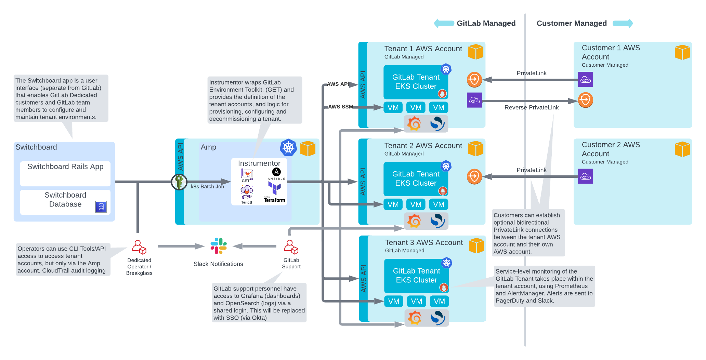
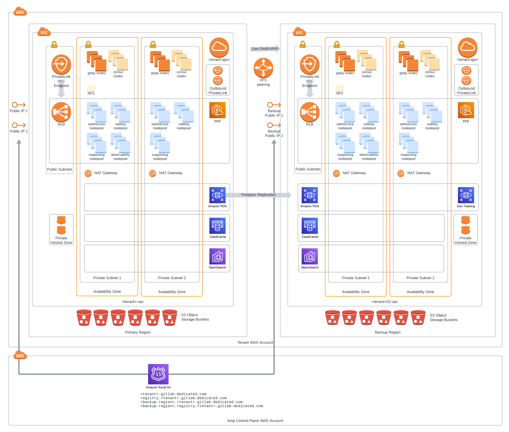
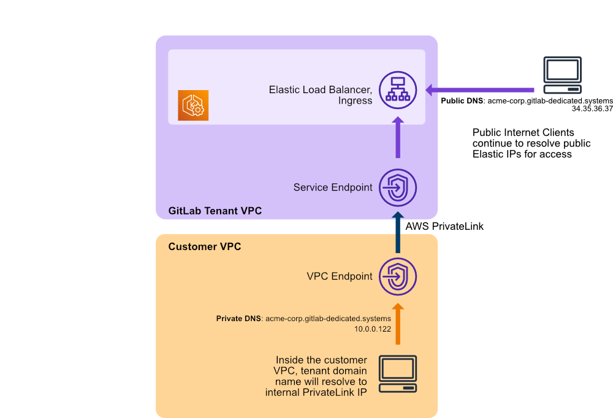

---

title: "GitLab Dedicated Architecture"
---

## Architecture

This page collects a set of architectural documents and diagrams for GitLab Dedicated.

## High level overview

## Tenant network

### Gitaly Setup

GitLab Dedicated deploys Gitaly [in a sharded setup](https://docs.gitlab.com/ee/administration/gitaly/#before-deploying-gitaly-cluster), not a Gitaly Cluster. In this setup:

- Customer repositories are spread across multiple virtual machines. 
- GitLab manages [storage weights](https://docs.gitlab.com/ee/administration/repository_storage_paths.html#configure-where-new-repositories-are-stored) on behalf of the customer.

### Geo Setup

GitLab Dedicated leverages GitLab Geo for [Disaster Recovery](https://docs.gitlab.com/ee/subscriptions/gitlab_dedicated/#disaster-recovery). 

Note: GitLab Geo is not an "active/active" system. To learn more about how GitLab Geo works, see [the solution overview page](https://about.gitlab.com/solutions/geo/).

### AWS PrivateLink connection

## Documents

- [From Dedicated to Cells: a Technical Analysis](from-dedicated-to-cells-technical-analysis.html)
