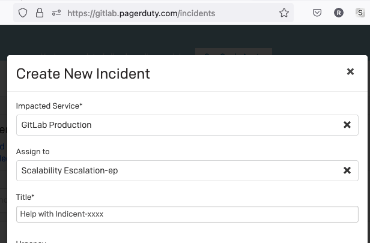
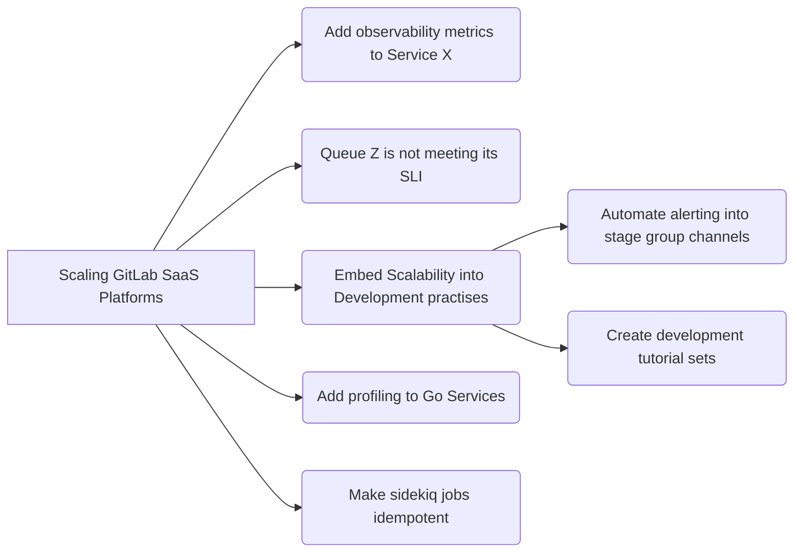

## Common Links
| | |
| --- | --- |
| **Workflow** | [Team workflow](/handbook/engineering/infrastructure/team/scalability/#how-we-work) |
| **GitLab.com** | `@gitlab-org/scalability` |
| **Issue Trackers** | [Scalability](https://gitlab.com/gitlab-com/gl-infra/scalability) |
| **Team Slack Channels** | [#g_scalability](https://gitlab.slack.com/archives/g_scalability) - Company facing channel   [#g_scalability-observability](https://gitlab.slack.com/archives/g_scalability-observability) - Team channel   [#g_scalability-practices](https://gitlab.slack.com/archives/g_scalability-practices) - Team channel  [#scalability_social](https://gitlab.slack.com/archives/scalability-social) - Group social channel |
| **Information Slack Channels** | [#infrastructure-lounge](https://gitlab.slack.com/archives/infrastructure-lounge) (Infrastructure Group Channel),  [#incident-management](https://gitlab.slack.com/archives/incident-management) (Incident Management),   [#alerts-general](https://gitlab.slack.com/archives/alerts-general) (SLO alerting),  [#mech_symp_alerts](https://gitlab.slack.com/archives/mech_symp_alerts) (Mechanical Sympathy Alerts) |

### Project Management Links

#### Group Level

1. [Scalability Epic Board](https://gitlab.com/groups/gitlab-com/gl-infra/-/epic_boards/39723?label_name[]=group%3A%3Ascalability)
1. [Scalability Issue Board](https://gitlab.com/groups/gitlab-com/gl-infra/-/boards/5797969?label_name[]=group%3A%3Ascalability)
1. [Scalability Issues not in an Epic](https://gitlab.com/groups/gitlab-com/gl-infra/-/boards/5798009?label_name[]=group%3A%3Ascalability&epic_id=None)
1. [Scalability Issues by Team](https://gitlab.com/groups/gitlab-com/gl-infra/-/boards/5797977?label_name[]=group%3A%3Ascalability)
1. [Scalability Issues by Team Member](https://gitlab.com/groups/gitlab-com/gl-infra/-/boards/5798021?label_name[]=group%3A%3Ascalability)

## Teams

The Scalability group is currently formed of two teams:
* [Scalability:Observability](./observability) and
* [Scalability:Practices](./practices).



### Scalability:Observability

The [Observability team](./observability) focuses on observability, forecasting & projection systems that enable development engineering to predict
system growth for their areas of responsibility.

The following people are members of the [Scalability:Observability team](./observability):



### Scalability:Practices

The [Practices team](./practices) focuses on tools and frameworks that enable the stage groups to support their features on our production systems.

The following people are members of the [Scalability:Practices team](./practices):



## Mission

The **Scalability group** is responsible for GitLab at scale, working on the highest priority scaling items related to our SaaS platforms.
We support other Engineering teams by sharing data and techniques so they can become better at scalability as well.

## Vision

As its name implies, the Scalability group enhances the **availability**, **reliability** and, **performance** of GitLab's SaaS platforms
by observing the application's capabilities to operate at scale.

The **Scalability group** analyzes application performance on GitLab's SaaS platforms,
recognizes bottlenecks in service availability, proposes (and develops) short term improvements
and develops long term plans that help drive the decisions of other Engineering teams.

Short term goals for the group include:

- Refine existing, define new, and document [Service Level Objectives](https://en.wikipedia.org/wiki/Service-level_objective)
for each of GitLab's services.
- Continuously expose the top 3 critical bottlenecks that threaten the stability of our SaaS platforms.
- Work on scoping, planning and defining the implementation steps of the top critical bottleneck.
- Define and track team KPI's to track impact on our SaaS platforms.
- Work on implementing user facing application features (such as API improvements) as a means to reduce pressure on our SaaS platforms generated by regular user interactions.

## Direction for FY24

We've moved the direction to the direction section [here](https://about.gitlab.com/direction/saas-platforms/scalability/) so that it's in the same place as the rest of our product direction.

## Indicators

The Infrastructure Department is concerned with the [availability](/handbook/engineering/infrastructure/performance-indicators/#gitlabcom-availability)
and [performance](/handbook/engineering/infrastructure/performance-indicators/#gitlab-com-performance) of GitLab's SaaS platforms.

GitLab.com's service level availability is visible on the [SLA Dashboard](https://dashboards.gitlab.com/d/general-slas/general-slas?orgId=1),
and we use the [General GitLab Dashboard](https://dashboards.gitlab.net/d/general-public-splashscreen/general-gitlab-dashboards)
in Grafana to observe the service level indicators (SLIs) of apdex, error ratios, requests per second, and saturation of the services.

These dashboards show lagging indicators for how the services have responded to the demand generated by the application.

Each team is responsible for separate indicators. For more information, please view the team pages linked above.

## Themes

The broad nature of work undertaken by the Scalability group can make prioritization challenging as it’s tricky to compare some issues like-for-like. For example, how do we compare the benefit of an issue to address a performance concern against an issue that reduces developer toil? To help guide the direction of the group and to inform our prioritization process, we can categorize issues in to the following _themes_, in order of priority:

1. **Critical Saturation Response**. On occasions saturation alerts can unexpectedly occur - for example, when caused by a sudden change in platform usage patterns - and need to be addressed with urgency. We try to avoid working reactively by proactively working on other themes.
1. **Horizontal Scalability**. The most obvious scaling bottlenecks in our infrastructure are those that can only be scaled *vertically* instead of *horizontally*. Horizontal scaling brings the benefit of *elasticity*, which increases confidence that we can meet future demand while keeping costs linear - both of these elements are strongly aligned with the vision of the Scalability group.
1. **Increasing Plaform Capacity**. Delivering foundational project work in the GitLab application and infrastructure to support service capacity needs for GitLab SaaS.
1. **Scalability Advocacy and Facilitation**. An effective method for the Scalability group to leverage its output is by collaborating closely with other engineering teams to promote scalability best practises. This might include building tools to enable wider engagement in GitLab SaaS operations (e.g. [Stage Dashboards](https://gitlab.com/groups/gitlab-com/gl-infra/-/epics/406)), or serving as a point of contact to other teams for scaling questions relating to their own initiatives.
1. **Eliminating Toil**. We want to make our output as efficient as possible by spending more time on engineering projects and less time on manual, repetitive, or automatable tasks. An effective way of achieving this is by considering how future toil can be avoid when delivering projects. However, inline with our Iteration value, we don’t want to over-optimize and we can't consider all eventualities ahead of time. We should always be mindful of opportunities to reduce toil, which will make us more effective in the long-term.

The above list is not comprehensive, nor does it outline a formal process. We should remain pragmatic when prioritizing work, while using the themes as a guideline.

### Job Families

The Scalability Group consists of a Senior Engineering Manager, Engineering Managers, Backend Engineers, and Site Reliability Engineers.

The Engineering Roles section of the handbook lists the responsbilies of these roles:
- [Engineering Manager](/job-families/engineering/infrastructure/engineering-management/#manager-engineering-scalability)
- [Backend Engineer](/job-families/engineering/backend-engineer) with [Scalability specialization](/job-families/engineering/backend-engineer/#scalability).
- [Site Reliability Engineer](/job-families/engineering/infrastructure/site-reliability-engineer/#levels-for-site-reliability-engineer) with [Scalability specialization](/job-families/engineering/infrastructure/site-reliability-engineer/#scalability).

## Working with us

### Emergency Escalation during S1/S2 incidents

Scalability leadership can be reached via PagerDuty [Scalability Escalation](https://gitlab.pagerduty.com/escalation_policies#PDJ160O).

From <a href="https://gitlab.pagerduty.com/incidents">https://gitlab.pagerduty.com/incidents</a>, click on the "New Incident" button and complete the new incident form as shown below.

### How do I engage with the Scalability Group?

1. Start with an issue in the Scalability tracker: [Create an issue](https://gitlab.com/gitlab-com/gl-infra/scalability/issues/new).
1. You are welcome to follow this up with a Slack message in [#g_scalability](https://gitlab.slack.com/archives/g_scalability).
1. Please don't add any `workflow` labels to the issue. The team will triage the issue and apply these.

Alternatively, mention us in the issue where you'd like our input.

When issues are sent out way, we will do our best to help or find a suitable owner to move the issue forward.
We may be a development team's first contact into the Infrastructure department and we endeavour to treat these
requests with care so that we can help to find an effective resolution for the issue.

#### Scalability review requests

If you're working on a feature that has specific scaling requirements, you
can create an issue with the [review request
template](https://gitlab.com/gitlab-com/gl-infra/scalability/-/issues/new?issuable_template=Review%20Request).
Some examples are:

1. [Review Request - Impact on database load for enabling advanced global search](https://gitlab.com/gitlab-com/gl-infra/scalability/-/issues/377)
1. [Review Request - Assumptions about build prerequisite-related application limits](https://gitlab.com/gitlab-com/gl-infra/scalability/-/issues/421)
1. [Review Request - Throttling for Cleanup Policies Scaling Request](https://gitlab.com/gitlab-com/gl-infra/scalability/-/issues/461)

This template gives the Scalability group the information we need to help you, and the issue will be shown on
our [build board](#issue-boards) with a high priority.

### How does the Scalability Group engage with Stage Groups?

When we observe a situation on GitLab.com that needs to be addressed alongside a stage group, we first raise an issue
in the Scalability issue tracker that describes what we are seeing. We try to determine if the problem lies with the action
the code is performing, or the way in which it is running on GitLab.com. For example, with queues and workers, we will see
if the problem is in what the queue does, or how the worker should run.

If we find that the problem is in what the code is doing, then we engage with the EM/PM of that group to find the right path
forward. If work is required from that group, we will create a new issue in the gitlab-org project and use the [Availability
and Performance Refinement process](/handbook/engineering/workflow/#process-1) to highlight this issue.

## How we work

### Handbook First

In line with the broader GitLab culture, we adopt a [Handbook First](https://handbook.gitlab.com/handbook/handbook-usage/#why-handbook-first) approach to documenting our team's workflow. Should you have any proposals aimed at enhancing our processes, please initiate a Merge Request (MR) to update the handbook. Assign the MR to `@rnienaber` for the Group level change and Scalability EMs for the respective team changes and tag the team in a comment to solicit feedback. If there are no objections within three working days of tagging the team, the MR will be deemed ready for merging. We adhere to the principle of making [two-way door decisions](https://handbook.gitlab.com/handbook/values/#make-two-way-door-decisions) meaning additional MRs can be created to suggest changes or removals of processes that are deemed inefficient.

### Communication

Everything is written in epics, issues, runbooks or the handbook.
Decisions or important information in Slack must be copied into a relevant location so that the information is persisted beyond the 90-day Slack retention policy.

#### Slack Channels and Guidelines

We communicate in public using the following channels:

1. [#g_scalability](https://gitlab.slack.com/archives/g_scalability) - Company facing channel where other team members can reach out to us. We also use this channel for highlighting work we have done.
1. [#g_scalability-observability](https://gitlab.slack.com/archives/g_scalability-observability) - Team channel where daily work information is shared and team coordination takes place.
1. [#g_scalability-practices](https://gitlab.slack.com/archives/g_scalability-practices) - Team channel where daily work information is shared and team coordination takes place.
1. [#scalability-social](https://gitlab.slack.com/archives/scalability-social) - Group social channel.

In the team channels, team members are encouraged to share what they are working and any blockers they may have.
The format is not fixed so that people share in a way that feels natural to them.

In addition to the channels above, we create a project channel per epic when appropriate.
A channel dedicated to a project helps to keep everything about the topic in one place and makes it easy to stay up to date on that topic.
It is useful for teams working across time zones or for getting back up to speed after being on leave.
The DRI for a project owns the project Slack channel.

#### Meetings and Scheduled Calls

We prefer to work asynchronously as far as possible but still use synchronous communication where it makes sense to do so.
Asynchronous communication is the best way to make sure everyone, regardless of timezone or availability, is included.

To keep people connected, team members are encouraged to schedule at least one coffee-chat with another team member each week.

#### Demo Calls

There is one demo call per week.
The time of the call differs each week to try to get people from different timezones to join different calls.
The purpose of this call is to showcase something that you have been working on during that week. It does not have to be perfect or polished.
These calls are a technical conversation and while we might land up with guidance on what we are working on, the purpose is not to make fixed decisions on this call.

Items should be added to the [agenda](https://docs.google.com/document/d/13TW4x3ofw0RxifZvZ7eNvrPxFnnXmhzQ8fal3fhYgjg/edit#) ahead of the meeting.
If there are no agenda items at that time, the call is cancelled for that week.

The call should be recorded and added to GitLab Unfiltered. Please use your discretion when choosing the visibility level as some screen shares contain private data. If you upload a private video, please add information in the description for why this visibility was chosen.
A [playlist of the recordings](https://www.youtube.com/playlist?list=PL05JrBw4t0Kphnnvtz9CDatQAVGs_q2Cv) is available on GitLab Unfiltered.

#### Communicating our work schedule to others

It is important that team-members know when we are available, so we keep our calendars updated.

1. We use the "working hours" settings in Google calendar.
1. We indicate "async only" periods if we need them during our working hours.
1. Our PTO tracker is linked to the group Google calendar using `gitlab.com_3puidsh74uhqdv9rkp3fj56af4@group.calendar.google.com` as an additional calendar in the Calendar Sync settings.
1. Any team members with on-call responsibilities should share their Pager Duty calendar with their manager.

### Impact

As a small team covering a wide domain, we need to make sure that
everything we do has sufficient impact. If we do something that only the
rest of the Scalability group knows about, we haven't 'shipped' anything.
Our 'users' in this context are the infrastructure itself, SREs, and
Development Engineers.

Impact could take the form of changes like:

1. Development practices that make it easier for our Development
   department to ship code that works well at scale.
2. Monitoring changes that mean we can detect and attribute problems sooner,
   particularly focusing on utilisation.
3. Code changes that reduce pressure on a part of our system that's
   feeling the strain.
4. Guides for Developers and SREs to work with a given service.

#### Announcing Impactful Items

In order to make others aware of the work we have done, we should advertise changes in the following locations:
1. Engineering Week-in-Review
1. Slack Channels
   1. For Backend Engineers
      1. `#development`
      1. `#eng-managers`
      1. `#dev_tip_of_the_day`
      1. `#development-guidelines`
   1. For SRE's
      1. `#infrastructure-lounge`
      1. `#infra-staff`

Documentation or tutorial videos should also be added to the [README.md](https://gitlab.com/gitlab-com/gl-infra/scalability/-/blob/master/README.md)
in our team repository.

### Project Management

We use Epics, Issues, and Issue Boards to organize our work, as they complement each other.

The single source of truth for all work is [Scaling GitLab SaaS Platforms epic](https://gitlab.com/groups/gitlab-com/gl-infra/-/epics/148).
This is considered as the top-level epic from which all other epics are derived.

Epics that are added as children to the top-level epic are used to describe projects that the team undertakes.

Having all projects at this level allows us to use a single list for prioritization and enables us to prioritize
work for different services alongside each other. Projects are prioritized in line with the OKRs for the current quarter.

Project status is maintained in the description of the top-level epic so that it is visible at a glance. This is auto-generated using [the epic issues summary project](https://gitlab.com/gitlab-com/gl-infra/epic-issue-summaries).
You can watch a [short demo of this process](https://youtu.be/6Wb1f-c1_og) to see how to use status labels
on the epics to make use of this automation.

Example organization is shown on the diagram below:

*Note* If you are not seeing the diagram, make sure that you accepted all cookies.

#### Project Ownership

Each project has an owner who is responsible for delivering the project.

The owner needs to:
1. Update the status block in the epic description each week.
1. Work with others to move project issues through the boards.

#### Project Structure

The epic for the project must have the following items:

1. **Background**, including a problem statement, to provide context for people looking to understand the project.
1. **Exit criteria** for the specific goals of the project.
    1. These are created as issues with the `exit criterion` label in the epic and are linked in the description.
    1. We create these at the start of the project to allow us to keep focused on our goal, and use [blocking issues](https://docs.gitlab.com/ee/user/project/issues/related_issues.html) to indicate the state of each exit criterion.
1. **Status yyyy-mm-dd** should be the final heading in the description.
    1. This enables others who are interested in the epic to see the latest status without having to read through all comments or issues attached to the epic.
    1. This heading is used to auto-generate the status information on the top-level epic.
    1. If the epic has no child-epics and a mermaid block is added, [this script](https://gitlab.com/gitlab-com/gl-infra/epic-issue-summaries/-/blob/master/epic_issue_relationships.rb) that runs on a pipeline will automatically generate and include an issue relationship diagram in this section. An example can be seem [in this epic](https://gitlab.com/groups/gitlab-com/gl-infra/-/epics/447).
1. **Start date** is set to the expected start date, and updated to be the actual start date when the project begins.
1. **Due date** is set to be the expected end date.
    1. This should be seen as a target, and this target is re-evaluated every few weeks while the project is in progress. The date that a project actually ended is taken from the date that the epic was closed.

### Issue boards

The Scalability group [issue boards](https://gitlab.com/gitlab-com/gl-infra/scalability/-/boards/) track
the progress of ongoing work.

On the **planning board**, the goal is to get issues into a state where we have enough information to build the issue.
However, not all issues that are `workflow-infra::Ready` to be built should be scheduled for development right away. Some
issues may be too big, or might not be as important as others. This means not all issues that are `workflow-infra::Ready` on the
planning board will move to the build board immediately.

Please see the [triage rotation section](#triage-rotation) for when to move issues between the boards.

| **Planning** | **Building**|
|--------------|-------------|
| [Planning Board](https://gitlab.com/gitlab-com/gl-infra/scalability/-/boards/1697168) | [Build Board](https://gitlab.com/gitlab-com/gl-infra/scalability/-/boards/1697160) |
| Issues where we are investigating the work to be done. | Issues that will be built next, or are actively in development. |
| 	    |         |

### Labels

The Scalability teams routinely uses the following set of labels:

1. The group label, `group::Scalability`.
2. The team labels, `team::Scalability-Observability` and `team::Scalability-Practices`
3. Scoped `workflow-infra` labels.
5. Scoped `Service` labels.

The `group::Scalability` label is used in order to allow for easier filtering of
issues applicable to the team that have group level labels applied.

#### Workflow labels

The Scalability teams leverage scoped workflow labels to track different stages of work.
They show the progression of work for each issue and allow us to remove blockers or change
focus more easily.

The standard progression of workflow is from top to bottom in the table below:

| State Label | Description |
| ----------- | ----------- |
|  | Problem is identified and effort is needed to determine the correct action or work required. |
|  | Proposal is created and put forward for review.  SRE looks for clarification and writes up a rough high-level execution plan if required. SRE highlights what they will check and along with soak/review time and developers can confirm.  If there are no further questions or blockers, the issue can be moved into "Ready". |
|  | Proposal is complete and the issue is waiting to be picked up for work. |
|  | Issue is assigned and work has started.  While in progress, the issue should be updated to include steps for verification that will be followed at a later stage.|
|  | Issue has an MR in review. |
|  | MR was merged and we are waiting to see the impact of the change to confirm that the initial problem is resolved. |
|  | Issue is updated with the latest graphs and measurements, this label is applied and issue can be closed. |

There are three other workflow labels of importance:

| State Label | Description |
| ----------- | ----------- |
|  | Work in the issue is being abandoned due to external factors or decision to not resolve the issue. After applying this label, issue will be closed. |
|  | Work is not abandoned but other work has higher priority. After applying this label, team Engineering Manager is mentioned in the issue to either change the priority or find more help. |
|  | Work is blocked due external dependencies or other external factors. Where possible, a [blocking issue](https://docs.gitlab.com/ee/user/project/issues/related_issues.html) should also be set. After applying this label, issue will be regularly triaged by the team until the label can be removed. |

#### Priority labels

The Scalability group has only one priority label: `Scalability::P1`.

Only issues of the utmost importance are given this label.

When an issue is given this label, a message should be pasted in the team's Slack channel so that an owner can be found as quickly as possible.

These issues should be picked up soon as possible after completing ongoing task unless directly communicated otherwise.

It is a scoped label as we previously had 4 levels of priority. We found that
[in practise we primarily used P4](https://gitlab.com/gitlab-com/gl-infra/scalability/-/issues/863), and used P1 to indicate the issues of greatest importance.

#### Labels in gitlab-org group

Stage groups use [type labels](/handbook/engineering/metrics/#data-classification) to label merge requests in projects in the `gitlab-org` group. The Scalability group is not a part of the stage groups, and labels of importance for the team are explained above. When submitting work in gitlab-org group, we apply ~"team::Scalability" and ~"type::maintenance" to merge requests by default. The latter label is describing work towards refinement of existing functionality which describes majority of the work the team is contributing.

### Triage rotation

We have automated triage policies defined in the [triage-ops project](https://gitlab.com/gitlab-com/gl-infra/triage-ops). These
perform tasks such as automatically labelling issues, asking the author to add labels, and creating weekly triage issues.

We rotate the triage ownership each month, with the current triage owner responsible for picking the next one (a
reminder is added to their last triage issue).

### Triaging issues

When issues arrive on our backlog, we should consider how they align with our vision, mission, and current OKRs.

We also determine which of the teams would be the more appropriate owner for that task.

We need to effectively triage these issues so that they can be handled appropriately. This means:
1. Critically assess the issue to understand the problem
1. Determine if this impacts .com or Self-Managed instances.
   1. If this primarily affects Self-Managed instances, the issue can usually be redirected to the [Application Performance group](/handbook/engineering/infrastructure/core-platform/data_stores/application_performance/).
1. If this is a scaling issue, assign it into our backlog using workflow labels and place it on the planning board if necessary.
1. If this is not a scaling issue, find the most appropriate owner in either Infrastructure or Development, or any other department.

When handing over an issue to the new owner, provide as much information as you can from your assessment of the issue.

### Engagement with Incidents

The Scalability team members often have specialized knowledge that is helpful in resolving incidents. Some team members are also SREs who are part of the on-call rota. We follow the guidelines below when contributing to incidents.

For an on-call SRE:
- follow the [ordinary incident management procedures for EOC](/handbook/engineering/infrastructure/incident-management/#engineer-on-call-eoc-responsibilities)
- at the end of your shift, if there are active incidents or corrective actions in progress, inform the EM who will help you to prioritize the remaining work

For an Incident Manager:
- follow the [ordinary incident management procedures for IM](/handbook/engineering/infrastructure/incident-management/#incident-manager-responsibilities)
- handover should occur as normal, but inform the EM if there are active incidents you are still working on

If you are not EOC or an Incident Manager when an incident occurs:
- For S1 incidents
   - the priority is to get GitLab.com up and running and getting back to a stable state takes priority over project work
   - when the system is stable, contribute to determining the root cause and writing up the corrective actions
   - the IM or Reliability EM will delegate corrective actions
   - work with the Scalability EM to prioritize any work that arises from an S1
- For all other incidents
   - if you are called into an incident, the priority is to enable others to resolve the problem
   - the expectation is to be hands-off, giving guidance where necessary, and returning to project work as soon as possible

The reason for this position is that our project work prevents future large S1 incidents from occurring.
If we try to participate in and resolve many incidents, our project work is delayed and the risk of future S1 incidents increases.

### Engagement with the Infradev Process

The [Infradev process](/handbook/engineering/workflow/#infradev) aims to highlight SaaS
availability and reliability improvements with the [Stage Groups](/handbook/product/categories/#devops-stages).

Where issues marked as `infradev` are found to be scaling problems, the `team::Scalability` label should be added.

Our commitment to this process, in line with the [team's vision](#vision), is to provide guidance and assistance to the stage groups who are responsible for resolving
these issues. We proactively assist them to determine how to resolve a problem, and then we contribute to reviewing
the changes that they make.

#### Weekly Issues

1. **`Service::Unknown` refinement** - go through issues marked `Service::Unknown` and add a defined service, where possible.
1. **Review request processing** - the goal is to move [review request](#scalability-review-requests) issues to `workflow-infra::In Progress`, either
   through picking them up directly, or asking on our team channel if any one else is able.

#### Monthly Issues

1. **Infradev review** - show issues with [`team::Scalability` and `infradev` labels](#engagement-with-the-infradev-process) so we can help the stage groups move those forward.

#### Quarterly Issues

Every quarter, we perform a review of all issues on the backlog that are not part of any project. When reviewing issues:
- if the issue is no longer relevant then it should be closed
- if it is relevant but we are unlikely to work on it soon it should remain open

The EM creates this issue each quarter. It is not the sole responsibility of the person on Triage Rotation and is shared among all team members.

## Choosing something to work on

We work from our main epic: [Scaling GitLab's SaaS Platforms](https://gitlab.com/groups/gitlab-com/gl-infra/-/epics/148).

Most of our work happens on the current in-progress sub epic. This is always prominently visible from the main
epic's description.

When choosing something new to work on you can either:
- Go to the [Build Board](https://gitlab.com/gitlab-com/gl-infra/scalability/-/boards/1697160) and pick from the `Ready` column.

or

- Go to the [Planning Board](https://gitlab.com/gitlab-com/gl-infra/scalability/-/boards/1697168) and try to advance issues
to the next appropriate column.

## Regarding Coding at Scale

Software development often happens on a single machine, with a single application version and almost no load.

This configuration is very different from what happens on GitLab.com and our customers' installations.

The problem _"at scale"_ comes from a different order of magnitude than the development and testing environments.
Things like the number of servers, the number of incoming requests, the number of rows on a table or
the number of application versions will make the difference between something that works on your computer and
something that works in production.

An extra challenge, almost unique to GitLab, is that we deploy from the main branch multiple times each day, but we have a monthly release cycle
and [zero downtime updates](https://docs.gitlab.com/ee/update/zero_downtime.html) is a requirement for both releases.

Overlooking the [compatibility with multiple versions of the application running at the same time](https://docs.gitlab.com/ee/development/multi_version_compatibility.html)
can induce a production incident.

You can find more detailed information in the links below. If this is not enough, please reach out to the
[delivery](/handbook/engineering/infrastructure/team/delivery/) or
[scalability](/handbook/engineering/infrastructure/team/scalability/) team.

1. [Expand and Contract pattern](https://docs.gitlab.com/ee/development/multi_version_compatibility.html)
2. [Zero Downtime Updates](https://docs.gitlab.com/ee/update/zero_downtime.html)
3. [Sidekiq Compatibility across Updates](https://docs.gitlab.com/ee/development/sidekiq_style_guide.html#sidekiq-compatibility-across-updates)
4. [Avoiding downtime in migrations](https://docs.gitlab.com/ee/development/database/avoiding_downtime_in_migrations.html)
5. [Uploads development documentation](https://docs.gitlab.com/ee/development/uploads.html)

## Team History

The Scalability team became a reality during [the fourth organizational iteration in the Infrastructure department](https://gitlab.com/gitlab-com/www-gitlab-com/-/merge_requests/28542) on 2019-08-22, although it only became a reality once [the first team member joined the team](https://gitlab.com/gitlab-com/www-gitlab-com/-/merge_requests/35882) on 2019-11-29.

Even though it might not look like it at first glance, the Scalability team has its origin connected to [the Delivery team](/handbook/engineering/infrastructure/team/delivery). Namely, the first two [backend engineers with Infrastructure specialisation](https://gitlab.com/gitlab-com/www-gitlab-com/-/merge_requests/18617) were a part of the Delivery team, a specialisation that previously did not fit into the organizational structure. They had a focus on reliability improvements for GitLab.com, often working [on features that had many scaling considerations](https://gitlab.com/gitlab-org/gitlab-foss/-/issues/62214). A milestone, that will prove to be a case for the Scalability team, was [Continuous Delivery on GitLab.com](https://gitlab.com/gitlab-com/gl-infra/delivery/-/issues/345).

Throughout July, August and September 2019, GitLab.com experienced a higher than normal amount of customer facing events. [Mirroring delays](https://gitlab.com/gitlab-com/gl-infra/production/-/issues/937), [slowdowns](https://gitlab.com/gitlab-com/gl-infra/production/-/issues/936), [vertical node scaling issues](https://gitlab.com/gitlab-com/gl-infra/production/-/issues/939) (to name a few) all contributed to general need to improve stability. This placed higher expectations on the Infrastructure department and with the organization at the time, this was harder to meet. To accelerate the timelines, ["infradev" and "rapid action"](https://gitlab.com/gitlab-com/www-gitlab-com/-/merge_requests/25458/) processes were created, as a connection point between Infrastructure and Development departments to help Product prioritise higher impact issues. This approach was starting to yield results, but the process was there as a reaction to an (ongoing) event with the focus on resolving that specific need.

[The background processing architectural proposal](https://gitlab.com/gitlab-com/gl-infra/infrastructure/-/issues/7219) clearly illustrated the need to stay ahead of the growing needs of the platform and approach the growth strategically as well as tactically. With a clear case and approvals in hand, [the team mission, vision, and goals were set](https://gitlab.com/gitlab-com/www-gitlab-com/-/merge_requests/29779) and the team buildout could commence. While that was in motion, we had another confirmation [through a performance retrospective](https://gitlab.com/gitlab-com/gl-infra/scalability/-/issues/64) that the need for the team is real.

As the team was taking shape, [the background processing architectural changes](https://gitlab.com/groups/gitlab-com/gl-infra/-/epics/96) were the first changes delivered by the team with a large impact on GitLab.com, with [many more incremental changes](https://gitlab.com/groups/gitlab-com/gl-infra/-/epics/148#white_check_mark-completed-work) throughout 2020 that followed. Measuring that impact reliably, and predicting the future challenges remains [one of the team focuses](https://gitlab.com/groups/gitlab-com/gl-infra/-/epics/296) at the time of the writing of this history summary.

The team impact overview is logged in issues:

1. [Year overview for 2020](https://gitlab.com/gitlab-com/gl-infra/scalability/-/issues/764)
1. [Year overview for 2021](https://gitlab.com/gitlab-com/gl-infra/scalability/-/issues/1473)
1. [Year overview for 2022](https://gitlab.com/gitlab-com/gl-infra/scalability/-/issues/2062)
1. [Year overview for 2023](https://gitlab.com/gitlab-com/gl-infra/scalability/-/issues/2665)
