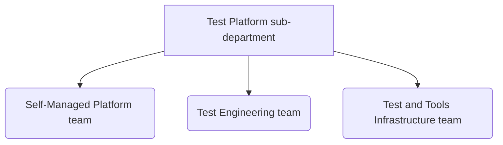

## Child Pages

[Bug Prioritization](/handbook/engineering/infrastructure/test-platform/bug-prioritization/)
{.h4}
[Quad Planning](/handbook/engineering/infrastructure/test-platform/quad-planning/)
{.h4}
[On-call Rotation](/handbook/engineering/infrastructure/test-platform/oncall-rotation/)
{.h4}
[Test Coverage](/handbook/engineering/infrastructure/test-platform/test-coverage/)
{.h4}
[E2E Test Execution Reports](/handbook/engineering/infrastructure/test-platform/test-execution-reports/)
{.h4}

---

## Mission

At GitLab [Quality is everyone's responsibility](https://handbook.gitlab.com/handbook/engineering/development/principles/#quality). The Test Platform sub-department's mission is to be a world class team that enables successful development and deployment of high quality GitLab software applications with [kaizen](https://www.techtarget.com/searcherp/definition/kaizen-or-continuous-improvement) workflow efficiency, reliability, productivity.

The Test Platform sub-department does this by focusing on:

- Innovative test architecture, efficiency, and customer results while delivering impact to the company's critical business initiatives.
- Broadening our lead in ensuring self-managed excellence, improve deployment confidence, drive visibility and actionability of test results, and expand our Architecture focus.
- Enabling development and deployment at scale.
- Fostering a culture of quality evangelism, promoting testing best practices across GitLab.

## Vision

The Test Platform sub-department vision is to focus on customer satisfaction and enable GitLab to deliver faster and efficiently by supporting Gitlab’s principle of Quality is everyone’s responsibility.

Integral parts of this vision:

1. Test Tooling: Build tools and frameworks that enable GitLab Engineering & Product teams to ship high-quality & reliable products to our customers efficiently.
1. Reliable platform: This includes monitoring the platform for performance issues, implementing security measures, and conducting capacity planning to ensure that the platform can handle the expected load.
1. Technical Support and Expertise: By providing technical support and expertise to development teams, test platform teams can help to solve complex technical challenges and ensure that applications are built with utmost quality.

## Our principles

- **Foster an environment where Quality is Everyone's responsibility.**
    - We enable product teams by baking quality early into the product development flow process.
    - We are a sounding-board for our end users by making feedback known to product teams.
    - We are a champion of good software design, testing practices and bug prevention strategies.
- **Improve test coverage and leverage tests at all [levels](https://docs.gitlab.com/ee/development/testing_guide/testing_levels.html).**
    - We work to ensure that the right tests run at the right places.
    - We enable product teams' awareness of their test coverage with fast, clear and actionable reporting.
    - We continuously refine test efficiency, refactor duplicate coverage, and increase stability.
- **Make Engineering teams efficient, engaged and productive.**
    - We build automated solutions to improve workflow efficiency and productivity.
    - We ensure reliability in our tooling and tests.
    - We ensure that continuous integration pipelines are efficient, stable with optimal coverage.
- **Metrics driven.**
    - We provide data driven insights into defects, test stability and efficiency.
    - We ensure the data is actionable and is available transparently to the company and the wider community.
    - We use data to make informative next steps and continuously improve with metrics-driven optimizations.

## FY25 Direction

GitLab has a [Three-Year Strategy](/handbook/company/strategy/). Our [Yearlies](/handbook/company/yearlies/) connect our 3 year strategy to our shorter-term quarterly [Objectives and Key Results (OKRs)](https://handbook.gitlab.com/handbook/engineering/infrastructure-quality/okrs/). The sub-department direction is accomplished through these objectives (OKRs).

Our focus is to support our FY25 Yearlies. They can be found in the [internal handbook](https://internal.gitlab.com/handbook/company/yearlies/#fy25-yearlies).

### OKRs

Objectives and Key Results (OKRs) help align our sub-department towards what really matters. These happen quarterly and are based on company OKRs. We follow the OKR process defined [here](/handbook/company/okrs/#okr-process-at-gitlab).

#### Active Quarter OKRs

Here is an [overview](https://gitlab.com/gitlab-com/gitlab-OKRs/-/work_items/4049) of our current Test Platform OKR.

## Areas of Responsibility

### Self-Managed Excellence

Test Platform owns several tools which form a 3-prong trident for Self-Managed Excellence: the [GitLab Environment Toolkit (GET)](https://gitlab.com/gitlab-org/gitlab-environment-toolkit), the [GitLab Performance Tool (GPT)](https://gitlab.com/gitlab-org/quality/performance), and the [Reference Architectures (RA)](https://docs.gitlab.com/ee/administration/reference_architectures/). Together, these tools support our broader strategy of cementing customer confidence and contributing to their ongoing success by ensuring their instances are built to a rigorously tested standard that performs smoothly at scale.

For more information, please visit our [Self-Managed Excellence](self-managed-excellence) page.

### Test Infrastructure

Test infrastructure provides stability, dependability, and testing continuity for better planning and implementation. It gives the foundation for engineers to write their tests and an execution platform to execute them. By standardizing and streamlining software development, deployment, and maintenance processes, Test Platform can enable engineers to deliver and improve applications more efficiently, while reducing errors, improving consistency, and increasing speed.

- Deliver tools and frameworks to increase standardization, repeatability, and consistency of tests performed.
- Provide controlled environments that allow for precise and reproducible test execution.
- Provide a platform for test automation to reduce human intervention during test execution.
- Offer flexibility in scheduling and executing tests at any time with no manual intervention required.

### Test Coverage

Given rapidly evolving technologies and our drive to provide a world class experience for GitLab users, Test Platform sub-department strives to meet the increasing demands of efficient, intelligent test coverage and confidence at scale. We aim to test the right things at the right time. We focus on exploring several new testing types and visibility improvements to increase the actionability, speed, and sophistication of our various test suites. 

- Machine learning for test gap recognition, failure analysis and classification, and failing fast.
- New testing types: visual regression testing, chaos testing, contract testing, permissions testing.
- Automated test pyramid analysis and code coverage visibility through a central dashboard.
- Continuous identification of broken, slow, flaky, stale, or duplicated tests.
- Built-in, one-click templates for performance and contract testing.

### Customer Centric Quality

Test Platform has been key to supporting prospect POVs and providing prompt, knowledgeable troubleshooting for external customers, while continuing to have a deep commitment to supporting our internal customers as well. We support our internal and external customers by:

- Outreach to understand user's needs of Reference Architectures and performing reviews for new environment proposals or existing environment issues where design is suspected
- Expand the capability of staging environments according to engineers' needs.
- Increase customer empathy by participating in triages that highlight their painpoints.
- Build tooling needs that enable developers to deliver efficiently and confidentally.
- Burn down customer bugs to improve user experience.

### Metric driven

To order to ensure platform is reliable, scalable, and secure, Test Platform sub-department can help with setting up dashboards for capturing test covearge, performance issues, and conducting capacity planning to ensure that the platform can handle the expected load.

- Define what metrics to collect.
- Test covearge ratio across all tiers.
- Continuous Integration Automated Test Pass Rate.
- Different Performance Testing matrices like Average latency/ wait time, Average load time, requests per second, etc.

### AI-powered Innovations

As AI has evolved to be a foundational and transformational technology that can provide compelling and helpful benefits through its capacity to assist, complement, empower, and inspire people in almost every field of human endeavor, the Test Platform sub-department is looking into ways to boost efficiency and reduce cycle times in every phase of the software development lifecycle.

- Employing AI for enhanced testing accuracy.
- Automated Test generation: The ability to generate test scripts.
- Test Covearge Optimization: The ability to carefully select tests and optimize coverage.
- AI powered performance testing.
- Automated bug triage: The ability to  triage untriaged bugs for critical details like severity, bug description, logs, etc.

### Techincal Expertise

Test Platform Engineers are always available to provide technical support and expertise to development teams to solve complex technical challenges and ensure that applications are built to industry standards. This includes but not limited to:

- Implement tooling needs to help deliver faster
- Knowledge sharing
- Provide guidelines on best testing practices
- Defines Testing strategy for a complex feature or implementation.
- Assisting internal and external customers with questions and asks around general GitLab deployments across various cloud providers and on-prem.

### Productivity

- Reduce manual burden for SET team members on-call.
- Improve test failure debugging through traceable test executions and streamlined, concise logging.
- Reduce duration of GitLab pipelines through selective test execution.
- Contribute quality tools to GitLab the product to help mature and dogfood our testing offerings.
- Increase MR Rate.

## Team Structure

Infrastructure Department structure is documented [here](/handbook/engineering/infrastructure/#organization-structure).

#### Test Platform sub-department structure

### Engage with us

Feel free to reach out to us by opening an issue on the [Quality Team Tasks project](https://gitlab.com/gitlab-org/quality/team-tasks/-/issues) or contacting us in one of the Slack channels listed below.

| Team                           | GitLab.com handle  | Slack channel | Slack handle |
| ------------------------------ | ------------------ | ------------- | ------------ |
| Test Platform            | [`@gl-quality/tp-sub-dept`](https://gitlab.com/gl-quality/tp-sub-dept) | [#test-platform](https://gitlab.slack.com/archives/C3JJET4Q6) | None |
| [Self-Managed Platform team](self-managed-platform-team) | [`@gl-quality/tp-self-managed-platform`](https://gitlab.com/gl-quality/tp-self-managed-platform) | [#self-managed-platform-team](https://gitlab.slack.com/archives/CTP7N0PM4) | `@self-managed-platform` |
| [Test Engineering team](test-engineering-team) | [`@gl-quality/tp-test-engineering`](https://gitlab.com/gl-quality/tp-test-engineering) | [#test-engineering-team](https://gitlab.slack.com/archives/C064M4S0FU5) |`@test-engineering-team` |
| [Test and Tools Infrastructure team](test-and-tools-infrastructure-team)     | [`@gl-quality/tp-test-tools-infrastructure`](https://gitlab.com/gl-quality/tp-test-tools-infrastructure)  |  [`#test-tools-infrastructure-team`](https://gitlab.slack.com/archives/C064M4D2V37)  | `@test-tools-infrastructure` |

## Team Members

### Management team



### Individual contributors

The following people are members of the [Self-Managed Platform team](self-managed-platform-team):



The following people are members of the [Test Engineering team](test-engineering-team):



The following people are members of the [Test and Tools Infrastructure team](test-and-tools-infrastructure-team):



## Communication

In addition to GitLab's [communication guidelines](/handbook/communication) and [engineering communication](/handbook/engineering/engineering-comms), we communicate and collaborate actively across GitLab in the following venues:

- [Meetings](#meetings)
- [Group Conversation](#group-conversation)
- [Week-in-review](#week-in-review)
- [Engineering-wide retrospective](#engineering-wide-retrospective)

### Meetings

GitLab is an all-remote, timezone distributed company as such we optimize for asynchronous communication. While some topics benefit from a real-time discussion, we should always evaluate meetings to ensure they are valuable. We follow the [guidance for all-remote meetings](/company/culture/all-remote/meetings/), including starting and ending on time - or earlier.

### Group Conversation

[Group Conversations](/handbook/group-conversations/) take the information from the Key Review (plus any additional topics) and shared with all of GitLab. All Team Members are invited to participate in Group Conversations by adding questions and comments in the Group Conversation Agenda.

Coordination of Infrastructure Group Conversation materials and facilitation of the discussion is a rotating role among the managers within the department.

Group Conversation DRI [Schedule](/handbook/group-conversations/#current-schedule).

### Week-in-review

By the end of the week, we populate the **Engineering Week-in-Review document** with relevant updates from our department. The agenda is internal only, please search in Google Drive for 'Engineering Week-in-Review'.
Every Monday a reminder is sent to all of engineering in the [#eng-week-in-review](https://gitlab.slack.com/messages/CJWA4E9UG) slack channel to read summarize updates in the google doc.

### Engineering-wide retrospective

The Test Platform sub-department holds an asynchronous retrospective for each release.
The process is automated and notes are captured [here](https://gitlab.com/gl-retrospectives/quality/) (GITLAB ONLY).

## How we Work

While this team operates as a several teams, we emphasize on ensuring the prioritization and needs of Engineering Leaders via stable counterparts.

### Stable counterparts

Every Software Engineer in Test (SET) takes part in building our product as a DRI in [GitLab's Product Quad DRIs](/handbook/product/product-processes/#pm-em-ux-and-set-quad-dris).
They work alongside Development, Product, and UX in the [Product Development Workflow](/handbook/product-development-flow/#build-phase-1-plan).
As stable counterparts, SETs should be considered critical members of the core team between Product Designers, Engineering Managers and Product Managers.

- SETs should receive invites and participate in all relevant product group collaborations (meeting recordings, retro issues, planning issues, etc).
- SETs should operate proactively, not waiting for other stable counterparts to provide them direction.
The area a SET is responsible for is defined in the [Product Stages and Groups](/handbook/product/categories/#hierarchy) and part of their title.
- SETs meet with their counterpart Product Manager (PM), Engineering Manager (EM), Product Designer, and developers every month to discuss scheduling and prioritization.

Every Engineering Manager (EM) is aligned with an Engineering Director in the Development Department.
They work at a higher level and align cross-team efforts which maps to a [Development Department section](/handbook/product/categories/#hierarchy).
The area a QEM is responsible for is defined in the [Product Stages and Groups](/handbook/product/categories/#hierarchy) and part of their title.

### Milestone Planning

Milestones (product releases) are one of our [planning horizons](/handbook/product/product-processes/#planning-horizons), where prioritization is a collaboration between Product, Development, UX, and Quality. [DRIs](/handbook/people-group/directly-responsible-individuals/) for prioritization are based on work type:

* Feature - PM
* Maintenance - EM
* Bug - QEM

We use [type labels](/handbook/engineering/metrics/#work-type-classification) to track: feature, maintenance, and bug issues and MRs. UX Leadership are active participants in influencing the prioritization of all three work types.

QEMs meet with their PM, EM, and UX counterparts to discuss the priorities for the upcoming milestone. The purpose of this is to ensure that everyone understands the requirements and to assess whether or not there is the capacity to complete all of the proposed issues.

For product groups with a SET counterpart, QEMs are encouraged to delegate bug prioritization to the SET as the bug subject matter expert for that group. In these situations, QEMs should provide guidance and oversight as needed by the SET and should still maintain broad awareness of bug prioritization for these delegated groups.

While we follow the [product development timeline](/handbook/engineering/workflow/#product-development-timeline), it is recommended that you work with your counterparts to discuss upcoming issues in your group's roadmap prior to them being marked as a deliverable for a particular milestone. There will be occasions where priorities shift and changes must be made to milestone deliverables. We should remain flexible and understanding of these situations, while doing our best to make sure these exceptions do not become the rule.

### Work type trends

Section-level members of the quad are QEMs, Directors of Development, Directors of Product Management, and Product Design Managers aligned to the same section. These counterparts will review their work type trends on a monthly basis.

## Building as part of GitLab

- **GitLab features first**: Where possible we will implement the tools that we use as GitLab features.
- **Build vs buy**: If there is a sense of urgency around an area we may consider buying/subscribing to a service to solve our Quality challenges in a timely manner.
This is where building as part of GitLab is not immediately viable. An issue will be created to document the decision making process in our [team task](https://gitlab.com/gitlab-org/quality/team-tasks) issue tracker.
This shall follow our [dogfooding](/handbook/engineering#dogfooding) process.

## Test Platform sub-department on-call process

The Test Platform sub-department has two on-call rotations: pipeline triage (SET-led) and incident management (QEM-led). These are scheduled in advance to share the responsibilities of debugging pipeline failures and representing Quality in incident responses.

### Pipeline triage

Every member in the Test Platform sub-department shares the responsibility of analyzing the daily QA tests against `master` and `staging` branches.
More details can be seen [here](/handbook/engineering/infrastructure/test-platform/oncall-rotation)

### Incident management

Every manager and director in the Test Platform sub-department shares the responsibility of monitoring new and existing incidents
and responding or mitigating as appropriate. Incidents may require review of test coverage, test planning, or updated
procedures, as examples of follow-up work which should be tracked by the DRI.
More details can be seen [here](/handbook/engineering/infrastructure/test-platform/oncall-rotation).

**Please note**: Any manager or director within Test Platform sub-department can step in to help in an urgent situation if the primary DRI is not available. Don't hesitate to reach out in the Slack channel `#test-platform`.

## Processes

### General tips and tricks

We have compiled a number of tips and tricks we have found useful in day-to-day Test Platform related tasks.

For more information, please visit our [tips and tricks page](tips-and-tricks).

### Quad planning

The Test Platform Sub-Department helps facilitate the quad-planning process.
This is the participation of Product Management, Development, UX, and Quality which aims to bring test planning as a topic before the development of any feature.

For more information, please visit our [quad planning page](quad-planning).

### Borrow Request for SETs

A [borrow](/handbook/product/product-processes/#borrow) is used when a team member is shifted from one team to another temporarily or assists other teams part-time for an agreed-upon period of time.
Currently, we do not have an SET embedded within every product group, hence for product groups with no SET counterpart, the following would be the process to request one:

1. Create a [borrow request issue](https://gitlab.com/gitlab-com/Product/-/issues/new?issuable_template=Borrow-Request-Lite) with `~SET Borrow` label.
2. Based on the priorities, the request will be handled accordingly.

Please note that the borrow request might not guarantee 100% allocation to the requested product group. The temporary allocation will depend upon ongoing priorities.

The list of all SET borrow requests can be seen [here](https://gitlab.com/gitlab-com/Product/-/issues/?label_name%5B%5D=SET%20Borrow).

### Reliable tests

Reliable tests have met stricter reliability criteria than other tests in our test suite. When a failure is seen in a reliable test, it's less likely to be flakiness and more likely to be a true issue.

For more information, please visit our [reliable tests page](reliable-tests).

### Risk mapping

The Test Platform Sub-Department helps facilitate the risk mapping process. This requires the participation of Product Management, Development, UX, and the Quality team to develop a strategic approach to risk and mitigation planning.

For more information, please visit our [risk mapping page](risk-mapping).

### Test engineering

The Test Platform Sub-Department helps facilitate the test planning process for all things related to Engineering work.

For more information, please visit our [test engineering page](test-engineering).

### Test failures

If you need to debug a test failure, please visit our [debugging QA pipeline test failures page](debugging-qa-test-failures).

### Test Platform Project Regulations

The Test Platform Sub-Department follows a regulation processes for ensuring efficient and consistent management of projects with clear guidelines.
For more information, please visit our [project management page](project-management).

## ChatOps for Test Platform

The Test Platform Sub-Department maintains [ChatOps](https://docs.gitlab.com/ee/development/chatops_on_gitlabcom.html) commands
for Test Platform sub-department which provides quick access to various information on Slack. These commands can be run on any Slack channel that has the GitLab ChatOps bot such as the [#test-platform](https://slack.com/app_redirect?channel=C3JJET4Q6) and [#chat-ops-test](https://slack.com/app_redirect?channel=CB2S7NNDP) channels.

Commands that are currently available are:

| Command                              | Description |
| ------------------------------------ | ----------- |
| `/chatops run quality dri schedule`  | Lists the current schedule for [on-call rotation](oncall-rotation) |
| `/chatops run quality dri report`    | Show current and previous Test Platform pipeline triage reports |
| `/chatops run quality dri incidents` | Lists currently active and mitigated incidents |

For more information about these commands you can run:

`/chatops run quality --help`

## Submitting and reviewing code

For test automation changes, it is crucial that every change is reviewed by at least one Senior Software Engineer in Test in the Test Platform team.

We are currently setting best practices and standards for Page Objects and REST API clients. Thus the first priority is to have test automation related changes reviewed and approved by the team.
For test automation only changes, the Test Platform Sub-Department alone is adequate to review and merge the changes.

## Weights

We use Fibonacci Series for weights and limit the highest number to 8. The definitions are as below:

| Weight | Description |
| ------ | ----------- |
| 1 - Trivial | Simple and quick changes (e.g. typo fix, test tag update, trivial documentation additions) |
| 2 - Small | Straight forward changes, no underlying dependencies needed. (e.g. new test that has existing factories or page objects) |
| 3 - Medium | Well understood changes with a few dependencies. Few surprises can be expected. (e.g. new test that needs to have new factories or page object / page components) |
| 5 - Large | A task that will require some investigation and research, in addition to the above weights (e.g. Tests that need framework level changes which can impact other parts of the test suite) |
| 8 - X-large | A very large task that will require much investigation and research. Pushing initiative level |
| 13 or more | Please break the work down further, we do not use weights higher than 8. |

## Performance Indicators

TBA

## Learning Resources

We have compiled a list of learning resources that we've found useful for Software Engineer in Test and Engineering Manager growth.

For more information, please visit our [learning resources page](learning-resources).
