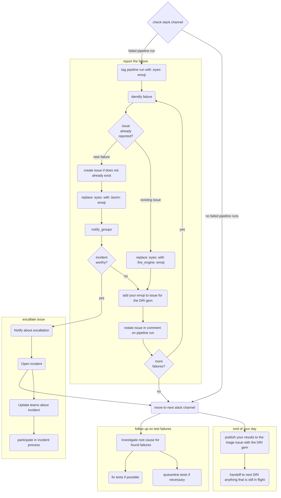

---

title: Debugging Failing Tests and Test Pipelines
description: Guidelines for investigating end-to-end test pipeline failures
---


## Overview

These guidelines are intended to help you to investigate [end-to-end test](https://docs.gitlab.com/ee/development/testing_guide/end_to_end/index.html) pipeline failures so that they can be properly addressed. This will involve analyzing each failure and creating an issue to report it. It might also involve [fixing tests](#fixing-the-test), [putting them in quarantine](#quarantining-tests), or [reporting bugs in the application](#bug-in-the-application).

The Pipeline triage [DRI](/handbook/people-group/directly-responsible-individuals/) is responsible for analyzing and debugging test pipeline failures. Please refer to the [DRI weekly rotation schedule](https://gitlab.com/gitlab-org/quality/pipeline-triage#dri-weekly-rotation-schedule) to know who the current DRIs are.

### General guidelines

- **Fix tests failing in `master` before other development work**: [Failing tests on `master` are treated as the highest priority](/handbook/engineering/workflow/#broken-master) relative to other development work, e.g., new features. Note that for pipeline triage DRIs, [triage and reporting](#report-the-failure) takes priority over fixing tests.
- **Follow the [pipeline triage guidelines](#how-to-triage-a-qa-test-pipeline-failure) for investigating, reporting, and resolving test failures**
- **Flaky tests are quarantined until proven stable**: A flaky test is as bad as no tests or in some cases worse due to the effort required to fix or even re-write the test.
As soon as detected it is quarantined immediately to stabilize CI, and then fixed as soon as possible, and monitored until it is fixed.
- **Close test failure issue (e.g example [issue](https://gitlab.com/gitlab-org/gitlab/-/issues/412769)) when the test is moved out of quarantine**: Quarantine issues should not be closed unless tests are moved out of quarantine.
- **Quarantine issues should be assigned and scheduled**: To ensure that someone is owning the issue, it should be assigned with a milestone set and have appropriate `~"quarantine"`, quarantine with type (e.g. `~"quarantine::bug"`) and failure with type (e.g. `~"failure::bug"`) labels.
- **Make relevant stage group aware**: When a test fails no matter the reason, an issue with related product group label (e.g. `~"group::ide"`) should be created and made known to the relevant product stage group as soon as possible.
In addition to notifying that a test in their domain fails, enlist help from the group as necessary.
- **Failure due to bug**: If one or multiple test failure(s) is a result of a bug, create a bug issue and provide as much details as possible (e.g. using issue's Bug template, provide steps to reproduce, relevant screenshots, etc.). Link the **all** related test failure issues to the bug issue. Apply `~"type::bug"`, severity, priority, product group, feature category, etc. labels to ensure a fix is scheduled in a timely manner.
Test failure issues are used for tracking and investigating purposes, they should not have `~"type::bug"` label. If the test failure is a result of a bug, apply `~"failure::bug"` label instead.
- **Everyone can fix a test, the responsibility falls on the last who worked on it**: Anyone can fix a failing/flaky test, but to ensure that a quarantined test isn't ignored,
the last engineer who worked on the test is responsible for taking it out of [quarantine](https://gitlab.com/gitlab-org/gitlab/blob/master/qa/README.md#quarantined-tests).

### Triage flow

The flow of triaging the pipelines as a decision tree (nodes link to the relevant sections of the handbook)



### QA test pipelines

The test pipelines run on a scheduled basis, and their results are posted to Slack. The following are the QA test pipelines that are monitored every day.

| Environment | Tests type | Schedule | Slack channel | Latest test report |
|-------------|------------|----------|---------------|--------------------|
| [Production](https://ops.gitlab.net/gitlab-org/quality/production/pipelines)           | Smoke and Reliable            | [after each deployment to Canary](https://ops.gitlab.net/gitlab-com/gl-infra/deployer/pipelines) | [`#qa-production`](https://gitlab.slack.com/messages/CCNNKFP8B) | [Production Sanity](https://gitlab-qa-allure-reports.s3.amazonaws.com/production-sanity/master/index.html) |
| [Production](https://ops.gitlab.net/gitlab-org/quality/production/pipelines)           | Full                          | [after a feature flag in production has been updated](https://docs.gitlab.com/ee/development/feature_flags/) | [`#qa-production`](https://gitlab.slack.com/messages/CCNNKFP8B) | [Production Full](https://gitlab-qa-allure-reports.s3.amazonaws.com/production-full/master/index.html) |
| [Canary](https://ops.gitlab.net/gitlab-org/quality/canary/pipelines)                   | Smoke and Reliable            | [after each deployment to Canary](https://ops.gitlab.net/gitlab-com/gl-infra/deployer/pipelines) | [`#qa-production`](https://gitlab.slack.com/messages/CCNNKFP8B) | [Canary Sanity](https://gitlab-qa-allure-reports.s3.amazonaws.com/canary-sanity/master/index.html) |
| [Canary Full](https://ops.gitlab.net/gitlab-org/quality/canary/pipelines)              | Full                          | [after each deployment to Canary](https://ops.gitlab.net/gitlab-com/gl-infra/deployer/pipelines) | [`#qa-production`](https://gitlab.slack.com/messages/CCNNKFP8B) | [Canary Full](https://gitlab-qa-allure-reports.s3.amazonaws.com/canary-full/master/index.html) |
| [Staging](https://ops.gitlab.net/gitlab-org/quality/staging/pipelines)                 | Smoke and Reliable            | [after each deployment to Staging-Canary](https://ops.gitlab.net/gitlab-com/gl-infra/deployer/pipelines) | [`#qa-staging`](https://gitlab.slack.com/messages/CBS3YKMGD)   | [Staging Sanity](https://gitlab-qa-allure-reports.s3.amazonaws.com/staging-sanity/master/index.html) |
| [Staging](https://ops.gitlab.net/gitlab-org/quality/staging/pipelines)                 | Smoke and Reliable            | [after the execution of post-deploy migrations in Staging](https://ops.gitlab.net/gitlab-com/gl-infra/deployer/pipelines) | [`#qa-staging`](https://gitlab.slack.com/messages/CBS3YKMGD)   | [Staging Sanity](https://gitlab-qa-allure-reports.s3.amazonaws.com/staging-sanity/master/index.html) |
| [Staging](https://ops.gitlab.net/gitlab-org/quality/staging/pipelines)                 | Smoke and Reliable (No Admin) | [Every 4 hours](https://ops.gitlab.net/gitlab-org/quality/staging/pipeline_schedules). This is useful to catch issues [when `requires_admin` tag is missed](https://gitlab.com/gitlab-com/gl-infra/production/-/issues/3678#note_514281399) | [`#qa-staging`](https://gitlab.slack.com/messages/CBS3YKMGD) | [Staging Sanity - No Admin](https://gitlab-qa-allure-reports.s3.amazonaws.com/staging-sanity-no-admin/master/index.html) |
| [Staging](https://ops.gitlab.net/gitlab-org/quality/staging/pipelines)                 | Geo                           | [Daily at 14:00 UTC](https://ops.gitlab.net/gitlab-org/quality/staging/pipeline_schedules) | [`#qa-staging`](https://gitlab.slack.com/messages/CBS3YKMGD) | Reported to Slack |
| [Staging-Canary](https://ops.gitlab.net/gitlab-org/quality/staging-canary/pipelines)   | Smoke and Reliable            | [after each deployment to Staging](https://ops.gitlab.net/gitlab-com/gl-infra/deployer/pipelines) | [`#qa-staging`](https://gitlab.slack.com/messages/CBS3YKMGD) | [Staging-Canary](https://gitlab-qa-allure-reports.s3.amazonaws.com/staging-canary-sanity/master/index.html) |
| [Staging-Canary](https://ops.gitlab.net/gitlab-org/quality/staging-canary/pipelines)   | Smoke and Reliable (No Admin) | [Every 4 hours](https://ops.gitlab.net/gitlab-org/quality/staging-canary/pipeline_schedules). This is useful to catch issues [when `requires_admin` tag is missed](https://gitlab.com/gitlab-com/gl-infra/production/-/issues/3678#note_514281399) | [`#qa-staging`](https://gitlab.slack.com/messages/CBS3YKMGD) | Reported to Slack |
| [CustomersDot Staging](https://gitlab.com/gitlab-org/customers-gitlab-com/-/pipelines) | Full | After each deployment to CustomersDot Staging | [`#qa-staging`](https://gitlab.slack.com/messages/CBS3YKMGD) [`#s_fulfillment_status`](https://gitlab.slack.com/messages/CL7SX4N86) | [CustomersDot Staging](https://gitlab-qa-allure-reports.s3.amazonaws.com/cdot-e2e-staging/main/index.html) |
| [Staging Ref](https://ops.gitlab.net/gitlab-org/quality/staging-ref/pipelines)         | Smoke and Reliable            | [after each deployment to Staging Ref](https://ops.gitlab.net/gitlab-com/gl-infra/deployer/pipelines). | [`#qa-staging-ref`](https://gitlab.slack.com/archives/C02JGFF2EAZ) | [Staging Ref Sanity](https://gitlab-qa-allure-reports.s3.amazonaws.com/staging-ref-sanity/master/index.html)  |
| [Staging Ref](https://ops.gitlab.net/gitlab-org/quality/staging-ref/pipelines)         | Full                          | [After each deployment to Staging Ref](https://ops.gitlab.net/gitlab-com/gl-infra/deployer/pipelines). | [`#qa-staging-ref`](https://gitlab.slack.com/archives/C02JGFF2EAZ) | [Staging Ref Full](https://gitlab-qa-allure-reports.s3.amazonaws.com/staging-ref-full/master/index.html)  |
| [Preprod](https://ops.gitlab.net/gitlab-org/quality/preprod/pipelines)                 | Smoke, Reliable               | [Every month for a few days before release, at 03:00 UTC](https://ops.gitlab.net/gitlab-org/quality/preprod/-/pipeline_schedules) and after [deployment to preprod](/handbook/engineering/infrastructure/environments/#pre) during Security and Patch releases | [`#qa-preprod`](https://gitlab.slack.com/archives/CR7QH0RV1) | [Preprod](https://gitlab-qa-allure-reports.s3.amazonaws.com/preprod-sanity/master/index.html) |
| [Release](https://ops.gitlab.net/gitlab-org/quality/release)                            | Smoke, Reliable               | [Every month after the final release](https://ops.gitlab.net/gitlab-org/quality/release/-/pipeline_schedules) and after [deployment to Release](/handbook/engineering/infrastructure/environments/#release) during Security and Patch releases | [`#qa-release`](https://gitlab.slack.com/archives/C0154HCFLRE) | [Release](https://gitlab-qa-allure-reports.s3.amazonaws.com/release-sanity/master/index.html) |
 | [Nightly Reference Architecture FIPS](https://gitlab.com/gitlab-org/distribution/reference-architecture-tester/-/pipelines) | Full | [Daily at 1.33 am UTC](https://dev.gitlab.org/gitlab/omnibus-gitlab/-/pipeline_schedules) | [`#qa-nightly`](https://gitlab.slack.com/messages/CGLMP1G7M) | Reported to Slack |
| [GitLab `master`'s `e2e:package-and-test-ee`](https://gitlab.com/gitlab-org/gitlab/pipelines)     | Full                          | When the `e2e:package-and-test-ee` job executes from a [scheduled pipeline every 2 hours](https://gitlab.com/gitlab-org/gitlab/pipeline_schedules) | [`#qa-master`](https://gitlab.slack.com/archives/CNV2N29DM) | [Master EE](https://gitlab-qa-allure-reports.s3.amazonaws.com/e2e-package-and-test/master/index.html) |
| [GitLab `master`'s `e2e:package-and-test-ce`](https://gitlab.com/gitlab-org/gitlab/-/pipeline_schedules)     | Full                          | [Daily at 4:00 am UTC](https://gitlab.com/gitlab-org/gitlab/-/pipeline_schedules) | [`#qa-master`](https://gitlab.slack.com/archives/CNV2N29DM) | [Master CE](https://gitlab-qa-allure-reports.s3.amazonaws.com/e2e-package-and-test-ce/master/index.html) |
| [GitLab `master`'s `e2e:package-and-test-nightly`](https://gitlab.com/gitlab-org/gitlab/-/pipeline_schedules)           | Full                          | [Daily at 4:00 am UTC](https://gitlab.com/gitlab-org/gitlab/-/pipeline_schedules) | [`#qa-master`](https://gitlab.slack.com/archives/CNV2N29DM) | [Master Nightly](https://gitlab-qa-allure-reports.s3.amazonaws.com/nightly/master/index.html) |
| [GitLab `master`'s `e2e:test-on-gdk`](https://gitlab.com/gitlab-org/gitlab/-/pipelines?ref=master&source=schedule)     | Smoke, Reliable      | When the `e2e:test-on-gdk` job executes from a [scheduled pipeline every 2 hours](https://gitlab.com/gitlab-org/gitlab/pipeline_schedules) | [`#qa-master`](https://gitlab.slack.com/archives/CNV2N29DM) | [Master GDK](https://gitlab-qa-allure-reports.s3.amazonaws.com/e2e-test-on-gdk/master/index.html) |
| [GitLab `master`'s `e2e:test-on-cng`](https://gitlab.com/gitlab-org/gitlab/-/pipeline_schedules) | Smoke, Reliable | [Daily at 4:00 am UTC](https://gitlab.com/gitlab-org/gitlab/pipeline_schedules) | [`#qa-master`](https://gitlab.slack.com/archives/CNV2N29DM) | [Master CNG](https://gitlab-qa-allure-reports.s3.amazonaws.com/e2e-test-on-cng/master/index.html) |

#### Emoji used
For each pipeline there is a notification of success or failure (except for `master` pipelines, which only report failures).
If there's a failure, we use emoji to indicate the state of its investigation:

- The :eyes: emoji , to show you're investigating a failing pipeline.
- The :boom: emoji , when there's a new failure.
- The :fire_engine: emoji , when a failure is already reported.
- The :retry: emoji , when there's a system failure (e.g., Docker or runner failure).

Note that while the configuration for each pipeline is in the `.gitlab-ci.yml` file in the relevant projects, pipeline schedules are configured via the UI and CI/CD variables are entered in project/group settings. Quality maintainers should have access to all the relevant configuration and settings. If you are the pipeline triage on-call DRI and you need to change settings but you don't have access, you can ask for assistance in the #quality_maintainers and #development Slack channels.

## How to triage a QA test pipeline failure

The general triage steps are:

- [Report the failure](#report-the-failure)
- [Review the failure logs](#review-the-failure-logs)
- [Investigate the root cause](#investigate-the-root-cause)
- [Classify the failure](#classify-and-triage-the-test-failure)

After triaging failed tests, possible follow up actions are:

- [Fixing tests](#fixing-the-test)
- [Quarantining tests](#quarantining-tests)
- [Dequarantining tests](#dequarantining-tests)
- [Re-evaluating tests](#re-evaluating-tests)

### Report the failure

Your priority is to make sure we have an issue for each failure, and to communicate the status of its investigation and resolution. When there are multiple failures to report, consider their impact when deciding which to report first. See the [pipeline triage responsibilities](/handbook/engineering/infrastructure/test-platform/oncall-rotation/#responsibility) for further guidance.

If there are multiple failures we recommend that you identify whether each one is new or old (and therefore already has an issue open for it). For each new failure, open an issue that includes only the required information. Once you have opened an issue for each new failure you can investigate each more thoroughly and act on them appropriately, as described in later sections.
[](){: name="known-failures"}

The reason for reporting all new failures first is to allow faster discovery by engineers who might find the test failing in their own merge request test pipeline. If there is no open issue about that failure, the engineer will have to spend time trying to figure out if their changes caused it.

Known failures should be linked to the current [pipeline triage report](https://gitlab.com/gitlab-org/quality/pipeline-triage/-/issues). However, issues can be opened by anyone and are not linked automatically, so be sure to confirm there is no existing issue before creating one.

1. Search for existing issues that have already been created with the `failure::*` label. By order of likelihood:
    1. [`failure::investigating`](https://gitlab.com/gitlab-org/gitlab/-/issues?scope=all&utf8=%E2%9C%93&state=opened&label_name%5B%5D=failure%3A%3Ainvestigating)
    2. [`failure::test-environment`](https://gitlab.com/gitlab-org/gitlab/-/issues?scope=all&utf8=%E2%9C%93&state=opened&label_name%5B%5D=failure%3A%3Atest-environment)
    3. [`failure::broken-test`](https://gitlab.com/gitlab-org/gitlab/-/issues?scope=all&utf8=%E2%9C%93&state=opened&label_name%5B%5D=failure%3A%3Abroken-test)
    4. [`failure::flaky-test`](https://gitlab.com/gitlab-org/gitlab/-/issues?scope=all&utf8=%E2%9C%93&state=opened&label_name%5B%5D=failure%3A%3Aflaky-test)
    5. [`failure::stale-test`](https://gitlab.com/gitlab-org/gitlab/-/issues?scope=all&utf8=%E2%9C%93&state=opened&label_name%5B%5D=failure%3A%3Astale-test)
    6. [`failure::bug`](https://gitlab.com/gitlab-org/gitlab/-/issues?scope=all&utf8=%E2%9C%93&state=opened&label_name%5B%5D=failure%3A%3Abug)
    7. [`failure::external-dependency`](https://gitlab.com/gitlab-org/gitlab/-/issues/?sort=created_date&state=opened&label_name%5B%5D=failure%3A%3Aexternal-dependency)
1. If the issue has already been reported please use the existing issue to track the latest status.
1. If there is no existing issue for the failure, please create an issue using one of [classification labels](#classify-and-triage-the-test-failure) via the steps below.

[](){: name="linking-issue"}
In the relevant Slack channel:

1. Apply the :eyes: emoji to indicate that you're investigating the failure(s).
1. If there's a system failure (e.g., Docker or runner failure), retry the job and apply the :retry: emoji. Read below for examples of system failures.
1. If an issue exists, add a :fire_engine: emoji. It can be helpful to reply to the failure notification with a link to the issue(s), but this isn't always necessary, especially if the failures are the same as in the previous pipeline and there are links there.
1. If you create a new issue, add a :boom: emoji.

#### Create an issue

Please use this step if there are no issues created to capture the failure. If there is already an issue please skip this step.

1. Create an issue for the test or system failure (if retrying the job does not resolve the latter) in [https://gitlab.com/gitlab-org/gitlab/issues](https://gitlab.com/gitlab-org/gitlab/issues) using the [QA failure](https://gitlab.com/gitlab-org/gitlab/issues/new?issuable_template=QA%20Failure) template. For failures in CustomersDot tests, open an issue in [CustomersDot](https://gitlab.com/gitlab-org/customers-gitlab-com/-/issues) project.
    - Apply the `~"type::ignore"` label to the issue until the investigation is complete and an [issue type](/handbook/engineering/metrics/#work-type-classification) is determined.
    - Inform the [counterpart SET](/handbook/engineering/quality/#individual-contributors) about the failure.
    - For system failures, it may make sense to open an issue in a different project such as [Omnibus GitLab](https://gitlab.com/gitlab-org/omnibus-gitlab/issues), [GitLab QA](https://gitlab.com/gitlab-org/gitlab-qa/issues), or [GitLab Runner](https://gitlab.com/gitlab-org/gitlab-runner/issues).
    - For staging environment-related failures, you can post a question in [`#infrastructure-lounge`](https://gitlab.slack.com/archives/CB3LSMEJV), or open an issue in the [infrastructure project](https://gitlab.com/gitlab-com/gl-infra/infrastructure)
    - Ask for help in [`#quality`](https://gitlab.slack.com/archives/C3JJET4Q6) if you're unsure where to file the issue.
1. In the relevant Slack channel, add the :boom: emoji and reply to the failure notification with a link to the issue.
1. Add the issue as a related issue to the current pipeline triage report. If multiple issues are the result of 1 bug, add the bug issue to the report instead.

#### Special considerations for Staging-Canary

`Staging-Canary` is unique when it comes to its blocking `smoke` and `reliable` tests that are triggered by the `deployer` pipeline. `Staging-Canary` executes `smoke/reliable` tests for both `Staging-Canary` AND `Staging` environments. This special configuration is designed to help catch issues that occur when incompatibilities arise between the shared and non-shared components of the environments.

`Staging-Canary` and `Staging` both share the same database backend, for example. Should a migration or change to either of the non-shared components during a deployment create an issue, running these tests together helps expose this situation. When the `deployer` pipeline triggers these test runs, they are reported serially in the `#qa_staging` Slack channel and they appear as different runs.

Note when viewing a deployment failure from the `#announcements` Slack channel, you will have to click into the pipeline and look at the `Downstream` results to understand if the deployment failure arose from a failure in `Staging-Canary` or if the failure occurred in `Staging`.

Click on the diagram below to visit the announcement issue for more context and view an uncompressed image:

[](https://gitlab.com/gitlab-com/gl-infra/delivery/-/issues/2280)

Note the diagram has been updated as part of increasing rollback availability by removing the [blocking nature of post-deployment migrations](https://gitlab.com/groups/gitlab-com/gl-infra/-/epics/585).

#### Special considerations for Staging Ref

[Staging Ref](/handbook/engineering/infrastructure/environments/staging-ref/) is a Sandbox environment used for pre-production testing of the latest Staging Canary code. It is a shared
environment with wide access permissions and as a result of engineers testing their code, the environment may become unstable and may need to be rebuilt.

As such failures in any QA pipelines on Staging Ref are _not blocking_ the deployment. QA suites are triggered when a new GitLab version
is deployed to the environment. They are used to check that the environment is healthy and functionality is working as expected.
Quality team maintains the environment and has full access to its resources for in-depth debugging.

Staging Ref deployment runs parallel to Staging Canary deployment. These two environments share the same GitLab version, if a failure happens
on Staging Ref but not on Staging Canary, it may indicate that the failure is environment specific. See [QA pipeline debugging guide](https://gitlab.com/gitlab-org/quality/gitlab-environment-toolkit-configs/staging-ref/-/blob/main/doc/qa_failure_debug.md) for more information on how to investigate QA failures in E2E tests triggered after Staging Ref deployment.

#### Special considerations for Preprod

[`Preprod`](/handbook/engineering/infrastructure/environments/#pre) is used to perform validation of release candidates. Every month around the [release date](/handbook/engineering/releases/), and the few days before, it is essential that there are no unexpected failures in the pipeline that will delay the release. There is a pipeline scheduled to run prior to deployment of the release candidate, to give us a chance to identify and resolve any issues with tests or the test environment. This scheduled pipeline should be given equal priority with `Production` and `Staging` pipelines because of the potential impact failures can have on a release.

Tests pipelines are also triggered by the [Kubernetes Workload configuration project](https://gitlab.com/gitlab-com/gl-infra/k8s-workloads/gitlab-com) to ensure that any configuration changes are valid.

#### Special considerations for Nightly

[Omnibus nightly builds](https://dev.gitlab.org/gitlab/omnibus-gitlab/-/pipeline_schedules) are paused at the start of a security release and enabled again once the release is complete.
This can cause the nightly tests to either run against an outdated package or fail during the `ce:sanity-version` and `ee:sanity-version` jobs when mirroring is down.

The `#quality` Slack channel should receive two notifications:

1. An announcement from the release team when the security release has started.
2. A notification from GitLab ChatOps when the security release has been published.

For other ways to check if there is an ongoing security release, you can visit the `#releases` Slack channel's `Next Security Release` bookmark, or [search the GitLab project's issues
by the `~"upcoming security release"` label](https://gitlab.com/gitlab-org/gitlab/-/issues/?sort=created_date&state=opened&label_name%5B%5D=upcoming%20security%20release&first_page_size=20).

Please note that a security release issue can sometimes be created before a release is in progress.
If you have any questions on the status, you can also reach out to the `@release-managers` in Slack.

#### Special considerations for `master` pipelines

GitLab `master` has three QA pipelines generated from scheduled pipeline against the default branch:

- [`package-and-test`](https://docs.gitlab.com/ee/development/testing_guide/end_to_end/#using-the-package-and-test-job) runs the `full` suite of end-to-end tests against an omnibus Docker image built from `master`
- [`test-on-gdk`](https://docs.gitlab.com/ee/development/testing_guide/end_to_end/#using-the-test-on-gdk-job) runs `reliable` and `smoke` suites of end-to-end tests against a GDK instance from a Docker image built from `master`

If jobs in `package-and-test` failed due to a GitLab Docker image issue, reach out to the [Distribution team](/handbook/engineering/infrastructure/core-platform/systems/distribution/) to see if it's a known problem with the build.

If failures occur only in `test-on-gdk` jobs, it's possible to stop those jobs from being added to new pipelines while the cause is being fixed. See the [runbook](https://gitlab.com/gitlab-org/quality/runbooks/-/tree/main/test-on-gdk#disable-the-e2etest-on-gdk-pipeline) for details.

Note that any failure in `master` QA pipeline will be deployed to Staging, so catching a failure earlier in the pipeline allows us to
find what changes caused it and act on resolving the failure more quickly.

#### Special considerations for FIPS Nightly

This is triggered from the `dev` omnibus [pipeline schedule](https://dev.gitlab.org/gitlab/omnibus-gitlab/-/pipeline_schedules).
It won't run when Nightly builds are paused. (See Special considerations for Nightly).

It is a triggered Reference Architecture Tester pipeline that stands up an environment, runs the `full` suite against 5 parallel jobs, then tears the environment down. Reference Architecture Tester project is maintained by [Distribution team](/handbook/engineering/infrastructure/core-platform/systems/distribution/). It stores scripts and configs that are used to build environments using [GitLab Environment Toolkit](https://gitlab.com/gitlab-org/gitlab-environment-toolkit).

Failures can be triaged as per any other pipeline. Note that as the environment is torn down, retrying QA jobs will fail as the endpoint is unreachable.

The pipeline can be manually retried by:
- Get the package name from the `ansible` job eg. `Configuring GET to fetch package from https://omnibus-builds.s3.amazonaws.com/el-8_fips/gitlab-fips-15.8.3%2Brnightly.fips.272378.ccd2c685-0.el8.x86_64.rpm` ([job example](https://gitlab.com/gitlab-org/distribution/reference-architecture-tester/-/jobs/3779956138#L48))
- Trigger a pipeline from [Reference Architecture Tester Pipelines](https://gitlab.com/gitlab-org/distribution/reference-architecture-tester/-/pipelines) with the variables
  - `PACKAGE_URL` - This is the package name from the `ansible` job
  - `QA_IMAGE` - This is typically `gitlab/gitlab-ee-qa:nightly`
  - `REFERENCE_ARCHITECTURE` - For FIPS nightly this is `omnibus-gitlab-mrs-fips`

Note that as the retry is not triggered, there will not be a slack notification unless you pass `CI_PIPELINE_SOURCE = trigger` when triggering the pipeline.

If you need to run tests against the environment locally, use credentials specified in `QA FIPS pipelines` in 1Password `Engineering` vault. It also has information about GCP project where RAT environments are being built. If you need access to machines, create [access request](/handbook/business-technology/end-user-services/onboarding-access-requests/access-requests/) to this GCP project. Once finished with debugging, **ensure** that`terraform-destroy` job was run to save costs.

##### Running tests against GDK running in FIPS mode

GDK can be used in FIPS mode if we wish to debug issues that may be related to FIPS.

Restart GDK using the `FIPS_MODE` variable:

`FIPS_MODE=1 gdk restart`

Tests can then be ran with the `FIPS` variable set:

`FIPS=1 bundle exec bin/qa Test::Instance::All http://gdk.test:3000/ ./qa/specs/features/browser_ui/2_plan/issue/create_issue_spec.rb`

### Review the failure logs

The aim of this step is to understand the failure. The results of the investigation will also let you know what to do about the failure. Update the failure issue with any findings from your review.

The following can help with your investigation:

| Log or artifact                                                                                                                                                                                                                                                | Notes                                                                                                                                                                                                                                                                                                                                                                                                                                                                                                                                                                                                                             |
|----------------------------------------------------------------------------------------------------------------------------------------------------------------------------------------------------------------------------------------------------------------|-----------------------------------------------------------------------------------------------------------------------------------------------------------------------------------------------------------------------------------------------------------------------------------------------------------------------------------------------------------------------------------------------------------------------------------------------------------------------------------------------------------------------------------------------------------------------------------------------------------------------------------|
| [Stack trace](https://docs.gitlab.com/ee/ci/quick_start/#viewing-the-status-of-your-pipeline-and-jobs)                                                                                                                                                         | Shown in the job's log; the starting point for investigating the test failure                                                                                                                                                                                                                                                                                                                                                                                                                                                                                                                                                     |
| [Screenshots and HTML captures](https://docs.gitlab.com/ee/ci/pipelines/job_artifacts.html#browsing-artifacts)                                                                                                                                                 | Available for download in the job's artifact for up to 1 week after the job run                                                                                                                                                                                                                                                                                                                                                                                                                                                                                                                                                   |
| [QA Logs](https://docs.gitlab.com/ee/ci/pipelines/job_artifacts.html#browsing-artifacts)                                                                                                                                                                       | Included in the job's artifacts; valuable for determining the steps taken by the tests before failing                                                                                                                                                                                                                                                                                                                                                                                                                                                                                                                             |
| [System Logs](https://docs.gitlab.com/ee/administration/logs/) (gitlab-rails, sidekiq, etc.)                                                                                                                                                                   | Included in the job's artifacts for containerized test runs, such as master and nightly. These are useful for investigating errors originating from the GitLab application itself. <br/><br />  A summary of the system logs related to a test failure can also be found in the description of QA failure issues generated from master and nightly runs containing a correlation ID.                                                                                                                                                                                                                                              |
| Sentry logs ([Staging](https://sentry.gitlab.net/gitlab/staginggitlabcom), [Staging Ref](https://new-sentry.gitlab.net/organizations/gitlab/projects/staging-ref/), [Preprod](https://sentry.gitlab.net/gitlab/pregitlabcom/), [Production](https://sentry.gitlab.net/gitlab/gitlabcom/)) | If staging, preprod or production tests fail due to a server error, there should be a record in [Sentry](/handbook/support/workflows/sentry/). For example, you can search for all unresolved staging errors linked to the `gitlab-qa` user with the query [`is:unresolved user:"username:gitlab-qa"`](https://sentry.gitlab.net/gitlab/staginggitlabcom/?query=is%3Aunresolved+user%3A%22username%3Agitlab-qa%22). However, note that some actions aren't linked to the `gitlab-qa` user, so they might only appear in the [full unresolved list](https://sentry.gitlab.net/gitlab/staginggitlabcom/?query=is%3Aunresolved). |
| Kibana logs ([Staging and Preprod](https://nonprod-log.gitlab.net/app/kibana#/discover), [Production](https://log.gprd.gitlab.net/app/kibana#/discover))                                                                                                       | Various system logs from live environments are sent to [Kibana](/handbook/support/workflows/kibana/), including Rails, Postgres, Sidekiq, and Gitaly logs. <br><br>**Note:** Staging and Preprod logs both use the same URL, but the search index pattern will be different. Staging indices contain `gstg` while Preprod contains `pre`. For example, to search within the Staging Rails index, you would change the index pattern dropdown value to `pubsub-rails-inf-gstg*`. More information on how to do this can be found [here](/handbook/support/workflows/kibana/#parameters).                                   |

#### Kibana and Sentry Logs

When a request fails in an E2E test that results in an error from the server, the job logs will print a link with the relevant correlation ID to logs in Sentry and Kibana for environments where these are available.

For Kibana, there will be two links available. One directs to a singular search against the Rails index in Kibana Discover, and another directs to the QA Correlation Dashboard, which contain panels of search results from multiple GitLab components.

#### Kibana Correlation Dashboards

We have QA Correlation Dashboards in Kibana to help organize logs from various GitLab components (e.g., Rails, Gitaly, Postgres, etc.) that are related to a given correlation ID, all in one place.

- [QA Correlation Dashboard - Staging](https://nonprod-log.gitlab.net/app/dashboards#/view/b74dc030-6f56-11ed-9af2-6131f0ee4ce6?_g=(filters%3A!()%2Cquery%3A(language%3Akuery%2Cquery%3A'')%2CrefreshInterval%3A(pause%3A!t%2Cvalue%3A0)%2Ctime%3A(from%3Anow-1d%2Cto%3Anow)))
- [QA Correlation Dashboard - Preprod](https://nonprod-log.gitlab.net/app/dashboards#/view/15596340-7570-11ed-9af2-6131f0ee4ce6?_g=(filters%3A!()%2CrefreshInterval%3A(pause%3A!t%2Cvalue%3A0)%2Ctime%3A(from%3Anow-1d%2Cto%3Anow)))
- [QA Correlation Dashboard - Prod](https://log.gprd.gitlab.net/app/dashboards#/view/5e6d3440-7597-11ed-9f43-e3784d7fe3ca?_g=(filters%3A!()%2CrefreshInterval%3A(pause%3A!t%2Cvalue%3A0)%2Ctime%3A(from%3Anow-15m%2Cto%3Anow)))

In addition to the dashboard link being automatically generated in E2E test failure logs, you can access these dashboards and use them manually as well. Just replace the correlation ID in the `json.correlation_id` filter with the ID you are interested in and set the appropriate date and time range.

This is similar to the Support team's [Correlation Dashboard](/handbook/support/workflows/kibana/#correlation-dashboard), but can be customized to fit the Quality team's needs.

### Investigate the root cause

Depending on your level of context for the test and its associated setup, you might feel comfortable investigating the root cause on your own, or you might get help from [other SETs](/handbook/engineering/quality/#individual-contributors) right away.

When investigating on your own, we suggest spending at most 20-30 minutes actively trying to find the root cause (this excludes time spent reporting the failure, reviewing the failure logs, or any test setup and pipeline execution time). After that point, or whenever you feel out of ideas, we recommend asking for help to unblock you.

**Note:** Please avoid logging in via `gitlab-qa` and all the other bot accounts on Canary/Production. They are monitored by [SIRT](/handbook/security/security-operations/sirt/) and will raise an alert if someone uses them to log in. If it is really needed to log in with these accounts, please give a quick heads-up in [#security-department](https://gitlab.slack.com/archives/CM74JMLTU) that someone is logging into the bot and tag `@sirt-members` for awareness.

Below is the list of the common root causes in descending order of likelihood:

1. Code changes: Check if the new code was deployed to the environment.
   - Find the diff between current and previous GitLab versions using this example `https://gitlab.com/gitlab-org/security/gitlab/-/compare/start_commit_sha...end_commit_sha` to see if there was a change that could have affected the test.
2. Feature Flag: Check if a new feature flag is enabled in the environment.
   - When a feature flag is enabled, it's being reported to specific QA pipeline Slack channel. This also triggers a Full QA job and it may help to identify which specific feature flag caused the failure.
   - A list of logs containing details on both recent and historic feature flag changes can also be viewed by visiting the [feature-flag-log](https://gitlab.com/gitlab-com/gl-infra/feature-flag-log) project. Each time a feature flag is updated, a new issue is generated in the project with helpful information such as when the feature flag was changed, who performed the update and on which environment. The project contains several `host` labels that can help filter by environment when searching through issues (ex: `~host::staging.gitlab.com`)
     - You can also reference this [dashboard](https://samdbeckham.gitlab.io/feature-flags) for a visual representation of feature flag statuses.
3. Environment / Infrastructure: If there were no code or feature flag changes and the environment has flaky errors, first start with analyzing [Sentry errors and Kibana logs](#review-the-failure-logs) to further investigate the issue.
    - Review the `#incident-management` channel to check if any ongoing incidents may be contributing to the failures.
    - GitLab's [Tamland](https://gitlab-com.gitlab.io/gl-infra/tamland/intro.html) may also be a helpful resource to review. Tamland is used to help forecast the utilization and saturation of various services, such as Sidekiq. For example, if high saturation is predicted, this could surface as flaky behavior in our tests due to performance degradation from that service. More information about Tamland can be found [here](/handbook/engineering/infrastructure/capacity-planning/#forecasting-with-tamland).
    - You may also reach out to the Infrastructure team at `#infrastructure-lounge` and ask if something was changed recently on the environment in question.
4. Test Data: Check that test data is valid. Live environments like Staging and Production rely on pre-existing data (QA users, access tokens).
5. New GitLab QA version: Check if a new [GitLab QA version](https://gitlab.com/gitlab-org/gitlab-qa/-/tags?sort=updated_desc) was released.

Failure examples can be seen in [Training Videos](#training-videos).

#### Run the test against your GDK

You can run the test (or perform the test steps manually) against your local GitLab instance to see if the failure is reproducible. For example:

``` plaintext
WEBDRIVER_HEADLESS=false bundle exec bin/qa Test::Instance::All http://localhost:3000 qa/specs/features/browser_ui/1_manage/project/create_project_spec.rb
```

Orchestrated tests are excluded by default. To run them, use `-- --tag orchestrated` before your file name. For example:

``` plaintext
WEBDRIVER_HEADLESS=false bundle exec bin/qa Test::Instance::All http://localhost:3000 -- --tag orchestrated qa/specs/features/browser_ui/1_manage/project/create_project_spec.rb
```

#### Run the test against a GitLab Docker container

You can also use the same Docker image as the one used in the failing job to run GitLab in a container on your local.
In the logs of the failing job, search for `gitlab-ee` or `gitlab-ce` and use its tag to start the container locally.

Once you have the image tag, [spin up GitLab instance locally](https://gitlab.com/gitlab-org/quality/runbooks/-/blob/main/running_gitlab_locally/index.md)

**Special Considerations**

Note that to be able to pull the docker image from `registry.gitlab.com` you need to [authenticate with the Container Registry](https://docs.gitlab.com/ee/user/packages/container_registry/#authenticate-with-the-container-registry).

To run Nightly images change `registry.gitlab.com/gitlab-org/build/omnibus-gitlab-mirror/gitlab-ee:<tag>` from one of the Docker commands above to `gitlab/gitlab-ee:nightly` or `gitlab/gitlab-ce:nightly`.

**Running the Test**

You can now run the test against this Docker instance. E.g.:

``` shell
WEBDRIVER_HEADLESS=false bundle exec bin/qa Test::Instance::All http://localhost qa/specs/features/browser_ui/1_manage/project/create_project_spec.rb
```

#### Run the tests against CustomersDot staging environment

To run CustomersDot E2E tests locally against staging environment, you will need to clone [CustomersDot](https://gitlab.com/gitlab-org/customers-gitlab-com) project, switch to `qa` directory, and then run

``` plaintext
STAGING=1 CP_ADMIN_TOKEN=<TOKEN> GL_ADMIN_TOKEN=<TOKEN> bundle exec rspec spec/ui/purchase/purchase_plan_spec.rb
```

**Note** - Token value can be found in GitLab-QA Vault. For details on running tests locally with more options, please refer to [CustomersDot README doc](https://gitlab.com/gitlab-org/customers-gitlab-com/-/blob/staging/README.md)

#### Tips for running tests locally

- Use the environment variable `QA_LOG_LEVEL=debug` to enable additional logging output that includes page actions and Git commands.
- Additional information about running tests locally can be found in the [QA readme](https://gitlab.com/gitlab-org/gitlab/tree/master/qa#running-specific-tests) and in the [instructions for running tests that require special setup](https://docs.gitlab.com/ee/development/testing_guide/end_to_end/running_tests_that_require_special_setup.html#jenkins-spec).
- To determine if the test is [flaky](https://docs.gitlab.com/ee/development/testing_guide/flaky_tests.html#whats-a-flaky-test), check the logs or run the test a few times. If it passes at least once but fails otherwise, it's flaky.

#### Checking Docker images

Sometimes tests may fail due to an outdated Docker image. To check if that's the case, follow the instructions below to see if specific merged code is available in a Docker image.

##### Checking test code (QA image)

If you suspect that certain test is failing due to the `gitlab/gitlab-{ce|ee}-qa` image being outdated, follow these steps:

1. Locally, run `docker run -it --entrypoint /bin/sh gitlab/gitlab-ce-qa:latest` to check for GitLab QA CE code, or `docker run -it --entrypoint /bin/sh gitlab/gitlab-ee-qa:latest` to check for GitLab QA EE code
1. Then, navigate to the `qa` directory (`cd /home/qa/qa`)
1. Finally, use `cat` to see if the code you're looking for is available in certain file (e.g., `cat page/project/issue/show.rb`)

> **Note** if you need to check in another tag (e.g., `nightly`), change it in one of the scripts of step 1 above.

##### Checking application code

1. Locally, run `docker run -it --entrypoint /bin/sh gitlab/gitlab-ce:latest` to check for GitLab CE code, or `docker run -it --entrypoint /bin/sh gitlab/gitlab-ee:latest` to check for GitLab EE code
1. Then, navigate to the `gitlab-rails` directory (`cd /opt/gitlab/embedded/service/gitlab-rails/`)
1. Finally, use `cat` to see if the code you're looking for is available or not in a certain file (e.g., `cat public/assets/issues_analytics/components/issues_analytics-9c3887211ed5aa599c9eea63836486d04605f5dfdd76c49f9b05cc24b103f78a.vue`.)

> **Note** if you want to check another tag (e.g., `nightly`) change it in one of the scripts of step 1 above.

##### Checking application version has the specific MR

1. Find the version which GitLab application is running on. In the failing job logs, search for `docker pull dev.gitlab.org:5005/gitlab/omnibus-gitlab/gitlab-ee-qa` and use the version specified after `gitlab-ee-qa:`.
    - For *nightly* the approach above won't work. There are two ways for finding the commit version of nightly:
        - Run the [nightly image on local](#run-the-test-against-a-gitlab-docker-container), sign-in as admin and navigate to `/help` page or call the `/api/v4/version` API.
        - Search for the commit in the [omnibus-gitlab pipeline](https://dev.gitlab.org/gitlab/omnibus-gitlab/-/pipelines) that built the last nightly. Jobs that build nightly have `bundle exec rake docker:push:nightly` command in the `Docker-branch` job of the `Package-and-image` stage. Once you find the latest pipeline, search for `gitlab-rails` under `build-component_shas` in any job under the `Gitlab_com:package` stage. For example, in [this `Ubuntu-16.04-branch` job](https://dev.gitlab.org/gitlab/omnibus-gitlab/-/jobs/9610785#L3373), the commit SHA for `gitlab-rails` is `32e76bc4fb02a615c2bf5a00a8fceaee7812a6bd`.
1. Open commits list for the specific version:
    - If version format is like a commit SHA, for example `gitlab-ee-qa:13.10-4b373026c98`, navigate to `https://gitlab.com/gitlab-org/gitlab/-/commits/<commit_SHA>` page, in our example the commit SHA is `4b373026c98`.
    - If version format is like a tag, for example `13.10.0-rc20210223090520-ee`, navigate to `https://gitlab.com/gitlab-org/gitlab/-/commits/v<tag>` page, in our example the tag is `13.10.0-rc20210223090520-ee`.
    - If page above returns 404 error, check if the version exists in [GitLab Security repo](https://gitlab.com/gitlab-org/security/gitlab) in case there is a security release.
1. Check if the MR that you were searching for is in this version.
    - Note the branch name of the MR.
    - Search the commits from Step 2 by the branch name.
        - If the commit is found, the MR is in this version. For [example](https://gitlab.com/gitlab-org/gitlab/-/commits/v13.10.0-rc20210223090520-ee?utf8=%E2%9C%93&search=add-share-with-group-to-modal).
        - If no results, the MR is not in this version. For [example](https://gitlab.com/gitlab-org/gitlab/-/commits/v13.10.0-rc20210223090520-ee?utf8=%E2%9C%93&search=qa-shl-add-requries-admin).

#### Investigating orchestrated test failure

##### Verify the reconfigure logs for the GitLab container in the pipeline artefacts.

Each orchestrated job has a log file attached as artifacts called
- `<container_name>-reconfigure-logs.txt` - if the container runs successfully on 1st attempt, or
- `<container_name>-retry-<retry_attempt>-reconfigure-logs.txt` - if the test has tried multiple times to spin up the GitLab container due to failure.

If you see any errors in this log file, the issue would be related to `gitlab-ctl reconfigure` command.
Get in touch with the distribution team on `#g_distribution` channel.

##### Investigating update-major or update-minor tests locally and common failures

Failures in `update-major` or `update-minor` might indicate that GitLab upgrade fails. Such failures could be caused by migration issues or other changes. To ensure customers won't face such issue during upgrade,  investigate the error as priority, especially near the release date.

Follow the document  [Investigating update-major or update-minor tests locally and common failures](https://gitlab.com/gitlab-org/quality/runbooks/-/blob/main/debug_orchestrated_test_locally/running_update-major_and_update-minor_locally.md).

### Identifying commit that introduced a failure

- While triaging failures we often may want to find which specific commit was the one that introduced the failure. While we may sometimes be able to identify this by reviewing the recent commit history, in other cases this may be more obscure. To quickly identify where the failure was introduced [git bisect](https://git-scm.com/docs/git-bisect) can be quite useful.
- A demo on using git bisect can be found in [Training Videos](#training-videos).

### Classify and triage the test failure

The aim of this step is to categorize the failure as either a stale test, a bug in the test, a bug in the application code, or a flaky test.

We use the following labels to capture the cause of the failure.

- `~"failure::investigating"`: Default label to apply at the start of investigation.
- `~"failure::stale-test"`: [Stale test due to application change](#stale-test-due-to-application-change)
- `~"failure::broken-test"`: [Bug in the test](#bug-in-the-test)
- `~"failure::flaky-test"`: [Flaky test](#flaky-test)
- `~"failure::test-environment"`: [Failure due to test environment](#failure-due-to-test-environment)
- `~"failure::bug"`: [Bug in the application](#bug-in-the-application)
- `~"failure::external-dependency"`: [Failure due to an external dependency](#failure-due-to-external-dependency)

Bugs blocking end-to-end test execution (due to the resulting quarantined tests) should additionally have severity and priority labels. For guidelines about which to choose, please see the [blocked tests section of the issue triage page](/handbook/engineering/infrastructure/engineering-productivity/issue-triage/#blocked-tests).

**Note**: It might take a while for a fix to propagate to all environments. Be aware that a new failure could be related
to a recently-merged fix that hasn't made it to the relevant environment yet. Similarly, if a known failure occurs but
the test should pass because a fix has been merged, verify that the fix has been deployed to the relevant environment
before attempting to troubleshoot further.

#### Stale test due to application change

The failure was caused by a change in the application code and the test needs to be updated.

- Include your findings in a note in the issue about the failure.
- Apply the `~"failure::stale-test"` label.
- If possible, mention the merge request which caused the test to break, to keep the corresponding engineer informed.

See [Quarantining Tests]

#### Bug in the test

The failure was caused by a bug in the test code itself, not in the application code.

- Include your findings in a note in the issue about the failure.
- Apply the `~"failure::broken-test"` label.

See [Quarantining Tests]

#### Bug in the application

The failure was caused by a bug in the application code.

- Apply `~"failure::bug"` label to the test failure issue(s).
- Create a new issue link all related test failure issue(s) to this issue.
- Include your findings in a note in the bug issue about the failure.
- Add the steps to reproduce the bug and expected/actual behavior.
- Apply the `~"type::bug"` label, and cc-ing the corresponding Engineering Managers (EM), QEM, and SET.
- Apply the `~"found by e2e test"` label to the bug issue (or bug fix MR if it is fixed immediately) to indicate the bug was found by the end-to-end test execution.
- If the problem adheres to the definition of a [transient bug](/handbook/engineering/infrastructure/engineering-productivity/issue-triage/#transient-bugs), apply the ~"bug::transient" label as well.
- If there is an issue open already for the bug, use this issue instead and apply the above steps.
- Communicate the issue in the corresponding Slack channels.
- [Quarantine][quarantining tests] the test right after the bug issue has been created. Leave a note on the bug issue with the link to the quarantined test and mention that it should be un-quarantined with the fix.
- When the reason for quarantining a test is because of a low severity bug in the code which will not be fixed in the upcoming couple of releases, add the `~"quarantine"` , quarantine with type and `~"failure::bug"` labels to the test failure issue(s).
- When the bug is fixed, the related quarantined tests should be unquarantined and verified as well. The bug issue and all related test failure issues should be closed out together.

**Note**: GitLab maintains a [daily deployment cadence](https://gitlab.com/gitlab-com/gl-infra/delivery/-/issues/880) so a breaking change in `master` reaches Canary and Production fast. Please communicate broadly to ensure that the corresponding [Product Group](/handbook/product/categories/#devops-stages) is aware of the regression and action is required. If the bug is [qualified for dev escalation](/handbook/engineering/development/processes/Infra-Dev-Escalation/process.html#scope-of-process) (example: `priority::1/severity::1` issue that blocks the deployment process), consider involving [On-call Engineers](/handbook/engineering/development/processes/Infra-Dev-Escalation/process.html) in the [`#dev-escalation`](https://gitlab.slack.com/archives/CLKLMSUR4) channel. To find out whos on-call follow the links in the channel subject line.

To find the appropriate team member to cc, please refer to the [Organizational Chart](https://comp-calculator.gitlab.net/org_chart). The [Quality Engineering team list](/handbook/engineering/quality/#department-members) and [DevOps stage group list](/handbook/product/categories/#devops-stages) might also be helpful.

See [Quarantining Tests]

#### Flaky Test

The failure is due to flakiness in the test itself.

- Include your findings in a note in the issue about the failure.
- Apply the `~"failure::flaky-test"` label.
- Add the test to our [Test Reliability: Improve test design](https://gitlab.com/gitlab-org/quality/team-tasks/-/issues/1330) tracking issue to identify areas of improvement that can help prevent future flakiness.

Flakiness can be caused by a myriad of problems. Examples of underlying problems
that have caused us flakiness include:

- Not waiting appropriately for pages to load or transitions from one state to another to complete.
- Animations preventing tests from interacting with elements.
- Non-independent tests (i.e. test A passes when run first, but fails otherwise).
- Actions not completing successfully (e.g. logging out).

For more details, see the list with example issues in our
[Testing standards and style guidelines section on Flaky tests](https://docs.gitlab.com/ee/development/testing_guide/flaky_tests.html).

See [Quarantining Tests]

#### Failure due to test environment

The failure is due external factors outside the scope of the test but within a test environment under GitLab's control. This could be due to environments, deployment hang-ups, or upstream dependencies within GitLab's control.

- Include your findings in a note in the issue about the failure.
- Apply the `~"failure::test-environment"` label.
- Identify the general category of improvement and add the failure issue to the approprite `Test Reliability` issue listed within the [Improve test environment reliability and reduce flaky/transient test failures](https://gitlab.com/gitlab-org/quality/team-tasks/-/issues/1309) tracking issue.
  - Endeavor to create an appropriate action item (issue or MR) to help resolve the reliability issue as indicated in the tracking issues.

A job may fail due to infrastructure or orchestration issues that are not related to any specific test. In some cases these issues will fail a job before tests are ever executed. Some examples of non-test related failures include:

- Failed to download container from GitLab Container Registry
- Failed to complete orchestration of a Geo cluster
- CI runner timeouts
- 500 error while uploading job artifacts

#### Failure due to external dependency

The failure is due to an external dependency the test is reliant on, but is outside of GitLab's control. This could be due to outages in external package management systems, or outages in third-party integrations. If possible, external dependencies should be avoided to increase the reliability of the test suite.

- Include your findings in a note in the issue about the failure.
- Apply the `~"failure::external-dependency"` label.
- Include a link to the external dependency's outage notice, if available.

Some examples of external dependency failures could include:

- Outages in package or container management systems such as registry.npmjs.org, RubyGems.org, NuGet or dockerhub
- Outages in third-party integrations such as Zuora

### Notify relevant groups about the failure

#### Failure needs escalation

If the failure is in a `smoke` or a `reliable` test, it will block deployments ([except for Staging Ref failures](#special-considerations-for-staging-ref)). Please inform the release managers of the root cause and if a fix is in progress by Quality. On GitLab.com, you can use `@gitlab-org/release/managers`. In Slack, you can use `@release-managers`.

If the failure could affect the performance of `GitLab.com` production, or make it unavailable to a specific group of users, you can [declare an incident](/handbook/engineering/infrastructure/incident-management/#reporting-an-incident) with `/incident declare` in the `#production` Slack channel, this will automatically prevent deployments (if the incident is at least an S2).

#### Notify group in all cases

Please also raise awareness by looping in the appropriate team members from the product group, such as SET or EM. The SET/EM can be identified by looking for who is assigned to that [stage/group](/handbook/product/categories/#devops-stages). Many tests are tagged with a `product_group` which will help with identification. You may also want to post in Quality's Slack channel `#quality` depending on the impact of the failure.

## Following up on test failures

### Fixing the test

If you've found that the test is the cause of the failure (either because the application code was changed or there's a bug in the test itself), it will need to be fixed. This might be done by another SET or by yourself. However, it should be fixed as soon as possible. In any case, the steps to follow are as follows:

- Create a merge request (MR) with the fix for the test failure.
- Apply the ~"Pick into auto-deploy", ~"priority::1", and ~"severity::1" labels if the fix is urgent and required to unblock deployments.

If the test was flaky:

- Confirm that the test is stable by ensuring it passes 3 to 5 times while in quarantine.

> **Note** The number of passes needed to be sure a test is stable is just a suggestion.
> You can use your judgement to pick a different threshold.

If the test was in quarantine, [remove it from quarantine](#dequarantining-tests).

### Quarantining Tests

The aim of quarantining a test is _not_ to get back a green pipeline, but rather to reduce the noise (due to constantly failing tests, flaky tests, and so on) so that new failures are not missed. If you're unsure about quarantining a test ask for help in the`#quality` Slack channel, and then consider adding to the list of examples below to help future pipeline triage DRIs.

Examples of when to quarantine a test:

- Bug in test code (`~"failure::broken-test"`), and a fix won't be ready for review within 24 hours
- Stale test (`~"failure::stale-test"`), and a fix won't be ready for review within 24 hours

Examples of when not to quarantine a test:

- Test failure is environment-related (`~"failure::test-environment"`), and neither the application code nor test code are the cause of the failure
- A merge request to fix the failure will be ready for review within 24 hours
- A flaky smoke test.
  - The `:smoke` tag should be removed from the test to prevent it running with the `smoke` suite, but still allowed to run elsewhere while the flakiness is under investigation or being worked on to unblock deployment.
  - Create an issue to follow up and restore the `:smoke` tag as soon as possible. Tests at the `:smoke` level should be given priority when addressing flakiness within our test suites.
  - Create a `# TODO` note in the test as a reminder with a link to the previously created issue url. For example:
    - `# TODO restore :smoke tag and close https://gitlab.com/gitlab-org/gitlab/-/issues/######`

> **Note** The time limit for the fix is just a suggestion.
> You can use your judgement to pick a different threshold.

### Fast quarantine

If a test is failing and you have good reason to quarantine it quickly you can [fast quarantine](https://gitlab.com/gitlab-org/quality/engineering-productivity/fast-quarantine/-/blob/main/README.md) it. Fast quarantine can be done by a single person, without requiring review by another engineer.

You should use fast quarantine to unblock deployment pipelines and MRs if the failure is disruptive and you've ruled out bugs as the cause of the failure (e.g., you've identified that the test is stale, or flaky).

> **Note**: Failing `:reliable` or `:smoke` tests in the `e2e: test-on-gdk` child pipeline will block MR pipelines as well as scheduled master pipelines. Failures of those tests are good candidates for fast quarantine.

After fast quarantining, please follow the long-term quarantine process below.

### Long-term quarantine

- Add the `:quarantine` metadata to the test with a link to the issue (see [quarantined test types](#quarantined-test-types))

> **Note** If the example has a `before` hook, [the `quarantine` metadata should be assigned to the outer context](#nested-contexts) to avoid running the `before` hook.

- Create a merge request using the [Quarantine End to End Test](https://gitlab.com/gitlab-org/gitlab/-/blob/master/.gitlab/merge_request_templates/Quarantine%20End%20to%20End%20Test.md) template.
  - The merge request shall have the labels: `~"Quality", ~"QA", ~"type::bug"`.
  - The merge request may have auto-deploy labels: `~"Pick into auto-deploy", ~"priority::1", and ~"severity::1"`. Please note that this is reserved for emergency cases only, such as blocked deployments, as it will delay all other deployments by around two hours.
  - The merge request may have stage or group labels. E.g. `~"devops::create" ~"group::source code"`.
  - The merge request shall have the current milestone.
  - The merge request shall link to (but not close) the failure issue.
- The failure issue should remain open and be assigned a DRI (likely the [counterpart SET](/handbook/engineering/quality/#individual-contributors)) for fixing, re-evaluating, or dequarantining the test as needed.

To be sure that the test is quarantined quickly, ask in the `#quality` Slack channel for someone to review and merge the merge request, rather than assigning it directly.

Here is an [example quarantine merge request](https://gitlab.com/gitlab-org/gitlab/-/merge_requests/83575/diffs).

> **Note** Be aware that for blocked release cycle auto deploy with quarantined test will not work. During canary deployment we trigger tests against both staging and canary. Spec is not quarantined on staging yet because quarantined MR didn't reach it. That leads to environment circular dependency problem.
>
> In that case the Release Managers should decide whether it is possible to rollback Staging, or whether to [manually deploy the quarantined MR to Staging](https://gitlab.com/gitlab-org/release/docs/-/blob/master/runbooks/deploy-to-a-single-environment.md). Manually deploying the fix to Staging will reduce the amount of mixed-version testing but may be the only option to allow deployment pipelines to continue.

#### Quarantined Test Types

If a test is placed under quarantine, it is important to specify _why_. By specifying a quarantine type we can see
quickly the reason for the quarantine.

The report accepts the quarantine types below:

| Quarantine Type | Description |
| --------------- | ----------- |
| [`:flaky`] | This test fails intermittently |
| [`:bug`] | This test is failing due to an _actual bug_ in the application |
| [`:stale`] | This test is outdated due to a feature change in the application and must be updated to fit the new changes |
| `:broken` | This test is failing because of a change to the test code or framework |
| `:waiting_on` | This test is quarantined temporarily due to an issue or MR that is a prerequisite for this test to pass |
| `:investigating` | This test is a `:flaky` test but it might be blocking other MRs and so should be quarantined while it's under investigation |
| `:test_environment` | This test is failing due to problems with the test environment and will not be fixed within 24 hours |

> **Note**: Be sure to attach an `issue` to the quarantine metadata. We use this issue for tracking the average age of the quarantined tests.

#### Examples

``` ruby
it 'is flaky', quarantine: { issue: 'https://gitlab.com/gitlab-org/gitlab/issues/12345', type: :flaky }
it 'is due to a bug', quarantine: {
                        issue: 'https://gitlab.com/gitlab-org/gitlab/issues/12345',
                        type: :bug
                      }
context 'when these tests rely on another MR', quarantine: {
                                                 type: :waiting_on,
                                                 issue: 'https://gitlab.com/gitlab-org/gitlab/merge_requests/12345'
                                               }
```

#### Nested contexts

You should apply the quarantine tag to the outermost `describe`/`context` block that has tags relevant
to the test being quarantined.

```ruby
# Good
RSpec.describe 'Plan', :smoke, quarantine: { issue: 'https://gitlab.com/gitlab-org/gitlab/issues/12345', type: :flaky } do
  describe 'Feature' do
    before(:context) do
      # This before(:context) block will only be executed in smoke quarantine jobs
    end
  end
end

# Bad
RSpec.describe 'Plan', :smoke do
  describe 'Feature', quarantine: { issue: 'https://gitlab.com/gitlab-org/gitlab/issues/12345', type: :flaky } do
    before(:context) do
      # This before(:context) block could be mistakenly executed in quarantine jobs that _don't_ have the smoke tag
    end
  end
end
```

### Dequarantining Tests

Failing to dequarantine tests periodically reduces the effectiveness of the test suite. Hence, the tests should be dequarantined on or before the due-date mentioned in the corresponding issue.

Before dequarantining a test:

- If the test failure was originally discovered in [`gitlab-org/gitlab` nightly schedule pipeline](https://gitlab.com/gitlab-org/gitlab/-/pipeline_schedules), MR or [master](https://gitlab.com/gitlab-org/gitlab/pipelines) pipeline, please make sure that the test passes on your local against GDK with latest code and that it has passed a few times
in the nightly pipeline's quarantine job for that test.
- If the test failure was originally discovered in [staging](https://ops.gitlab.net/gitlab-org/quality/staging/pipelines), [canary](https://ops.gitlab.net/gitlab-org/quality/canary/pipelines) or [production](https://ops.gitlab.net/gitlab-org/quality/production/pipelines) pipeline, please make sure that the test passes in the CI pipeline against that environment.
You can trigger a CI pipeline against a live environment by clicking "Run Pipeline" button on the [staging](https://ops.gitlab.net/gitlab-org/quality/staging/pipelines), [canary](https://ops.gitlab.net/gitlab-org/quality/canary/pipelines) or [production](https://ops.gitlab.net/gitlab-org/quality/production/pipelines) pipelines page
and setting the `RELEASE` variable to the release that has your changes. See [Running GitLab-QA pipeline against a specific GitLab release](/handbook/engineering/infrastructure/test-platform/tips-and-tricks/#running-gitlab-qa-pipeline-against-a-specific-gitlab-release)
for instruction on finding your release version created and tagged by the Omnibus pipeline.

To dequarantine a test:

- Create a merge request that removes the `:quarantine` tag using the [Quarantine End to End Test](https://gitlab.com/gitlab-org/gitlab/-/blob/master/.gitlab/merge_request_templates/Quarantine%20End%20to%20End%20Test.md) MR template.
- Close the issue created as part of the quarantining process.

As with quarantining a test, you can ask in the `#quality` Slack channel for someone to review and merge the merge request, rather than assigning it.

### Re-evaluating tests

If the due date of a failing test issue is reached, you should re-evaluate if the failing test should really be covered at the end-to-end test level, or if it should be covered in a lower level of the [testing levels pyramid](https://docs.gitlab.com/ee/development/testing_guide/testing_levels.html).

If you decide to delete the test, open a merge request to delete it and close the test failure issue. In the MR description or comment, mention the stable counterpart SET for the test's stage for their awareness. Then open a new issue to cover the test scenario in a different test level.

If you decide the test is still valuable but don't want to leave it quarantined, you could replace `:quarantine` with `:skip`, which will skip the test entirely (i.e., it won't run even in jobs for quarantined tests). That can be useful when you know the test will continue to fail for some time (e.g., at least the next milestone or two).

### Quarantined test report

Every week, a list of the current [long-term quarantined](#long-term-quarantine) E2E tests in both the GitLab and CustomersDot project is reported to the `#quality-reports` Slack channel.

This report is generated from the Test Platform Department's [toolbox](https://gitlab.com/gitlab-org/quality/toolbox) project.

## Training Videos

These videos walking through the triage process were recorded and uploaded to the [GitLab Unfiltered](https://www.youtube.com/channel/UCMtZ0sc1HHNtGGWZFDRTh5A) YouTube channel.

- [Quality Team: Failure Triage Training - Part 1](https://www.youtube.com/watch?v=Fx1DeWoTG4M)
  - Covers the basics of investigating pipeline failures locally.
- [Quality Team: Failure Triage Training - Part 2](https://www.youtube.com/watch?v=WeQb8GEw6PM)
  - Continued discussion with a focus on using Docker containers that were used in the pipeline that failed.
- [Quality Engineering On-call Rotation and Debugging QA failures](https://youtu.be/zdIEbl_DPHA) ([private video](/handbook/marketing/marketing-operations/youtube/#unable-to-view-a-video-on-youtube) on GitLab Unfiltered)
  - Overview of QE on-call rotation process, GitLab deployment process and how to debug failed E2E specs with examples.
- [Quality Engineering: Failure Triage - Using git bisect to identify commit that introduced a failure](https://www.youtube.com/watch?v=ZvrOF5Bx2Bo)
  - A demo on how to use git bisect to identify which commit introduced a test failure
- [Quality Engineering: Test environments show and tell](https://drive.google.com/file/d/1m3f5Vz-KSRu7SfNmdDjTQsU5kMDpPwDJ/view)
  - A show and tell presentation that gives an overview of our test environments. Originally presented for an audience of our counterparts.
- [Runner Taskscaler and Fleeting Test Plan Discussion](https://www.youtube.com/watch?v=_uuy7KCDgWw)
  - A high level discussion on the new runner architecture, including the new [taskscaler](https://gitlab.com/gitlab-org/fleeting/taskscaler) and [fleeting](https://gitlab.com/gitlab-org/fleeting/fleeting), the components replacing docker-machine for [runner autoscaling](https://docs.gitlab.com/runner/runner_autoscale/).

## Other references

You can find some [general tips for troubleshooting problems with GitLab end-to-end tests in the development documentation](https://docs.gitlab.com/ee/development/testing_guide/end_to_end/troubleshooting.html).

[quarantining tests]: #quarantining-tests
[`:flaky`]: #flaky-test
[`:bug`]: #bug-in-the-application
[`:stale`]: #test-is-stale-due-to-application-change
