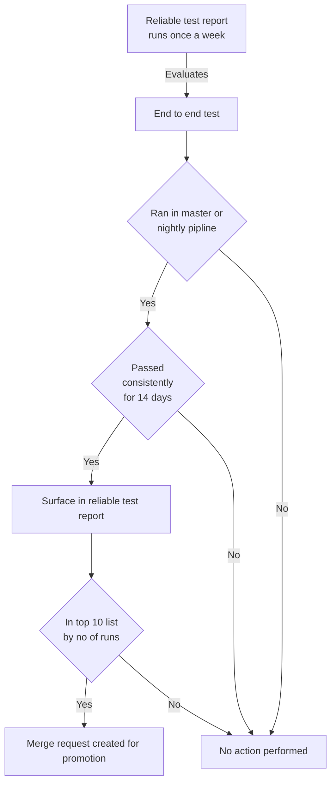
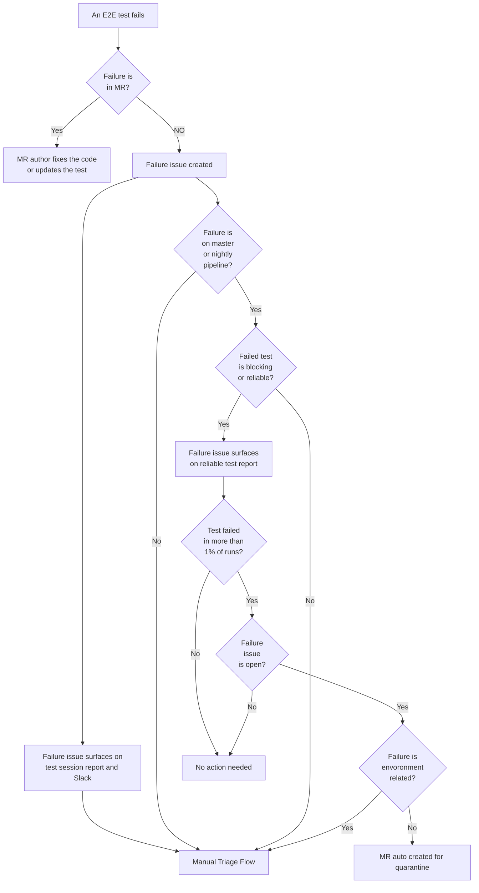

---

title: "Reliable and Blocking end-to-end tests"
description: "This page describes the process and technical documentation around reliable and blocking end-to-end tests at GitLab.
Reliable tests are executed as a blocking step in the release pipelines. Blocking tests are executed as a blocking step in MRs but not the release."
---

## Overview

GitLab's end-to-end tests for API and UI, located in `qa/qa/specs/features/`, can be promoted to:

- **Reliable Tests**: Essential for the release process, they are executed as a blocking step.
- **Blocking Tests**: Key to maintaining code quality in MRs, not used in the release process but mandatory for MR
  approval.

Both `:reliable` and `:blocking` suites are temporary buckets used for gradual promotion of tests for use as critical
checkpoints in MRs and the release process.
In the longer term, the both the buckets will be sunset. All the tests will be run as a blocking step in the MRs and
only smoke tests will be run during the release process.

### Defining a Reliable Test

- A test is `:reliable` if it consistently passes
  across [all pipelines](https://handbook.gitlab.com/handbook/engineering/infrastructure/test-platform/debugging-qa-test-failures/#qa-test-pipelines)
  for 14 days.
- The current focus of the team is shifting the tests left by expanding the blocking suite and not the reliable suite.

### Defining a Blocking Test

- A `:blocking` test consistently succeeds in the master or nightly pipeline for at least 14 days.
- A blocking test is for MR quality control and not included in release pipelines.

## Promotion Processes

### To Blocking Suite

Tests are selected for promotion by a weekly automated script that uses the data produced by reliable test report.

- Criteria: 14 consecutive days of success and top 10 in run frequency in master or nightly pipelines
- The process involves generating MRs for the top-performing tests and assigning them for review by counterpart SET for
  the DevOps stage of the test as a DRI.
- A test should ideally not be promoted manually without it being identified in the reliable test report. However, if a
  test has been identified in the reliable test report did not make it to the top 10 number of runs, it can be promoted
  by manually creating an MR.

The flow of promotion to blocking as a decision tree:

### Weekly Reliable Spec Report

This report plays a crucial role in managing the health of the test suite, highlighting:

- Specs passing consistently for 14 days in different pipelines. These tests are promoted to blocking.
- Reliable and blocking specs that failed in last 14 days. These tests are quarantined.

## Managing Test Failures

The flow of test failures as a decision tree:

### What happens when a reliable test fails?

- **In MRs**: The author is responsible for addressing any bugs or updating the test.
- **In master or nightly pipeline**: Consistent failures trigger automatic quarantine.
- **In release pipeline**: The [triage flow](/handbook/engineering/infrastructure/test-platform/debugging-qa-test-failures/#triage-flow) is followed with these guidelines:

| Reason for Failure                    | Action                         |
|---------------------------------------|--------------------------------|
| Test itself or test framework issues  | Remove `:reliable` tag and fix |
| Minor transient infrastructure issues | Remove `:reliable` tag and fix |
| Bug in application code               | Test remains `:reliable`       |
| Significant infrastructure issues     | Test remains `:reliable`       |

The reliable test suite is not actively expanded. Therefore, once a demoted reliable test passes consistently, it will
be identified and
an MR will be created to promote it to the blocking suite and not the reliable suite.

The `:reliable` tag will be sunset at a later stage. Refer to the [Future Iterations](#future-iterations) section below
for issue link.

### What happens when a blocking test fails?

Blocking test failures require immediate attention:

- **In MRs**: The author is responsible for addressing any bugs or updating the test.
- **In master or nightly pipeline**: Consistent failures trigger automatic quarantine.

Once a test is quarantined, the counter part SET will be mentioned in a comment on the failure issue which will already be assigned to them.
It is the responsibility of the coutner part SET to either delegate the issue or fix and de-quarantine the test themselves.

If a test needs to be quarantined sooner than the next reliable test report run,
the [fast quarantine](/handbook/engineering/infrastructure/test-platform/debugging-qa-test-failures/#fast-quarantine)
process must be followed.

The `:blocking` tag cannot be removed from a test. Such a test can only be quarantined and de-quarantined.
The `:blocking` tag will be sunset at a later stage. Refer to the [Future Iterations](#future-iterations) section below
for issue link.

## Execution Commands

- **Reliable Tests**: `bin/qa Test::Instance::All http://localhost:3000 -- --tag reliable`
- **Blocking Tests**: `bin/qa Test::Instance::All http://localhost:3000 -- --tag blocking`

## Execution Schedule and Environments

- **Reliable Tests**: Run as part of
  the [release process across staging, canary, and production](/handbook/engineering/infrastructure/test-platform/debugging-qa-test-failures/#qa-test-pipelines)
  in the `qa-reliable` jobs.
- **Blocking Tests**: Executed in MRs and master in `gdk-qa-blocking` jobs for ongoing quality assurance.

## Future Iterations

- Automate the process of de-quarantining the tests that have been consistently
  passing. ([Issue link](https://gitlab.com/gitlab-org/quality/quality-engineering/team-tasks/-/issues/1918#phase-3-automate-de-quarantining-update-process-and-docs-okr))
- Make reliable orchestrated tests block
  MR. ([Issue link](https://gitlab.com/gitlab-org/quality/quality-engineering/team-tasks/-/issues/2516))
- Once most of the tests have been promoted to the blocking, sunset the `:blocking` tag and make all tests block MRs. At
  this stage, any left over tests that weren't promoted should be
  quarantined. ([Issue link](https://gitlab.com/gitlab-org/quality/quality-engineering/team-tasks/-/issues/2498))
- Once we have most of the tests blocking the MRs, remove the `:reliable` tag so that we no longer block deployment
  process using live
  environments. ([Issue link](https://gitlab.com/gitlab-org/quality/quality-engineering/team-tasks/-/issues/2499))
