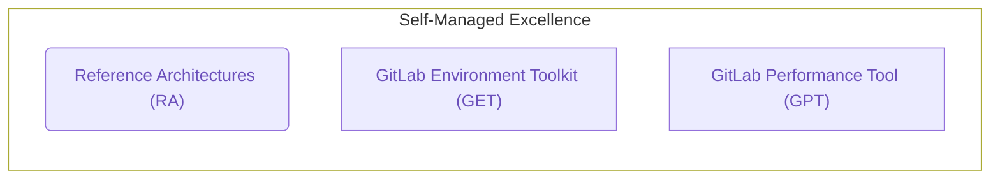

## Overview

This page provides more detail about Self-Managed Excellence initiatives.

Quality Engineering owns several tools which form a 3-prong trident for Self-Managed Excellence: the [Reference Architectures (RA)](https://docs.gitlab.com/ee/administration/reference_architectures/), the [GitLab Environment Toolkit (GET)](https://gitlab.com/gitlab-org/gitlab-environment-toolkit), and the [GitLab Performance Tool (GPT)](https://gitlab.com/gitlab-org/quality/performance). Together, these tools support our broader strategy of cementing customer confidence and contributing to their ongoing success by ensuring their instances are built to a rigorously tested standard that performs smoothly at scale.

- Reference Architectures (RA), our officially recommended environment designs for deploying GitLab at scale in production
- Expanding GitLab Environment Toolkit (GET), our established provisioning toolkit.
- Expanding GitLab Performance Tool (GPT), our performance testing tool for validation at scale.

The [Self-Managed Excellence dashboard](https://10az.online.tableau.com/#/site/gitlab/workbooks/2241132/views)
tracks merge requests and issues metrics for GitLab Environment Toolkit, GitLab Performance Tool and Reference Architectures projects.

## Reference Architectures

The [Reference Architectures](https://docs.gitlab.com/ee/administration/reference_architectures/) are officially recommended environment designs for deploying GitLab at scale in production that are tested and maintained by the Reference Architecture group. The group, led by Quality Engineering, is comprised of various individuals across GitLab disciplines and has the following responsibilities:

- To test, maintain and update the Reference Architectures - Officially recommended environment designs and guidance for deploying GitLab at scale in production
- To review any existing or proposed environment designs not already covered in the documentation
- To assess the need for updates to the Reference Architectures during and after escalations involving performance issues suspected to be caused by environment design.

The group meets regularly on a [bi-weekly](https://docs.google.com/document/d/1FpXtHlIEKNuTCooUn5MxlMvkNvml5UWeBNRHCcDfMrA/edit) business to discuss any notable ongoings with customers environments and to discuss any changes or challenges being seen with the Reference Architectures. To be added to the meetings, please reach out to the Quality Engineering Manager, Enablement or in `#reference-architecture` Slack channel.

Please note however, this is a cross department group and provides support for environment designs on a best effort basis. The group is not a dedicated or an escalation resource and is unable to fulfill any urgent requests, attend customer calls or join customer projects

### FY23 Direction

In FY23 we're focusing on enabling self-service approach for Reference Architecture reviews as well as maturing the Architectures to enable more informed choices for users:

- Restructure Reference Architecture reviews approach to a self-service first model - [epic#40](https://gitlab.com/groups/gitlab-org/quality/-/epics/40).
- Identify and Implement further improvements to Reference Architectures - [epic#50](https://gitlab.com/groups/gitlab-org/quality/-/epics/50)
  - Mature the Reference Architectures and review process to enable more informed choices and engagement - [epic#51](https://gitlab.com/groups/gitlab-org/quality/-/epics/51)

### Metrics




## GitLab Environment Toolkit

Quality Engineering is currently building and maintaining the [GitLab Environment Toolkit](https://gitlab.com/gitlab-org/gitlab-environment-toolkit) (GET),
which is a collection of tools to deploy and operate production GitLab instances based on our [Reference Architectures](https://docs.gitlab.com/ee/administration/reference_architectures/).

### FY23 Direction

In FY23 we're focusing on achieving Viable maturity status for GET in both functional and UX terms. In particular our goals include making the following additions:

- GCP
  - Google Cloud SQL support (including Read Replicas)
  - Google Cloud Load Balancer support
  - GKE Regional Cluster support
  - Dedicated Service Account support
  - Applying latest best practice security recommendations
- AWS
  - RDS Read Replica support
  - Applying latest best practice security recommendations
- OpenSearch support
- Additional support for more advanced Geo setups such as cross VPC support
- Documentation of Cloud Provider permission requirements

### Metrics




## GitLab Performance Tool

Quality Engineering is currently building and maintaining the [GitLab Performance Tool](https://gitlab.com/gitlab-org/quality/performance) (GPT),
which is used to validate GitLab performance at scale. More information is available on [Performance and Scalability](/handbook/engineering/quality/performance-and-scalability/) page.

### FY24 Direction

To continue support and maintaining the tool for internal teams and customers alike to performance test common areas of the GitLab application.

1. Streamline the GitLab Performance Tool by consolidating and unifying configuration files.
1. Expand the setup for test data used in performance tests to ensure comprehensive testing.
1. Enhance monitoring and reporting capabilities to identify issues more effectively.
1. Improve documentation to facilitate better comprehension and streamline the onboarding process with the tool.

For more details about the roadmap and the list of planned issues, please refer to [issue#1770](https://gitlab.com/gitlab-org/quality/quality-engineering/team-tasks/-/issues/1770).

### Metrics




## How to Engage with Us

There are occasions where the expertise of the Reference Architecture or Quality Engineering group may be needed in support of a customer issue.

For any requests relating to customer environments, either proposed or existing, they must be raised in the [Reference Architectures](https://gitlab.com/gitlab-org/quality/reference-architectures/-/issues/new) project with the appropriate template. Requests should be opened two or more business days before action is needed to ensure the team has time to prepare and we kindly ask for this process to be followed for tracking and capacity reasons. Any requests made outside of this process such as direct asks to join customer calls or projects will be rejected and should instead be directed to Support or Professional Services accordingly.

For issues specifically with the [GitLab Environment Toolkit](https://gitlab.com/gitlab-org/gitlab-environment-toolkit/-/issues/new) or [GitLab Performance Tool](https://gitlab.com/gitlab-org/quality/performance/-/issues/new) issues can be raised in each respective project.

For individual questions please reach out to the group via our slack channels.

### Slack Channels

| Channel | Purpose |
| :---: | :--- |
| [#reference-architectures](https://gitlab.slack.com/archives/C015V8PDUSW) | Channel to ask questions relating to Reference Architectures |
| [#gitlab_environment_toolkit](https://gitlab.slack.com/archives/C01DE8TA545) | Channel to discuss and any ask questions relating to GitLab Environment Toolkit |
| [#gitlab_performance_tool](https://gitlab.slack.com/archives/C02JMABFT2R) | Channel to discuss and ask any questions relating to GitLab Performance Tool and QE performance testing |
