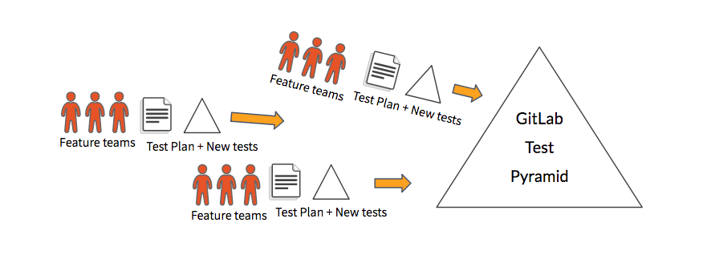

---

title: "Test Engineering"
description: "The Quality Engineering Sub-Department helps facilitate the test planning process for all things related to Engineering work."
---

The Quality Engineering Sub-Department helps facilitate the test planning process for all things related to Engineering work.

### General guidelines

- **Test plans as collaborative design document**: Test Plans as documented in here are design documents that aim to flush out optimal test coverage.
It is expected that engineers in every cross-functional team take part in test plan discussions.
- **E2E test automation is a collective effort**: [SET]s should not be the sole responsible party that automates the End-to-end tests.
The goal is to have engineers contribute and own coverage for their teams.
- **We own test infrastructure**: Test infrastructure is under our ownership, we develop and maintain it with an emphasis on ease of use, ease of debugging, and orchestration ability.
- `Future` **Disable feature by default until E2E test merged**: If a feature is to be merged without a QA test,
it **must** be behind a feature flag (disabled by default) until a QA test is written and merged as well.

### Test Planning

The goal of our test planning process is to ensure quality and manage risk in an efficient and effective manner.

To achieve that goal when delivering a change or new feature, we have conversations that link test requirements to product requirements, identify risks and quality concerns, and review and plan test coverage across [all test levels](https://docs.gitlab.com/ee/development/testing_guide/testing_levels.html).

The output or deliverables of the test planning process are:
* Requirements on unit test coverage.
* Requirements on integration test coverage.
* Requirements on end-to-end test coverage (where applicable).
* One-off manual testing as needed (ideally this should be minimal and in the form of adhoc/exploratory testing).

The deliverables are considered complete when the tests have been added/updated and the merge request has been merged.

#### Process

At [release kickoff](/handbook/engineering/workflow/#kickoff) we highlight some of the changes scheduled for the next release. The majority of our test planning work starts in the issues relevant to those changes, although this process can be applied to any change. Here is an overview of the process:

* Discuss how the change could affect quality (in the feature issue and/or merge request).
* Review test coverage and list test deliverables for [tests at different levels](https://docs.gitlab.com/ee/development/testing_guide/testing_levels.html).
* Add/update tests.

The following guidelines provide more detail, as well as suggested responsibilities for various roles.

##### As a feature issue author:

* Use the issue to discuss how the change could affect the quality of the product and impact our users.
  * Start the discussion by answering the questions in the Testing section of the [feature proposal template](https://gitlab.com/gitlab-org/gitlab/-/blob/master/.gitlab/issue_templates/Feature%20proposal%20-%20detailed.md). Note that those questions are not exhaustive.
  * [Optional] See the [Test Plan](#test-plan) section for advice on when a test plan might be useful.

##### As a Product Manager, Product Designer, Engineer (of any type), user, or anyone else involved in the change:

* Continue the discussion of quality and risk that was started in the issue description. Share any insights that you have that could help guide testing efforts.

##### As an Engineer who will implement the change, or a Software Engineer in Test contributing to the change:

* Use the issue to start a discussion about test strategy, to come up with clear test deliverables for tests at different levels.
  * List the test deliverables in the feature merge request(s).
  * You can use [test design heuristics](/handbook/engineering/infrastructure/test-platform/test-engineering/#test-heuristics) to determine what tests are required. It's not necessary to use test design heuristics explicitly, but it can be helpful to clarify how you come up with tests; it helps to guide discussion and create shared understanding.
* If a merge request touches the feature specs `spec/features`, involve your counterpart Software Engineer in Test to review the merge request.
* If a feature requires an end-to-end test, add a `Requires e2e tests` label to the feature issue or merge request.
  * Before merging the feature merge request, ensure the end-to-end test merge request is linked to the feature merge request.

##### As a merge request author (i.e., the Engineer who will implement the test):

* Complete the test deliverables.
 * End-to-end tests should be included in the feature merge request where possible, but can be in a separate merge request (e.g., if being written by a different engineer).
 * All lower-level tests **must** be included in the feature merge request.

##### As a Software Engineer in Test:

* Help guide the discussions in issues and merge requests, and ensure that we complete the test coverage as planned before the feature is merged into `master` and released to production.

Finally, once all test deliverables are completed, the feature issue can be closed (along with a test plan, if one was created).

Everyone in engineering is expected to contribute to Quality and keep our test pyramid in top shape.
For every new feature we aim to ship a new slice of the pyramid so we don't incur test automation debt.
This is what enables us to do Continuous Delivery.

#### Test Plan

We do not require a test plan for every feature or epic. Test plans are expensive to create and we would only limit this to high-impact and cross functional changes.
There is no strict guideline for this and we defer this decision to each engineering group or team.

**Examples of work that's likely to warrant a test plan:**
* Swapping underlying infrastructure providers (e.g., the [GCP migration](https://gitlab.com/gitlab-com/migration/issues/451#test-plan)).
* Certifying performance improvements for customers.
* Upgrading underlying Rails version (e.g., the [Rails 5 migration](https://gitlab.com/gitlab-org/gitlab-ce/issues/51719)).

GitLab's test plan is based on [Google’s 10 min test plan](https://testing.googleblog.com/2011/09/10-minute-test-plan.html).
This test plan uses the ACC Framework (Attribute, Components and Capabilities matrix)
* Attributes: qualities the product should have
* Components: major parts of the product
* Capabilities: behavior the product should display that links components and attributes

Currently we have a [test plan template](https://gitlab.com/gitlab-org/gitlab/blob/master/.gitlab/issue_templates/Test%20Plan.md) that is available for test planning in GitLab. A test plan can be created by anyone involved in a change.

You can see the all the existing test plans here: [GitLab Test Plans](https://gitlab.com/gitlab-org/gitlab/issues?scope=all&utf8=%E2%9C%93&state=opened&label_name[]=test-plan).

#### Security

In addition to quality, [security](security) is also one of our top concerns. With every change and every new feature we need to consider security risks and mitigate them early in the development process.

See also when and how to request a [security review](/handbook/security/).

The test plan template has a risk column dedicated to security, however, whether or not a test plan is not created, it is essential that a discussion about security risks takes place as early as possible.

### Test Coverage

The Quality Department has coverage to support different test scenarios. More information is available on our
[Test Coverage](/handbook/engineering/infrastructure/test-platform/test-coverage/) page.

### Test Coverage Tracking

We are currently evaluating using GitLab mechanics to track test coverage in [gitlab-org/quality/testcases](https://gitlab.com/gitlab-org/quality/testcases/issues).

Our previous iteration can be seen at [DEPRECATED - GitLab Blackbox Integration & E2E Test Coverage](https://docs.google.com/spreadsheets/d/1RlLfXGboJmNVIPP9jgFV5sXIACGfdcFq1tKd7xnlb74/edit).

An explanation of why we chose to do it this way is explained in this issue: [Test case management and test tracking in a Native Continuous Delivery way](https://gitlab.com/gitlab-org/gitlab-ce/issues/51790).

To summarize, we want to track our tests in a Native Continuous Delivery way.
* If we are doing continuous delivery in the right way, there should be little to no manual tests. Manual tests if any should be minimal and exploratory.
* There should be little need for detailed test steps if manual testing is minimal and exploratory.
  * Exploratory testing has a free form emphasis which removes the importance of hardcoded test steps.
  * The disadvantage of going into too much detail with hardcoded test steps is we are not able to catch bugs outside the hardcoded flow in the document, it's also a high maintenance document.
  * Our test case name / description contains just enough description, this helps fuzzes the workflow up and we end up catching more critical bugs this way.
* An emphasis on risk-based test planning using the ACC framework.
* An emphasis on categorizing test automation types which tracks the pyramid shape (API, UI, and Visual).
* An emphasis on tracking alignment in the lower test levels in the pyramid.
* An emphasis on intelligent test design using [Test Heuristics](#test-heuristics) design.

#### Risk Mapping

Another way to gauge test coverage and mitigation of risks is to use a [risk map](https://about.gitlab.com/blog/2020/09/03/risk-mapping/). Making a risk map will show not only where the product is not tested, but also how severe the impact of a failure in that area is likely to be. Knowing both the risk area and the impact a failure could produce helps guide where to begin implementing future tests.

The [Global Search](/handbook/engineering/infrastructure/core-platform/data_stores/search/) team has undertaken this effort before here: https://gitlab.com/gitlab-org/gitlab/-/issues/229431. If future teams attempt to implement a risk map this documentation may grow over time to reflect their experiences.

Read more on the [risk mapping page](risk-mapping).

### Test Heuristics

#### Why Care?
Testing can sometimes be reduced to the simplest of checks for a specific behavior of a specific function. We often do this when we're under a time constraint. But is that how our customers always use our software?

By taking just a little extra time in our test approach to think about testing in general, we can save hours of work rolling back a release or producing hotfixes. Here are some simple approaches to enhancing our testing without adding a significant amount of time to our process.

This is especially applicable to any exploratory testing performed by both software engineers in test and backend/frontend engineers alike. They can also be helpful to consider when designing automated tests as they help eliminate bias.

#### Discovering Variations
Even simple solutions can have infinite variations to test when we consider the data, timing, environmental or platform factors, configuration, and user behavior following varied sequences actions. We should have as our goal to find the most important and most interesting variations to test, since we cannot possibly test them all.

##### Identifying Variables
Some variables are obvious, some are not. Some are accessible to the end user, some are indirectly accessible, modified only indirectly through changing other variables. For example, size or number of files in a database or number of users logged into a system may affect how a feature functions but are outside of the feature itself and may not be directly modified without specific environments or tools.

So our goal here is to identify the variables that may play a part in how a particular feature functions and use these as touch points for testing that feature. Since we may have a number of variables to consider, it would be wise to create simple notes to track those variables to make our testing more effective.

##### Heuristics to Help Identify Variables

###### What are heuristics?
The definition of a heuristic is varied based on where we look, so we'll use the simple definition: a heuristic is a fallible method for solving a problem or making a decision. They are not algorithms, so they do not always give us the results we want. We should think of them as excellent thinking tools to help us navigate unknowns, such as "did my change introduce a bug?". They are dependent upon context, so not every heuristic is applicable to every problem, just like algorithms.

Here are some heuristics that may help us find variables:

- Things That Can Be Counted
  - Zero, One, Many
  - Too Many
  - Too Few
- Relative Position
  - Beginning, Middle, End
- Format
- Input
- Navigation
- Related to Time
  - When?
  - How often?
  - How long?
- Location
- Storage
- Size
- Depth

How can we use these heuristics? Are there others? The next section answers those questions.

#### Heuristic Glossary
- Boundaries
  - Use values that approach the boundary, whether almost too big or small.
  - Value at the boundary.
- Configurations
  - Vary configuration settings.
    - Example:
      - Examine the possible config variables for [Omnibus](https://gitlab.com/gitlab-org/omnibus-gitlab/blob/master/files/gitlab-config-template/gitlab.rb.template).
      - Determine which settings are most important or may have the most interesting effect on the feature.
      - Utilize these as baseline config values for your exploratory/automation testing.
- Count
  - Zero, One, Many
    - Perform functions on zero, one, and many records.
    - Examples:
      - Perform search queries you know will return zero, one, or many records.
      - Edit/Delete Projects or Groups with zero, one, or many sub-entities.
      - Performing merge requests of many files or just one.
  - Too Many
    - This involves creating conditions that generate more events or objects than the system can handle. Essentially, flooding the system.
      - Too many connections or requests
      - Too many files or objects
  - Too Few
    - This involves creating conditions where fewer data are provided to the system than expected.
- CRUD
  - Perform each function for an entity managed by the system. Sometimes there are multiple ways to achieve CRUD for an entity.
    - For example, creating a project through the GUI or through `git push`.
- Depth
  - Anything that has a hierarchy has depth and can be varied to produce different effects.
    - XML and JSON
    - File Systems
    - Nested functions
- Following Data
  - Verify data integrity as it moves through different stages of a system.
  - Example:
    - A new feature stores persistent data outside of the DB. Following this heuristic reminds us to:
      - Analyze the environment and determine where such data resides. Does development have these locations documented? If not, what discussions need to take place to discover this information? Document this learning if it isn't already.
      - Analyze the risk to determine what coverage may be necessary.
      - Analyze the existing tests. Is it covered at the appropriate level?
        - Do we need more unit test coverage? Advocate with development team and track accordingly.
        - API coverage? UI coverage? Visual coverage? Should this be a smoke test? Document test gaps in the Quality Team's [testcases](https://gitlab.com/gitlab-org/quality/testcases) repository for determining current/future tasks for quality or development.
- Format
  - Violate or utilize other commonly accepted formats
    - Phone numbers - dashes, periods, parentheses, length, use of country codes
    - Email addresses
    - Domains
    - IP addresses
    - Postal codes
    - Dates
    - Files - document and image file types, variations of a single file type (i.e., PDF)
- Goldilocks
  - Vary data to include values that are too big, too small, and just right
- Input Methods
  - Systems can have multiple interfaces - GUI, API, CLI
  - GUI interfaces can have multiple mechanics for entering data - keyboard, voice, paste from system clipboard, gestures such as drag and drop
- Interruptions
  - While the system is in a specific state, cause the system to log out, shut down, reboot, kill a process, disconnect, timeout, cancel, sleep, etc.
- Position
  - Beginning, Middle, End
  - Example:
    - Edit text at the beginning, in the middle, and the end of a record.
    - Change corresponding items in a list.
- Location
  - Solutions often have logic that is related to geographic location as can be represented in:
    - Timezones
    - Zip codes
- Navigation
  - Navigation occurs in more ways than just clicking on a GUI link or button. Attempt navigation through:
    - Clicking as normal (or via automation) with a mouse.
    - Use shortcut keys.
    - Use tab, arrow keys, and return/spacebar.
- Selection
  - Select some, none, or all options.
    - *e.g.*, adding/removing labels
- Sequences
  - Vary the order of operations.
    - Randomize order of setting options, navigation, etc.
  - Combine multiple sequences.
- Sort
  - Alphanumeric vs. numeric
  - Domain specific sorts (IP address)
  - Sorting with pagination
- Starvation
  - Test while CPU, memory, database, network, disk space, or IO is close to or at maximum capacity.
- Storage
  - Vary the location of dependent resources.
- Size
  - Vary file size, or possibly dimensions in the case of images.
  - Variables are often constrained by powers of 2.
  - Vary the size of repositories, commits, merge requests, comments, etc.
  - Vary hardware configurations with disk size and size of available memory.
- Time
  - When?
    - Perform an action just before, after, or as timeouts occur.
    - Set up contributors with multiple timezone/DST differences.
      - Australian Central Western Standard Time (ACWST) UTC +8:45
      - Marquesas Time (MART) UTC -9:30
      - Line Islands Time (LINT) UTC +14:00
    - Set dates using leap days, Feb. 29 on non-leap years, invalid calendar days (April 31, Feb 30).
  - How often?
    - Attempt actions frequently/repeatedly or in conjunction with other events on a timed basis.
  - How long?
    - Vary the duration of actions to expose issues like mempry leaks, unexpected session timeouts, etc.
- User Scenarios
  - Use Cases
    - This is just what it sounds like and often critical testing if they are identified correctly.
  - Personae
    - Adopt the personality of expected user personas. Modify your testing behavior to mimic the knowledge, focus, and concerns of the persona.
    - See the [personas](/handbook/product/personas/#user-personas) defined here as an example.
  - Soap Operas
    - This kind of testing is based on "real life" situations, but are condensed and more extreme, like a soap opera.
    - As an example, a user pushes a branch and creates a merge request. The user then closes the merge request and deletes the branch because they had difficulty with a conflict. They delete their local branch, recreate with the same name, make their updates cleanly, then push and open another merge request, all within a short period of time.
    - These scenarios are not always edge cases or extreme. They're simply more exaggerated and condensed.
  - Extreme Personalities
    - These personas are similar to the ones listed above, but with a touch of dysfunction. Examples:
      - User believes that nothing is fast enough, and therefore continuously cancels and retries actions.
      - User believes they are being constantly monitored, therefore they use software that blocks web page actions/components/javascript, work only through VPN's, attempt to anonymize their activity, and always use strong passwords.

##### Add Your Own
This is not an exhaustive list of heuristics. If you know others you have found useful, please consider contributing them to this document.

*Accreditation to these ideas belongs to the general test community, many who have contributed to and compiled these ideas in different ways. For further explanation of applying heuristics to testing, see Elisabeth Hendrickson, VP of R&D at Pivotal Software, Inc., and her book titled **Explore It!** or many other various blogs and sites, e.g. [Satisfice](https://www.satisfice.com/blog/), [DevelopSense](https://www.developsense.com/blog/), or [Ministry of Testing](https://club.ministryoftesting.com/categories). For an in-depth explanation of heuristics in the context of software testing, see [Heuristics for Understanding Heuristics](https://www.developsense.com/blog/2012/04/heuristics-for-understanding-heuristics/).*
