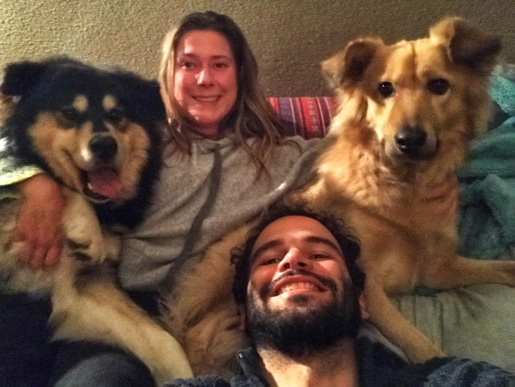

---

title: "Daniel Diniz's README"
job: "Support Engineer"
---

## Daniel Diniz's README

**Daniel Diniz - Support Engineer (EMEA)**

Hey! My name is Daniel Diniz and this is the first interation on a personal README document.

The 'goal' of writing this document is simply writing in itself, and it's pulibshed for anyone interested in a glimpse into who I am. A wise person once said:

> Meditate to heal the mind.
>
> Read to expand the mind.
>
> Write to clarify the mind.

## Related pages

* [LinkedIn](https://www.linkedin.com/in/dnldnz/)
* [Twitter](https://twitter.com/dnldnz)

## About me

I'm passionate about life itself. I love learning new things, preferably on a daily basis. I like it so much that if I would have to name one goal in life, it would be to become a full-time learner.

* Whenever I'm not behind a computer, I try to find any excuse to be outdoors, living life dynamically in many different ways. I like :palm_tree: [Slacklining](https://en.wikipedia.org/wiki/Slacklining), :surfer: [Kitesurfing](https://en.wikipedia.org/wiki/Kiteboarding), :dog: :snowboarder: [Dogsurfing](https://vimeo.com/258229614), :mount_fuji: [Climbing](https://en.wikipedia.org/wiki/Climbing). I'm an adept of the :monkey: [Movement Culture](http://www.idoportal.com/).

* I have many :musical_note: musical instruments, and try to find time in between all other activities to explore musicality as much as I can. 

* My most recent passion is Carpentry :hammer:; I really feel like human beings are meant to construct their own structures. I love setting out time to plan, design and build practical things, from chairs, tables and shelfs all the way to small houses and shelers. 

* Here are a couple of things I like doing _every day_:
  - Going for a walk :runner:
  - Writing :orange_book:
  - Spending time alone in silence :thought_balloon:
  - At least one deep, meaningful conversation with someone I love :speech_balloon:
  - Some deep, focused work :godmode:
  - A good night's sleep :zzz:

## Personally

- I currently live in the beautiful Netherlands, but I'm originally from Brazil.
- I am a 'sea' person. I'm the happiest version of myself when on walking distance from a seashore.
- Two of my best friends are actually not human. I spend dumb amounts of time with my two dogs, Kiss and Ravi: 

## Things I don't care about you:

Your age, skin color, political beliefs, religious beliefs, sexual orientation, alma mater, past mistakes, how much you earn.

## Things I care about you:

Your integrity, who you are today, whether you try to make society a better place, the things you care about.

## Finding me

In general, I can be reached via email (ddiniz@gitlab.com). I'll try to respond as quickly as possible.

Gitlabbers can find me in Slack, either via DM or at one of the channels below:

| Work | Social |
| ---- | ------ |
| `#support_self-managed` | `#dog` |
| `#support_gitlab-com` | `#mental_health_aware` |
| | `#kitesurfing` |
|  | `#intheparenthood` |
| | `#brazil` |
