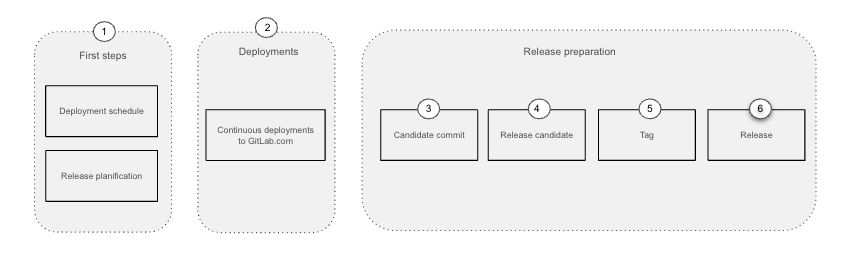

## Overview and terminology

This page describes the processes used to release packages to self-managed users.

**Monthly self-managed release**

GitLab version (XX.YY.0) [is published every month][process-monthly-release]. From this monthly release, [patch][process-patch-release], [non-critical][process-security-release-non-critical], and [critical][process-security-release-critical] security releases are created as needed.

Our [maintenance policy] describes in detail the cadence of our major, minor and patch releases for self-managed users. The major release yearly cadence was defined [after an all stakeholder discussion](https://gitlab.com/gitlab-com/Product/issues/50).

## Self-managed overview

The `self-managed release` is a [semver] versioned package containing changes from many successful [deployments on GitLab.com](/handbook/engineering/deployments-and-releases/deployments/). Users on GitLab.com, therefore, receive features and bug fixes earlier than users of self-managed installations.

The [deployments and releases page](/handbook/engineering/deployments-and-releases/) details how the two processes work together.

### Self-managed releases process

The `monthly self-managed release` timelines are concentrated around the [release date](/handbook/engineering/releases/).

Overview of the steps involved on the self-managed release process:

- [Diagram source](https://docs.google.com/presentation/d/1YRjA1dYCXNXp06VltDYlik1MdFyzUvaeXKk69mMPcA4/edit#slide=id.g2951f7d5d31_1_0)

The end-to-end process consists on the following stages:

1. **First steps** - Initial steps to setup the monthly release, including setting up the release schedule and the deployment cadence.
1. **GitLab.com deployments** - From the start of the milestone up to one week before the release date, GitLab.com receives multiple
    deployments per day. For application changes to be considered in a self-managed release they need to be successfully deployed to GitLab.com.
1. **Candidate commit** - One week before the release date a candidate commit is selected and broadcasted by release managers, the commit is usually
    the current commit running on GitLab.com. Pending GitLab.com availability, a different commit might be choosen, this means that the availability and
    stability of GitLab.com deployments will determine the cutoff date for inclusion in the release. This commit is announced in multiple Slack engineering channels, including
    [#releases], [#development], [#backend] and [#frontend].
1. **Release candidate** - A test release candidate (RC) is created, along with a stable branch for the targeted [semver] version. The release candidate package is built,
    tested and deployed to the [pre environment]. A successful outcome indicates this package can be used as the final version. At this point [release managers] will
    announce the final commit to be included in the release.
1. **Tag** - Release managers tag the final version of the release based on the release candidate. The release is built and deployed to the [Release environment].
1. **Release** - On the release day, the release packages are published.

### Timelines

The only guaranteed date throughout the release cycle is the [release date](/handbook/engineering/releases/). On this date,
the `self-managed release` will be published together with the release announcement.

**All other dates** are **a guideline only** and cannot be considered a deadline
when it comes to what will be included into any type of release. This includes the
[development month] and the dates defined there as well as any promises given to
customers. This is strictly because there are a lot of moving parts to be considered
when preparing a release which includes working on highest priority and severity
issues as well as security related issues.

If it is absolutely necessary to get a certain feature
ready for a specific version, merge the feature early in the development cycle.
Merges closer to the release date are absolutely not guaranteed to be included
in that specific monthly `self-managed release`.

### How can I determine if my merge request will make it into the monthly release?

When we create release candidates, and when we create a new release package,
the [Release Tools project][release-tools] will
[add a label to the merge requests included](#labels-indicating-inclusion-in-upcoming-self-managed-release).

For more information, refer to the [Auto-deploy
status](https://gitlab.com/gitlab-org/release/docs/-/blob/master/general/deploy/auto-deploy.md#auto-deploy-status)
command.

In the runup to the [release date](/handbook/engineering/releases/), release managers will also start announcing
what commit will at the very least make it into the release. Such notifications
are shared in Slack [#releases] channel and will look something like this (format is defined in the [release-tools monthly template](https://gitlab.com/gitlab-org/release-tools/-/blob/master/templates/monthly.md.erb)):

> This is the candidate commit to be released on the [release date](/handbook/engineering/releases/).
https://gitlab.com/gitlab-org/gitlab/commits/4033cb0ed66de77a4b5c1936e33de918edef558e

The last commit to make it into the release will have a message similar to this:

> :mega: Barring any show-stopping issues, this is the final commit to be released on the [release date](/handbook/engineering/releases/).
https://gitlab.com/gitlab-org/gitlab/-/commits/13-1-stable-ee

Merge Requests that have been included in the monthly release will receive [a label indicating inclusion](/handbook/engineering/releases/#labels-indicating-inclusion-in-upcoming-self-managed-release).

### Monthly release information dashboard

GitLab team members can view the [internal Grafana dashboard "Release Information"](https://dashboards.gitlab.net/d/delivery-release_info/delivery3a-release-information?orgId=1) for the following information:

* Active monthly release version
* Active monthly release date
* Current status of the active monthly release

The metrics used to display this information are updated automatically throughout the [self-managed releases process](#self-managed-releases-process).

## Patch releases overview

The [patch release policy] allows bug fixes to be backported to the current stable released version of GitLab. Patches that are outside of
our [maintenance policy] for bug fixes must be requested and agreed upon by the release managers and the requester (see
[backporting to versions outside the maintenance policy] for details).

### Patch release cadence

Patch releases are scheduled twice a month on the second and fourth Wednesdays, around the monthly release week. These are best-effort dates and they might be subject to change.

### Patch release process

Patches fix regressions in the current self-managed release.

If you're a GitLab engineer looking to include a bug fix in a release, please follow the steps on the [patch release runbook for GitLab engineers].

Overview of the steps involved with creating a patch release:

- [Diagram source](https://docs.google.com/presentation/d/1YRjA1dYCXNXp06VltDYlik1MdFyzUvaeXKk69mMPcA4/edit#slide=id.g226a611e9ec_0_0)

The end-to-end process consists on the following stages:

1. **Prepare** - A merge request backporting a bug fix to the current version is prepared by
   GitLab engineers.
1. **Test** - The merge request executes end-to-end tests via package-and-test pipeline
   to guarantee the bug fix meets the quality standards. If the package-and-test pipeline fails, a review from
   a Software Engineer in Test is required.
1. **Merge** - The merge request is merged by a GitLab maintainer in the stable branch associated
   with the current version.
1. **Analysis** - To determine if a patch release is required, release managers analyze the severity and number of backports waiting to be patch along other release pressures.
1. **Tag** - Release managers tag a new patch release package for the current version.
1. **Deploy** - The patch release package is deployed and tested to the GitLab Release instance.
1. **Release** - Release managers publish the packages associated with the patch release.

Details of the patch release lifecycle can be found on the [patch release documentation], including the
[patch release runbook for GitLab engineers] and the [patch release runbook for release managers].

## Security releases

The [security release processes](/handbook/engineering/releases/security-releases/#security-release-process) are used to prepare and publish packages containing vulnerability fixes. For more details about the release overview and the release processes, see the [security release](/handbook/engineering/releases/security-releases/) page.

## Backports overview

For information on backports, visit the [backports page](/handbook/engineering/releases/backports).

## Labels of importance

The release process has a few labels of specific importance.

#### Delivery impact labels

Incidents may optionally have a `Delivery impact:*` label to indicate the impact the incident has when active. This label is intended to help with prioritizing between multiple incidents.

| **Impact label** | **Definition** |
| ----- | ---------- |
| Delivery impact::1 | Deployments and/or scheduled releases are fully blocked by this incident. Action should be taken to resolve this immediately |
| Delivery impact::2 | Deployments and/or scheduled releases will soon become blocked. Resolve as soon as possible |
| Delivery impact::3 | Deployments and releases are not currently blocked but there is some impact on the delivery process |

### Labels indicating inclusion in upcoming Self-managed release

As a merge request is included in monthly self-managed release candidates (RC), it will receive the
`released::candidate` label when the release candidate it is included in is deployed to
[pre.gitlab.com]. See ["What is a release candidate and when are they created?"](#what-is-a-release-candidate-and-when-are-they-created)
for more information on release candidates. This label indicates that the MR will most
likely be included in the upcoming Self-managed release.

A merge request will receive the `released::published` label (which replaces the `released::candidate` label)
when included in a packaged release, such as `13.6.0` or `13.5.2`, and deployed to
[release.gitlab.net] for both automated and manual testing. This label indicates that the
MR will be published with the Self-managed release.

## Frequently Asked Questions

### Who are the release managers for release X?

You can find this out by taking a look at the [GitLab Release
Managers](https://about.gitlab.com/community/release-managers/) schedule.

### What is a release candidate and when are they created?

A release candidate (RC) is a GitLab package that includes the changes that will
make it into the final self-managed release, except for the rare case where a
change may need to be reverted. RCs are only created for the monthly
self-managed release, not patch releases. The amount of RCs created per month
will vary per release.

There is no fixed point in time where a release manager creates a release
candidate. Instead, this is based entirely on how the release process has been
going, what the state is of GitLab.com, etc.

Release candidates are created whenever possible, and as such there are no
guarantees on creation timing. This will depend on factors such as:

- Any incidents on GitLab.com that are or have been going on in the run-up to
  the release.
- Any (critical) [security releases](https://about.gitlab.com/handbook/engineering/releases/security-releases/) that require the attention of release
  managers.
- Any issues with our auto-deployment pipelines.
- Other release related work that may delay or prevent the creation of a release
  candidate until said work is dealt with.

In other words, if you want to know when a release candidate is created your
best option is to join one of the following Slack channels:

- [#releases]
- [#f_upcoming_release]

Release candidates are deployed to [pre.gitlab.com] for both automated and
manual testing.

### Will release managers create a release candidate earlier if I ask them to?

It is up to a release manager to decide when to create a release candidate,
taking into account the state of deployments and GitLab.com.

Please do not message a release manager in private about release related
questions or requests. Instead, post your request/question in the [#releases]
channel.

### When do I need to have my MR merged in order for it to be included into the monthly release?

The earlier in the monthly cycle your MR is merged, the higher the chances are for it to be included in that month's release.

There is no guaranteed "cut-off", "freeze" or any other date defined under which the MR will be included.

Availability, security and performance of GitLab.com is a pre-requisite for any monthly self-managed release.
If GitLab.com is not experiencing any issues, MR's merged as late as 2 days before the [release date] were included in the release.
On the opposite side, when GitLab.com stability was lower, MR's merged as early as one week before the [release date] of the month were not included.

In other words:

**The quality and stability of what is delivered by everyone defines the final MR that will be included in the monthly release.**

For more detailed information:
* Use the [internal dashboard](#monthly-release-information-dashboard) to verify the status of a merge request with respect to the monthly release.
* See [self-managed release timelines](/handbook/engineering/releases/#self-managed-overview).
* Refer to [status of a merge request with respect to the monthly release](https://gitlab.com/gitlab-org/release/docs/-/blob/master/general/deploy/auto-deploy.md#status-of-a-merged-mr-with-respect-to-monthly-releases) documentation.

### What's the process for a release of type X?

The different processes are documented here:

- Self-managed releases:
  - [Monthly releases][process-monthly-release]
  - [Critical security releases][process-security-release-critical]
  - [Non-critical security releases][process-security-release-non-critical]
  - [Patch releases][process-patch-release]
- GitLab.com releases:
  - [Auto-deploy releases][process-auto-deploy-release]
  - [Hot patch]

### How can I get a high severity bug fix released?

Any high severity issue should start with an issue labelled with the appropriate bug and severity labels.

Depending on the bug details, follow one of the following processes:

- For [high severity security bugs][process-security-release-critical]
- For [high severity bugs affecting self-managed users][process-patch-release]. If the bug has been found close to the [release date](/handbook/engineering/releases/) of the month please also alert the Release Managers in [#releases].
- For [high severity bugs affecting GitLab.com](/handbook/engineering/deployments-and-releases/deployments/#gitlabcom-pick-label)
- For [high security bugs affecting security merge requests](https://gitlab.com/gitlab-org/release/docs/-/blob/master/general/security/bugs_introduced_by_security_merge_request.md)

## Resources

| Description        | Location            |
|--------------------|---------------------|
| Release documentation | [Link](https://gitlab.com/gitlab-org/release/docs) |
| Issue Tracker | [`gitlab-org/release/tasks`][release/tasks] |
| Slack Channels | [#f_upcoming_release] / `@release-managers` |
| Release Manager schedule | [Link](https://about.gitlab.com/community/release-managers/) |
| Maintenance Policy | [Link](https://docs.gitlab.com/ee/policy/maintenance.html) |
| Reaching us | [How to find us](/handbook/engineering/infrastructure/team/delivery/#reaching-our-team) |

___________

If you need any additional help please ask the Release Managers in the [#releases] Slack channel.

[#f_upcoming_release]: https://gitlab.slack.com/archives/f_upcoming_release
[semver]: https://semver.org
[canary]: /handbook/engineering#canary-testing
[development month]: /handbook/engineering/workflow/#product-development-timeline
[auto deploy transition]: https://gitlab.com/gitlab-org/release/docs/blob/21cbd409dd5f157fe252f254f3e897f01908abe2/general/deploy/auto-deploy-transition.md#transition
[maintenance policy]: https://docs.gitlab.com/ee/policy/maintenance.html
[gitlab-org/gitlab]: https://gitlab.com/gitlab-org/gitlab
[release-tools]: https://gitlab.com/gitlab-org/release-tools
[release/tasks]: https://gitlab.com/gitlab-org/release/tasks/-/issues
[labels of importance]: #labels-of-importance
[auto-deploy]: https://www.youtube.com/watch?v=_G-EWRpCAz4
[severity]: /handbook/engineering/infrastructure/engineering-productivity/issue-triage/#severity
[#releases]: https://gitlab.slack.com/archives/C0XM5UU6B
[#f_upcoming_release]: https://gitlab.slack.com/archives/C0139MAV672a
[#development]: https://gitlab.slack.com/archives/C02PF508L
[#backend]: https://gitlab.slack.com/archives/C8HG8D9MY
[#frontend]: https://gitlab.slack.com/archives/C0GQHHPGW
[process-monthly-release]: https://gitlab.com/gitlab-org/release/docs/blob/master/general/monthly/process.md
[process-auto-deploy-release]: https://gitlab.com/gitlab-org/release/docs/blob/master/general/deploy/auto-deploy.md
[process-security-release-critical]: https://gitlab.com/gitlab-org/release/docs/blob/master/general/security/process.md#critical-security-releases
[process-security-release-non-critical]: https://gitlab.com/gitlab-org/release/docs/blob/master/general/security/process.md#non-critical-security-releases
[process-patch-release]: https://gitlab.com/gitlab-org/release/docs/blob/master/general/patch/process.md
[Security Release process as Developer]: https://gitlab.com/gitlab-org/release/docs/-/blob/master/general/security/developer.md
[Security Releases How to video]: https://www.youtube.com/watch?v=ixtUDxM3nWA
[GitLab Security]: https://gitlab.com/gitlab-org/security/
[security issue template]: https://gitlab.com/gitlab-org/security/gitlab/issues/new?issuable_template=Security+developer+workflow
[security release backports]: https://gitlab.com/gitlab-org/release/docs/-/blob/master/general/security/developer.md#backports
[Hot patch]: https://gitlab.com/gitlab-org/release/docs/blob/master/general/deploy/post-deployment-patches.md
[pre.gitlab.com]: /handbook/engineering/infrastructure/environments/#pre
[release.gitlab.net]: /handbook/engineering/infrastructure/environments/#release
[How to fix a broken stable branch]: https://gitlab.com/gitlab-org/release/docs/-/blob/master/general/how-to-fix-broken-stable-branch.md
[post-deploy migrations]: https://docs.gitlab.com/ee/development/database/post_deployment_migrations.html
[post-deploy migration pipeline documentation]: https://gitlab.com/gitlab-org/release/docs/-/tree/master/general/post_deploy_migration
[internal-pilot-question]: #where-i-can-learn-more-about-the-internal-patch-release-pilot-for-gitlab-engineers
[backporting to versions outside the maintenance policy]: https://docs.gitlab.com/ee/policy/maintenance.html#backporting-to-older-releases
[patch release documentation]: https://gitlab.com/gitlab-org/release/docs/-/blob/master/general/patch/process.md
[patch release runbook for GitLab engineers]: https://gitlab.com/gitlab-org/release/docs/-/blob/master/general/patch/engineers.md
[patch release runbook for release managers]: https://gitlab.com/gitlab-org/release/docs/-/blob/master/general/patch/release_managers.md
[patch release policy]: https://docs.gitlab.com/ee/policy/maintenance.html#patch-releases
[release date]: https://about.gitlab.com/releases/
[pre environment]: https://about.gitlab.com/handbook/engineering/infrastructure/environments/#pre
[release managers]: https://about.gitlab.com/community/release-managers/
[Release environment]: https://about.gitlab.com/handbook/engineering/infrastructure/environments/#release
